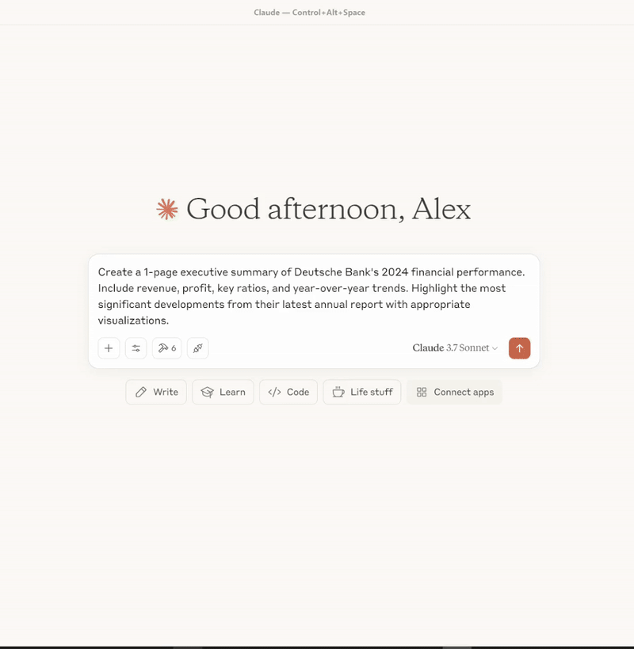

# Financial Reports MCP Server

## 🎬 Demo

<div align="center">
  
</div>


An MCP (Model Context Protocol) server for accessing the Financial Reports API, providing tools and resources to access company financial filings, industry classifications, and related data.

## Features

- Search for companies by name, country, or sector
- Get detailed company information
- Access latest financial filings
- Look up industry classifications
- Get filing details and content

## Prerequisites

- Python 3.11+
- Docker (recommended)
- FastMCP (if running locally)
- dotenv for environment variable management (if running locally)

**Note:** The server now uses only the real Financial Reports API. All mock API logic and configuration has been removed for simplicity and reliability.

## 🚀 Getting Started

There are multiple ways to run this MCP server. Choose one of the following:

### Option 1: Docker (Recommended)

Docker is the recommended way to run the MCP server for reproducibility, isolation, and ease of use.

```bash
# Build (once)
docker build -t financial-reports-mcp .

# Run
docker run --rm -i \
  -e API_KEY=your_api_key_here \
  -e API_BASE_URL=https://api.financialreports.eu/ \
  -e MCP_TRANSPORT=stdio \
  financial-reports-mcp:latest
```

_For Docker Compose users:_

```bash
# Copy and configure .env
echo "Copy .env.example to .env and fill in secrets"
cp .env.example .env
# Start services
docker-compose up
```

For Claude Desktop, use the following configuration. **Pass secrets as `-e` arguments in `args` for maximum compatibility and security:**

```json
{
  "mcpServers": {
    "financial-reports": {
      "command": "docker",
      "args": [
        "run",
        "--rm",
        "-i",
        "-e", "API_KEY=your_api_key_here",
        "-e", "API_BASE_URL=https://api.financialreports.eu/",
        "-e", "MCP_TRANSPORT=stdio",
        "financial-reports-mcp:latest"
      ]
    }
  }
}
```

> **Why?** Passing secrets as `-e` arguments in `args` guarantees Docker always receives them, regardless of how the client implements environment variable support. This is the most robust and portable approach for Claude Desktop and similar clients.

### Option 2: Smithery CLI (for Claude)

Use the Smithery CLI to install and run the server in Claude:

```bash
npx -y @smithery/cli@latest install \
  @itisaevalex/financial-reports-mcp-server \
  --client claude \
  --key smithery_api_key
```

### Option 3: Local Python (development/testing)

1. Install dependencies:
```bash
python -m venv venv           # Create venv
venv\Scripts\activate        # Activate on Windows
pip install -r requirements.txt
```

2. Run the server:
```bash
python -m src.financial_reports_mcp
# or with uv
uv run src/financial_reports_mcp.py
```

> **Tip:** If you use `uv`, it automatically loads `.env` from the project root.

## Examples

All example scripts and configs are now located in the `examples/` directory, e.g.:

- `examples/test_server.py` — Run the full MCP test suite
- `examples/docker_claude_config.json` — Example Claude Desktop config for Docker
- `examples/uvx_claude_config.json` — Example Claude Desktop config for uv
- `examples/python_client_example.py` — Example Python client usage

Run the test suite:
```bash
python examples/test_server.py
```

## Configuration

Create a `.env` file in the root directory with the following variables:

```
API_KEY=your_api_key_here
API_BASE_URL=https://api.financialreports.eu/
MCP_TRANSPORT=stdio
```

## Project Structure

- `src/` — Source code directory
  - `financial_reports_mcp.py` — MCP server main entrypoint (all tools/resources defined here)
  - `api_client.py` — API client factory
  - `real_api/real_client.py` — Real API client implementation
- `.env` - Environment variables (not in git)
- `requirements.txt` - Project dependencies
- `Dockerfile` & `docker-compose.yml` - Docker configuration
- `setup.py` - Package installation configuration
- `install.py` - Helper for Claude Desktop installation
- `examples/` - Example scripts and configs
- `scripts/` - Install scripts

## Available Tools

- `get_filing_type(filing_type_id)` — Get detailed information about a filing type by its ID
- `list_industries(industry_group, page, page_size, search)` — List all available GICS industries
- `get_industry(industry_id)` — Get detailed information about a GICS industry
- `list_industry_groups(sector, page, page_size, search)` — List all available GICS industry groups
- `get_industry_group(group_id)` — Get detailed information about a GICS industry group
- `get_sector(sector_id)` — Get detailed information about a GICS sector
- `list_sub_industries(industry, page, page_size, search)` — List all available GICS sub-industries
- `get_sub_industry(sub_industry_id)` — Get detailed information about a GICS sub-industry
- `list_sources(page, page_size)` — List all available data sources
- `get_source(source_id)` — Get detailed information about a data source
- `get_processed_filing(processed_filing_id)` — Get processed content for a filing
- `get_schema(format, lang)` — Get the OpenAPI3 schema for the API
- `search_companies(params)` — Search for companies by name, ISIN, LEI, etc.
- `get_company_detail(company_id)` — Get detailed information about a company
- `get_latest_filings(params)` — Get the latest financial filings
- `get_filing_detail(filing_id)` — Get detailed information about a specific filing
- `list_sectors()` — List all available GICS sectors
- `list_filing_types()` — List all available filing types

### Additional Resources/Helpers
- `get_sectors_resource()` — Markdown-formatted list of GICS sectors
- `get_filing_types_resource()` — Markdown-formatted list of filing types
- `get_company_profile(company)` — Markdown-formatted company profile
- `get_company_recent_filings(company, limit)` — Markdown-formatted list of recent filings

### Prompts
- `search_company_by_name()` — Prompt for searching a company by name
- `find_latest_annual_reports()` — Prompt for finding latest annual reports

## Available Resources

- `financial-reports://sectors`: List of all GICS sectors
- `financial-reports://filing-types`: List of all filing types
- `financial-reports://companies/{company_id}/profile`: Company profile
- `financial-reports://companies/{company_id}/recent-filings`: Recent filings for a company

## Examples

### Example 1: Search for a company and get its profile

```
I want to search for information about Deutsche Bank. Please help me find:
1. Basic company details like country, sector and industry
2. Recent financial filings
3. Key financial metrics if available
```

### Example 2: Find the latest annual reports for banks

```
I'd like to see the latest annual reports from major European banks. 
Please help me:
1. Find companies in the banking sector
2. Get their latest annual reports
3. Summarize key financial metrics from these reports if available
```

## Cross-Platform Compatibility

The server can be run on:

- **Linux**: All methods supported
- **macOS**: All methods supported 
- **Windows**: All methods supported, but using `uv` is recommended for Claude Desktop

For Windows users specifically:
- For Claude Desktop, uv-based installation is recommended
- Docker requires Docker Desktop for Windows

## Troubleshooting

### Common Issues

1. **Communication Issues with Claude Desktop**: 
   - Ensure you're using stdio transport when configuring for Claude Desktop
   - For Docker, make sure to include the `-i` flag for interactive mode

2. **"Module not found" errors**: 
   - Make sure all dependencies are installed with `pip install -r requirements.txt`
   
3. **Cannot connect to the MCP server**: 
   - Check if the server is running and accessible from the client

4. **Authentication errors with the API**: 
   - Verify your API key in the `.env` file

### Logs

When running directly, logs are output to the console. For Docker, you can view logs with:

```bash
docker logs <container-id>
```

## License

This project is licensed under the MIT License with an attribution requirement for Data Alchemy Labs. See [LICENSE](LICENSE) for details.
