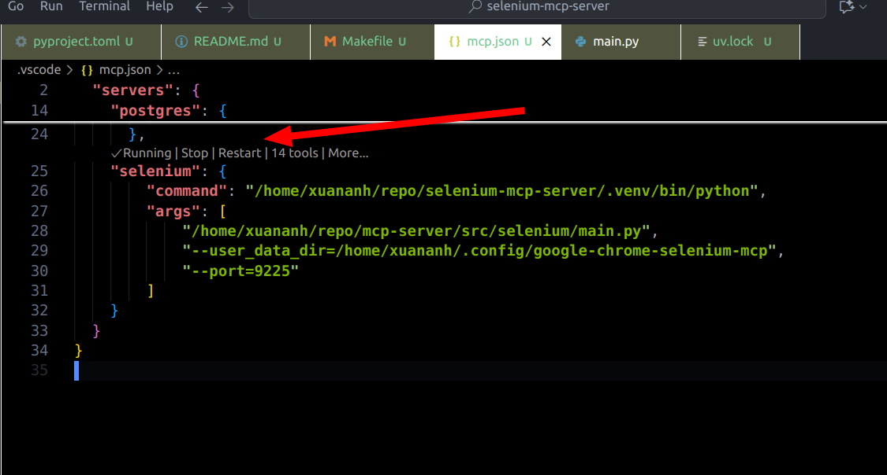

Selenium MCP Server
---

A Model Context Protocol (MCP) server that provides web automation capabilities through Selenium WebDriver. This server allows AI assistants to interact with web pages by providing tools for navigation, element interaction, taking screenshots, and more.

## 1.1. Quick Start

### 1.1.1. Using Installed Package (Recommended)
```bash
# Install
pip install mcp-server-selenium

# Run
python -m mcp_server_selenium --port 9222 --user_data_dir /tmp/chrome-debug
```

### 1.1.2. Using Source Code (Development)
```bash
# Clone and setup
git clone https://github.com/PhungXuanAnh/selenium-mcp-server.git
cd selenium-mcp-server
uv sync

# Run
PYTHONPATH=src python -m mcp_server_selenium --port 9222 --user_data_dir /tmp/chrome-debug
```

---

- [2. Features](#2-features)
- [3. Available Tools](#3-available-tools)
  - [3.1. Navigation and Page Management](#31-navigation-and-page-management)
  - [3.2. Element Interaction](#32-element-interaction)
  - [3.3. Element Styling](#33-element-styling)
  - [3.4. JavaScript Execution](#34-javascript-execution)
  - [3.5. Browser Logs](#35-browser-logs)
  - [3.6. Local Storage Management](#36-local-storage-management)
- [4. Installation](#4-installation)
  - [4.1. Prerequisites](#41-prerequisites)
  - [4.2. Installation Options](#42-installation-options)
    - [4.2.1. Option A: Install as Python Package (Recommended)](#421-option-a-install-as-python-package-recommended)
    - [4.2.2. Option B: Run from Source Code](#422-option-b-run-from-source-code)
  - [4.3. Chrome Setup](#43-chrome-setup)
- [5. Usage](#5-usage)
  - [5.1. Running the MCP Server](#51-running-the-mcp-server)
    - [5.1.1. Option A: From Installed Package](#511-option-a-from-installed-package)
    - [5.1.2. Option B: From Source Code](#512-option-b-from-source-code)
  - [5.2. Using MCP Inspector for Testing](#52-using-mcp-inspector-for-testing)
    - [5.2.1. Start Inspector Server](#521-start-inspector-server)
    - [5.2.2. Access Inspector Interface](#522-access-inspector-interface)
    - [5.2.3. Command Line Options](#523-command-line-options)
  - [5.3. Using with MCP Clients](#53-using-with-mcp-clients)
    - [5.3.1. Configuration Examples](#531-configuration-examples)
    - [5.3.2. Debug](#532-debug)
- [6. Examples](#6-examples)
  - [6.1. Basic Web Automation](#61-basic-web-automation)
  - [6.2. Advanced Usage](#62-advanced-usage)
    - [6.2.1. JavaScript Examples](#621-javascript-examples)
- [7. Logging](#7-logging)
- [8. Troubleshooting](#8-troubleshooting)
  - [8.1. Common Issues](#81-common-issues)
    - [8.1.1. Installation-Related Issues](#811-installation-related-issues)
    - [8.1.2. Runtime Issues](#812-runtime-issues)
    - [8.1.3. Configuration Issues](#813-configuration-issues)
- [9. Architecture](#9-architecture)
- [10. Contributing](#10-contributing)
- [11. Support](#11-support)
- [12. Documentation](#12-documentation)
- [13. Reference](#13-reference)


# 2. Features

- **Web Navigation**: Navigate to URLs with timeout control and page readiness checking
- **Element Discovery & Interaction**: Find elements by multiple criteria (text, class, ID, attributes, XPath) and interact with them through clicking and input value setting
- **Advanced Element Querying**: Get single elements, multiple elements with pagination, and direct child nodes with comprehensive filtering options
- **Screenshots**: Capture full-page screenshots of the current browser window
- **Element Styling**: Retrieve CSS styles and computed style information for any element
- **JavaScript Execution**: Execute custom JavaScript code in browser console with optional console output capture
- **Browser Logging**: Access console logs (with level filtering) and network request logs (with URL filtering and error filtering)
- **Local Storage Management**: Complete CRUD operations for browser local storage (add, read, update, delete)
- **iFrame Support**: Work with elements inside iframes using iframe ID or name targeting
- **XPath Support**: Use XPath expressions for precise element targeting
- **Chrome Browser Control**: Connect to existing Chrome instances or automatically start new ones

# 3. Available Tools

The MCP server provides the following tools:

## 3.1. Navigation and Page Management
- `navigate(url, timeout)` - Navigate to a specified URL with Chrome browser
- `check_page_ready(wait_seconds)` - Check if the current page is fully loaded with optional wait
- `take_screenshot()` - Take a screenshot of the current browser window

## 3.2. Element Interaction
- `get_an_element(text, class_name, id, attributes, element_type, in_iframe_id, in_iframe_name, return_html, xpath)` - Get an element identified by various criteria
- `get_elements(text, class_name, id, attributes, element_type, in_iframe_id, in_iframe_name, page, page_size, return_html, xpath)` - Get multiple elements with pagination support
- `get_direct_children(text, class_name, id, attributes, element_type, in_iframe_id, in_iframe_name, return_html, xpath, page, page_size)` - Get all direct child nodes of an element with pagination
- `click_to_element(text, class_name, id, attributes, element_type, in_iframe_id, in_iframe_name, element_index, xpath)` - Click on an element identified by various criteria
- `set_value_to_input_element(text, class_name, id, attributes, element_type, input_value, in_iframe_id, in_iframe_name, xpath)` - Set a value to an input element

## 3.3. Element Styling
- `get_style_an_element(text, class_name, id, attributes, element_type, in_iframe_id, in_iframe_name, return_html, xpath, all_styles, computed_style)` - Get style information for an element

## 3.4. JavaScript Execution
- `run_javascript_in_console(javascript_code)` - Execute JavaScript code in the browser console
- `run_javascript_and_get_console_output(javascript_code)` - Execute JavaScript code and capture both return value and console output

## 3.5. Browser Logs
- `get_console_logs(log_level)` - Retrieve console logs from the browser with optional filtering by log level
- `get_network_logs(filter_url_by_text, only_errors_log)` - Retrieve network request logs from the browser with optional filtering

## 3.6. Local Storage Management
- `local_storage_add(key, string_value, object_value, create_empty_string, create_empty_object)` - Add or update a key-value pair in browser's local storage
- `local_storage_read(key)` - Read a value from browser's local storage by key
- `local_storage_read_all()` - Read all key-value pairs from browser's local storage
- `local_storage_remove(key)` - Remove a key-value pair from browser's local storage
- `local_storage_remove_all()` - Remove all key-value pairs from browser's local storage

# 4. Installation

## 4.1. Prerequisites

- Python 3.10 or higher
- Chrome browser installed

## 4.2. Installation Options

You can use this MCP server in two ways:

### 4.2.1. Option A: Install as Python Package (Recommended)

Install directly from PyPI:
```bash
pip install mcp-server-selenium
```

Or using uv:
```bash
uv add mcp-server-selenium
```

### 4.2.2. Option B: Run from Source Code

1. Clone this repository:
```bash
git clone https://github.com/PhungXuanAnh/selenium-mcp-server.git
cd selenium-mcp-server
```

2. Install dependencies using uv:
```bash
uv sync
```

Or using pip with virtual environment:
```bash
python -m venv .venv
source .venv/bin/activate  # On Windows: .venv\Scripts\activate
pip install -e .
```

## 4.3. Chrome Setup

The MCP server can work with Chrome in two ways:

1. **Connect to existing Chrome instance** (recommended): Start Chrome with debugging enabled:
```bash
google-chrome --remote-debugging-port=9222 --user-data-dir=/tmp/chrome-debug
```

2. **Auto-start Chrome**: The server can automatically start Chrome if no instance is found.

# 5. Usage

## 5.1. Running the MCP Server

### 5.1.1. Option A: From Installed Package

After installing via pip/uv, you can run the server directly:

```bash
# Basic usage with default settings
python -m mcp_server_selenium

# With custom Chrome debugging port and user data directory
python -m mcp_server_selenium --port 9222 --user_data_dir /tmp/chrome-debug

# With verbose logging
python -m mcp_server_selenium --port 9222 --user_data_dir /tmp/chrome-debug -v

# Using the installed command (if available)
selenium-mcp-server --port 9222 --user_data_dir /tmp/chrome-debug -v
```

### 5.1.2. Option B: From Source Code

When running from source, ensure the Python path includes the src directory:

```bash
# Navigate to the project directory
cd /path/to/selenium-mcp-server

# Activate virtual environment (if using one)
source .venv/bin/activate

# Run with proper Python path
PYTHONPATH=src python -m mcp_server_selenium --port 9222 --user_data_dir /tmp/chrome-debug -v

# Or using uv (recommended for development)
uv run python -m mcp_server_selenium --port 9222 --user_data_dir /tmp/chrome-debug -v
```

## 5.2. Using MCP Inspector for Testing

### 5.2.1. Start Inspector Server

For development and testing, you can use the MCP inspector:

**From Source Code:**
```bash
# Using uv (recommended)
uv run mcp dev src/mcp_server_selenium/__main__.py

# Or with make command
make inspector

# With custom options
uv run mcp dev src/mcp_server_selenium/__main__.py --port 9222 --user_data_dir /tmp/chrome-debug --verbose
```

**From Installed Package:**
```bash
# Create a wrapper script or use directly
mcp dev python -m mcp_server_selenium
```

### 5.2.2. Access Inspector Interface

Open your browser and navigate to: http://127.0.0.1:6274/#tools


Check logs:
```shell
tailf /tmp/selenium-mcp.log
```

### 5.2.3. Command Line Options

- `--port`: Chrome remote debugging port (default: 9222)
- `--user_data_dir`: Chrome user data directory (default: auto-generated in /tmp)
- `-v, --verbose`: Increase verbosity (use multiple times for more details)

## 5.3. Using with MCP Clients

The server communicates via stdio and follows the Model Context Protocol specification. You can integrate it with MCP-compatible AI assistants or clients.

### 5.3.1. Configuration Examples

**For Claude Desktop** (`claude_desktop_config.json`):

Using installed package:
```json
{
  "mcpServers": {
    "selenium": {
      "command": "python",
      "args": [
        "-m", "mcp_server_selenium",
        "--port", "9222",
        "--user_data_dir", "/tmp/chrome-debug-claude"
      ],
      "env": {}
    }
  }
}
```

**For VS Code Copilot** (`.vscode/mcp.json`):

Using installed package:
```json
{
  "servers": {
    "selenium-installed": {
      "command": "python",
      "args": [
        "-m", "mcp_server_selenium",
        "--user_data_dir=/home/user/.config/google-chrome-selenium-mcp",
        "--port=9225"
      ]
    }
  }
}
```

Using source code directly:
```json
{
  "servers": {
    "selenium-source": {
      "command": "/path/to/selenium-mcp-server/.venv/bin/python",
      "args": [
        "-m", "mcp_server_selenium",
        "--user_data_dir=/home/user/.config/google-chrome-selenium-mcp-source",
        "--port=9226"
      ],
      "env": {
        "PYTHONPATH": "/path/to/selenium-mcp-server/src"
      }
    }
  }
}
```

Alternative source code configuration using full path:
```json
{
  "servers": {
    "selenium-source-alt": {
      "command": "/path/to/selenium-mcp-server/.venv/bin/python",
      "args": [
        "/path/to/selenium-mcp-server/src/mcp_server_selenium/__main__.py",
        "--user_data_dir=/home/user/.config/google-chrome-selenium-mcp-alt",
        "--port=9227"
      ]
    }
  }
}
```

### 5.3.2. Debug

**VS Code Copilot MCP Status:**
If you open the `.vscode/mcp.json` file, you can see the MCP server status at the bottom of VS Code.



**View MCP Logs:**
- In VS Code: Open Command Palette → "Developer: Show Logs..." → "MCP: selenium"
- Check log file: `tail -f /tmp/selenium-mcp.log`

# 6. Examples

## 6.1. Basic Web Automation

1. **Navigate to a website**:
   - Tool: `navigate`
   - URL: `https://example.com`

2. **Take a screenshot**:
   - Tool: `take_screenshot`
   - Result: Screenshot saved to `~/selenium-mcp/screenshot/`

3. **Fill a form**:
   - Tool: `fill_input`
   - Selector: `#email`
   - Text: `user@example.com`

4. **Click a button**:
   - Tool: `click_element`
   - Selector: `button[type="submit"]`

5. **Execute JavaScript**:
   - Tool: `run_javascript_in_console`
   - Code: `return document.title;`
   - Result: Returns the page title

6. **JavaScript with console output**:
   - Tool: `run_javascript_and_get_console_output`
   - Code: `console.log('Hello from browser'); return window.location.href;`
   - Result: Shows both console output and return value

## 6.2. Advanced Usage

- **Wait for dynamic content**: Use `wait_for_element` to wait for elements to load
- **Get page information**: Use `get_page_title`, `get_current_url`, `get_page_content`
- **Element inspection**: Use `get_element_text`, `get_element_attribute`, `check_element_exists`
- **JavaScript automation**: Use `run_javascript_in_console` for complex DOM manipulation and data extraction
- **JavaScript debugging**: Use `run_javascript_and_get_console_output` to capture console logs for debugging

### 6.2.1. JavaScript Examples

**Extract page data**:
```javascript
// Tool: run_javascript_in_console
var links = Array.from(document.querySelectorAll('a')).slice(0, 5).map(a => ({
    text: a.textContent.trim(),
    href: a.href
}));
return links;
```

**Page performance monitoring**:
```javascript
// Tool: run_javascript_and_get_console_output
console.time('Page Analysis');
var stats = {
    title: document.title,
    links: document.querySelectorAll('a').length,
    images: document.querySelectorAll('img').length,
    scripts: document.querySelectorAll('script').length
};
console.timeEnd('Page Analysis');
console.log('Page stats:', stats);
return stats;
```

**Form automation**:
```javascript
// Tool: run_javascript_in_console
document.querySelector('#username').value = 'testuser';
document.querySelector('#password').value = 'password123';
document.querySelector('#login-form').submit();
return 'Form submitted successfully';
```

# 7. Logging

The server logs all operations to `/tmp/selenium-mcp.log` with rotation. Use the `-v` flag to increase console verbosity:

- `-v`: INFO level logging
- `-vv`: DEBUG level logging

# 8. Troubleshooting

## 8.1. Common Issues

### 8.1.1. Installation-Related Issues

**Package not found (installed package):**
```bash
# Verify installation
pip list | grep mcp-server-selenium
# or
python -c "import mcp_server_selenium; print('OK')"
```

**Module not found (source code):**
```bash
# Ensure PYTHONPATH is set correctly
export PYTHONPATH=/path/to/selenium-mcp-server/src
# or run from project root with:
PYTHONPATH=src python -m mcp_server_selenium
```

### 8.1.2. Runtime Issues

1. **Chrome not starting**: Ensure Chrome is installed and accessible from PATH
2. **Port conflicts**: Use a different port with `--port` option
3. **Permission errors**: Ensure the user data directory is writable
4. **Element not found**: Increase wait times or use more specific selectors
5. **JavaScript execution errors**: Check browser console for syntax errors or security restrictions
6. **Console output not captured**: Ensure the JavaScript code runs successfully before checking console logs

### 8.1.3. Configuration Issues

**MCP Client Connection Problems:**
- Verify the command path is correct (use `which python` to find Python executable)
- For source code: Ensure PYTHONPATH environment variable is set
- For installed package: Ensure the package is installed in the same Python environment as the MCP client
- Check MCP client logs for detailed error messages

# 9. Architecture

- **FastMCP**: Uses the FastMCP framework for MCP protocol implementation
- **Selenium WebDriver**: Chrome WebDriver for browser automation
- **Synchronous Design**: All operations are synchronous for reliability
- **Chrome DevTools Protocol**: Connects to Chrome via remote debugging protocol

# 10. Contributing

1. Fork the repository
2. Create a feature branch
3. Make your changes
4. Add tests if applicable
5. Submit a pull request

# 11. Support

For issues and questions:
- Create an issue in the repository
- Check the logs at `/tmp/selenium-mcp.log`
- Use verbose logging for debugging

# 12. Documentation

For detailed documentation on specific features:
- [JavaScript Console Tools](docs/javascript_console_tools.md) - Comprehensive guide for JavaScript execution tools
- [Examples](examples/javascript_console_examples.py) - JavaScript execution examples and use cases

# 13. Reference

- https://github.com/modelcontextprotocol/python-sdk
- https://github.com/modelcontextprotocol/servers
