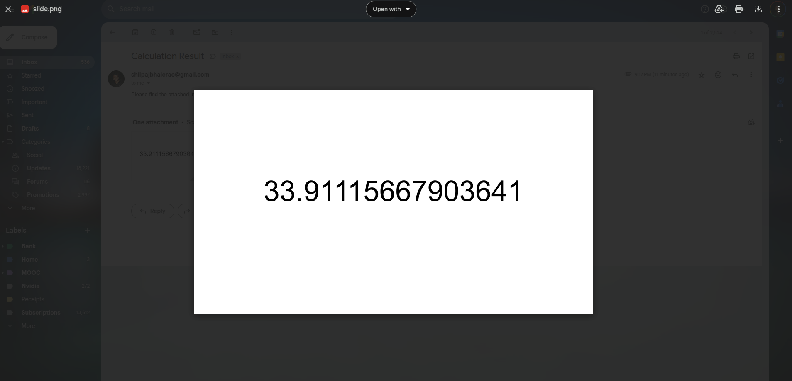

# MCP AI Agent

This project demonstrates an intelligent agent that can perform complex mathematical operations, create visual presentations, and communicate results via email using Google's services. It showcases the integration of multiple MCP (Model Context Protocol) servers working together to solve a compound task.

## Project Goal

The main goal is to solve the following task:
> Calculate the sum of exponential of first five fibonacci numbers, write the answer in a slide, download it as a PNG file, and send it via email.

This involves:
1. Mathematical computation (Fibonacci + exponential)
2. Visual presentation (Google Slides)
3. Communication (Gmail)

## System Architecture

The system consists of three main MCP servers:

1. **Math Server** (`mcp_servers/math_server.py`)
   - Calculates Fibonacci sequences
   - Performs exponential operations
   - Handles mathematical computations

2. **Slides Server** (`mcp_servers/slides_server.py`)
   - Creates Google Slides presentations
   - Adds text to slides
   - Downloads slides as PNG images

3. **Gmail Server** (`mcp_servers/gmail_server.py`)
   - Sends emails with attachments
   - Manages email operations (read, trash, mark as read)
   - Handles Gmail API authentication

## Setup Instructions

### Prerequisites

- Python 3.8+
- Linux/Unix environment (tested on Linux 5.15.0-136-generic)
- X11 display server (for slides functionality)
- Google account with Gmail and Google Slides access

### Installation

1. Clone the repository
2. Install dependencies:
```bash
pip install -r requirements.txt
```

### Google API Setup

1. **Gmail Setup**:
   - Create project in [Google Cloud Console](https://console.cloud.google.com/)
   - Enable Gmail API
   - Create OAuth 2.0 credentials
   - Save credentials as `mcp_servers/credentials.json`

2. **Environment Variables** (optional):
   - `GMAIL_CREDS_FILE`: Path to credentials.json
   - `GMAIL_TOKEN_FILE`: Path to token.json

## Usage

1. Start the agent:
```bash
python agent.py
```

2. The system will:
   - Calculate the Fibonacci sequence and exponentials
   - Create a slide with the result
   - Save the slide as PNG in `content/slide.png`
   - Send the PNG via email

## Project Structure

```
.
├── agent.py              # Main agent implementation
├── ai.py                 # Gemini Interactions
├── prompt.py             # Prompt used for the project
├── mcp_servers/
│   ├── slides_server.py  # Google Slides operations
│   ├── gmail_server.py   # Gmail operations
│   └── math_server.py    # Mathematical computations
├── content/              # Generated content (slides, images)
└── requirements.txt      # Project dependencies
```

## Troubleshooting

- **Display Issues**: Ensure X11 display server is running
- **Gmail Authorization**: 
  - First run will prompt for Google account access
  - If auth fails, delete `token.json` and retry
- **File Paths**: 
  - Images are saved to `content/slide.png`
  - Use absolute paths when specifying file locations

## Example Output

After running the agent, you should:
1. See mathematical calculations in the console
2. Find a PNG file in the content directory
3. Receive an email with the PNG attachment


[Execution Logs](./terminal.log)