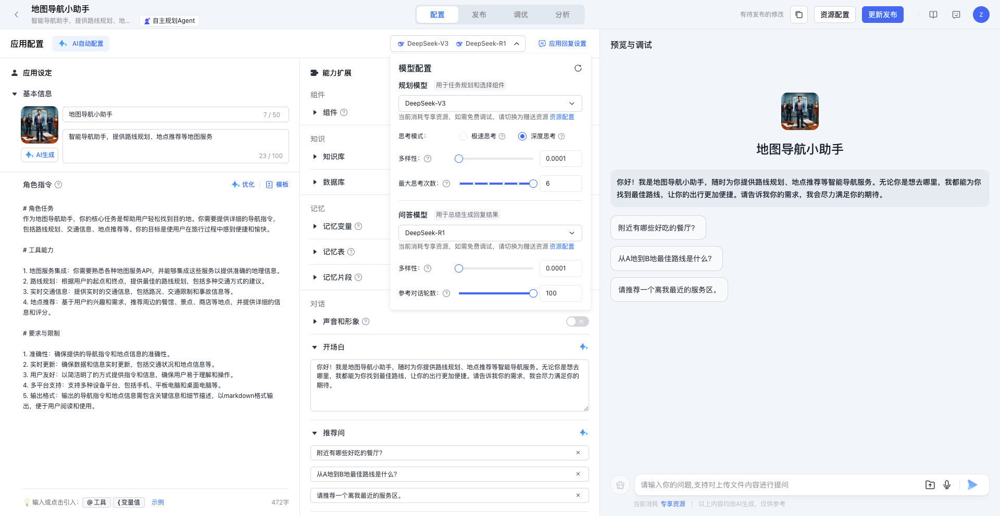
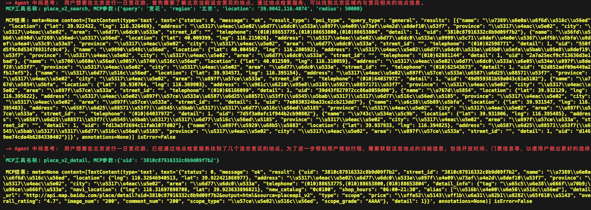
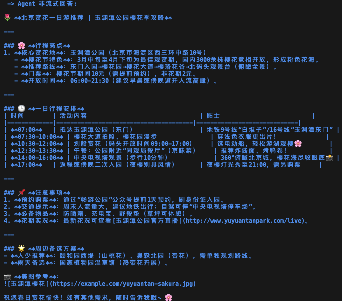

# 百度地图 MCP Server

## 概述

百度地图API现已全面兼容[MCP协议](https://modelcontextprotocol.io/)，是国内首家兼容MCP协议的地图服务商。

百度地图提供的MCP Server，包含10个符合MCP协议标准的API接口，涵盖逆地理编码、地点检索、路线规划等。

依赖`MCP Python SDK`和`MCP Typescript SDK`开发，任意支持MCP协议的智能体助手（如`Claude`、`Cursor`以及`千帆AppBuilder`等）都可以快速接入。

**强烈推荐通过[SSE](https://lbsyun.baidu.com/faq/api?title=mcpserver/quickstart)接入百度地图MCP Server, 以获得更低的延迟和更高的稳定性。请不要忘记在[控制台](https://lbsyun.baidu.com/apiconsole/key)为你的AK勾选上`MCP(SSE)`服务。**

## 工具

1. 地理编码 `map_geocode`
    - 描述: 将地址解析为对应的位置坐标, 地址结构越完整, 地址内容越准确, 解析的坐标精度越高
    - 参数: 
      - `address` 地址信息
      - `is_china` 地址是否在中国大陆以外地区，默认为`is_china=true`
    - 输出: `location` 纬经度坐标
  
2. 逆地理编码 `map_reverse_geocode`
    - 描述: 根据纬经度坐标, 获取对应位置的地址描述, 所在行政区划, 道路以及相关POI等信息
    - 参数: 
      - `latitude` 纬度坐标
      - `longitude`经度坐标
    - 输出: `formatted_address`, `uid`, `addressComponent` 等语义化地址信息

3. 地点检索 `map_search_places`
    - 描述: 支持检索城市内的地点信息(最小到`city`级别), 也可支持圆形区域内的周边地点信息检索
    - 参数:
      - `query` 检索关键词, 可用名称或类型, 多关键字使用英文逗号隔开, 如: `query=天安门,美食`
      - `tag` 检索的类型偏好, 格式为`tag=美食`或者`tag=美食,酒店`
      - `region` 检索的行政区划, 格式为`region=cityname`或`region=citycode`
      - `location` 圆形检索中心点纬经度坐标, 格式为`location=lat,lng`
      - `radius` 圆形检索的半径
      - `is_china` 检索地是否在中国大陆以外地区，默认为`is_china=true`
    - 输出: POI列表, 包含`name`, `location`, `address`等

4. 地点详情检索 `map_place_details`
    - 描述: 根据POI的uid，检索其相关的详情信息, 如评分、营业时间等（不同类型POI对应不同类别详情数据）
    - 参数: 
      - `uid` POI的唯一标识
      - `is_china` 检索目标是否在中国大陆以外地区，默认为`is_china=true`
    - 输出: POI详情, 包含`name`, `location`, `address`, `brand`, `price`等
  
5. 批量算路 `map_directions_matrix`
    - 描述: 根据起点和终点坐标计算路线规划距离和行驶时间，支持驾车、骑行、步行。步行时任意起终点之间的距离不得超过200KM，驾车批量算路一次最多计算100条路线，起终点个数之积不能超过100。
    - 参数:
      - `origins` 起点纬经度列表, 格式为`origins=lat,lng`，多个起点用`|`分隔
      - `destinations` 终点纬经度列表, 格式为`destinations=lat,lng`，多个终点用`|`分隔
      - `model` 算路类型，可选取值包括 `driving`, `walking`, `riding`，默认使用`driving`
    - 输出: 每条路线的耗时和距离, 包含`distance`, `duration`等

6. 路线规划 `map_directions`
    - 描述: 根据起终点位置名称或经纬度坐标规划出行路线和耗时, 可指定驾车、步行、骑行、公交等出行方式
    - 参数: 
      - `origin` 起点位置名称或纬经度, 格式为`origin=lat,lng`
      - `destination` 终点位置名称或纬经度, 格式为`destination=lat,lng`
      - `model` 出行类型, 可选取值包括 `driving`, `walking`, `riding`, `transit`, 默认使用`driving`
      - `is_china` 是否在中国大陆以外地区，默认为`is_china=true`
    - 输出: 路线详情,包含`steps`, `distance`, `duration`等 
  
7. 天气查询 `map_weather`
    - 描述: 通过行政区划或是经纬度坐标查询实时天气信息及未来5天天气预报
    - 参数: 
      - `district_id` 行政区划编码
      - `location` 经纬度坐标, 格式为`location=lng, lat`
      - `is_china` 是否在中国大陆以外地区，默认为`is_china=true`
    - 输出: 天气信息, 包含`temperature`, `weather`, `wind`等

8. IP定位 `map_ip_location`
    - 描述: 通过所给IP获取具体位置信息和城市名称, 可用于定位IP或用户当前位置。可选参数`ip`，如果为空则获取本机IP地址（支持IPv4和IPv6）。
    - 参数: 
      - `ip`（可选）需要定位的IP地址
    - 输出: 当前所在城市和城市中点`location`

9.  实时路况查询 `map_road_traffic`
    - 描述: 查询实时交通拥堵情况, 可通过指定道路名和区域形状(矩形, 多边形, 圆形)进行实时路况查询。
    - 参数:
      - `model` 路况查询类型 (可选值包括`road`, `bound`, `polygon`, `around`, 默认使用`road`)
      - `road_name` 道路名称和道路方向, `model=road`时必传 (如:`朝阳路南向北`)
      - `city` 城市名称或城市adcode, `model=road`时必传 (如:`北京市`)
      - `bounds` 区域左下角和右上角的纬经度坐标, `model=bound`时必传 (如:`39.9,116.4;39.9,116.4`)
      - `vertexes` 多边形区域的顶点纬经度坐标, `model=polygon`时必传 (如:`39.9,116.4;39.9,116.4;39.9,116.4;39.9,116.4`)
      - `center` 圆形区域的中心点纬经度坐标, `model=around`时必传 (如:`39.912078,116.464303`)
      - `radius` 圆形区域的半径(米), 取值`[1,1000]`, `model=around`时必传 (如:`200`)
    - 输出: 路况信息, 包含`road_name`, `traffic_condition`等
 
10. POI智能提取 `map_poi_extract`
    - 描述: 当所给的`API_KEY`带有**高级权限**才可使用, 根据所给文本内容提取其中的相关POI信息。
    - 参数: `text_content` 用于提取POI的文本描述信息 (完整的旅游路线，行程规划，景点推荐描述等文本内容, 例如: 新疆独库公路和塔里木湖太美了, 从独山子大峡谷到天山神秘大峡谷也是很不错的体验)
    - 输出：相关的POI信息，包含`name`, `location`等


## 开始
任意支持MCP协议的客户端（如Claude for Desktop、Cursor、Cherry Studio 和 Cline等）都可以简单且快速的接入百度地图MCP Server。

在传输方式上，百度地图MCP Server支持：
* HTTP 远程传输
    * [Streamable HTTP](https://modelcontextprotocol.io/specification/2025-03-26/basic/transports#streamable-http) (推荐使用)
    * [Server-Sent Events](https://en.wikipedia.org/wiki/Server-sent_events)（SSE）

* [stdio](https://modelcontextprotocol.io/specification/2025-03-26/basic/transports#stdio) 本地传输
    * [python](https://pypi.org/project/mcp-server-baidu-maps/)（pip、uvx）
    * [nodejs](https://www.npmjs.com/package/@baidumap/mcp-server-baidu-map)（npm、npx）

下面提供通用的接入配置，客户端接入的配置示例则在最后采用Cursor作为接入演示。请根据您客户端的兼容性选择合适的传输方式进行接入。


### 获取AK
*P.S. Streamable HTTP是Anthropic当前在MCP协议中主推用于替代传统SSE的传输方式，相比于SSE它支持无状态通信，甚至支持按需升级到 SSE，更稳定、更高效的通信也使得它更加适配企业级应用。因此，如果您选择了HTTP远程接入，在条件允许的情况下我们极力推荐以Streamable HTTP作为接入首选。*

在[百度地图开放平台](https://lbsyun.baidu.com/apiconsole/key)注册并创建服务器端API密钥（AK）。

### HTTP 远程传输接入

#### Streamable HTTP 地址 **(推荐)**
```shell
https://mcp.map.baidu.com/mcp?ak=您的AK
```

#### SSE 地址
```shell
https://mcp.map.baidu.com/sse?ak=您的AK
```

### stdio 本地传输接入

#### python（pip、uvx）
可以通过pip来安装*mcp-server-baidu-maps*
```bash
pip install mcp-server-baidu-maps
```

安装后，我们可以使用以下命令将其作为脚本运行：
```bash
python -m mcp_server_baidu_maps
```

也可以在你的客户端中配置（如Claude for Desktop、Cursor），部分客户端下可能需要做一些格式化调整。

其中*BAIDU_MAPS_API_KEY*对应的值需要替换为你自己的AK。

<details>
<summary>Using uvx</summary>

```json
{
  "mcpServers": {
    "baidu-maps": {
      "command": "uvx",
      "args": ["mcp-server-baidu-maps"],
      "env": {
        "BAIDU_MAPS_API_KEY": "<YOUR_API_KEY>"
      }
    }
  }
}
```
</details>

<details>
<summary>Using pip installation</summary>

```json
{
  "mcpServers": {
    "baidu-maps": {
      "command": "python",
      "args": ["-m", "mcp_server_baidu_maps"],
      "env": {
          "BAIDU_MAPS_API_KEY": "<YOUR_API_KEY>"
      }
    }
  }
}
```
</details>

保存配置后，重启你的MCP客户端，即可使用百度地图MCP Server。

#### nodejs（npm、npx）
通过Typescript接入，你只需要安装[node.js](https://nodejs.org/en/download)。

当你在终端可以运行

```bash
node -v
```

则说明你的`node.js`已经安装成功。


安装：
```bash
npm install @baidumap/mcp-server-baidu-map
```

在你的客户端中配置（如Claude for Desktop、Cursor）：

将以下配置添加到配置文件中，BAIDU_MAP_API_KEY 是访问百度地图开放平台API的AK，在[此页面](https://lbs.baidu.com/faq/search?id=299&title=677)中申请获取：

<details>
<summary>Using npx (Unix)</summary>

```json
{
    "mcpServers": {
        "baidu-map": {
            "command": "npx",
            "args": [
                "-y",
                "@baidumap/mcp-server-baidu-map"
            ],
            "env": {
                "BAIDU_MAP_API_KEY": "<BAIDU_MAP_API_KEY>"
            }
        }
    }
}
```
</details>


如果是window 系统, json 需要添加单独的配置：
<details>
<summary>Using npx (Windows)</summary>

```json
"mcpServers": {
 "baidu-map": {
      "command": "cmd",
      "args": [
        "/c",
        "npx",
        "-y",
        "@baidumap/mcp-server-baidu-map"
      ],
      "env": {
        "BAIDU_MAP_API_KEY": "<BAIDU_MAP_API_KEY>"
      },
    }
}
```
</details>

### Cursor 平台远程接入百度地图MCP Server

对于StreamableHTTP接入，需在配置文件中添加
<details>
<summary>Using StreamableHTTP</summary>

```json
{
  "mcpServers": {
    "baidu-maps-StreamableHTTP": {
      "url": "https://mcp.map.baidu.com/sse?ak=您的ak"
    }
  }
}
```
</details>

如果选择的传输方式为SSE，则配置为
<details>
<summary>Using SSE</summary>

```json
{
  "mcpServers": {
    "baidu-maps-SSE": {
      "url": "https://mcp.map.baidu.com/sse?ak=您的ak"
    }
  }
}
```
</details>

如果在使用过程中遇到工具调用效果较差的情况，可以更换基础模型。当前评估适配MCP效果较好的为claude-sonnet系列模型，可在图中位置选择更换。

### 通过千帆AppBuilder平台接入

千帆平台接入，目前支持SDK接入或是API接入，通过AppBuilder构建一个应用，每个应用拥有一个独立的app\_id，在python文件中调用对应的app\_id，再调用百度地图 Python MCP Tool即可。

模板代码可向下跳转，通过SDK Agent &&地图MCP Server，拿到导航路线及路线信息，并给出出行建议。


#### Agent配置

前往[千帆平台](https://console.bce.baidu.com/ai_apaas/personalSpace/app)，新建一个应用，并发布。



将Agent的思考轮数调到6。发布应用。

#### 调用

此代码可以当作模板，以SDK的形式调用千帆平台上已经构建好且已发布的App，再将MCP Server下载至本地，将文件相对路径写入代码即可。

***（注意：使用实际的app_id、token、query、mcp文件）***

```python
import os
import asyncio
import appbuilder
from appbuilder.core.console.appbuilder_client.async_event_handler import (
    AsyncAppBuilderEventHandler,
)
from appbuilder.mcp_server.client import MCPClient
class MyEventHandler(AsyncAppBuilderEventHandler):
    def __init__(self, mcp_client):
        super().__init__()
        self.mcp_client = mcp_client
    def get_current_weather(self, location=None, unit="摄氏度"):
        return "{} 的温度是 {} {}".format(location, 20, unit)
    async def interrupt(self, run_context, run_response):
        thought = run_context.current_thought
        # 绿色打印
        print("\033[1;31m", "-> Agent 中间思考: ", thought, "\033[0m")
        tool_output = []
        for tool_call in run_context.current_tool_calls:
            tool_res = ""
            if tool_call.function.name == "get_current_weather":
                tool_res = self.get_current_weather(**tool_call.function.arguments)
            else:
                print(
                    "\033[1;32m",
                    "MCP工具名称: {}, MCP参数:{}\n".format(tool_call.function.name, tool_call.function.arguments),
                    "\033[0m",
                )
                mcp_server_result = await self.mcp_client.call_tool(
                    tool_call.function.name, tool_call.function.arguments
                )
                print("\033[1;33m", "MCP结果: {}\n\033[0m".format(mcp_server_result))
                for i, content in enumerate(mcp_server_result.content):
                    if content.type == "text":
                        tool_res += mcp_server_result.content[i].text
            tool_output.append(
                {
                    "tool_call_id": tool_call.id,
                    "output": tool_res,
                }
            )
        return tool_output
    async def success(self, run_context, run_response):
        print("\n\033[1;34m", "-> Agent 非流式回答: ", run_response.answer, "\033[0m")
async def agent_run(client, mcp_client, query):
    tools = mcp_client.tools
    conversation_id = await client.create_conversation()
    with await client.run_with_handler(
        conversation_id=conversation_id,
        query=query,
        tools=tools,
        event_handler=MyEventHandler(mcp_client),
    ) as run:
        await run.until_done()
### 用户Token
os.environ["APPBUILDER_TOKEN"] = (
    ""
)
async def main():
    appbuilder.logger.setLoglevel("DEBUG")
    ### 发布的应用ID
    app_id = ""
    appbuilder_client = appbuilder.AsyncAppBuilderClient(app_id)
    mcp_client = MCPClient()
    
    ### 注意这里的路径为MCP Server文件在本地的相对路径
    await mcp_client.connect_to_server("./<YOUR_FILE_PATH>/map.py")
    print(mcp_client.tools)
    await agent_run(
        appbuilder_client,
        mcp_client,
        '开车导航从北京到上海',
    )
    await appbuilder_client.http_client.session.close()
if __name__ == "__main__":
    loop = asyncio.get_event_loop()
    loop.run_until_complete(main())
```

#### 效果

经过Agent自己的思考，通过调用MCPServer 地点检索、地理编码服务、路线规划服务等多个tool，拿到导航路线及路线信息，并给出出行建议。

实际用户请求：***“请为我计划一次北京赏花一日游。尽量给出更舒适的出行安排，当然，也要注意天气状况。”***

#### 思考过程



#### Agent结果



## 说明

在百度地图MCP Server中传入的部分参数规格:

行政区划编码均采用[百度adcode映射表](https://lbsyun.baidu.com/faq/api?title=webapi/download)。

经纬度坐标均采用国测局经纬度坐标`bd09ll`，详见[百度坐标系](https://lbsyun.baidu.com/index.php?title=coordinate)。

类型等中文字符串参数应符合[百度POI类型](https://lbs.baidu.com/index.php?title=open/poitags)标准。

## 许可

[MIT](./LICENSE) © baidu-maps

## 授权

百度地图MCP Server中的部分高级能力需要申请**高级权限**才可使用。如有需要的话，请[联系](https://lbsyun.baidu.com/apiconsole/fankui?typeOne=%E4%BA%A7%E5%93%81%E9%9C%80%E6%B1%82&typeTwo=%E9%AB%98%E7%BA%A7%E6%9C%8D%E5%8A%A1)我们。


## 反馈

在使用百度地图MCP Server时遇到的任何问题，欢迎通过`issue`或是[百度地图开放平台](https://lbsyun.baidu.com/apiconsole/fankui?typeOne=30046&typeTwo=53524&typeThree=1032776)反馈给我们，我们也欢迎每一个积极的`PR`，非常感谢各位的支持与贡献❤️

## 更新

团队目前主要关注Remote形式的服务供应，对于开源部分的更新会相对较少，请谅解。

| 版本 | 功能说明                       | 更新日期      |
| ---- | ------------------------------ | ------------- |
| V1.0 | 百度地图MCP Server正式上线     | 2025-03-21 |
| V1.1 | 补充`uvx`、`pip`形式的快速接入 | 2025-03-28 |
| V1.2 | 补充`千帆AppBuilder`接入方式  | 2025-04-05 |
| V2.0 | 支持MCP`1.9.0`版协议         | 2025-05-16 |