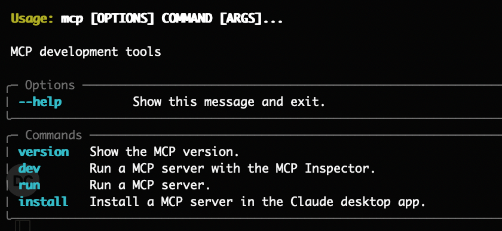
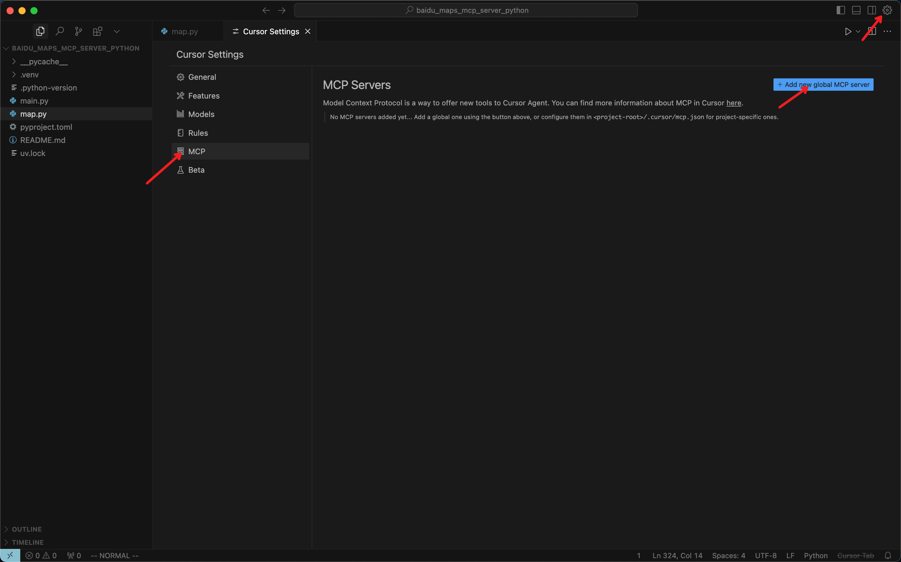
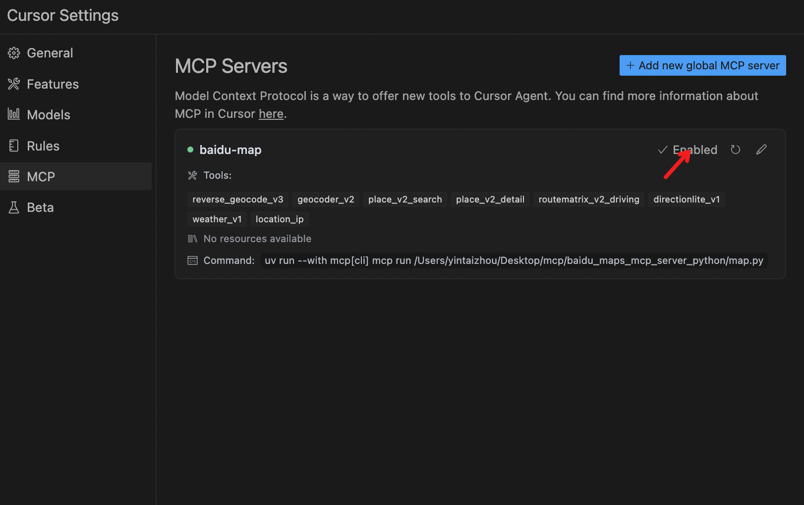
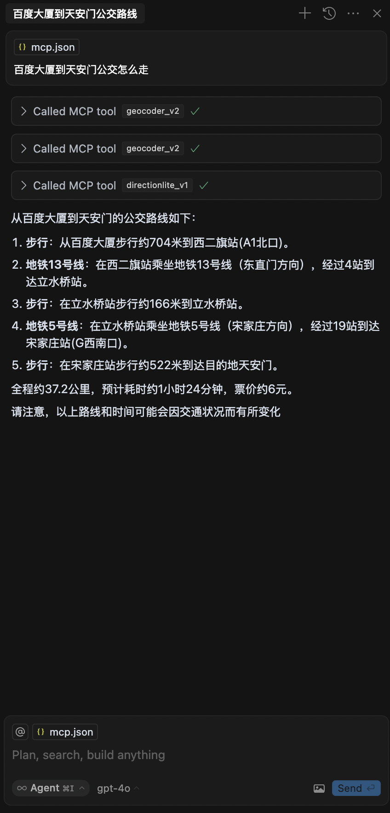
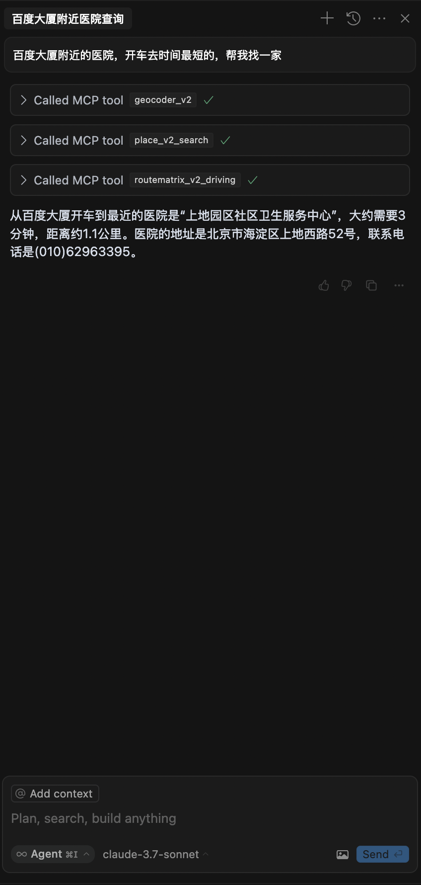

## Baidu Map MCP Server (Python)
### 搭建Python虚拟环境
我们推荐通过`uv`构建虚拟环境来运行MCP server，关于`uv你可以在[这里](https://docs.astral.sh/uv/getting-started/features/)找到一些说明。

按照[官方流程](https://modelcontextprotocol.io/quickstart/server)，你会安装`Python`包管理工具`uv`。除此之外，你也可以尝试其他方法（如`Anaconda`）来创建你的`Python`虚拟环境。

通过`uv`添加`mcp`依赖

```bash
uv add "mcp[cli]"
```

验证mcp依赖是否安装成功，执行如下命令
```bash
uv run mcp
```

当出现下图时代表安装成功



通过`uv`安装`python`，最低版本要求为3.11

```bash
uv python install 3.11
```

### 获取 MCP Server
前往百度地图 Mcp Server 官方[开源仓库](https://github.com/baidu-maps/mcp/tree/main/src/baidu-map/python)下载

### 配置本地项目
通过`uv`创建一个项目

```bash
uv init mcp_server_baidu_maps
```

将`map.py`拷贝到该目录下，通过如下命令测试mcp server是否正常运行

```bash
uv run --with mcp[cli] mcp run {YOUR_PATH}/mcp_server_baidu_maps/map.py
# 如果是mac，需要加转义符
uv run --with mcp\[cli\] mcp run {YOUR_PATH}/mcp_server_baidu_maps/map.py
```

如果没有报错则MCP Server启动成功

### 在Cursor中使用

打开`Cursor`配置，在MCP中添加MCP Server



在文件中添加如下内容后保存

```json
{
  "mcpServers": {
    "baidu-map": {
      "command": "uv",
      "args": [
        "run",
        "--with",
        "mcp[cli]",
        "mcp",
        "run",
        "{YOUR_PATH}/mcp_server_baidu_maps/map.py"
      ],
      "env": {
        "BAIDU_MAPS_API_KEY": "<YOUR_API_KEY>"
      }
    }
  }
}
```

回到配置，此时百度MCP Server已经启用



### 测试

行程规划：



