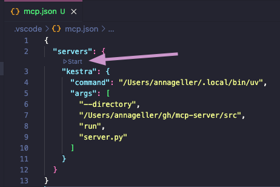
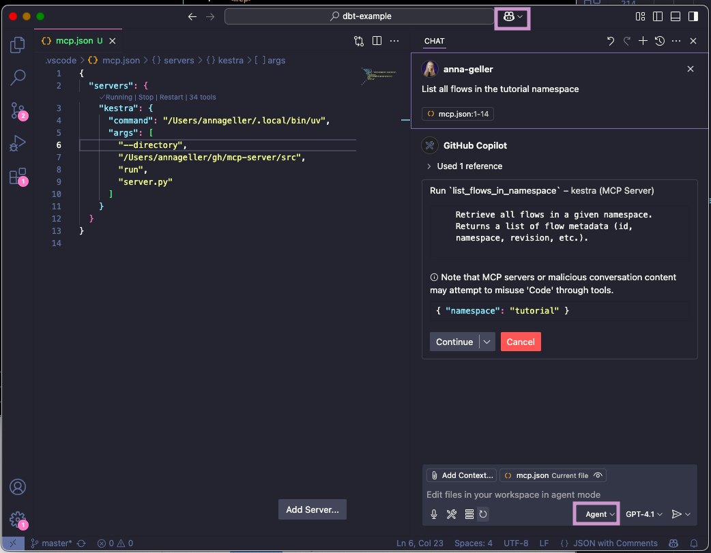
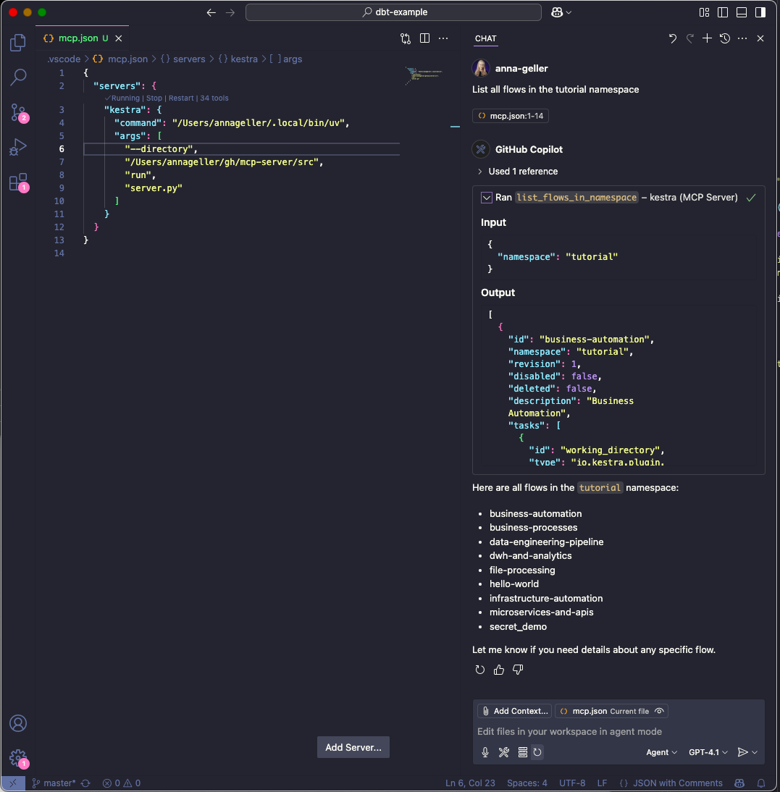

## Kestra Python MCP Server

You can run the MCP Server in a Docker container. This is useful if you want to avoid managing Python environments or dependencies on your local machine.

### Using Kestra AI Agent

See [kestra_mcp_docker](docs/flows/kestra_mcp_docker.yaml).

### Minimal configuration for OSS users

Paste the following configuration into your MCP settings (e.g., Cursor, Claude, or VS Code):

```json
{
  "mcpServers": {
    "kestra": {
      "command": "docker",
      "args": [
        "run",
        "-i",
        "--rm",
        "--pull",
        "always",
        "-e",
        "KESTRA_BASE_URL",
        "-e",
        "KESTRA_TENANT_ID",
        "-e",
        "KESTRA_MCP_DISABLED_TOOLS",
        "-e",
        "KESTRA_MCP_LOG_LEVEL",
        "-e",
        "KESTRA_USERNAME",
        "-e",
        "KESTRA_PASSWORD",
        "ghcr.io/kestra-io/mcp-server-python:latest"
      ],
      "env": {
        "KESTRA_BASE_URL": "http://host.docker.internal:8080/api/v1",
        "KESTRA_TENANT_ID": "main",
        "KESTRA_MCP_DISABLED_TOOLS": "ee",
        "KESTRA_MCP_LOG_LEVEL": "ERROR",
        "KESTRA_USERNAME": "admin@kestra.io",
        "KESTRA_PASSWORD": "your_password"
      }
    }
  }
}
```

### Minimal configuration for EE users

```json
{
  "mcpServers": {
    "kestra": {
      "command": "docker",
      "args": [
        "run",
        "-i",
        "--rm",
        "--pull",
        "always",
        "-e", "KESTRA_BASE_URL",
        "-e", "KESTRA_API_TOKEN",
        "-e", "KESTRA_TENANT_ID",
        "-e", "KESTRA_MCP_LOG_LEVEL",
        "ghcr.io/kestra-io/mcp-server-python:latest"
      ],
      "env": {
        "KESTRA_BASE_URL": "http://host.docker.internal:8080/api/v1",
        "KESTRA_API_TOKEN": "<your_kestra_api_token>",
        "KESTRA_TENANT_ID": "main",
        "KESTRA_MCP_LOG_LEVEL": "ERROR"
      }
    }
  }
}
```

### Detailed Configuration using Docker

```json
{
  "mcpServers": {
    "kestra": {
      "command": "docker",
      "args": [
        "run",
        "-i",
        "--rm",
        "--pull",
        "always",
        "-e", "KESTRA_BASE_URL",
        "-e", "KESTRA_API_TOKEN",
        "-e", "KESTRA_TENANT_ID",
        "-e", "KESTRA_USERNAME",
        "-e", "KESTRA_PASSWORD",
        "-e", "KESTRA_MCP_DISABLED_TOOLS",
        "-e", "KESTRA_MCP_LOG_LEVEL",
        "ghcr.io/kestra-io/mcp-server-python:latest"
      ],
      "env": {
        "KESTRA_BASE_URL": "http://host.docker.internal:8080/api/v1",
        "KESTRA_API_TOKEN": "<your_kestra_api_token>",
        "KESTRA_TENANT_ID": "main",
        "KESTRA_USERNAME": "admin",
        "KESTRA_PASSWORD": "admin",
        "KESTRA_MCP_DISABLED_TOOLS": "ee",
        "KESTRA_MCP_LOG_LEVEL": "ERROR"
      }
    }
  }
}
```

**Notes:**
- Replace `<your_kestra_api_token>`, `<your_google_api_key>`, and `<your_helicone_api_key>` with your actual credentials.
- For OSS installations, you can use `KESTRA_USERNAME` and `KESTRA_PASSWORD` instead of `KESTRA_API_TOKEN`.
- To disable Enterprise Edition tools in OSS, set `KESTRA_MCP_DISABLED_TOOLS=ee`.
- The `host.docker.internal` hostname allows the Docker container to access services running on your host machine (such as the Kestra API server on port 8080). This works on macOS and Windows. On Linux, you may need to use the host network mode or set up a custom bridge.
- The `-e` flags pass environment variables from your MCP configuration into the Docker container. 

---

### Available Tools

- 🔄 backfill
- ⚙️ ee (Enterprise Edition tools)
- ▶️ execution
- 📁 files
- 🔀 flow
- 🗝️ kv
- 📋 logs
- 🌐 namespace
- 🔁 replay
- ♻️ restart
- ⏸️ resume

**Note:** The `ee` tool group contains Enterprise Edition specific functionality and is only available in EE/Cloud editions. For OSS users, you can disable EE tools by adding `KESTRA_MCP_DISABLED_TOOLS=ee` to your `.env` file.

Optionally, you can include `KESTRA_MCP_DISABLED_TOOLS` in your `.env` file listing the tools that you prefer to disable. For example, if you want to disable Namespace Files tools, add this to your `.env` file:

```dotenv
KESTRA_MCP_DISABLED_TOOLS=files
```

To disable multiple tools, separate them with comma:

```dotenv
KESTRA_MCP_DISABLED_TOOLS=ee
```

### Logging Configuration

By default, the MCP server only logs ERROR level messages to minimize noise. You can control the logging level using the `KESTRA_MCP_LOG_LEVEL` environment variable:

```dotenv
# Only show ERROR messages (default)
KESTRA_MCP_LOG_LEVEL=ERROR

# Show WARNING and ERROR messages
KESTRA_MCP_LOG_LEVEL=WARNING

# Show INFO, WARNING, and ERROR messages
KESTRA_MCP_LOG_LEVEL=INFO

# Show all messages including DEBUG
KESTRA_MCP_LOG_LEVEL=DEBUG
```

When using Docker, add the environment variable to your MCP configuration:

```json
{
  "mcpServers": {
    "kestra": {
      "command": "docker",
      "args": [
        "run",
        "-i",
        "--rm",
        "--pull",
        "always",
        "-e", "KESTRA_BASE_URL",
        "-e", "KESTRA_MCP_LOG_LEVEL",
        "ghcr.io/kestra-io/mcp-server-python:latest"
      ],
      "env": {
        "KESTRA_BASE_URL": "http://host.docker.internal:8080/api/v1",
        "KESTRA_MCP_LOG_LEVEL": "ERROR"
      }
    }
  }
}
```

---

### Local development

To run the MCP Server for Kestra locally (e.g. if you want to extend it with new tools), make sure to create a virtual environment first:

```bash
uv venv --python 3.13
uv pip install -r requirements.txt
```

Create an `.env` file in the root directory of the project similar to the [.env_example](.env_example) file. For OSS installations, you can use basic authentication with `KESTRA_USERNAME` and `KESTRA_PASSWORD`. For EE/Cloud installations, use `KESTRA_API_TOKEN`. To disable Enterprise Edition tools in OSS, add `KESTRA_MCP_DISABLED_TOOLS=ee` to your `.env` file.

Then, follow the instructions below explaining how to test your local server in Cursor, Windsurf, VS Code or Claude Desktop.

---

### Usage in Cursor, Windsurf, VS Code or Claude Desktop

To use the Python MCP Server with Claude or modern IDEs, first check what is the path to uv on your machine:

```bash
which uv
```

Copy the path returned by `which uv` and paste it into the `command` section.
Then, replace the `--directory` by the path where you cloned the Kestra MCP Server repository. For example:

```json
{
  "mcpServers": {
    "kestra": {
      "command": "/Users/annageller/.local/bin/uv",
      "args": [
        "--directory",
        "/Users/annageller/gh/mcp-server-python/src",
        "run",
        "server.py"
      ]
    }
  }
}
```

You can paste that in the Cursor MCP settings or Claud Developer settings.

### VS Code setup

In your VS Code project directory, add a folder `.vscode` and within that folder, create a file called `mcp.json`. Paste your MCP configuration into that file (note that in VS Code, the key is `servers` instead of `mcpServers`):

```json
{
  "servers": {
    "kestra": {
      "command": "/Users/annageller/.local/bin/uv",
      "args": [
        "--directory",
        "/Users/annageller/gh/mcp-server-python/src",
        "run",
        "server.py"
      ]
    }
  }
}
```

A small `Start` button should show up, click on it to start the server.



If you now navigate to the GitHub Copilot tab and switch to the Agent mode, you will be able to directly interact with the Kestra MCP Server tools. For example, try typing the prompt: "List all flows in the tutorial namespace".



If you click on continue, you will see the result of the command in the output window.



### FAQ

**Question: Do I have to manually start the server as an always-on process?**

No, you don't have to run the server manually, as when using the `stdio` transport, the AI IDEs/chat-interfaces (Cursor, Windsurf, VS Code or Claude Desktop) launch the MCP server as a subprocess. This subprocess communicates with AI IDEs via JSON-RPC messages over standard input and output streams. The server receives messages through stdin and sends responses through stdout.

**Question: Do I have to manually activate the virtual environment for the MCP Server?**

No, because we use `uv`. Unlike traditional Python package managers, where virtual environment activation modifies shell variables like `PATH`, `uv` directly uses the Python interpreter and packages from the `.venv` directory without requiring environment variables to be set first. Just make sure you have created a uv virtual environment with `uv venv` and installed the required packages with `uv pip install` as described in the previous section.

