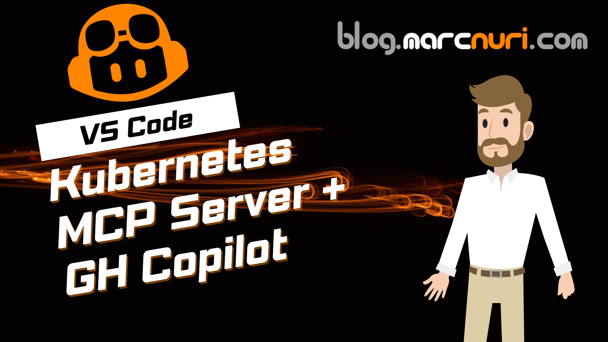

# Kubernetes MCP Server

[](https://github.com/containers/kubernetes-mcp-server/blob/main/LICENSE)
[](https://www.npmjs.com/package/kubernetes-mcp-server)
[](https://pypi.org/project/kubernetes-mcp-server/)
[](https://github.com/containers/kubernetes-mcp-server/releases/latest)
[](https://github.com/containers/kubernetes-mcp-server/actions/workflows/build.yaml)

[✨ Features](#features) | [🚀 Getting Started](#getting-started) | [🎥 Demos](#demos) | [⚙️ Configuration](#configuration) | [🛠️ Tools](#tools-and-functionalities) | [💬 Community](#community) | [🧑‍💻 Development](#development)

https://github.com/user-attachments/assets/be2b67b3-fc1c-4d11-ae46-93deba8ed98e

## ✨ Features <a id="features"></a>

A powerful and flexible Kubernetes [Model Context Protocol (MCP)](https://blog.marcnuri.com/model-context-protocol-mcp-introduction) server implementation with support for **Kubernetes** and **OpenShift**.

- **✅ Configuration**:
  - Automatically detect changes in the Kubernetes configuration and update the MCP server.
  - **View** and manage the current [Kubernetes `.kube/config`](https://blog.marcnuri.com/where-is-my-default-kubeconfig-file) or in-cluster configuration.
- **✅ Generic Kubernetes Resources**: Perform operations on **any** Kubernetes or OpenShift resource.
  - Any CRUD operation (Create or Update, Get, List, Delete).
- **✅ Pods**: Perform Pod-specific operations.
  - **List** pods in all namespaces or in a specific namespace.
  - **Get** a pod by name from the specified namespace.
  - **Delete** a pod by name from the specified namespace.
  - **Show logs** for a pod by name from the specified namespace.
  - **Top** gets resource usage metrics for all pods or a specific pod in the specified namespace.
  - **Exec** into a pod and run a command.
  - **Run** a container image in a pod and optionally expose it.
- **✅ Namespaces**: List Kubernetes Namespaces.
- **✅ Events**: View Kubernetes events in all namespaces or in a specific namespace.
- **✅ Projects**: List OpenShift Projects.
- **☸️ Helm**:
  - **Install** a Helm chart in the current or provided namespace.
  - **List** Helm releases in all namespaces or in a specific namespace.
  - **Uninstall** a Helm release in the current or provided namespace.
- **🔭 Observability**: Optional OpenTelemetry distributed tracing and metrics with custom sampling rates. Includes `/stats` endpoint for real-time statistics. See [OTEL.md](docs/OTEL.md).

Unlike other Kubernetes MCP server implementations, this **IS NOT** just a wrapper around `kubectl` or `helm` command-line tools.
It is a **Go-based native implementation** that interacts directly with the Kubernetes API server.

There is **NO NEED** for external dependencies or tools to be installed on the system.
If you're using the native binaries you don't need to have Node or Python installed on your system.

- **✅ Lightweight**: The server is distributed as a single native binary for Linux, macOS, and Windows.
- **✅ High-Performance / Low-Latency**: Directly interacts with the Kubernetes API server without the overhead of calling and waiting for external commands.
- **✅ Multi-Cluster**: Can interact with multiple Kubernetes clusters simultaneously (as defined in your kubeconfig files).
- **✅ Cross-Platform**: Available as a native binary for Linux, macOS, and Windows, as well as an npm package, a Python package, and container/Docker image.
- **✅ Configurable**: Supports [command-line arguments](#configuration), [TOML configuration files](docs/configuration.md), and environment variables.
- **✅ Well tested**: The server has an extensive test suite to ensure its reliability and correctness across different Kubernetes environments.
- **📚 Documentation**: Comprehensive [user documentation](docs/) including setup guides, configuration reference, and observability.

## 🚀 Getting Started <a id="getting-started"></a>

### Requirements

- Access to a Kubernetes cluster.

<details>
<summary><b>Claude Code</b></summary>

Follow the [dedicated Claude Code getting started guide](docs/getting-started-claude-code.md) in our [user documentation](docs/).

For a secure production setup with dedicated ServiceAccount and read-only access, also review the [Kubernetes setup guide](docs/getting-started-kubernetes.md).

</details>

### Claude Desktop

#### Using npx

If you have npm installed, this is the fastest way to get started with `kubernetes-mcp-server` on Claude Desktop.

Open your `claude_desktop_config.json` and add the mcp server to the list of `mcpServers`:
``` json
{
  "mcpServers": {
    "kubernetes": {
      "command": "npx",
      "args": [
        "-y",
        "kubernetes-mcp-server@latest"
      ]
    }
  }
}
```

### VS Code / VS Code Insiders

Install the Kubernetes MCP server extension in VS Code Insiders by pressing the following link:

[](https://insiders.vscode.dev/redirect?url=vscode%3Amcp%2Finstall%3F%257B%2522name%2522%253A%2522kubernetes%2522%252C%2522command%2522%253A%2522npx%2522%252C%2522args%2522%253A%255B%2522-y%2522%252C%2522kubernetes-mcp-server%2540latest%2522%255D%257D)
[](https://insiders.vscode.dev/redirect?url=vscode-insiders%3Amcp%2Finstall%3F%257B%2522name%2522%253A%2522kubernetes%2522%252C%2522command%2522%253A%2522npx%2522%252C%2522args%2522%253A%255B%2522-y%2522%252C%2522kubernetes-mcp-server%2540latest%2522%255D%257D)

Alternatively, you can install the extension manually by running the following command:

```shell
# For VS Code
code --add-mcp '{"name":"kubernetes","command":"npx","args":["kubernetes-mcp-server@latest"]}'
# For VS Code Insiders
code-insiders --add-mcp '{"name":"kubernetes","command":"npx","args":["kubernetes-mcp-server@latest"]}'
```

### Cursor

Install the Kubernetes MCP server extension in Cursor by pressing the following link:

[](https://cursor.com/en/install-mcp?name=kubernetes-mcp-server&config=eyJjb21tYW5kIjoibnB4IC15IGt1YmVybmV0ZXMtbWNwLXNlcnZlckBsYXRlc3QifQ%3D%3D)

Alternatively, you can install the extension manually by editing the `mcp.json` file:

```json
{
  "mcpServers": {
    "kubernetes-mcp-server": {
      "command": "npx",
      "args": ["-y", "kubernetes-mcp-server@latest"]
    }
  }
}
```

### Goose CLI

[Goose CLI](https://blog.marcnuri.com/goose-on-machine-ai-agent-cli-introduction) is the easiest (and cheapest) way to get rolling with artificial intelligence (AI) agents.

#### Using npm

If you have npm installed, this is the fastest way to get started with `kubernetes-mcp-server`.

Open your goose `config.yaml` and add the mcp server to the list of `mcpServers`:
```yaml
extensions:
  kubernetes:
    command: npx
    args:
      - -y
      - kubernetes-mcp-server@latest

```

## 🎥 Demos <a id="demos"></a>

### Diagnosing and automatically fixing an OpenShift Deployment

Demo showcasing how Kubernetes MCP server is leveraged by Claude Desktop to automatically diagnose and fix a deployment in OpenShift without any user assistance.

https://github.com/user-attachments/assets/a576176d-a142-4c19-b9aa-a83dc4b8d941

### _Vibe Coding_ a simple game and deploying it to OpenShift

In this demo, I walk you through the process of _Vibe Coding_ a simple game using VS Code and how to leverage [Podman MCP server](https://github.com/manusa/podman-mcp-server) and Kubernetes MCP server to deploy it to OpenShift.

<a href="https://www.youtube.com/watch?v=l05jQDSrzVI" target="_blank">
 
</a>

### Supercharge GitHub Copilot with Kubernetes MCP Server in VS Code - One-Click Setup!

In this demo, I'll show you how to set up Kubernetes MCP server in VS code just by clicking a link.

<a href="https://youtu.be/AI4ljYMkgtA" target="_blank">
 
</a>

## ⚙️ Configuration <a id="configuration"></a>

The Kubernetes MCP server can be configured using command line (CLI) arguments.

You can run the CLI executable either by using `npx`, `uvx`, or by downloading the [latest release binary](https://github.com/containers/kubernetes-mcp-server/releases/latest).

```shell
# Run the Kubernetes MCP server using npx (in case you have npm and node installed)
npx kubernetes-mcp-server@latest --help
```

```shell
# Run the Kubernetes MCP server using uvx (in case you have uv and python installed)
uvx kubernetes-mcp-server@latest --help
```

```shell
# Run the Kubernetes MCP server using the latest release binary
./kubernetes-mcp-server --help
```

### Configuration Options

| Option                    | Description                                                                                                                                                                                                                                                                                   |
|---------------------------|-----------------------------------------------------------------------------------------------------------------------------------------------------------------------------------------------------------------------------------------------------------------------------------------------|
| `--port`                  | Starts the MCP server in Streamable HTTP mode (path /mcp) and Server-Sent Event (SSE) (path /sse) mode and listens on the specified port .                                                                                                                                                    |
| `--log-level`             | Sets the logging level (values [from 0-9](https://github.com/kubernetes/community/blob/master/contributors/devel/sig-instrumentation/logging.md)). Similar to [kubectl logging levels](https://kubernetes.io/docs/reference/kubectl/quick-reference/#kubectl-output-verbosity-and-debugging). |
| `--config`                | (Optional) Path to the main TOML configuration file. See [Configuration Reference](docs/configuration.md) for details.                                                                                                                                                                        |
| `--config-dir`            | (Optional) Path to drop-in configuration directory. Files are loaded in lexical (alphabetical) order. Defaults to `conf.d` relative to the main config file if `--config` is specified. See [Configuration Reference](docs/configuration.md) for details.                                    |
| `--kubeconfig`            | Path to the Kubernetes configuration file. If not provided, it will try to resolve the configuration (in-cluster, default location, etc.).                                                                                                                                                    |
| `--list-output`           | Output format for resource list operations (one of: yaml, table) (default "table")                                                                                                                                                                                                            |
| `--read-only`             | If set, the MCP server will run in read-only mode, meaning it will not allow any write operations (create, update, delete) on the Kubernetes cluster. This is useful for debugging or inspecting the cluster without making changes.                                                          |
| `--disable-destructive`   | If set, the MCP server will disable all destructive operations (delete, update, etc.) on the Kubernetes cluster. This is useful for debugging or inspecting the cluster without accidentally making changes. This option has no effect when `--read-only` is used.                            |
| `--stateless`             | If set, the MCP server will run in stateless mode, disabling tool and prompt change notifications. This is useful for container deployments, load balancing, and serverless environments where maintaining client state is not desired.                                                       |
| `--toolsets`              | Comma-separated list of toolsets to enable. Check the [🛠️ Tools and Functionalities](#tools-and-functionalities) section for more information.                                                                                                                                                |
| `--disable-multi-cluster` | If set, the MCP server will disable multi-cluster support and will only use the current context from the kubeconfig file. This is useful if you want to restrict the MCP server to a single cluster.                                                                                          |
| `--cluster-provider`      | Cluster provider strategy to use (one of: kubeconfig, in-cluster, kcp, disabled). If not set, the server will auto-detect based on the environment.                                                                                                                                           |

> **Note**: Most CLI options have equivalent TOML configuration fields. The `--disable-multi-cluster` flag is equivalent to setting `cluster_provider_strategy = "disabled"` in TOML. See the [Configuration Reference](docs/configuration.md) for all TOML options.

### TOML Configuration Files

For complex or persistent configurations, use TOML configuration files instead of CLI arguments:

```shell
kubernetes-mcp-server --config /etc/kubernetes-mcp-server/config.toml
```

**Example configuration:**

```toml
log_level = 2
read_only = true
toolsets = ["core", "config", "helm", "kubevirt"]

# Deny access to sensitive resources
[[denied_resources]]
group = ""
version = "v1"
kind = "Secret"

[telemetry]
endpoint = "http://localhost:4317"
```

For comprehensive TOML configuration documentation, including:
- All configuration options and their defaults
- Drop-in configuration files for modular settings
- Dynamic configuration reload via SIGHUP
- Denied resources for restricting access to sensitive resource types
- Server instructions for MCP Tool Search
- [Custom MCP prompts](docs/prompts.md)
- [OAuth/OIDC authentication](docs/KEYCLOAK_OIDC_SETUP.md) for HTTP mode

See the **[Configuration Reference](docs/configuration.md)**.

## 📊 MCP Logging <a id="mcp-logging"></a>

The server supports the MCP logging capability, allowing clients to receive debugging information via structured log messages.
Kubernetes API errors are automatically categorized and logged to clients with appropriate severity levels.
Sensitive data (tokens, keys, passwords, cloud credentials) is automatically redacted before being sent to clients.

See the **[MCP Logging Guide](docs/logging.md)**.

## 🛠️ Tools and Functionalities <a id="tools-and-functionalities"></a>

The Kubernetes MCP server supports enabling or disabling specific groups of tools and functionalities (tools, resources, prompts, and so on) via the `--toolsets` command-line flag or `toolsets` configuration option.
This allows you to control which Kubernetes functionalities are available to your AI tools.
Enabling only the toolsets you need can help reduce the context size and improve the LLM's tool selection accuracy.

### Available Toolsets

The following sets of tools are available (toolsets marked with ✓ in the Default column are enabled by default):

<!-- AVAILABLE-TOOLSETS-START -->

| Toolset  | Description                                                                                                                                                                     | Default |
|----------|---------------------------------------------------------------------------------------------------------------------------------------------------------------------------------|---------|
| config   | View and manage the current local Kubernetes configuration (kubeconfig)                                                                                                         | ✓       |
| core     | Most common tools for Kubernetes management (Pods, Generic Resources, Events, etc.)                                                                                             | ✓       |
| helm     | Tools for managing Helm charts and releases                                                                                                                                     |         |
| kcp      | Manage kcp workspaces and multi-tenancy features                                                                                                                                |         |
| kiali    | Most common tools for managing Kiali, check the [Kiali documentation](https://github.com/containers/kubernetes-mcp-server/blob/main/docs/KIALI.md) for more details.            |         |
| kubevirt | KubeVirt virtual machine management tools, check the [KubeVirt documentation](https://github.com/containers/kubernetes-mcp-server/blob/main/docs/kubevirt.md) for more details. |         |

<!-- AVAILABLE-TOOLSETS-END -->

### Tools

In case multi-cluster support is enabled (default) and you have access to multiple clusters, all applicable tools will include an additional `context` argument to specify the Kubernetes context (cluster) to use for that operation.

<!-- AVAILABLE-TOOLSETS-TOOLS-START -->

<details>

<summary>config</summary>

- **configuration_contexts_list** - List all available context names and associated server urls from the kubeconfig file

- **targets_list** - List all available targets

- **configuration_view** - Get the current Kubernetes configuration content as a kubeconfig YAML
  - `minified` (`boolean`) - Return a minified version of the configuration. If set to true, keeps only the current-context and the relevant pieces of the configuration for that context. If set to false, all contexts, clusters, auth-infos, and users are returned in the configuration. (Optional, default true)

</details>

<details>

<summary>core</summary>

- **events_list** - List Kubernetes events (warnings, errors, state changes) for debugging and troubleshooting in the current cluster from all namespaces
  - `namespace` (`string`) - Optional Namespace to retrieve the events from. If not provided, will list events from all namespaces

- **namespaces_list** - List all the Kubernetes namespaces in the current cluster

- **projects_list** - List all the OpenShift projects in the current cluster

- **nodes_log** - Get logs from a Kubernetes node (kubelet, kube-proxy, or other system logs). This accesses node logs through the Kubernetes API proxy to the kubelet
  - `name` (`string`) **(required)** - Name of the node to get logs from
  - `query` (`string`) **(required)** - query specifies services(s) or files from which to return logs (required). Example: "kubelet" to fetch kubelet logs, "/<log-file-name>" to fetch a specific log file from the node (e.g., "/var/log/kubelet.log" or "/var/log/kube-proxy.log")
  - `tailLines` (`integer`) - Number of lines to retrieve from the end of the logs (Optional, 0 means all logs)

- **nodes_stats_summary** - Get detailed resource usage statistics from a Kubernetes node via the kubelet's Summary API. Provides comprehensive metrics including CPU, memory, filesystem, and network usage at the node, pod, and container levels. On systems with cgroup v2 and kernel 4.20+, also includes PSI (Pressure Stall Information) metrics that show resource pressure for CPU, memory, and I/O. See https://kubernetes.io/docs/reference/instrumentation/understand-psi-metrics/ for details on PSI metrics
  - `name` (`string`) **(required)** - Name of the node to get stats from

- **nodes_top** - List the resource consumption (CPU and memory) as recorded by the Kubernetes Metrics Server for the specified Kubernetes Nodes or all nodes in the cluster
  - `label_selector` (`string`) - Kubernetes label selector (e.g. 'node-role.kubernetes.io/worker=') to filter nodes by label (Optional, only applicable when name is not provided)
  - `name` (`string`) - Name of the Node to get the resource consumption from (Optional, all Nodes if not provided)

- **pods_list** - List all the Kubernetes pods in the current cluster from all namespaces
  - `fieldSelector` (`string`) - Optional Kubernetes field selector to filter pods by field values (e.g. 'status.phase=Running', 'spec.nodeName=node1'). Supported fields: metadata.name, metadata.namespace, spec.nodeName, spec.restartPolicy, spec.schedulerName, spec.serviceAccountName, status.phase (Pending/Running/Succeeded/Failed/Unknown), status.podIP, status.nominatedNodeName. Note: CrashLoopBackOff is a container state, not a pod phase, so it cannot be filtered directly. See https://kubernetes.io/docs/concepts/overview/working-with-objects/field-selectors/
  - `labelSelector` (`string`) - Optional Kubernetes label selector (e.g. 'app=myapp,env=prod' or 'app in (myapp,yourapp)'), use this option when you want to filter the pods by label

- **pods_list_in_namespace** - List all the Kubernetes pods in the specified namespace in the current cluster
  - `fieldSelector` (`string`) - Optional Kubernetes field selector to filter pods by field values (e.g. 'status.phase=Running', 'spec.nodeName=node1'). Supported fields: metadata.name, metadata.namespace, spec.nodeName, spec.restartPolicy, spec.schedulerName, spec.serviceAccountName, status.phase (Pending/Running/Succeeded/Failed/Unknown), status.podIP, status.nominatedNodeName. Note: CrashLoopBackOff is a container state, not a pod phase, so it cannot be filtered directly. See https://kubernetes.io/docs/concepts/overview/working-with-objects/field-selectors/
  - `labelSelector` (`string`) - Optional Kubernetes label selector (e.g. 'app=myapp,env=prod' or 'app in (myapp,yourapp)'), use this option when you want to filter the pods by label
  - `namespace` (`string`) **(required)** - Namespace to list pods from

- **pods_get** - Get a Kubernetes Pod in the current or provided namespace with the provided name
  - `name` (`string`) **(required)** - Name of the Pod
  - `namespace` (`string`) - Namespace to get the Pod from

- **pods_delete** - Delete a Kubernetes Pod in the current or provided namespace with the provided name
  - `name` (`string`) **(required)** - Name of the Pod to delete
  - `namespace` (`string`) - Namespace to delete the Pod from

- **pods_top** - List the resource consumption (CPU and memory) as recorded by the Kubernetes Metrics Server for the specified Kubernetes Pods in the all namespaces, the provided namespace, or the current namespace
  - `all_namespaces` (`boolean`) - If true, list the resource consumption for all Pods in all namespaces. If false, list the resource consumption for Pods in the provided namespace or the current namespace
  - `label_selector` (`string`) - Kubernetes label selector (e.g. 'app=myapp,env=prod' or 'app in (myapp,yourapp)'), use this option when you want to filter the pods by label (Optional, only applicable when name is not provided)
  - `name` (`string`) - Name of the Pod to get the resource consumption from (Optional, all Pods in the namespace if not provided)
  - `namespace` (`string`) - Namespace to get the Pods resource consumption from (Optional, current namespace if not provided and all_namespaces is false)

- **pods_exec** - Execute a command in a Kubernetes Pod (shell access, run commands in container) in the current or provided namespace with the provided name and command
  - `command` (`array`) **(required)** - Command to execute in the Pod container. The first item is the command to be run, and the rest are the arguments to that command. Example: ["ls", "-l", "/tmp"]
  - `container` (`string`) - Name of the Pod container where the command will be executed (Optional)
  - `name` (`string`) **(required)** - Name of the Pod where the command will be executed
  - `namespace` (`string`) - Namespace of the Pod where the command will be executed

- **pods_log** - Get the logs of a Kubernetes Pod in the current or provided namespace with the provided name
  - `container` (`string`) - Name of the Pod container to get the logs from (Optional)
  - `name` (`string`) **(required)** - Name of the Pod to get the logs from
  - `namespace` (`string`) - Namespace to get the Pod logs from
  - `previous` (`boolean`) - Return previous terminated container logs (Optional)
  - `tail` (`integer`) - Number of lines to retrieve from the end of the logs (Optional, default: 100)

- **pods_run** - Run a Kubernetes Pod in the current or provided namespace with the provided container image and optional name
  - `image` (`string`) **(required)** - Container Image to run in the Pod
  - `name` (`string`) - Name of the Pod (Optional, random name if not provided)
  - `namespace` (`string`) - Namespace to run the Pod in
  - `port` (`number`) - TCP/IP port to expose from the Pod container (Optional, no port exposed if not provided)

- **resources_list** - List Kubernetes resources and objects in the current cluster by providing their apiVersion and kind and optionally the namespace and label selector
(common apiVersion and kind include: v1 Pod, v1 Service, v1 Node, apps/v1 Deployment, networking.k8s.io/v1 Ingress, route.openshift.io/v1 Route)
  - `apiVersion` (`string`) **(required)** - apiVersion of the resources (examples of valid apiVersion are: v1, apps/v1, networking.k8s.io/v1)
  - `fieldSelector` (`string`) - Optional Kubernetes field selector to filter resources by field values (e.g. 'status.phase=Running', 'metadata.name=myresource'). Supported fields vary by resource type. For Pods: metadata.name, metadata.namespace, spec.nodeName, spec.restartPolicy, spec.schedulerName, spec.serviceAccountName, status.phase (Pending/Running/Succeeded/Failed/Unknown), status.podIP, status.nominatedNodeName. See https://kubernetes.io/docs/concepts/overview/working-with-objects/field-selectors/
  - `kind` (`string`) **(required)** - kind of the resources (examples of valid kind are: Pod, Service, Deployment, Ingress)
  - `labelSelector` (`string`) - Optional Kubernetes label selector (e.g. 'app=myapp,env=prod' or 'app in (myapp,yourapp)'), use this option when you want to filter the resources by label
  - `namespace` (`string`) - Optional Namespace to retrieve the namespaced resources from (ignored in case of cluster scoped resources). If not provided, will list resources from all namespaces

- **resources_get** - Get a Kubernetes resource in the current cluster by providing its apiVersion, kind, optionally the namespace, and its name
(common apiVersion and kind include: v1 Pod, v1 Service, v1 Node, apps/v1 Deployment, networking.k8s.io/v1 Ingress, route.openshift.io/v1 Route)
  - `apiVersion` (`string`) **(required)** - apiVersion of the resource (examples of valid apiVersion are: v1, apps/v1, networking.k8s.io/v1)
  - `kind` (`string`) **(required)** - kind of the resource (examples of valid kind are: Pod, Service, Deployment, Ingress)
  - `name` (`string`) **(required)** - Name of the resource
  - `namespace` (`string`) - Optional Namespace to retrieve the namespaced resource from (ignored in case of cluster scoped resources). If not provided, will get resource from configured namespace

- **resources_create_or_update** - Create or update a Kubernetes resource in the current cluster by providing a YAML or JSON representation of the resource
(common apiVersion and kind include: v1 Pod, v1 Service, v1 Node, apps/v1 Deployment, networking.k8s.io/v1 Ingress, route.openshift.io/v1 Route)
  - `resource` (`string`) **(required)** - A JSON or YAML containing a representation of the Kubernetes resource. Should include top-level fields such as apiVersion,kind,metadata, and spec

- **resources_delete** - Delete a Kubernetes resource in the current cluster by providing its apiVersion, kind, optionally the namespace, and its name
(common apiVersion and kind include: v1 Pod, v1 Service, v1 Node, apps/v1 Deployment, networking.k8s.io/v1 Ingress, route.openshift.io/v1 Route)
  - `apiVersion` (`string`) **(required)** - apiVersion of the resource (examples of valid apiVersion are: v1, apps/v1, networking.k8s.io/v1)
  - `gracePeriodSeconds` (`integer`) - Optional duration in seconds before the object should be deleted. Value must be non-negative integer. The value zero indicates delete immediately. If this value is nil, the default grace period for the specified type will be used
  - `kind` (`string`) **(required)** - kind of the resource (examples of valid kind are: Pod, Service, Deployment, Ingress)
  - `name` (`string`) **(required)** - Name of the resource
  - `namespace` (`string`) - Optional Namespace to delete the namespaced resource from (ignored in case of cluster scoped resources). If not provided, will delete resource from configured namespace

- **resources_scale** - Get or update the scale of a Kubernetes resource in the current cluster by providing its apiVersion, kind, name, and optionally the namespace. If the scale is set in the tool call, the scale will be updated to that value. Always returns the current scale of the resource
  - `apiVersion` (`string`) **(required)** - apiVersion of the resource (examples of valid apiVersion are apps/v1)
  - `kind` (`string`) **(required)** - kind of the resource (examples of valid kind are: StatefulSet, Deployment)
  - `name` (`string`) **(required)** - Name of the resource
  - `namespace` (`string`) - Optional Namespace to get/update the namespaced resource scale from (ignored in case of cluster scoped resources). If not provided, will get/update resource scale from configured namespace
  - `scale` (`integer`) - Optional scale to update the resources scale to. If not provided, will return the current scale of the resource, and not update it

</details>

<details>

<summary>helm</summary>

- **helm_install** - Install (deploy) a Helm chart to create a release in the current or provided namespace
  - `chart` (`string`) **(required)** - Chart reference to install (for example: stable/grafana, oci://ghcr.io/nginxinc/charts/nginx-ingress)
  - `name` (`string`) - Name of the Helm release (Optional, random name if not provided)
  - `namespace` (`string`) - Namespace to install the Helm chart in (Optional, current namespace if not provided)
  - `values` (`object`) - Values to pass to the Helm chart (Optional)

- **helm_list** - List all the Helm releases in the current or provided namespace (or in all namespaces if specified)
  - `all_namespaces` (`boolean`) - If true, lists all Helm releases in all namespaces ignoring the namespace argument (Optional)
  - `namespace` (`string`) - Namespace to list Helm releases from (Optional, all namespaces if not provided)

- **helm_uninstall** - Uninstall a Helm release in the current or provided namespace
  - `name` (`string`) **(required)** - Name of the Helm release to uninstall
  - `namespace` (`string`) - Namespace to uninstall the Helm release from (Optional, current namespace if not provided)

</details>

<details>

<summary>kcp</summary>

- **kcp_workspaces_list** - List all available kcp workspaces in the current cluster

- **kcp_workspace_describe** - Get detailed information about a specific kcp workspace
  - `workspace` (`string`) **(required)** - Name or path of the workspace to describe

</details>

<details>

<summary>kiali</summary>

- **kiali_mesh_graph** - Returns the topology of a specific namespaces, health, status of the mesh and namespaces. Includes a mesh health summary overview with aggregated counts of healthy, degraded, and failing apps, workloads, and services. Use this for high-level overviews
  - `graphType` (`string`) - Optional type of graph to return: 'versionedApp', 'app', 'service', 'workload', 'mesh'
  - `namespace` (`string`) - Optional single namespace to include in the graph (alternative to namespaces)
  - `namespaces` (`string`) - Optional comma-separated list of namespaces to include in the graph
  - `rateInterval` (`string`) - Optional rate interval for fetching (e.g., '10m', '5m', '1h').

- **kiali_manage_istio_config_read** - Lists or gets Istio configuration objects (Gateways, VirtualServices, etc.)
  - `action` (`string`) **(required)** - Action to perform: list or get
  - `group` (`string`) - API group of the Istio object (e.g., 'networking.istio.io', 'gateway.networking.k8s.io')
  - `kind` (`string`) - Kind of the Istio object (e.g., 'DestinationRule', 'VirtualService', 'HTTPRoute', 'Gateway')
  - `name` (`string`) - Name of the Istio object
  - `namespace` (`string`) - Namespace containing the Istio object
  - `version` (`string`) - API version of the Istio object (e.g., 'v1', 'v1beta1')

- **kiali_manage_istio_config** - Creates, patches, or deletes Istio configuration objects (Gateways, VirtualServices, etc.)
  - `action` (`string`) **(required)** - Action to perform: create, patch, or delete
  - `group` (`string`) - API group of the Istio object (e.g., 'networking.istio.io', 'gateway.networking.k8s.io')
  - `json_data` (`string`) - JSON data to apply or create the object
  - `kind` (`string`) - Kind of the Istio object (e.g., 'DestinationRule', 'VirtualService', 'HTTPRoute', 'Gateway')
  - `name` (`string`) - Name of the Istio object
  - `namespace` (`string`) - Namespace containing the Istio object
  - `version` (`string`) - API version of the Istio object (e.g., 'v1', 'v1beta1')

- **kiali_get_resource_details** - Gets lists or detailed info for Kubernetes resources (services, workloads) within the mesh
  - `namespaces` (`string`) - Comma-separated list of namespaces to get services from (e.g. 'bookinfo' or 'bookinfo,default'). If not provided, will list services from all accessible namespaces
  - `resource_name` (`string`) - Name of the resource to get details for (optional string - if provided, gets details; if empty, lists all).
  - `resource_type` (`string`) - Type of resource to get details for (service, workload)

- **kiali_get_metrics** - Gets lists or detailed info for Kubernetes resources (services, workloads) within the mesh
  - `byLabels` (`string`) - Comma-separated list of labels to group metrics by (e.g., 'source_workload,destination_service'). Optional
  - `direction` (`string`) - Traffic direction: 'inbound' or 'outbound'. Optional, defaults to 'outbound'
  - `namespace` (`string`) **(required)** - Namespace to get resources from
  - `quantiles` (`string`) - Comma-separated list of quantiles for histogram metrics (e.g., '0.5,0.95,0.99'). Optional
  - `rateInterval` (`string`) - Rate interval for metrics (e.g., '1m', '5m'). Optional, defaults to '10m'
  - `reporter` (`string`) - Metrics reporter: 'source', 'destination', or 'both'. Optional, defaults to 'source'
  - `requestProtocol` (`string`) - Filter by request protocol (e.g., 'http', 'grpc', 'tcp'). Optional
  - `resource_name` (`string`) **(required)** - Name of the resource to get details for (optional string - if provided, gets details; if empty, lists all).
  - `resource_type` (`string`) **(required)** - Type of resource to get details for (service, workload)
  - `step` (`string`) - Step between data points in seconds (e.g., '15'). Optional, defaults to 15 seconds

- **kiali_workload_logs** - Get logs for a specific workload's pods in a namespace. Only requires namespace and workload name - automatically discovers pods and containers. Optionally filter by container name, time range, and other parameters. Container is auto-detected if not specified.
  - `container` (`string`) - Optional container name to filter logs. If not provided, automatically detects and uses the main application container (excludes istio-proxy and istio-init)
  - `namespace` (`string`) **(required)** - Namespace containing the workload
  - `since` (`string`) - Time duration to fetch logs from (e.g., '5m', '1h', '30s'). If not provided, returns recent logs
  - `tail` (`integer`) - Number of lines to retrieve from the end of logs (default: 100)
  - `workload` (`string`) **(required)** - Name of the workload to get logs for

- **kiali_get_traces** - Gets traces for a specific resource (app, service, workload) in a namespace, or gets detailed information for a specific trace by its ID. If traceId is provided, it returns detailed trace information and other parameters are not required.
  - `clusterName` (`string`) - Cluster name for multi-cluster environments (optional, only used when traceId is not provided)
  - `endMicros` (`string`) - End time for traces in microseconds since epoch (optional, defaults to 10 minutes after startMicros if not provided, only used when traceId is not provided)
  - `limit` (`integer`) - Maximum number of traces to return (default: 100, only used when traceId is not provided)
  - `minDuration` (`integer`) - Minimum trace duration in microseconds (optional, only used when traceId is not provided)
  - `namespace` (`string`) - Namespace to get resources from. Required if traceId is not provided.
  - `resource_name` (`string`) - Name of the resource to get traces for. Required if traceId is not provided.
  - `resource_type` (`string`) - Type of resource to get traces for (app, service, workload). Required if traceId is not provided.
  - `startMicros` (`string`) - Start time for traces in microseconds since epoch (optional, defaults to 10 minutes before current time if not provided, only used when traceId is not provided)
  - `tags` (`string`) - JSON string of tags to filter traces (optional, only used when traceId is not provided)
  - `traceId` (`string`) - Unique identifier of the trace to retrieve detailed information for. If provided, this will return detailed trace information and other parameters (resource_type, namespace, resource_name) are not required.

</details>

<details>

<summary>kubevirt</summary>

- **vm_clone** - Clone a KubeVirt VirtualMachine by creating a VirtualMachineClone resource. This creates a copy of the source VM with a new name using the KubeVirt Clone API
  - `name` (`string`) **(required)** - The name of the source virtual machine to clone
  - `namespace` (`string`) **(required)** - The namespace of the source virtual machine
  - `targetName` (`string`) **(required)** - The name for the new cloned virtual machine

- **vm_create** - Create a VirtualMachine in the cluster with the specified configuration, automatically resolving instance types, preferences, and container disk images. VM will be created in Halted state by default; use autostart parameter to start it immediately.
  - `autostart` (`boolean`) - Optional flag to automatically start the VM after creation (sets runStrategy to Always instead of Halted). Defaults to false.
  - `instancetype` (`string`) - Optional instance type name for the VM (e.g., 'u1.small', 'u1.medium', 'u1.large')
  - `name` (`string`) **(required)** - The name of the virtual machine
  - `namespace` (`string`) **(required)** - The namespace for the virtual machine
  - `networks` (`array`) - Optional secondary network interfaces to attach to the VM. Each item specifies a Multus NetworkAttachmentDefinition to attach. Accepts either simple strings (NetworkAttachmentDefinition names) or objects with 'name' (interface name in VM) and 'networkName' (NetworkAttachmentDefinition name) properties. Each network creates a bridge interface on the VM.
  - `performance` (`string`) - Optional performance family hint for the VM instance type (e.g., 'u1' for general-purpose, 'o1' for overcommitted, 'c1' for compute-optimized, 'm1' for memory-optimized). Defaults to 'u1' (general-purpose) if not specified.
  - `preference` (`string`) - Optional preference name for the VM
  - `size` (`string`) - Optional workload size hint for the VM (e.g., 'small', 'medium', 'large', 'xlarge'). Used to auto-select an appropriate instance type if not explicitly specified.
  - `storage` (`string`) - Optional storage size for the VM's root disk when using DataSources (e.g., '30Gi', '50Gi', '100Gi'). Defaults to 30Gi. Ignored when using container disks.
  - `workload` (`string`) - The workload for the VM. Accepts OS names (e.g., 'fedora' (default), 'ubuntu', 'centos', 'centos-stream', 'debian', 'rhel', 'opensuse', 'opensuse-tumbleweed', 'opensuse-leap') or full container disk image URLs

- **vm_lifecycle** - Manage VirtualMachine lifecycle: start, stop, or restart a VM
  - `action` (`string`) **(required)** - The lifecycle action to perform: 'start' (changes runStrategy to Always), 'stop' (changes runStrategy to Halted), or 'restart' (stops then starts the VM)
  - `name` (`string`) **(required)** - The name of the virtual machine
  - `namespace` (`string`) **(required)** - The namespace of the virtual machine

</details>


<!-- AVAILABLE-TOOLSETS-TOOLS-END -->

### Prompts

<!-- AVAILABLE-TOOLSETS-PROMPTS-START -->

<details>

<summary>core</summary>

- **cluster-health-check** - Perform comprehensive health assessment of Kubernetes/OpenShift cluster
  - `namespace` (`string`) - Optional namespace to limit health check scope (default: all namespaces)
  - `check_events` (`string`) - Include recent warning/error events (true/false, default: true)

</details>

<details>

<summary>kubevirt</summary>

- **vm-troubleshoot** - Generate a step-by-step troubleshooting guide for diagnosing VirtualMachine issues
  - `namespace` (`string`) **(required)** - The namespace of the VirtualMachine to troubleshoot
  - `name` (`string`) **(required)** - The name of the VirtualMachine to troubleshoot

</details>


<!-- AVAILABLE-TOOLSETS-PROMPTS-END -->

## Helm Chart

A [Helm Chart](https://helm.sh) is available to simplify the deployment of the Kubernetes MCP server.

```shell
helm install kubernetes-mcp-server oci://ghcr.io/containers/charts/kubernetes-mcp-server
```

For configuration options including OAuth, telemetry, and resource limits, see the [chart README](./charts/kubernetes-mcp-server/README.md) and [values.yaml](./charts/kubernetes-mcp-server/values.yaml).

## 💬 Community <a id="community"></a>

Join the conversation and connect with other users and contributors:

- [Slack](https://cloud-native.slack.com/archives/C0AHQJVR725) - Ask questions, share feedback, and discuss the Kubernetes MCP server in the `#kubernetes-mcp-server` channel on the CNCF Slack workspace. If you're not already a member, you can [request an invitation](https://slack.cncf.io).

## 🧑‍💻 Development <a id="development"></a>

### Running with mcp-inspector

Compile the project and run the Kubernetes MCP server with [mcp-inspector](https://modelcontextprotocol.io/docs/tools/inspector) to inspect the MCP server.

```shell
# Compile the project
make build
# Run the Kubernetes MCP server with mcp-inspector
npx @modelcontextprotocol/inspector@latest $(pwd)/kubernetes-mcp-server
```

---

mcp-name: io.github.containers/kubernetes-mcp-server
