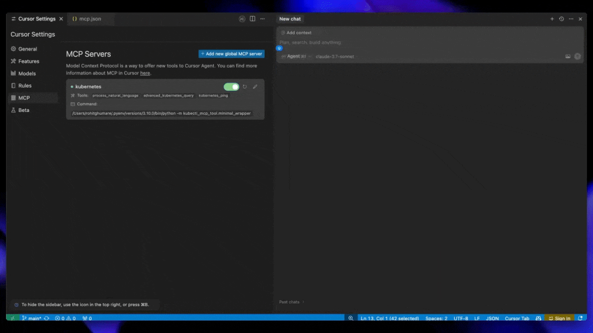

<p align="center">
  
  <br>
  <strong style="font-size: 24px;">kubectl-mcp-server</strong>
</p>

<p align="center">
<b>Control your entire Kubernetes infrastructure through natural language conversations with AI.</b><br>
Talk to your clusters like you talk to a DevOps expert. Debug crashed pods, optimize costs, deploy applications, audit security, manage Helm charts, and visualize dashboards—all through natural language.
</p>

<p align="center">
  <a href="https://github.com/rohitg00/kubectl-mcp-server"></a>
  <a href="https://opensource.org/licenses/MIT"></a>
  <a href="https://www.python.org/"></a>
  <a href="https://kubernetes.io/"></a>
  <a href="https://modelcontextprotocol.io"></a>
</p>

<p align="center">
  <a href="https://pypi.org/project/kubectl-mcp-server/"></a>
  <a href="https://www.npmjs.com/package/kubectl-mcp-server"></a>
  <a href="https://hub.docker.com/r/rohitghumare64/kubectl-mcp-server"></a>
  <a href="https://github.com/rohitg00/kubectl-mcp-server"></a>
  <a href="https://aregistry.ai"></a>
</p>

---

## Installation

### Quick Start with npx (Recommended - Zero Install)

```bash
# Run directly without installation - works instantly!
npx -y kubectl-mcp-server

# Or install globally for faster startup
npm install -g kubectl-mcp-server
```

### Or install with pip (Python)

```bash
# Standard installation
pip install kubectl-mcp-server

# With interactive UI dashboards (recommended)
pip install kubectl-mcp-server[ui]
```
---

## 📑 Table of Contents

- [What Can You Do?](#what-can-you-do)
- [Why kubectl-mcp-server?](#why-kubectl-mcp-server)
- [Live Demos](#live-demos)
- [Installation](#installation)
  - [Quick Start with npx](#quick-start-with-npx-recommended---zero-install)
  - [Install with pip](#or-install-with-pip-python)
  - [Docker](#docker)
- [Getting Started](#getting-started)
- [Quick Setup with Your AI Assistant](#quick-setup-with-your-ai-assistant)
- [All Supported AI Assistants](#all-supported-ai-assistants)
- [Complete Feature Set](#complete-feature-set)
- [Using the CLI](#using-the-cli)
- [Advanced Configuration](#advanced-configuration)
- [Optional Features](#optional-interactive-dashboards-6-ui-tools)
  - [Interactive Dashboards](#optional-interactive-dashboards-6-ui-tools)
  - [Browser Automation](#optional-browser-automation-26-tools)
- [Enterprise](#enterprise-oauth-21-authentication)
- [Integrations & Ecosystem](#integrations--ecosystem)
- [In-Cluster Deployment](#in-cluster-deployment)
- [Multi-Cluster Support](#multi-cluster-support)
- [Architecture](#architecture)
- [Agent Skills](#agent-skills-24-skills-for-ai-coding-agents)
- [Development & Testing](#development--testing)
- [Contributing](#contributing)
- [Support & Community](#support--community)

---

## What Can You Do?

Simply ask your AI assistant in natural language:

💬 **"Why is my pod crashing?"**
- Instant crash diagnosis with logs, events, and resource analysis
- Root cause identification with actionable recommendations

💬 **"Deploy a Redis cluster with 3 replicas"**
- Creates deployment with best practices
- Configures services, persistent storage, and health checks

💬 **"Show me which pods are wasting resources"**
- AI-powered cost optimization analysis
- Resource recommendations with potential savings

💬 **"Which services can't reach the database?"**
- Network connectivity diagnostics with DNS resolution
- Service chain tracing from ingress to pods

💬 **"Audit security across all namespaces"**
- RBAC permission analysis
- Secret security scanning and pod security policies

💬 **"Show me the cluster dashboard"**
- Interactive HTML dashboards with live metrics
- Visual timeline of events and resource usage

**253 powerful tools** | **8 workflow prompts** | **8 data resources** | **Works with all major AI assistants**

## Why kubectl-mcp-server?

- **🚀 Stop context-switching** - Manage Kubernetes directly from your AI assistant conversations
- **🧠 AI-powered diagnostics** - Get intelligent troubleshooting, not just raw data
- **💰 Built-in cost optimization** - Identify waste and get actionable savings recommendations
- **🔒 Enterprise-ready** - OAuth 2.1 auth, RBAC validation, non-destructive mode, secret masking
- **⚡ Zero learning curve** - Natural language instead of memorizing kubectl commands
- **🌐 Universal compatibility** - Works with Claude, Cursor, Windsurf, Copilot, and 15+ other AI tools
- **📊 Visual insights** - Interactive dashboards and browser automation for web-based tools
- **☸️ Production-grade** - Deploy in-cluster with kMCP, 216 passing tests, active maintenance

From debugging crashed pods to optimizing cluster costs, kubectl-mcp-server is your AI-powered DevOps companion.

## Live Demos

### Claude Desktop


### Cursor AI


### Windsurf


## Installation

### Quick Start with npx (Recommended - Zero Install)

```bash
# Run directly without installation - works instantly!
npx -y kubectl-mcp-server

# Or install globally for faster startup
npm install -g kubectl-mcp-server
```

### Or install with pip (Python)

```bash
# Standard installation
pip install kubectl-mcp-server

# With interactive UI dashboards (recommended)
pip install kubectl-mcp-server[ui]
```

### Install from GitHub Release

```bash
# Install specific version directly from GitHub release (replace {VERSION} with desired version)
pip install https://github.com/rohitg00/kubectl-mcp-server/releases/download/v{VERSION}/kubectl_mcp_server-{VERSION}-py3-none-any.whl

# Example: Install v1.19.0
pip install https://github.com/rohitg00/kubectl-mcp-server/releases/download/v1.19.0/kubectl_mcp_server-1.19.0-py3-none-any.whl

# Or install latest from git
pip install git+https://github.com/rohitg00/kubectl-mcp-server.git
```

### Prerequisites
- **Python 3.9+** (for pip installation)
- **Node.js 14+** (for npx installation)
- **kubectl** installed and configured
- Access to a Kubernetes cluster

### Docker

```bash
# Pull from Docker Hub
docker pull rohitghumare64/kubectl-mcp-server:latest

# Or pull from GitHub Container Registry
docker pull ghcr.io/rohitg00/kubectl-mcp-server:latest

# Run with stdio transport
docker run -i -v $HOME/.kube:/root/.kube:ro rohitghumare64/kubectl-mcp-server:latest

# Run with HTTP transport
docker run -p 8000:8000 -v $HOME/.kube:/root/.kube:ro rohitghumare64/kubectl-mcp-server:latest --transport sse
```

## Getting Started

### 1. Test the Server (Optional)

Before integrating with your AI assistant, verify the installation:

```bash
# Check if kubectl is configured
kubectl cluster-info

# Test the MCP server directly
kubectl-mcp-server info

# List all available tools
kubectl-mcp-server tools

# Try calling a tool
kubectl-mcp-server call get_pods '{"namespace": "kube-system"}'
```

### 2. Connect to Your AI Assistant

Choose your favorite AI assistant and add the configuration:

## Quick Setup with Your AI Assistant

### Claude Desktop

Add to `~/Library/Application Support/Claude/claude_desktop_config.json`:

```json
{
  "mcpServers": {
    "kubernetes": {
      "command": "npx",
      "args": ["-y", "kubectl-mcp-server"]
    }
  }
}
```

### Cursor AI

Add to `~/.cursor/mcp.json`:

```json
{
  "mcpServers": {
    "kubernetes": {
      "command": "npx",
      "args": ["-y", "kubectl-mcp-server"]
    }
  }
}
```

### Windsurf

Add to `~/.config/windsurf/mcp.json`:

```json
{
  "mcpServers": {
    "kubernetes": {
      "command": "npx",
      "args": ["-y", "kubectl-mcp-server"]
    }
  }
}
```

### Using Python Instead of npx

```json
{
  "mcpServers": {
    "kubernetes": {
      "command": "python",
      "args": ["-m", "kubectl_mcp_tool.mcp_server"],
      "env": {
        "KUBECONFIG": "/path/to/.kube/config"
      }
    }
  }
}
```

**More integrations**: GitHub Copilot, Goose, Gemini CLI, Roo Code, and [15+ other clients](#mcp-client-compatibility) —> see [full configuration guide](#all-supported-ai-assistants) below.

### 3. Restart Your AI Assistant

After adding the configuration, restart your AI assistant **(GitHub Copilot, Claude Code,Claude Desktop, Cursor, etc.)** to load the MCP server.

### 4. Try These Commands

Start a conversation with your AI assistant and try these:

**Troubleshooting:**
```
"Show me all pods in the kube-system namespace"
"Why is the nginx-deployment pod crashing?"
"Diagnose network connectivity issues in the default namespace"
```

**Deployments:**
```
"Create a deployment for nginx with 3 replicas"
"Scale my frontend deployment to 5 replicas"
"Roll back the api-server deployment to the previous version"
```

**Cost & Optimization:**
```
"Which pods are using the most resources?"
"Show me idle resources that are wasting money"
"Analyze cost optimization opportunities in the production namespace"
```

**Security:**
```
"Audit RBAC permissions in all namespaces"
"Check for insecure secrets and configurations"
"Show me pods running with privileged access"
```

**Helm:**
```
"List all Helm releases in the cluster"
"Install Redis from the Bitnami chart repository"
"Show me the values for my nginx-ingress Helm release"
```

**Multi-Cluster:**
```
"List all available Kubernetes contexts"
"Switch to the production cluster context"
"Show me cluster information and version"
```

## MCP Client Compatibility

Works seamlessly with **all MCP-compatible AI assistants**:

| Client | Status | Client | Status |
|--------|--------|--------|--------|
| Claude Desktop | ✅ Native | Claude Code | ✅ Native |
| Cursor | ✅ Native | Windsurf | ✅ Native |
| GitHub Copilot | ✅ Native | OpenAI Codex | ✅ Native |
| Gemini CLI | ✅ Native | Goose | ✅ Native |
| Roo Code | ✅ Native | Kilo Code | ✅ Native |
| Amp | ✅ Native | Trae | ✅ Native |
| OpenCode | ✅ Native | Kiro CLI | ✅ Native |
| Antigravity | ✅ Native | Clawdbot | ✅ Native |
| Droid (Factory) | ✅ Native | Any MCP Client | ✅ Compatible |

## All Supported AI Assistants

### Claude Code

Add to `~/.config/claude-code/mcp.json`:

```json
{
  "mcpServers": {
    "kubernetes": {
      "command": "npx",
      "args": ["-y", "kubectl-mcp-server"]
    }
  }
}
```

### GitHub Copilot (VS Code)

Add to VS Code `settings.json`:

```json
{
  "mcp": {
    "servers": {
      "kubernetes": {
        "command": "npx",
        "args": ["-y", "kubectl-mcp-server"]
      }
    }
  }
}
```

### Goose

Add to `~/.config/goose/config.yaml`:

```yaml
extensions:
  kubernetes:
    command: npx
    args:
      - -y
      - kubectl-mcp-server
```

### Gemini CLI

Add to `~/.gemini/settings.json`:

```json
{
  "mcpServers": {
    "kubernetes": {
      "command": "npx",
      "args": ["-y", "kubectl-mcp-server"]
    }
  }
}
```

### Roo Code / Kilo Code

Add to `~/.config/roo-code/mcp.json` or `~/.config/kilo-code/mcp.json`:

```json
{
  "mcpServers": {
    "kubernetes": {
      "command": "npx",
      "args": ["-y", "kubectl-mcp-server"]
    }
  }
}
```

## Complete Feature Set

### 253 MCP Tools for Complete Kubernetes Management

| Category | Tools |
|----------|-------|
| **Pods** | `get_pods`, `get_logs`, `get_pod_events`, `check_pod_health`, `exec_in_pod`, `cleanup_pods`, `get_pod_conditions`, `get_previous_logs` |
| **Deployments** | `get_deployments`, `create_deployment`, `scale_deployment`, `kubectl_rollout`, `restart_deployment` |
| **Workloads** | `get_statefulsets`, `get_daemonsets`, `get_jobs`, `get_replicasets` |
| **Services & Networking** | `get_services`, `get_ingress`, `get_endpoints`, `diagnose_network_connectivity`, `check_dns_resolution`, `trace_service_chain` |
| **Storage** | `get_persistent_volumes`, `get_pvcs`, `get_storage_classes` |
| **Config** | `get_configmaps`, `get_secrets`, `get_resource_quotas`, `get_limit_ranges` |
| **Cluster** | `get_nodes`, `get_namespaces`, `get_cluster_info`, `get_cluster_version`, `health_check`, `get_node_metrics`, `get_pod_metrics` |
| **RBAC & Security** | `get_rbac_roles`, `get_cluster_roles`, `get_service_accounts`, `audit_rbac_permissions`, `check_secrets_security`, `get_pod_security_info`, `get_admission_webhooks` |
| **CRDs** | `get_crds`, `get_priority_classes` |
| **Helm Releases** | `helm_list`, `helm_status`, `helm_history`, `helm_get_values`, `helm_get_manifest`, `helm_get_notes`, `helm_get_hooks`, `helm_get_all` |
| **Helm Charts** | `helm_show_chart`, `helm_show_values`, `helm_show_readme`, `helm_show_crds`, `helm_show_all`, `helm_search_repo`, `helm_search_hub` |
| **Helm Repos** | `helm_repo_list`, `helm_repo_add`, `helm_repo_remove`, `helm_repo_update` |
| **Helm Operations** | `install_helm_chart`, `upgrade_helm_chart`, `uninstall_helm_chart`, `helm_rollback`, `helm_test`, `helm_template`, `helm_template_apply` |
| **Helm Development** | `helm_create`, `helm_lint`, `helm_package`, `helm_pull`, `helm_dependency_list`, `helm_dependency_update`, `helm_dependency_build`, `helm_version`, `helm_env` |
| **Context** | `get_current_context`, `switch_context`, `list_contexts`, `list_kubeconfig_contexts` |
| **Diagnostics** | `diagnose_pod_crash`, `detect_pending_pods`, `get_evicted_pods`, `compare_namespaces` |
| **Operations** | `kubectl_apply`, `kubectl_create`, `kubectl_describe`, `kubectl_patch`, `delete_resource`, `kubectl_cp`, `backup_resource`, `label_resource`, `annotate_resource`, `taint_node`, `wait_for_condition` |
| **Autoscaling** | `get_hpa`, `get_pdb` |
| **Cost Optimization** | `get_resource_recommendations`, `get_idle_resources`, `get_resource_quotas_usage`, `get_cost_analysis`, `get_overprovisioned_resources`, `get_resource_trends`, `get_namespace_cost_allocation`, `optimize_resource_requests` |
| **Advanced** | `kubectl_generic`, `kubectl_explain`, `get_api_resources`, `port_forward`, `get_resource_usage`, `node_management` |
| **UI Dashboards** | `show_pod_logs_ui`, `show_pods_dashboard_ui`, `show_resource_yaml_ui`, `show_cluster_overview_ui`, `show_events_timeline_ui`, `render_k8s_dashboard_screenshot` |
| **GitOps (Flux/Argo)** | `gitops_apps_list`, `gitops_app_get`, `gitops_app_sync`, `gitops_app_status`, `gitops_sources_list`, `gitops_source_get`, `gitops_detect_engine` |
| **Cert-Manager** | `certs_list`, `certs_get`, `certs_issuers_list`, `certs_issuer_get`, `certs_renew`, `certs_status_explain`, `certs_challenges_list`, `certs_requests_list`, `certs_detect` |
| **Policy (Kyverno/Gatekeeper)** | `policy_list`, `policy_get`, `policy_violations_list`, `policy_explain_denial`, `policy_audit`, `policy_detect` |
| **Backup (Velero)** | `backup_list`, `backup_get`, `backup_create`, `backup_delete`, `restore_list`, `restore_create`, `restore_get`, `backup_locations_list`, `backup_schedules_list`, `backup_schedule_create`, `backup_detect` |
| **KEDA Autoscaling** | `keda_scaledobjects_list`, `keda_scaledobject_get`, `keda_scaledjobs_list`, `keda_triggerauths_list`, `keda_triggerauth_get`, `keda_hpa_list`, `keda_detect` |
| **Cilium/Hubble** | `cilium_policies_list`, `cilium_policy_get`, `cilium_endpoints_list`, `cilium_identities_list`, `cilium_nodes_list`, `cilium_status`, `hubble_flows_query`, `cilium_detect` |
| **Argo Rollouts/Flagger** | `rollouts_list`, `rollout_get`, `rollout_status`, `rollout_promote`, `rollout_abort`, `rollout_retry`, `rollout_restart`, `analysis_runs_list`, `flagger_canaries_list`, `flagger_canary_get`, `rollouts_detect` |
| **Cluster API** | `capi_clusters_list`, `capi_cluster_get`, `capi_machines_list`, `capi_machine_get`, `capi_machinedeployments_list`, `capi_machinedeployment_scale`, `capi_machinesets_list`, `capi_machinehealthchecks_list`, `capi_clusterclasses_list`, `capi_cluster_kubeconfig`, `capi_detect` |
| **KubeVirt VMs** | `kubevirt_vms_list`, `kubevirt_vm_get`, `kubevirt_vmis_list`, `kubevirt_vm_start`, `kubevirt_vm_stop`, `kubevirt_vm_restart`, `kubevirt_vm_pause`, `kubevirt_vm_unpause`, `kubevirt_vm_migrate`, `kubevirt_datasources_list`, `kubevirt_instancetypes_list`, `kubevirt_datavolumes_list`, `kubevirt_detect` |
| **Istio/Kiali** | `istio_virtualservices_list`, `istio_virtualservice_get`, `istio_destinationrules_list`, `istio_gateways_list`, `istio_peerauthentications_list`, `istio_authorizationpolicies_list`, `istio_proxy_status`, `istio_analyze`, `istio_sidecar_status`, `istio_detect` |
| **vCluster (vind)** | `vind_detect_tool`, `vind_list_clusters_tool`, `vind_status_tool`, `vind_get_kubeconfig_tool`, `vind_logs_tool`, `vind_create_cluster_tool`, `vind_delete_cluster_tool`, `vind_pause_tool`, `vind_resume_tool`, `vind_connect_tool`, `vind_disconnect_tool`, `vind_upgrade_tool`, `vind_describe_tool`, `vind_platform_start_tool` |
| **kind (K8s in Docker)** | `kind_detect_tool`, `kind_version_tool`, `kind_list_clusters_tool`, `kind_get_nodes_tool`, `kind_get_kubeconfig_tool`, `kind_export_logs_tool`, `kind_cluster_info_tool`, `kind_node_labels_tool`, `kind_create_cluster_tool`, `kind_delete_cluster_tool`, `kind_delete_all_clusters_tool`, `kind_load_image_tool`, `kind_load_image_archive_tool`, `kind_build_node_image_tool`, `kind_set_kubeconfig_tool` |

### MCP Resources

Access Kubernetes data as browsable resources:

| Resource URI | Description |
|--------------|-------------|
| `kubeconfig://contexts` | List all available kubectl contexts |
| `kubeconfig://current-context` | Get current active context |
| `namespace://current` | Get current namespace |
| `namespace://list` | List all namespaces |
| `cluster://info` | Get cluster information |
| `cluster://nodes` | Get detailed node information |
| `cluster://version` | Get Kubernetes version |
| `cluster://api-resources` | List available API resources |
| `manifest://deployments/{ns}/{name}` | Get deployment YAML |
| `manifest://services/{ns}/{name}` | Get service YAML |
| `manifest://pods/{ns}/{name}` | Get pod YAML |
| `manifest://configmaps/{ns}/{name}` | Get ConfigMap YAML |
| `manifest://secrets/{ns}/{name}` | Get secret YAML (data masked) |
| `manifest://ingresses/{ns}/{name}` | Get ingress YAML |

### MCP Prompts

Pre-built workflow prompts for common Kubernetes operations:

| Prompt | Description |
|--------|-------------|
| `troubleshoot_workload` | Comprehensive troubleshooting guide for pods/deployments |
| `deploy_application` | Step-by-step deployment workflow |
| `security_audit` | Security scanning and RBAC analysis workflow |
| `cost_optimization` | Resource optimization and cost analysis workflow |
| `disaster_recovery` | Backup and recovery planning workflow |
| `debug_networking` | Network debugging for services and connectivity |
| `scale_application` | Scaling guide with HPA/VPA best practices |
| `upgrade_cluster` | Kubernetes cluster upgrade planning |

### Key Capabilities

- 🤖 **253 Powerful Tools** - Complete Kubernetes management from pods to security
- 🎯 **8 AI Workflow Prompts** - Pre-built workflows for common operations
- 📊 **8 MCP Resources** - Browsable Kubernetes data exposure
- 🎨 **6 Interactive Dashboards** - HTML UI tools for visual cluster management
- 🌐 **26 Browser Tools** - Web automation with cloud provider support
- 🔄 **107 Ecosystem Tools** - GitOps, Cert-Manager, Policy, Backup, KEDA, Cilium, Rollouts, CAPI, KubeVirt, Istio, vCluster
- ⚡ **Multi-Transport** - stdio, SSE, HTTP, streamable-http
- 🔐 **Security First** - Non-destructive mode, secret masking, RBAC validation
- 🏥 **Advanced Diagnostics** - AI-powered troubleshooting and cost optimization
- ☸️ **Multi-Cluster** - Target any cluster via context parameter in every tool
- 🎡 **Full Helm v3** - Complete chart lifecycle management
- 🔧 **Powerful CLI** - Shell-friendly tool discovery and direct calling
- 🐳 **Cloud Native** - Deploy in-cluster with kMCP or kagent

## Using the CLI

The built-in CLI lets you explore and test tools without an AI assistant:

```bash
# List all tools with descriptions
kubectl-mcp-server tools -d

# Search for pod-related tools
kubectl-mcp-server grep "*pod*"

# Show specific tool schema
kubectl-mcp-server tools get_pods

# Call a tool directly
kubectl-mcp-server call get_pods '{"namespace": "kube-system"}'

# Pipe JSON from stdin
echo '{"namespace": "default"}' | kubectl-mcp-server call get_pods

# Check dependencies
kubectl-mcp-server doctor

# Show/switch Kubernetes context
kubectl-mcp-server context
kubectl-mcp-server context minikube

# List resources and prompts
kubectl-mcp-server resources
kubectl-mcp-server prompts

# Show server info
kubectl-mcp-server info
```

### CLI Features

- **Structured errors**: Actionable error messages with suggestions
- **Colorized output**: Human-readable with JSON mode for scripting (`--json`)
- **NO_COLOR support**: Respects `NO_COLOR` environment variable
- **Stdin support**: Pipe JSON arguments to commands

## Advanced Configuration

### Transport Modes

The server supports multiple transport protocols:

```bash
# stdio (default) - Best for Claude Desktop, Cursor, Windsurf
kubectl-mcp-server
# or: python -m kubectl_mcp_tool.mcp_server

# SSE - Server-Sent Events for web clients
kubectl-mcp-server --transport sse --port 8000

# HTTP - Standard HTTP for REST clients
kubectl-mcp-server --transport http --port 8000

# streamable-http - For agentgateway integration
kubectl-mcp-server --transport streamable-http --port 8000
```

**Transport Options:**
- `--transport`: Choose from `stdio`, `sse`, `http`, `streamable-http` (default: `stdio`)
- `--host`: Bind address (default: `0.0.0.0`)
- `--port`: Port for network transports (default: `8000`)
- `--non-destructive`: Enable read-only mode (blocks delete, apply, create operations)

### Environment Variables

**Core Settings:**

| Variable | Description | Default |
|----------|-------------|---------|
| `KUBECONFIG` | Path to kubeconfig file | `~/.kube/config` |
| `MCP_DEBUG` | Enable verbose logging | `false` |
| `MCP_LOG_FILE` | Log file path | None (stdout) |

**Authentication (Enterprise):**

| Variable | Description | Default |
|----------|-------------|---------|
| `MCP_AUTH_ENABLED` | Enable OAuth 2.1 authentication | `false` |
| `MCP_AUTH_ISSUER` | OAuth 2.0 Authorization Server URL | - |
| `MCP_AUTH_JWKS_URI` | JWKS endpoint URL | Auto-derived |
| `MCP_AUTH_AUDIENCE` | Expected token audience | `kubectl-mcp-server` |
| `MCP_AUTH_REQUIRED_SCOPES` | Required OAuth scopes | `mcp:tools` |

**Browser Automation (Optional):**

| Variable | Description | Default |
|----------|-------------|---------|
| `MCP_BROWSER_ENABLED` | Enable browser automation tools | `false` |
| `MCP_BROWSER_PROVIDER` | Cloud provider (browserbase/browseruse) | None |
| `MCP_BROWSER_PROFILE` | Persistent profile path | None |
| `MCP_BROWSER_CDP_URL` | Remote CDP WebSocket URL | None |
| `MCP_BROWSER_PROXY` | Proxy server URL | None |

## Optional: Interactive Dashboards (6 UI Tools)

Get beautiful HTML dashboards for visual cluster management.

**Installation:**

```bash
# Install with UI support
pip install kubectl-mcp-server[ui]
```

**6 Dashboard Tools:**
- 📊 `show_pods_dashboard_ui` - Real-time pod status table
- 📝 `show_pod_logs_ui` - Interactive log viewer with search
- 🎯 `show_cluster_overview_ui` - Complete cluster dashboard
- ⚡ `show_events_timeline_ui` - Events timeline with filtering
- 📄 `show_resource_yaml_ui` - YAML viewer with syntax highlighting
- 📸 `render_k8s_dashboard_screenshot` - Export dashboards as PNG

**Features:**
- 🎨 Dark theme optimized for terminals (Catppuccin)
- 🔄 Graceful fallback to JSON for incompatible clients
- 🖼️ Screenshot rendering for universal compatibility
- 🚀 Zero external dependencies

**Works With**: Goose, LibreChat, Nanobot (full HTML UI) | Claude Desktop, Cursor, others (JSON + screenshots)

## Optional: Browser Automation (26 Tools)

Automate web-based Kubernetes operations with [agent-browser](https://github.com/vercel-labs/agent-browser) integration.

**Quick Setup:**

```bash
# Install agent-browser
npm install -g agent-browser
agent-browser install

# Enable browser tools
export MCP_BROWSER_ENABLED=true
kubectl-mcp-server
```

**What You Can Do:**
- 🌐 Test deployed apps via Ingress URLs
- 📸 Screenshot Grafana, ArgoCD, or any K8s dashboard
- ☁️ Automate cloud console operations (EKS, GKE, AKS)
- 🏥 Health check web applications
- 📄 Export monitoring dashboards as PDF
- 🔐 Test authentication flows with persistent sessions

**26 Available Tools**: `browser_open`, `browser_screenshot`, `browser_click`, `browser_fill`, `browser_test_ingress`, `browser_screenshot_grafana`, `browser_health_check`, and [19 more](https://github.com/rohitg00/kubectl-mcp-server#browser-tools)

**Advanced Features**:
- Cloud providers: Browserbase, Browser Use
- Persistent browser profiles
- Remote CDP connections
- Session management

## Optional: kubectl-mcp-app (8 Interactive UI Dashboards)

A standalone npm package that provides beautiful, interactive UI dashboards for Kubernetes management using the MCP ext-apps SDK.

**Installation:**

```bash
# Via npm
npm install -g kubectl-mcp-app

# Or via npx (no install)
npx kubectl-mcp-app
```

**Claude Desktop Configuration:**

```json
{
  "mcpServers": {
    "kubectl-app": {
      "command": "npx",
      "args": ["kubectl-mcp-app"]
    }
  }
}
```

**8 Interactive UI Tools:**

| Tool | Description |
| ---- | ----------- |
| `k8s-pods` | Interactive pod viewer with filtering, sorting, status indicators |
| `k8s-logs` | Real-time log viewer with syntax highlighting and search |
| `k8s-deploy` | Deployment dashboard with rollout status, scaling, rollback |
| `k8s-helm` | Helm release manager with upgrade/rollback actions |
| `k8s-cluster` | Cluster overview with node health and resource metrics |
| `k8s-cost` | Cost analyzer with waste detection and recommendations |
| `k8s-events` | Events timeline with type filtering and grouping |
| `k8s-network` | Network topology graph showing Services/Pods/Ingress |

**Features:**
- 🎨 Dark/light theme support
- 📊 Real-time data visualization
- 🖱️ Interactive actions (scale, restart, delete)
- 🔗 Seamless integration with kubectl-mcp-server

**More Info**: See [kubectl-mcp-app/README.md](./kubectl-mcp-app/README.md) for full documentation.

## Enterprise: OAuth 2.1 Authentication

Secure your MCP server with OAuth 2.1 authentication (RFC 9728).

```bash
export MCP_AUTH_ENABLED=true
export MCP_AUTH_ISSUER=https://your-idp.example.com
export MCP_AUTH_AUDIENCE=kubectl-mcp-server
kubectl-mcp-server --transport http --port 8000
```

**Supported Identity Providers**: Okta, Auth0, Keycloak, Microsoft Entra ID, Google OAuth, and any OIDC-compliant provider.

**Use Case**: Multi-tenant environments, compliance requirements, audit logging.

## Integrations & Ecosystem

### Docker MCP Toolkit

Works with [Docker MCP Toolkit](https://docs.docker.com/ai/mcp-catalog-and-toolkit/toolkit/):

```bash
docker mcp server add kubectl-mcp-server mcp/kubectl-mcp-server:latest
docker mcp server configure kubectl-mcp-server --volume "$HOME/.kube:/root/.kube:ro"
docker mcp server enable kubectl-mcp-server
docker mcp client connect claude
```

### agentregistry

Install from the centralized [agentregistry](https://aregistry.ai):

```bash
# Install arctl CLI
curl -fsSL https://raw.githubusercontent.com/agentregistry-dev/agentregistry/main/scripts/install.sh | bash

# Install kubectl-mcp-server
arctl mcp install io.github.rohitg00/kubectl-mcp-server
```

**Available via**: PyPI (`uvx`), npm (`npx`), OCI (`docker.io/rohitghumare64/kubectl-mcp-server`)

### agentgateway

Route to multiple MCP servers through [agentgateway](https://github.com/agentgateway/agentgateway):

```bash
# Start with streamable-http
kubectl-mcp-server --transport streamable-http --port 8000

# Configure gateway
cat > gateway.yaml <<EOF
binds:
- port: 3000
  listeners:
  - routes:
    - backends:
      - mcp:
          targets:
          - name: kubectl-mcp-server
            mcp:
              host: http://localhost:8000/mcp
EOF

# Start gateway
agentgateway --config gateway.yaml
```

Connect clients to `http://localhost:3000/mcp` for unified access to all 253 tools.

## In-Cluster Deployment

### Option 1: kMCP (Recommended)

Deploy with [kMCP](https://github.com/kagent-dev/kmcp) - a control plane for MCP servers:

```bash
# Install kMCP
curl -fsSL https://raw.githubusercontent.com/kagent-dev/kmcp/refs/heads/main/scripts/get-kmcp.sh | bash
kmcp install

# Deploy kubectl-mcp-server (easiest)
kmcp deploy package --deployment-name kubectl-mcp-server \
   --manager npx --args kubectl-mcp-server

# Or with Docker image
kmcp deploy --file deploy/kmcp/kmcp.yaml --image rohitghumare64/kubectl-mcp-server:latest
```

See [kMCP quickstart](https://kagent.dev/docs/kmcp/quickstart) for details.

### Option 2: Standard Kubernetes

Deploy with kubectl/kustomize:

```bash
# Using kustomize (recommended)
kubectl apply -k deploy/kubernetes/

# Or individual manifests
kubectl apply -f deploy/kubernetes/namespace.yaml
kubectl apply -f deploy/kubernetes/rbac.yaml
kubectl apply -f deploy/kubernetes/deployment.yaml
kubectl apply -f deploy/kubernetes/service.yaml

# Access via port-forward
kubectl port-forward -n kubectl-mcp svc/kubectl-mcp-server 8000:8000
```

See [deploy/](deploy/) directory for all manifests and configuration options.

### Option 3: kagent (AI Agent Framework)

Integrate with [kagent](https://github.com/kagent-dev/kagent) - a CNCF Kubernetes-native AI agent framework:

```bash
# Install kagent
brew install kagent
kagent install --profile demo

# Register as ToolServer
kubectl apply -f deploy/kagent/toolserver-stdio.yaml

# Open dashboard
kagent dashboard
```

Your AI agents now have access to all 253 Kubernetes tools. See [kagent quickstart](https://kagent.dev/docs/kagent/getting-started/quickstart).

## Architecture

```
┌─────────────────┐     ┌──────────────────┐     ┌─────────────────┐
│   AI Assistant  │────▶│   MCP Server     │────▶│  Kubernetes API │
│ (Claude/Cursor) │◀────│ (kubectl-mcp)    │◀────│    (kubectl)    │
└─────────────────┘     └──────────────────┘     └─────────────────┘
```

The MCP server implements the [Model Context Protocol](https://github.com/modelcontextprotocol/spec), translating natural language requests into kubectl operations.

### Modular Structure

```
kubectl_mcp_tool/
├── mcp_server.py          # Main server (FastMCP, transports)
├── tools/                  # 253 MCP tools organized by category
│   ├── pods.py            # Pod management & diagnostics
│   ├── deployments.py     # Deployments, StatefulSets, DaemonSets
│   ├── core.py            # Namespaces, ConfigMaps, Secrets
│   ├── cluster.py         # Context/cluster management
│   ├── networking.py      # Services, Ingress, NetworkPolicies
│   ├── storage.py         # PVCs, StorageClasses, PVs
│   ├── security.py        # RBAC, ServiceAccounts, PodSecurity
│   ├── helm.py            # Complete Helm v3 operations
│   ├── operations.py      # kubectl apply/patch/describe/etc
│   ├── diagnostics.py     # Metrics, namespace comparison
│   ├── cost.py            # Resource optimization & cost analysis
│   ├── ui.py              # MCP-UI interactive dashboards
│   ├── gitops.py          # GitOps (Flux/ArgoCD)
│   ├── certs.py           # Cert-Manager
│   ├── policy.py          # Policy (Kyverno/Gatekeeper)
│   ├── backup.py          # Backup (Velero)
│   ├── keda.py            # KEDA autoscaling
│   ├── cilium.py          # Cilium/Hubble network observability
│   ├── rollouts.py        # Argo Rollouts/Flagger
│   ├── capi.py            # Cluster API
│   ├── kubevirt.py        # KubeVirt VMs
│   ├── kiali.py           # Istio/Kiali service mesh
│   └── vind.py            # vCluster (virtual clusters)
├── resources/              # 8 MCP Resources for data exposure
├── prompts/                # 8 MCP Prompts for workflows
└── cli/                    # CLI interface
```

## Agent Skills (25 Skills for AI Coding Agents)

Extend your AI coding agent with Kubernetes expertise using our [Agent Skills](https://agenstskills.com) library. Skills provide specialized knowledge and workflows that agents can load on demand.

### Quick Install

```bash
# Copy all skills to Claude
cp -r kubernetes-skills/claude/* ~/.claude/skills/

# Or install specific skills
cp -r kubernetes-skills/claude/k8s-helm ~/.claude/skills/
```

### Available Skills (25)

| Category | Skills |
|----------|--------|
| **Core Resources** | k8s-core, k8s-networking, k8s-storage |
| **Workloads** | k8s-deploy, k8s-operations, k8s-helm |
| **Observability** | k8s-diagnostics, k8s-troubleshoot, k8s-incident |
| **Security** | k8s-security, k8s-policy, k8s-certs |
| **GitOps** | k8s-gitops, k8s-rollouts |
| **Scaling** | k8s-autoscaling, k8s-cost, k8s-backup |
| **Multi-Cluster** | k8s-multicluster, k8s-capi, k8s-kubevirt, k8s-vind |
| **Networking** | k8s-service-mesh, k8s-cilium |
| **Tools** | k8s-browser, k8s-cli |

### Convert to Other Agents

Use [SkillKit](https://github.com/rohitg00/skillkit) to convert skills to your preferred AI agent format:

```bash
npm install -g skillkit

# Convert to Cursor format
skillkit translate kubernetes-skills/claude --to cursor --output .cursor/rules/

# Convert to Codex format
skillkit translate kubernetes-skills/claude --to codex --output ./
```

**Supported agents:** Claude, Cursor, Codex, Gemini CLI, GitHub Copilot, Goose, Windsurf, Roo, Amp, and more.

See [kubernetes-skills/README.md](kubernetes-skills/README.md) for full documentation.

## Multi-Cluster Support

Seamlessly manage multiple Kubernetes clusters through natural language. **Every tool** supports an optional `context` parameter to target any cluster without switching contexts.

### Context Parameter (v1.15.0)

Most kubectl-backed tools accept an optional `context` parameter to target specific clusters.
Note: vCluster (vind) and kind tools run via their local CLIs and do not accept the `context` parameter.

**Talk to your AI assistant:**
```
"List pods in the production cluster"
"Get deployments from staging context"
"Show logs from the api-pod in the dev cluster"
"Compare namespaces between production and staging clusters"
```

**Direct tool calls with context:**
```bash
# Target a specific cluster context
kubectl-mcp-server call get_pods '{"namespace": "default", "context": "production"}'

# Get deployments from staging
kubectl-mcp-server call get_deployments '{"namespace": "app", "context": "staging"}'

# Install Helm chart to production cluster
kubectl-mcp-server call install_helm_chart '{"name": "redis", "chart": "bitnami/redis", "namespace": "cache", "context": "production"}'

# Compare resources across clusters
kubectl-mcp-server call compare_namespaces '{"namespace1": "prod-ns", "namespace2": "staging-ns", "context": "production"}'
```

### Context Management

**Talk to your AI assistant:**
```
"List all available Kubernetes contexts"
"Switch to the production cluster"
"Show me details about the staging context"
"What's the current cluster I'm connected to?"
```

**Or use the CLI directly:**
```bash
kubectl-mcp-server context                    # Show current context
kubectl-mcp-server context production         # Switch context
kubectl-mcp-server call list_contexts_tool    # List all contexts via MCP
```

### How It Works

- If `context` is omitted, the tool uses your current kubectl context
- If `context` is specified, the tool targets that cluster directly
- Response includes `"context": "production"` or `"context": "current"` for clarity
- Works with all kubeconfig setups and respects `KUBECONFIG` environment variable
- No need to switch contexts for cross-cluster operations

## Development & Testing

### Setup Development Environment

```bash
# Clone the repository
git clone https://github.com/rohitg00/kubectl-mcp-server.git
cd kubectl-mcp-server

# Create virtual environment
python -m venv venv
source venv/bin/activate  # On Windows: venv\Scripts\activate

# Install development dependencies
pip install -r requirements-dev.txt
```

### Running Tests

```bash
# Run all tests
pytest tests/ -v

# Run specific test file
pytest tests/test_tools.py -v

# Run with coverage
pytest tests/ --cov=kubectl_mcp_tool --cov-report=html

# Run only unit tests
pytest tests/ -v -m unit
```

### Test Structure

```
tests/
├── __init__.py          # Test package
├── conftest.py          # Shared fixtures and mocks
├── test_tools.py        # Unit tests for 253 MCP tools
├── test_resources.py    # Tests for 8 MCP Resources
├── test_prompts.py      # Tests for 8 MCP Prompts
└── test_server.py       # Server initialization tests
```

**234 tests covering**: tool registration, resource exposure, prompt generation, server initialization, non-destructive mode, secret masking, error handling, transport methods, CLI commands, browser automation, and ecosystem tools.

### Code Quality

```bash
# Format code
black kubectl_mcp_tool tests

# Sort imports
isort kubectl_mcp_tool tests

# Lint
flake8 kubectl_mcp_tool tests

# Type checking
mypy kubectl_mcp_tool
```

## Contributing

We ❤️ contributions! Whether it's bug reports, feature requests, documentation improvements, or code contributions.

**Ways to contribute:**
- 🐛 Report bugs via [GitHub Issues](https://github.com/rohitg00/kubectl-mcp-server/issues)
- 💡 Suggest features or improvements
- 📝 Improve documentation
- 🔧 Submit pull requests
- ⭐ Star the project if you find it useful!

**Development setup**: See [Development & Testing](#development--testing) section above.

**Before submitting a PR:**
1. Run tests: `pytest tests/ -v`
2. Format code: `black kubectl_mcp_tool tests`
3. Check linting: `flake8 kubectl_mcp_tool tests`

## Support & Community

- 📖 [Documentation](https://github.com/rohitg00/kubectl-mcp-server#readme)
- 💬 [GitHub Discussions](https://github.com/rohitg00/kubectl-mcp-server/discussions)
- 🐛 [Issue Tracker](https://github.com/rohitg00/kubectl-mcp-server/issues)
- 🎯 [Feature Requests](https://github.com/rohitg00/kubectl-mcp-server/issues/new)
- 🌟 [agentregistry Profile](https://aregistry.ai)

## License

MIT License - see [LICENSE](LICENSE) for details.

## Links & Resources

**Package Repositories:**
- 🐍 [PyPI Package](https://pypi.org/project/kubectl-mcp-server/)
- 📦 [npm Package](https://www.npmjs.com/package/kubectl-mcp-server)
- 🐳 [Docker Hub](https://hub.docker.com/r/rohitghumare64/kubectl-mcp-server)

**Project:**
- 🔧 [GitHub Repository](https://github.com/rohitg00/kubectl-mcp-server)
- 🐛 [Issue Tracker](https://github.com/rohitg00/kubectl-mcp-server/issues)
- 📋 [Changelog](https://github.com/rohitg00/kubectl-mcp-server/releases)

**Ecosystem:**
- 📚 [Model Context Protocol](https://modelcontextprotocol.io)
- ☸️ [Kubernetes Documentation](https://kubernetes.io/docs)

---

**Made with ❤️ for the Kubernetes and AI community**

If **kubectl-mcp-server** makes your DevOps life easier, give it a ⭐ on [GitHub](https://github.com/rohitg00/kubectl-mcp-server)!
