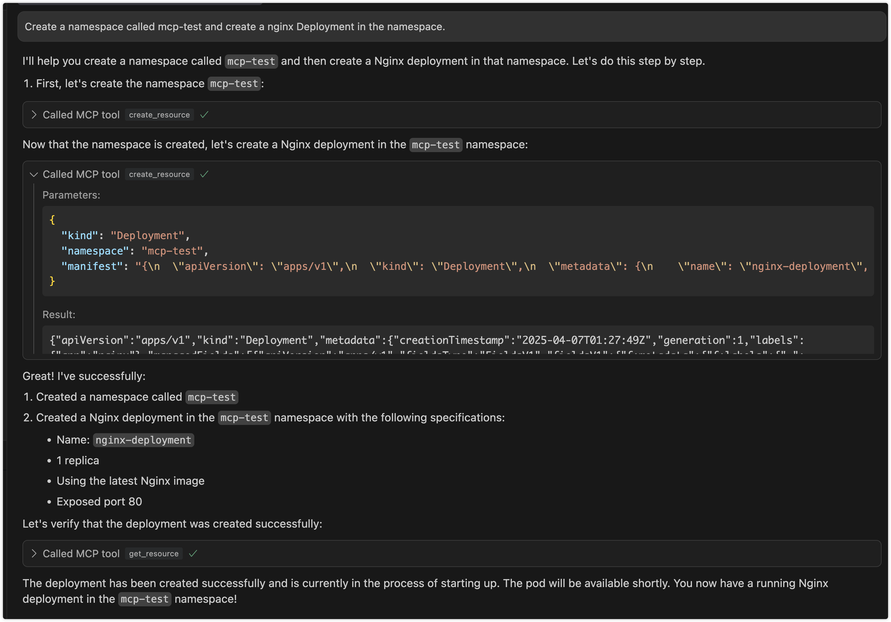

# mcp-k8s

[](https://github.com/silenceper/mcp-k8s/blob/main/go.mod)
[](https://github.com/silenceper/mcp-k8s/blob/main/LICENSE)
[](https://github.com/silenceper/mcp-k8s/releases)
[](https://goreportcard.com/report/github.com/silenceper/mcp-k8s)
[](https://github.com/silenceper/mcp-k8s/actions/workflows/go-ci.yml)
[](https://github.com/silenceper/mcp-k8s/pulls)

A Kubernetes MCP (Model Control Protocol) server that enables interaction with Kubernetes clusters through MCP tools.

## Features

- Query supported Kubernetes resource types (built-in resources and CRDs)
- Kubernetes resource operations with fine-grained control
  - Read operations: get resource details, list resources by type with filtering options
  - Write operations: create, update, and delete resources (each can be independently enabled/disabled)
  - Support for all Kubernetes resource types, including custom resources
- Connects to Kubernetes cluster using kubeconfig
- Helm support with fine-grained control
  - Helm releases management (list, get, install, upgrade, uninstall)
  - Helm repositories management (list, add, remove)
  - Each operation can be independently enabled/disabled

## Preview
> Interaction through cursor



## Use Cases

### 1. Kubernetes Resource Management via LLM

- **Interactive Resource Management**: Manage Kubernetes resources through natural language interaction with LLM, eliminating the need to memorize complex kubectl commands
- **Batch Operations**: Describe complex batch operation requirements in natural language, letting LLM translate them into specific resource operations
- **Resource Status Queries**: Query cluster resource status using natural language and receive easy-to-understand responses

### 2. Automated Operations Scenarios

- **Intelligent Operations Assistant**: Serve as an intelligent assistant for operators in daily cluster management tasks
- **Problem Diagnosis**: Assist in cluster problem diagnosis through natural language problem descriptions
- **Configuration Review**: Leverage LLM's understanding capabilities to help review and optimize Kubernetes resource configurations

### 3. Development and Testing Support

- **Quick Prototype Validation**: Developers can quickly create and validate resource configurations through natural language
- **Environment Management**: Simplify test environment resource management, quickly create, modify, and clean up test resources
- **Configuration Generation**: Automatically generate resource configurations that follow best practices based on requirement descriptions

### 4. Education and Training Scenarios

- **Interactive Learning**: Newcomers can learn Kubernetes concepts and operations through natural language interaction
- **Best Practice Guidance**: LLM provides best practice suggestions during resource operations
- **Error Explanation**: Provide easy-to-understand error explanations and correction suggestions when operations fail

## Architecture

### 1. Project Overview

An stdio-based MCP server that connects to Kubernetes clusters and provides the following capabilities:
- Query Kubernetes resource types (including built-in resources and CRDs)
- CRUD operations on Kubernetes resources (with configurable write operations)
- Helm operations for release and repository management

### 2. Technical Stack

- Go
- [mcp-go](https://github.com/mark3labs/mcp-go) SDK
- Kubernetes client-go library
- Helm v3 client library
- Stdio for communication

### 3. Core Components

1. **MCP Server**: Uses mcp-go's `mcp-k8s` package to create an stdio-based MCP server
2. **K8s Client**: Uses client-go to connect to Kubernetes clusters
3. **Helm Client**: Uses Helm v3 library for Helm operations
4. **Tool Implementations**: Implements various MCP tools for different Kubernetes operations

### 4. Available Tools

#### Resource Type Query Tools
- `get_api_resources`: Get all supported API resource types in the cluster

#### Resource Operation Tools
- `get_resource`: Get detailed information about a specific resource
- `list_resources`: List all instances of a resource type
- `create_resource`: Create new resources (can be disabled)
- `update_resource`: Update existing resources (can be disabled)
- `delete_resource`: Delete resources (can be disabled)

#### Helm Operation Tools
- `list_helm_releases`: List all Helm releases in the cluster
- `get_helm_release`: Get detailed information about a specific Helm release
- `install_helm_chart`: Install a Helm chart (can be disabled)
- `upgrade_helm_chart`: Upgrade a Helm release (can be disabled)
- `uninstall_helm_chart`: Uninstall a Helm release (can be disabled)
- `list_helm_repositories`: List configured Helm repositories
- `add_helm_repository`: Add a new Helm repository (can be disabled)
- `remove_helm_repository`: Remove a Helm repository (can be disabled)

## Usage

mcp-k8s supports three communication modes:

### 1. Stdio Mode (Default)

In stdio mode, mcp-k8s communicates with the client through standard input/output streams. This is the default mode and is suitable for most use cases.

```bash
# Run in stdio mode (default)
{
    "mcpServers":
    {
        "mcp-k8s":
        {
            "command": "/path/to/mcp-k8s",
            "args":
            [
                "--kubeconfig",
                "/path/to/kubeconfig",
                "--enable-create",
                "--enable-delete",
                "--enable-update",
                "--enable-list",
                "--enable-helm-install",
                "--enable-helm-upgrade"
            ]
        }
    }
}
```

### 2. SSE Mode

In SSE (Server-Sent Events) mode, mcp-k8s exposes an HTTP endpoint to mcp client.
You can deploy the service on a remote server (but you need to pay attention to security)

```bash
# Run in SSE mode
./bin/mcp-k8s --kubeconfig=/path/to/kubeconfig --transport=sse --port=8080 --host=localhost --enable-create --enable-delete --enable-list --enable-update --enable-helm-install
# This command will open all operations
```

mcp config
```json
{
  "mcpServers": {
    "mcp-k8s": {
      "url": "http://localhost:8080/sse",
      "args": []
    }
  }
}
```

SSE mode configuration:
- `--transport`: Set to "sse" to enable SSE mode
- `--port`: HTTP server port (default: 8080)
- `--host`: HTTP server host (default: "localhost")

### 3. Streamable HTTP Mode

In Streamable HTTP mode, mcp-k8s exposes an HTTP endpoint that supports both direct HTTP responses and SSE streams. This mode provides better flexibility and supports streaming output.

```bash
# Run in Streamable HTTP mode
./bin/mcp-k8s --kubeconfig=/path/to/kubeconfig --transport=streamable-http --port=8080 --host=localhost --endpoint-path=/mcp --enable-create --enable-delete --enable-list --enable-update --enable-helm-install
```

mcp config
```json
{
  "mcpServers": {
    "mcp-k8s": {
      "url": "http://localhost:8080/mcp",
      "args": []
    }
  }
}
```

Streamable HTTP mode configuration:
- `--transport`: Set to "streamable-http" to enable Streamable HTTP mode
- `--port`: HTTP server port (default: 8080)
- `--host`: HTTP server host (default: "localhost")
- `--endpoint-path`: Endpoint path for the MCP server (default: "/mcp")

### 4. Docker environment
#### SSE Mode

1. Complete Example
Assuming your image name is mcp-k8s and you need to map ports and set environment parameters, you can run:
```bash
docker run --rm -p 8080:8080 -i -v ~/.kube/config:/root/.kube/config ghcr.io/silenceper/mcp-k8s:latest --transport=sse
```

#### Streamable HTTP Mode

```bash
docker run --rm -p 8080:8080 -i -v ~/.kube/config:/root/.kube/config ghcr.io/silenceper/mcp-k8s:latest --transport=streamable-http --endpoint-path=/mcp
```
#### stdio Mode

```json
{
  "mcpServers": {
    "mcp-k8s": {
      "command": "docker",
      "args": [
        "run",
        "-i",
        "-v",
        "~/.kube/config:/root/.kube/config",
        "--rm",
        "ghcr.io/silenceper/mcp-k8s:latest"
      ]
    }
  }
}
```


## Getting Started

### Direct Usage
You can directly download the binary for your platform from the [releases page](https://github.com/silenceper/mcp-k8s/releases) and use it immediately.

### Go Install

```bash
go install github.com/silenceper/mcp-k8s/cmd/mcp-k8s@latest
```

### Build

#### Using Makefile (Recommended)

The Makefile automatically injects version information from the VERSION file:

```bash
git clone https://github.com/silenceper/mcp-k8s.git
cd mcp-k8s
make build
```

This will build with version information injected via ldflags.

#### Direct Build

```bash
git clone https://github.com/silenceper/mcp-k8s.git
cd mcp-k8s
go build -o bin/mcp-k8s cmd/mcp-k8s/main.go
```

Note: Direct build will show version as "dev" unless you specify ldflags manually.

### Command Line Arguments

You can use `mcp-k8s --help` to see all available options, or `mcp-k8s --version` to check the version.

#### Kubernetes Resource Operations
- `--kubeconfig`: Path to Kubernetes configuration file (uses default config if not specified)
- `--enable-create`: Enable resource creation operations (default: false)
- `--enable-update`: Enable resource update operations (default: false)
- `--enable-delete`: Enable resource deletion operations (default: false)
- `--enable-list`: Enable resource list operations (default: true)

#### Helm Operations
- `--enable-helm-release-list`: Enable Helm release list operations (default: true)
- `--enable-helm-release-get`: Enable Helm release get operations (default: true)
- `--enable-helm-install`: Enable Helm chart installation (default: false)
- `--enable-helm-upgrade`: Enable Helm chart upgrade (default: false)
- `--enable-helm-uninstall`: Enable Helm chart uninstallation (default: false)
- `--enable-helm-repo-list`: Enable Helm repository list operations (default: true)
- `--enable-helm-repo-add`: Enable Helm repository add operations (default: false)
- `--enable-helm-repo-remove`: Enable Helm repository remove operations (default: false)

#### Transport Configuration
- `--transport`: Transport type (stdio, sse, or streamable-http) (default: "stdio")
- `--host`: Host for HTTP transport (SSE or Streamable HTTP) (default: "localhost")
- `--port`: TCP port for HTTP transport (SSE or Streamable HTTP) (default: 8080)
- `--endpoint-path`: Endpoint path for Streamable HTTP transport (default: "/mcp")

#### Version Information
- `--version`: Display version information including version, commit hash, and build date
- `--help` or `-h`: Display help information

### Testing Streamable HTTP

To test if Streamable HTTP mode is working correctly, you can use the provided test script:

```bash
# Start the server in one terminal
./bin/mcp-k8s --transport=streamable-http --port=8080 --enable-list

# In another terminal, run the test script
./test_streamable_http.sh
```

For detailed testing instructions, see [TEST_STREAMABLE_HTTP.md](./TEST_STREAMABLE_HTTP.md).

### Integration with MCP Clients

mcp-k8s is an stdio-based MCP server that can be integrated with any MCP-compatible LLM client. Refer to your MCP client's documentation for integration instructions.

## Security Considerations

- Write operations are strictly controlled through independent configuration switches
- Uses RBAC to ensure K8s client has only necessary permissions
- Validates all user inputs to prevent injection attacks
- Helm operations follow the same security principles with read operations enabled by default and write operations disabled by default

## Follow WeChat Official Account

