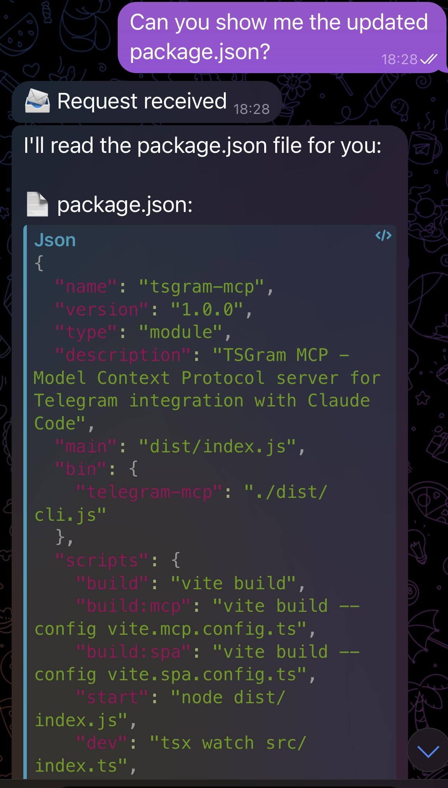
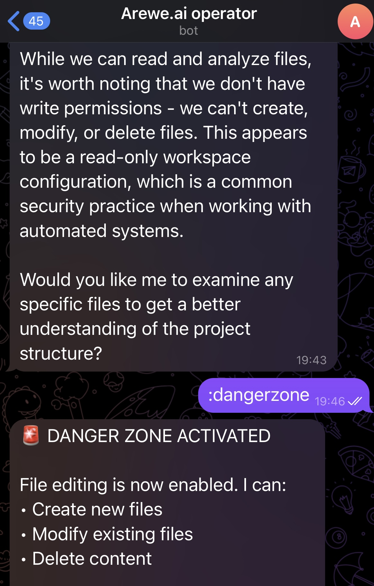
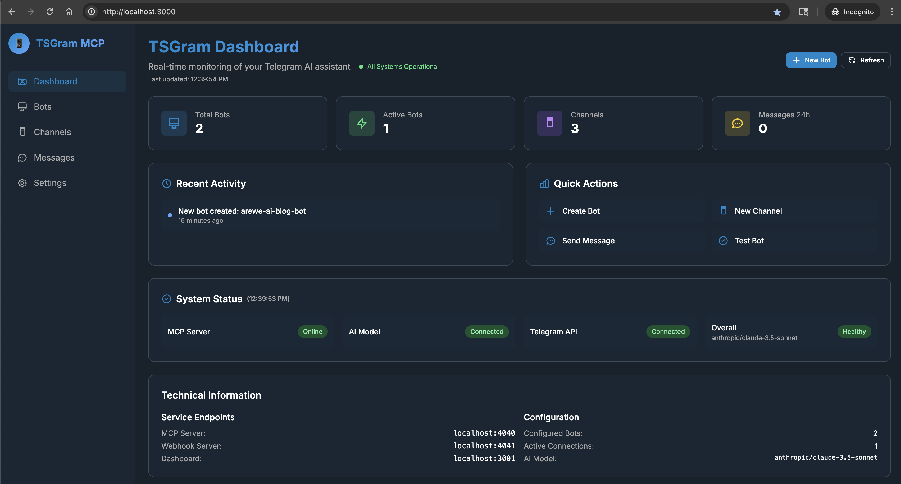

# TSGram MCP 🚀

**Get Claude Code in your local project talking to Telegram in 3 minutes!**



TSGram MCP connects Claude Code sessions to Telegram using TS/Node/Docker/cli-utils, enabling AI-powered code assistance directly in your Telegram chats. Ask questions about your codebase, get AI insights, and even edit files - all from Telegram on your phone!

## 🔒 How It Works (All Local)
- Local Docker container runs the Telegram webhook server
- TSGram MCP server runs locally 
- Your Claude Code or Claude Desktop runs locally and adds MCP locally
- Create and delete bots in-app through Telegram, access limited to your telegram user id
- Modern local web dashboard to manage bots from localhost 
- Local means local! If your computer is offline, so are your bots.

## Quick Start (3 Minutes)

### 🤖 AI Agent Enhanced Setup (Recommended!)

Let Claude handle the entire setup and ask you for the required values.

**From your terminal:**
0. Install [Docker Desktop](https://www.docker.com/products/docker-desktop/) and [Node.js 20+](https://nodejs.org/en/download) (npm included)
1. Clone the repository:
   ```bash
   git clone https://github.com/areweai/tsgram-mcp.git
   cd tsgram-mcp
   ```

2. From the command line, start Claude:
   ```bash
   claude --model sonnet
   ```

3. Initialize with `/init`

4. Copy and paste this prompt:
   > First, explain to the human how to register a new Telegram bot with @BotFather and get their bot token (TELEGRAM_BOT_TOKEN), and how to get their Telegram user ID from @userinfobot (for AUTHORIZED_CHAT_ID). They can work on getting these credentials while you set up the system. Then help the user set up tsgram-mcp for claude code. Do everything from installing node modules to creating and deploying the local docker containers. Finally, when everything is deployed, remind the user to configure their bot token and authorized chat ID along wither other required .env variables.

Make sure you replace the `TELEGRAM_BOT_TOKEN` and `AUTHORIZED_CHAT_ID` placeholders with the actual values.

In order to retrieve those values, you will have to message the following Telegram bots and follow their instructions:
- [@BotFather](https://t.me/botfather)
- [@userinfobot](https://t.me/userinfobot)

The AI will then handle all the setup steps for you, including:
- Installing dependencies
- Configuring environment variables
- Building Docker containers
- Starting services
- Guiding you through bot registration
- Setting up the MCP server (and allow you to extend functionality locally)

**CLI no-AI Alternative If Hitting LLM troubles: Setup Shell Script**
Run from your project root:
```bash
# One-line install (macOS/Linux)
curl -sSL https://raw.githubusercontent.com/areweai/tsgram-mcp/main/setup.sh | bash

# Or if you prefer to review first:
curl -sSL https://raw.githubusercontent.com/areweai/tsgram-mcp/main/setup.sh > setup.sh
chmod +x setup.sh
./setup.sh
```

**Adding TSGram to an Existing Project:**

If you already have a project and want to add TSGram as an MCP server:

1. From your existing project root:
   ```bash
   git clone https://github.com/areweai/tsgram-mcp.git .tsgram-mcp
   cd .tsgram-mcp
   ```

2. Use Claude to set it up:
   ```bash
   claude model --sonnet
   /init
   ```

3. Paste this prompt:
   > "First, explain to the human how to register a new Telegram bot with @BotFather and get their bot token (TELEGRAM_BOT_TOKEN) from @UserBotInfoBot, and how to get their Telegram user ID from @userinfobot (for AUTHORIZED_CHAT_ID). They can work on getting these credentials while you set up the system. Then help me add TSGram MCP to my existing project in the parent directory. Set up the Docker containers and MCP configuration so I can use Telegram to interact with my project files. The project root is one level up from here."

This will configure TSGram to work with your existing project structure (and allow you to extend functionality locally).

### Test Your Bot! 🎉
**IMPORTANT: You will need to message your bot first before it can message you.**

Send your bot a message and ask it something about your local project!




**⚠️ Security Note**: TSGram has basic safeguards to not list, preview, or serve .env files but it is still strongly recommended that you do not use TSGram for anything highly sensitive as third party servers are part of the transport layer.

## 📊 Web Dashboard

Monitor and manage your bots through the beautiful web dashboard at **http://localhost:3000**:



The dashboard provides:
- **Real-time bot status** and activity monitoring
- **System health** indicators (MCP server, AI model, API keys)
- **Bot management** - create, test, and monitor Telegram bots
- **Activity logs** - track messages, responses, and system events
- **Quick actions** - send test messages and manage bot configurations
- **run from local** - npm run dashboard to view (chrome recommended)

## 📋 You Will Need

- [Docker Desktop](https://www.docker.com/products/docker-desktop/)
- [Node.js 20+](https://nodejs.org/en/download) (npm included)
- Telegram on a phone
- Claude Desktop or Claude Code (CLI)
- An OpenRouter API key (We recommend creating a new API key with a $1.00 limit. Trust, but limit!)
- Chrome (Optional but highly recommended for local management UI)

## Manual Setup Steps

### 1. Get Your Bot Token & User ID
1. **Create Bot**: Message [@BotFather](https://t.me/botfather) on Telegram
2. Send `/newbot` and follow prompts
3. Copy your bot token (keep this secret!)
4. **Get Your User ID** (IMPORTANT): Message [@userinfobot](https://t.me/userinfobot)
   - This returns your numeric user ID (e.g., `123456789`)
   - **Use the user ID, NOT your username** for security (usernames can be changed)

### 2. Configure Environment
Edit `.env` with your values:
```env
TELEGRAM_BOT_TOKEN=your_bot_token_here
# CRITICAL: Use your numeric user ID from @userinfobot, not your username!
AUTHORIZED_CHAT_ID=123456789  # Your numeric user ID from step 1

# Choose ONE AI provider:
OPENROUTER_API_KEY=your_openrouter_key  # For Claude (recommended with $1 limit)
# OR
OPENAI_API_KEY=your_openai_key         # For GPT-4
```

**Security Note**: The bot now uses your **numeric user ID** instead of username for authorization. This is more secure because:
- User IDs never change
- Usernames can be changed by users
- User IDs cannot be guessed or easily discovered

### 3. Start TSGram
```bash
npm install
npm run docker:build
npm run docker:start
```

## 🎯 Key Features

- **"Stop" and "Start" commands** in TSGram bot chat provide convenient output control
- **Select subset of unix commands supported** (`:h ls` or `:h cat $FILE`)
- **Opt-in edit mode** for vibe coding and debugging on the go (`:dangerzone` to enable)
- **AI-Powered Responses**: Uses Claude 3.5 Sonnet or GPT-4
- **Code Understanding**: Reads and analyzes your entire codebase
- **Web Dashboard**: Monitor bots at http://localhost:3000

## 💬 Bot Commands

- **Regular messages**: Get AI responses about your code
- **`:h`** - Show help and available commands
- **`:h ls [path]`** - List files in directory
- **`:h cat filename`** - View file contents
- **`:dangerzone`** - Enable file editing (careful!)
- **`:safetyzone`** - Disable file editing
- **`stop`** - Pause bot responses
- **`start`** - Resume bot responses

## 🛠️ Common Commands

```bash
# View logs
npm run docker:logs

# Check health
npm run docker:health

# Stop services
npm run docker:stop

# Rebuild after changes
npm run docker:rebuild

# Access dashboard (Chrome recommended)
npm run dashboard
```

## 📜 Useful Scripts

The project includes several helper scripts in the `scripts/` directory:

**Setup & Configuration**
- `setup.sh` - Automated install script (can be run via curl)
- `configure-mcp.sh` - Configure MCP settings for Claude Desktop/Code
- `fix-permissions.sh` - Fix file permissions if needed

**Updates & Maintenance**
- `update-system.sh` - Update TSGram to latest version
- `update-ai-context.sh` - Update AI context files

**Testing & Debugging**
- `test-api-keys.sh` - Verify your API keys are working
- `test-docker-setup.sh` - Test Docker configuration

Run any script with:
```bash
./scripts/script-name.sh
# or
npm run script-name  # for npm-wrapped scripts
```

## 🔧 Advanced Setup

### Using with Claude Code
Add to your Claude Code MCP settings:
```json
{
  "tsgram": {
    "command": "docker",
    "args": ["exec", "-i", "tsgram-mcp-workspace", "npx", "tsx", "src/mcp-server.ts"],
    "env": {
      "TELEGRAM_BOT_TOKEN": "your_bot_token_here",
      "AUTHORIZED_CHAT_ID": "123456789"
    }
  }
}
```

**Note**: Replace `123456789` with your actual numeric user ID from [@userinfobot](https://t.me/userinfobot)

### MCP Compatibility

TSGram uses the standard Model Context Protocol (MCP) format and should be compatible with any MCP-supporting IDE or tool. **Tested with:**
- ✅ Claude Code CLI
- ✅ Claude Desktop

**Should work with** (standard MCP format):
- Cursor IDE
- GitHub Copilot
- Other MCP-compatible editors

Use the same Docker configuration pattern shown above, adapting the syntax for your specific MCP client.

### CLI-to-Telegram Bridge
Forward Claude Code CLI responses to Telegram:
```bash
# Setup global command (may prompt for sudo password to create npm global install /usr/local/bin/claude-tg)
npm run setup

# Use instead of 'claude'
claude-tg "analyze this codebase"
```

## 🚨 Troubleshooting

**Bot not responding?**
```bash
# Check if services are running
npm run docker:health

# View logs for errors
npm run docker:logs
```

**Can't connect to bot?**
1. Verify bot token is correct in `.env`
2. **Check your user ID**: Make sure `AUTHORIZED_CHAT_ID` is your numeric user ID (not username)
   - Get it from [@userinfobot](https://t.me/userinfobot) if unsure
3. Make sure you messaged the bot first
4. If you get "authorization not configured" error, set `AUTHORIZED_CHAT_ID` in your `.env` file

**File edits not working?**
- Type `:dangerzone` to enable (one-time)
- Check logs for permission errors
- Ensure Docker has file access

## 📚 Project Structure

```
tsgram/
├── src/
│   ├── telegram-bot-ai-powered.ts    # Main bot logic
│   ├── telegram-mcp-webhook-server.ts # MCP integration
│   └── models/                        # AI providers
├── docker-compose.tsgram-workspace.yml # Main Docker config
├── .env.example                       # Environment template
└── data/                             # Persistent storage
```

## 🤝 Contributing

PRs welcome! Please:
1. Fork the repository
2. Create a feature branch
3. Add tests if applicable
4. Submit a pull request

## 📄 License

MIT - Feel free to use in your own projects!

---

**Need help?** Open an issue on GitHub or message your bot with questions!