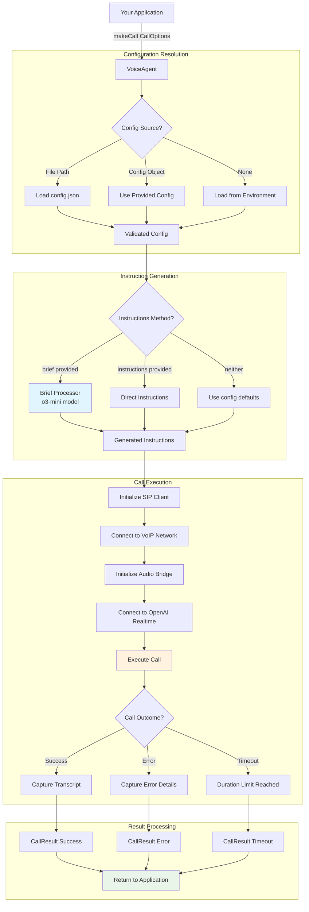

# AI Voice Agent - API Documentation

A comprehensive TypeScript/JavaScript library for making AI-powered phone calls with automatic instruction generation and high-quality audio codecs.

## Installation

```bash
npm install ai-voice-agent
```

## Quick Start

```typescript
import { makeCall } from 'ai-voice-agent';

const result = await makeCall({
  number: '+1234567890',
  brief: 'Call Bocca di Bacco and book a table for 2 at 7pm tonight',
  userName: 'John Doe',
  config: './config.json'
});

console.log(`Call ${result.success ? 'succeeded' : 'failed'}`);
console.log(`Duration: ${result.duration}s`);
if (result.transcript) {
  console.log(`Transcript:\n${result.transcript}`);
}
```

## API Flow Diagram



## Core API Functions

### `makeCall(options: CallOptions): Promise<CallResult>`

Make a single phone call with the AI agent. This is the primary function for most use cases.

```typescript
import { makeCall } from 'ai-voice-agent';

// Restaurant reservation
const result = await makeCall({
  number: '+1234567890',
  brief: 'Call Mario\'s Pizza and order 2 large pepperoni pizzas for delivery',
  userName: 'Sarah Johnson',
  config: 'config.json'
});

// Medical appointment scheduling
const result = await makeCall({
  number: '+1555123456',
  brief: 'Call Dr. Smith\'s office to reschedule my Tuesday 2pm appointment to Friday morning',
  userName: 'Jennifer Martinez',
  config: configObject
});

// Customer service inquiry
const result = await makeCall({
  number: '+18005551234',
  brief: 'Call internet provider about slow speeds, reference ticket #45692',
  userName: 'Mike Chen',
  recording: true,
  duration: 600
});

// Business meeting coordination
const result = await makeCall({
  number: '+14155987654',
  brief: 'Call client to confirm tomorrow\'s 3pm project review meeting',
  userName: 'Alex Thompson',
  logLevel: 'quiet'
});

// Service cancellation
const result = await makeCall({
  number: '+18009876543',
  brief: 'Cancel gym membership, account holder Jane Doe, membership ID 12345',
  userName: 'Jane Doe',
  recording: 'cancellation-proof.wav'
});
```

### `createAgent(config, options?): Promise<VoiceAgent>`

Create a persistent VoiceAgent instance for advanced use cases where you need to make multiple calls or want fine-grained control over the agent lifecycle.

```typescript
import { createAgent } from 'ai-voice-agent';

const agent = await createAgent('config.json', {
  enableCallRecording: true,
  recordingFilename: 'agent-calls.wav'
});

// Event handlers
agent.on('callInitiated', ({ callId, target }) => {
  console.log(`Call ${callId} started to ${target}`);
});

agent.on('callEnded', () => {
  console.log('Call finished');
});

agent.on('error', (error) => {
  console.error('Agent error:', error.message);
});

// Make calls
await agent.makeCall({ 
  targetNumber: '+1234567890',
  duration: 300 
});

// Clean shutdown when done
await agent.shutdown();
```

## Interfaces

### `CallOptions`

Options for the `makeCall()` function.

```typescript
interface CallOptions {
  /** Phone number to call */
  number: string;
  
  /** Call duration in seconds (optional) */
  duration?: number;
  
  /** Configuration - file path or config object */
  config?: string | Config;
  
  /** Direct AI instructions (highest priority) */
  instructions?: string;
  
  /** Call brief to generate instructions from */
  brief?: string;
  
  /** Your name for the AI to use when calling */
  userName?: string;
  
  /** Voice to use ('auto' for AI selection, or specific voice name) */
  voice?: string;
  
  /** Enable recording with optional filename */
  recording?: boolean | string;
  
  /** Log level: 'quiet' | 'error' | 'warn' | 'info' | 'debug' | 'verbose' */
  logLevel?: string;
  
  /** Enable colored output */
  colors?: boolean;
  
  /** Enable timestamps in logs */
  timestamps?: boolean;
}
```

## Error Handling

The API provides comprehensive error information to help diagnose issues:

```typescript
try {
  const result = await makeCall({
    number: '+1234567890',
    brief: 'Test call',
    config: 'config.json'
  });
  
  if (result.success) {
    console.log('✅ Call succeeded');
    console.log(`Duration: ${result.duration}s`);
    if (result.transcript) {
      console.log('Transcript:', result.transcript);
    }
  } else {
    // Call failed but was handled gracefully
    console.log('❌ Call failed:', result.error);
    
    // Common failure scenarios:
    if (result.error?.includes('401')) {
      console.log('→ Check SIP credentials');
    } else if (result.error?.includes('timeout')) {
      console.log('→ Check network connectivity');
    } else if (result.error?.includes('codec')) {
      console.log('→ Audio codec negotiation failed');
    }
  }
} catch (error) {
  // System-level errors (configuration, network, etc.)
  if (error.message.includes('Configuration')) {
    console.error('Config error:', error.message);
    console.log('→ Run: npm run validate config.json');
  } else if (error.message.includes('Call brief error')) {
    console.error('Brief processing failed:', error.message);
    console.log('→ Check OpenAI API key and brief content');
  } else if (error.message.includes('SIP')) {
    console.error('SIP connection error:', error.message);
    console.log('→ Check network and firewall settings');
  } else {
    console.error('Unexpected error:', error.message);
  }
}
```

### Common Error Scenarios

| Error Type | Likely Cause | Solution |
|------------|--------------|----------|
| `401 Unauthorized` | Invalid SIP credentials | Verify username/password in config |
| `Connection timeout` | Network/firewall issues | Check STUN servers, firewall rules |
| `Codec negotiation failed` | Audio codec mismatch | Ensure G.722 compiled or enable G.711 fallback |
| `Call brief error` | Invalid OpenAI API key | Verify API key has sufficient credits |
| `Configuration invalid` | Missing required fields | Run `npm run validate config.json` |

### `CallResult`

Return value from `makeCall()`.

```typescript
interface CallResult {
  /** Call ID if successful */
  callId?: string;
  
  /** Call duration in seconds */
  duration: number;
  
  /** Full conversation transcript */
  transcript?: string;
  
  /** Whether call was successful */
  success: boolean;
  
  /** Error message if failed */
  error?: string;
}
```

### `Config`

Configuration structure for SIP and AI settings.

```typescript
interface Config {
  sip: {
    username: string;
    password: string;
    serverIp: string;
    serverPort?: number;
    localPort?: number;
    provider?: string;        // 'fritz-box', 'asterisk', etc.
    stunServers?: string[];
    // ... advanced options
  };
  ai: {
    openaiApiKey: string;
    voice?: 'auto' | 'alloy' | 'ash' | 'ballad' | 'cedar' | 'coral' | 'echo' | 'marin' | 'sage' | 'shimmer' | 'verse';
    instructions?: string;
    brief?: string;
  };
}
```

## Configuration

### File-Based Configuration

Create a `config.json` file:

```json
{
  "sip": {
    "username": "your_sip_username",
    "password": "your_sip_password",
    "serverIp": "192.168.1.1",
    "serverPort": 5060,
    "provider": "fritz-box"
  },
  "ai": {
    "openaiApiKey": "sk-your-openai-api-key",
    "voice": "alloy",
    "instructions": "You are a helpful AI assistant making phone calls."
  }
}
```

> **💡 Validation Tip**: Always validate your configuration before making calls:
> ```bash
> npm run validate config.json  # Basic validation
> npm run validate:detailed     # With network tests
> ```

Then use it:

```typescript
const result = await makeCall({
  number: '+1234567890',
  brief: 'Test call',
  config: './config.json'
});
```

### Object-Based Configuration

```typescript
const config = {
  sip: {
    username: 'sip_user',
    password: 'sip_pass',
    serverIp: '192.168.1.1',
    serverPort: 5060
  },
  ai: {
    openaiApiKey: process.env.OPENAI_API_KEY,
    voice: 'auto'
  }
};

const result = await makeCall({
  number: '+1234567890',
  brief: 'Call the restaurant',
  config: config
});
```

### Environment Variables

If no config is provided, the library will try to load from environment variables:

```bash
# Required
OPENAI_API_KEY=sk-your-openai-key
SIP_USERNAME=your_sip_user
SIP_PASSWORD=your_sip_password
SIP_SERVER_IP=192.168.1.1

# Optional
SIP_SERVER_PORT=5060
SIP_LOCAL_PORT=5060
OPENAI_VOICE=alloy
```

> **⚠️ Environment Setup**: When using environment variables, test your setup first:
> ```bash
> npx ai-voice-agent validate  # Validates env vars
> ```

Then:

```typescript
// Will use environment variables
const result = await makeCall({
  number: '+1234567890',
  brief: 'Test call'
  // No config needed
});
```

## Call Brief vs Instructions

The library supports two ways to control the AI's behavior:

### Call Brief (Recommended) 🤖

Use simple, natural language descriptions. The system automatically generates sophisticated instructions using OpenAI's o3 model.

```typescript
// Simple brief - o3 generates detailed instructions
const result = await makeCall({
  number: '+1234567890',
  brief: 'Call Bocca di Bacco restaurant and book a table for 2 people at 7pm tonight. Mention we\'re celebrating an anniversary.',
  userName: 'Jennifer Martinez'
});
```

**Why this works better:** OpenAI's real-time voice models need very specific instructions to handle complex tasks well. The o3 model automatically creates detailed conversation flows, handles edge cases, and provides appropriate tone.

### Direct Instructions

For when you need complete control over the AI's behavior:

```typescript
const result = await makeCall({
  number: '+1234567890',
  instructions: `You are calling on behalf of Jennifer Martinez to make a restaurant reservation.
  
  Goal: Book a table for 2 people at Bocca di Bacco for tonight at 7pm.
  
  Process:
  1. Greet professionally: "Hello, this is an assistant calling on behalf of Jennifer Martinez"
  2. State purpose immediately: "I'm calling to make a dinner reservation"
  3. Request: Table for 2 people, tonight at 7pm
  4. If unavailable: Ask for alternatives between 6-8pm
  5. Confirm all details and get confirmation number
  6. Thank them professionally
  
  Special notes: Mention this is for an anniversary celebration.`
});
```

## VoiceAgent Events

When using `createAgent()`, you can listen to various events:

```typescript
const agent = await createAgent('config.json');

// Call lifecycle events
agent.on('callInitiated', ({ callId, target }) => {
  console.log(`📞 Call ${callId} started to ${target}`);
});

agent.on('callEnded', () => {
  console.log('📱 Call ended');
});

agent.on('error', (error) => {
  console.error('❌ Call error:', error.message);
});

// Connection events
agent.on('connectionStateChange', (state) => {
  console.log(`🔄 Connection state: ${state.status}`);
});

agent.on('reconnectAttempt', (attempt) => {
  console.log(`🔄 Reconnect attempt ${attempt}`);
});

agent.on('transportFallback', (transport) => {
  console.log(`🔄 Transport fallback to ${transport}`);
});
```

## Advanced Features

### Call Recording

Enable call recording to capture both sides of the conversation in stereo WAV format:

```typescript
// Auto-generated filename
const result = await makeCall({
  number: '+1234567890',
  brief: 'Important business call',
  recording: true
});

// Custom filename
const result = await makeCall({
  number: '+1234567890',
  brief: 'Client consultation',
  recording: 'client-call-2024-01-15.wav'
});
```

The recording will have:
- **Left channel**: Caller audio (person being called)
- **Right channel**: AI assistant audio

### Transcript Capture

In quiet mode (`logLevel: 'quiet'`), the full conversation transcript is automatically captured and returned:

```typescript
const result = await makeCall({
  number: '+1234567890',
  brief: 'Call for transcript analysis',
  logLevel: 'quiet'  // Only shows transcript during call
});

if (result.transcript) {
  console.log('Full conversation:');
  console.log(result.transcript);
}
```

### Duration Limits

Set maximum call duration to automatically end calls:

```typescript
const result = await makeCall({
  number: '+1234567890',
  brief: 'Quick status check',
  duration: 120  // End call after 2 minutes
});
```

### Logging Control

Control verbosity during calls:

```typescript
// Quiet mode - only transcript
const result = await makeCall({
  number: '+1234567890',
  brief: 'Test call',
  logLevel: 'quiet'
});

// Verbose mode - all debugging info
const result = await makeCall({
  number: '+1234567890',
  brief: 'Debug call',
  logLevel: 'verbose',
  colors: true,
  timestamps: true
});
```

## Error Handling

```typescript
try {
  const result = await makeCall({
    number: '+1234567890',
    brief: 'Test call',
    config: 'config.json'
  });
  
  if (result.success) {
    console.log('Call succeeded!');
  } else {
    console.error('Call failed:', result.error);
  }
} catch (error) {
  if (error.message.includes('Configuration')) {
    console.error('Config error:', error.message);
  } else if (error.message.includes('Call brief error')) {
    console.error('Brief processing failed:', error.message);  
  } else {
    console.error('Unexpected error:', error.message);
  }
}
```

## Utility Functions

### Configuration Utilities

```typescript
import { loadConfig, loadConfigFromEnv, createSampleConfig } from 'ai-voice-agent';

// Load from file
const config = loadConfig('./config.json');

// Load from environment
const envConfig = loadConfigFromEnv();

// Create sample config for reference
const sample = createSampleConfig();
```

### Call Brief Processing

```typescript
import { CallBriefProcessor } from 'ai-voice-agent';

const processor = new CallBriefProcessor({
  openaiApiKey: 'your-key',
  defaultUserName: 'John Doe'
});

const instructions = await processor.generateInstructions(
  'Call the pizza place and order 2 large pepperonis',
  'John Doe'
);
```

## Audio Codecs

The library automatically negotiates the best available audio codec:

1. **G.722** (preferred) - 16kHz wideband, superior voice quality
2. **G.711 μ-law** (fallback) - 8kHz narrowband, universal compatibility
3. **G.711 A-law** (fallback) - 8kHz narrowband, European standard

```typescript
import { CodecRegistry } from 'ai-voice-agent';

// Check codec availability
console.log('Supported codecs:', CodecRegistry.getSupportedCodecs());
```

## TypeScript Support

Full TypeScript definitions are included:

```typescript
import type { 
  CallOptions,
  CallResult,
  Config,
  VoiceAgent,
  CallBriefProcessor
} from 'ai-voice-agent';

// All interfaces are fully typed
const options: CallOptions = {
  number: '+1234567890',
  brief: 'Test call',
  config: './config.json'
};
```

## Best Practices

### 1. Use Call Briefs
```typescript
// ✅ Good - uses o3 to generate sophisticated instructions
const result = await makeCall({
  number: '+1234567890',
  brief: 'Call Mama\'s Kitchen and book a table for 4 at 7pm, mention food allergies',
  userName: 'Sarah'
});
```

### 2. Include Your Name
```typescript
// ✅ Good - AI introduces itself properly
const result = await makeCall({
  number: '+1234567890',
  brief: 'Make restaurant reservation',
  userName: 'Dr. Sarah Johnson'  // Important for professional calls
});
```

### 3. Handle Errors Gracefully
```typescript
// ✅ Good - comprehensive error handling
try {
  const result = await makeCall(options);
  if (!result.success) {
    console.log('Call failed but handled gracefully:', result.error);
    // Implement retry logic, logging, etc.
  }
} catch (error) {
  console.error('System error:', error.message);
}
```

### 4. Use Appropriate Log Levels
```typescript
// ✅ Good - quiet for production, verbose for debugging
const result = await makeCall({
  number: '+1234567890',
  brief: 'Production call',
  logLevel: process.env.NODE_ENV === 'production' ? 'quiet' : 'debug'
});
```

---

## Support

- **Configuration Issues**: Use the built-in validation tools
- **Provider Support**: Check compatibility matrix in README
- **API Questions**: All interfaces are fully documented with TypeScript
- **Examples**: See the `/examples` directory for more use cases