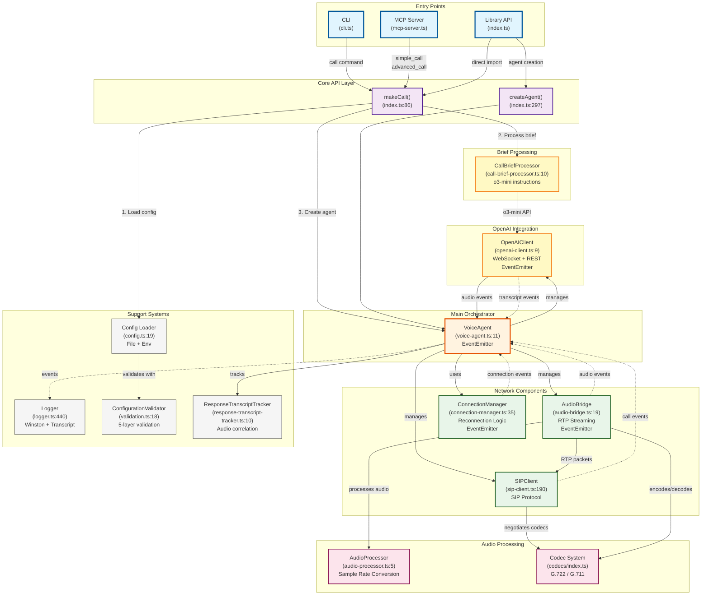
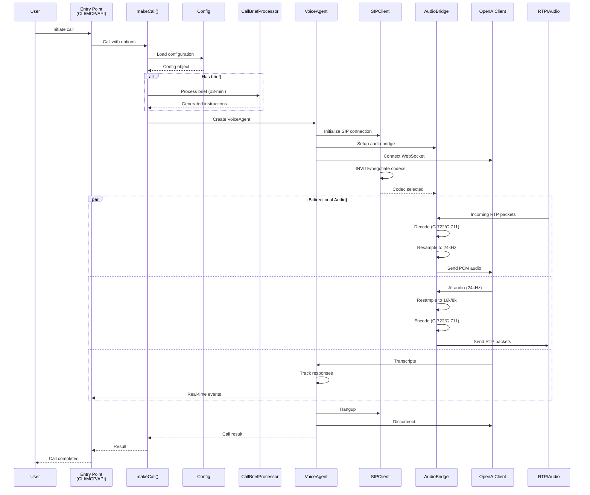

# Architecture Call Graph

## Main Entry Points and Module Interactions

This diagram shows the primary entry points and call flow between major modules in the VoIP Agent system.

## Source Code Links

### Entry Points
- **CLI**: [`src/cli.ts`](https://github.com/gerkensm/callcenter.js-mcp/blob/main/src/cli.ts)
- **MCP Server**: [`src/mcp-server.ts`](https://github.com/gerkensm/callcenter.js-mcp/blob/main/src/mcp-server.ts)
- **Library API**: [`src/index.ts`](https://github.com/gerkensm/callcenter.js-mcp/blob/main/src/index.ts)

### Core API Functions
- **makeCall()**: [`src/index.ts:86`](https://github.com/gerkensm/callcenter.js-mcp/blob/main/src/index.ts#L86)
- **createAgent()**: [`src/index.ts:297`](https://github.com/gerkensm/callcenter.js-mcp/blob/main/src/index.ts#L297)

### Main Components
- **VoiceAgent**: [`src/voice-agent.ts:11`](https://github.com/gerkensm/callcenter.js-mcp/blob/main/src/voice-agent.ts#L11)
- **CallBriefProcessor**: [`src/call-brief-processor.ts:10`](https://github.com/gerkensm/callcenter.js-mcp/blob/main/src/call-brief-processor.ts#L10)
- **SIPClient**: [`src/sip-client.ts:190`](https://github.com/gerkensm/callcenter.js-mcp/blob/main/src/sip-client.ts#L190)
- **AudioBridge**: [`src/audio-bridge.ts:19`](https://github.com/gerkensm/callcenter.js-mcp/blob/main/src/audio-bridge.ts#L19)
- **ConnectionManager**: [`src/connection-manager.ts:35`](https://github.com/gerkensm/callcenter.js-mcp/blob/main/src/connection-manager.ts#L35)
- **OpenAIClient**: [`src/openai-client.ts:9`](https://github.com/gerkensm/callcenter.js-mcp/blob/main/src/openai-client.ts#L9)

### Audio & Codec System
- **AudioProcessor**: [`src/audio-processor.ts:5`](https://github.com/gerkensm/callcenter.js-mcp/blob/main/src/audio-processor.ts#L5)
- **Codec System**: [`src/codecs/index.ts`](https://github.com/gerkensm/callcenter.js-mcp/blob/main/src/codecs/index.ts)

### Support Systems
- **Logger**: [`src/logger.ts:440`](https://github.com/gerkensm/callcenter.js-mcp/blob/main/src/logger.ts#L440)
- **Config Loader**: [`src/config.ts:19`](https://github.com/gerkensm/callcenter.js-mcp/blob/main/src/config.ts#L19)
- **ConfigurationValidator**: [`src/validation.ts:18`](https://github.com/gerkensm/callcenter.js-mcp/blob/main/src/validation.ts#L18)
- **ResponseTranscriptTracker**: [`src/response-transcript-tracker.ts:10`](https://github.com/gerkensm/callcenter.js-mcp/blob/main/src/response-transcript-tracker.ts#L10)

## Call Flow Sequence

## Key Design Patterns

### Event-Driven Architecture
- **EventEmitters**: VoiceAgent, AudioBridge, OpenAIClient, ConnectionManager
- **Event Flow**: Components communicate asynchronously via events
- **Decoupling**: Loose coupling between major components

### Module Responsibilities

| Module | Primary Responsibility | Key Methods/Events |
|--------|----------------------|-------------------|
| **[VoiceAgent](https://github.com/gerkensm/callcenter.js-mcp/blob/main/src/voice-agent.ts#L11)** | Main orchestrator | `startCall()`, `endCall()`, emits: `callStarted`, `callEnded`, `error` |
| **[SIPClient](https://github.com/gerkensm/callcenter.js-mcp/blob/main/src/sip-client.ts#L190)** | SIP protocol handling | `call()`, `hangup()`, handles INVITE/BYE |
| **[AudioBridge](https://github.com/gerkensm/callcenter.js-mcp/blob/main/src/audio-bridge.ts#L19)** | RTP streaming & codecs | `startRTPSession()`, `processAudio()` |
| **[OpenAIClient](https://github.com/gerkensm/callcenter.js-mcp/blob/main/src/openai-client.ts#L9)** | OpenAI API integration | WebSocket events, REST for brief processing |
| **[CallBriefProcessor](https://github.com/gerkensm/callcenter.js-mcp/blob/main/src/call-brief-processor.ts#L10)** | Natural language → instructions | `generateInstructions()` using o3-mini |
| **[ConnectionManager](https://github.com/gerkensm/callcenter.js-mcp/blob/main/src/connection-manager.ts#L35)** | Reconnection with backoff | `connect()`, `reconnect()`, exponential backoff |

### Data Flow Patterns

1. **Configuration Priority**: CLI flags > Config file > Environment variables
2. **Brief Processing**: Natural language → o3-mini → structured instructions
3. **Audio Pipeline**: RTP → Decode → Resample → OpenAI → Resample → Encode → RTP
4. **Response Tracking**: OpenAI response IDs → transcript correlation → audio completion

### Critical Paths

1. **Call Initiation**:
   - Entry → makeCall → Config → VoiceAgent → SIPClient

2. **Audio Processing**:
   - RTP packets → AudioBridge → Codec → AudioProcessor → OpenAI

3. **Transcript Handling**:
   - OpenAI → ResponseTracker → VoiceAgent → Logger (transcript channel)