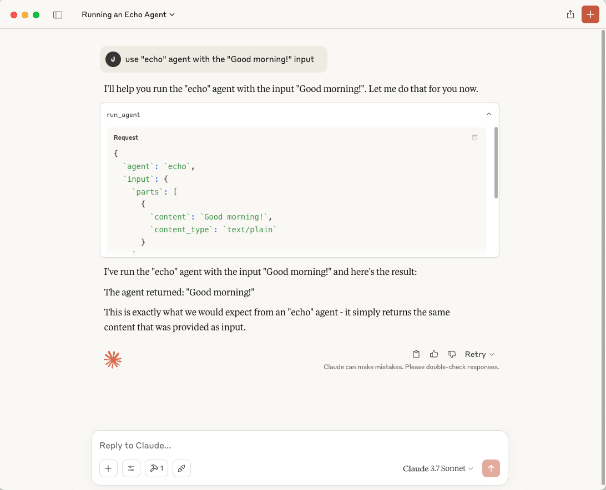
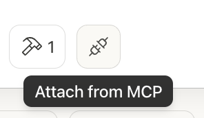

<div align="left">

<h1>ACP to MCP Adapter</h1>

**Connect ACP Agents to MCP Applications Seamlessly**

[](https://github.com/i-am-bee/beeai-framework?tab=Apache-2.0-1-ov-file#readme)
[](https://bsky.app/profile/beeaiagents.bsky.social)
[](https://discord.com/invite/NradeA6ZNF)
[](https://lfaidata.foundation/projects/)

</div>

The **ACP to MCP Adapter** is a lightweight standalone server that acts as a bridge between two AI ecosystems: **Agent Communication Protocol (ACP)** for agent-to-agent communication and **Model Context Protocol (MCP)** for connecting AI models to external tools. It allows MCP applications (like **Claude Desktop**) to discover and interact with ACP agents as resources.

## Capabilities & Tradeoffs

This adapter enables interoperability between ACP and MCP with specific benefits and tradeoffs:

### Benefits

- Makes ACP agents discoverable as MCP resources
- Exposes ACP agent runs as MCP tools
- Bridges two ecosystems with minimal configuration

### Current Limitations

- ACP agents become MCP tools instead of conversational peers
- No streaming of incremental updates
- No shared memory across servers
- Basic content translation between formats without support for complex data structures

This adapter is best for situations where you need ACP agents in MCP environments and accept these compromises.

## Requirements

- Python 3.11 or higher
- Installed Python packages: `acp-sdk`, `mcp`
- An ACP server running (Tip: Follow the [ACP quickstart](https://github.com/i-am-bee/acp/blob/main/README.md#quickstart) to start one easily)
- An MCP client application (We use [Claude Desktop](https://claude.ai/download) in the quickstart)

## Quickstart

**1. Run the Adapter**

Start the adapter and connect it to your ACP server:

```sh
uvx acp-mcp http://localhost:8000
```

> [!NOTE]
> Replace `http://localhost:8000` with your ACP server URL if different.

<details> <summary><strong>Prefer Docker?</strong></summary>

```sh
docker run -i --rm ghcr.io/i-am-bee/acp-mcp http://host.docker.internal:8000
```

**Tip:** `host.docker.internal` allows Docker containers to reach services running on the host (adjust if needed for your setup).

</details> 

**2. Connect via Claude Desktop**

To connect via Claude Desktop, follow these steps:
1. Open the Claude menu on your computer and navigate to Settings (note: this is separate from the in-app Claude account settings).
2. Navigate to Developer > Edit Config
3. The config file will be created here:
  - macOS: `~/Library/Application Support/Claude/claude_desktop_config.json`
  - Windows: `%APPDATA%\Claude\claude_desktop_config.json`
4. Edit the file with the following:

```json
{
  "mcpServers": {
    "acp-local": {
      "command": "uvx",
      "args": ["acp-mcp", "http://localhost:8000"]
    }
  }
}
```
  
<details> <summary><strong>Prefer Docker?</strong></summary>
  
```json
{
  "mcpServers": {
    "acp-docker": {
      "command": "docker",
      "args": [
        "run",
        "-i",
        "--rm",
        "ghcr.io/i-am-bee/acp-mcp",
        "http://host.docker.internal:8000"
      ]
    }
  }
}
```

</details>

**3. Restart Claude Desktop and Invoke Your ACP Agent**

After restarting, invoke your ACP agent with:

```
use "echo" agent with the "Good morning!" input
```

Accept the integration and observe the agent running.





> [!TIP]
> ACP agents are also registered as **MCP resources** in Claude Desktop.<br />
> To attach them manually, click the Resources icon (two plugs connecting) in the sidebar, labeled "Attach from MCP", then select an agent like `acp://agents/echo`.

## How It Works

1. The adapter connects to your ACP server.
2. It automatically discovers all registered ACP agents.
3. Each ACP agent is registered in MCP as a resource using the URI: `acp://agents/{agent_name}`
4. The adapter provides a new MCP tool called `run_agent`, letting MCP apps easily invoke ACP agents.

## Supported Transports

- Currently supports Stdio transport

---

Developed by contributors to the BeeAI project, this initiative is part of the [Linux Foundation AI & Data program](https://lfaidata.foundation/projects/). Its development follows open, collaborative, and community-driven practices.
