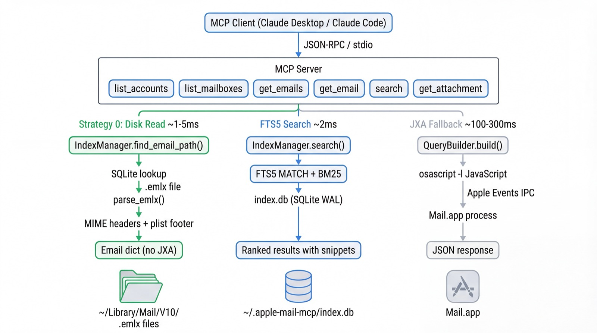
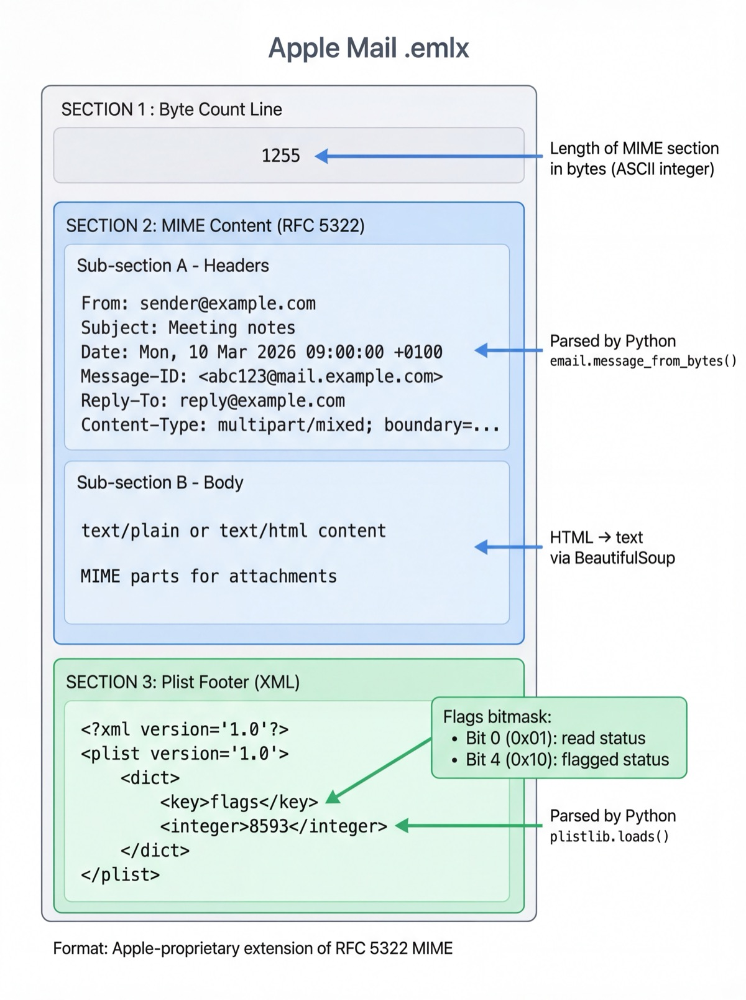

# Architecture Deep Dive

A detailed look at how Apple Mail MCP reads emails at disk speed, why JXA is slow, and how the FTS5 index ties it all together.



## The Three Access Layers

Apple Mail MCP uses a **3-layer architecture** where each tool picks the fastest available path for its operation:

| Layer | Latency | Used By | Requires |
|-------|---------|---------|----------|
| **Disk read** | ~1–5ms | `get_email()` | Search index |
| **FTS5 search** | ~2–25ms | `search()` | Search index |
| **JXA / Apple Events** | ~100–300ms | `get_emails()`, `list_mailboxes()` | Mail.app running |

The key insight is that **most "read email" operations don't need Mail.app at all**. The email content is already on disk as `.emlx` files. We only need JXA when we want real-time state that only Mail.app knows (like the unread count on a mailbox, or listing emails with live filters).

---

## The `.emlx` File Format

Apple Mail stores every email as a standalone `.emlx` file in `~/Library/Mail/V10/`. This is an Apple-proprietary format that wraps a standard [RFC 5322](https://datatracker.ietf.org/doc/html/rfc5322) MIME message with two additions: a byte-count header and an XML plist footer.



### Structure

An `.emlx` file has three sections, read sequentially:

```
1255                          ← Section 1: Byte count (ASCII integer)
From: sender@example.com      ← Section 2: RFC 5322 MIME content
Subject: Hello                    (exactly <byte_count> bytes)
Date: Mon, 10 Mar 2026 09:00:00 +0100
Content-Type: text/plain

Email body text here...
<?xml version="1.0"?>         ← Section 3: Plist metadata footer
<plist version="1.0">            (everything after the MIME content)
<dict>
    <key>flags</key>
    <integer>8593</integer>
</dict>
</plist>
```

### Section 1: Byte Count

The first line is an ASCII integer indicating the exact byte length of the MIME content that follows. This lets parsers know exactly where the MIME section ends and the plist footer begins — without scanning for a delimiter.

**Implementation:** `disk.py:299-304` reads this line, then slices the file content at `mime_start:mime_start + byte_count`.

### Section 2: MIME Content (RFC 5322)

The core email data. This is a standard MIME message identical to what you'd find in an `.eml` file. We parse it with Python's built-in [`email.message_from_bytes()`](https://docs.python.org/3/library/email.parser.html), which handles:

- **Headers** — `From`, `Subject`, `Date`, `Message-ID`, `Reply-To`, `Content-Type`
- **Body** — `text/plain` preferred, `text/html` fallback (converted to text via [BeautifulSoup](https://www.crummy.com/software/BeautifulSoup/bs4/doc/))
- **Attachments** — MIME parts with `Content-Disposition: attachment` or inline images with `Content-ID`
- **Encoding** — RFC 2047 encoded headers decoded via `email.header.decode_header()`

For multipart messages, we walk the MIME tree and prefer `text/plain` parts. If only `text/html` is available, BeautifulSoup strips tags, scripts, and styles to produce clean plaintext. This is important for security — regex-based HTML stripping is vulnerable to XSS bypasses like `<<script>script>` ([OWASP XSS Prevention](https://cheatsheetseries.owasp.org/cheatsheets/Cross-Site_Scripting_Prevention_Cheat_Sheet.html)).

### Section 3: Plist Footer

Everything after the MIME content is an XML [property list](https://developer.apple.com/library/archive/documentation/Cocoa/Conceptual/PropertyLists/Introduction/Introduction.html) containing Apple Mail metadata. We parse it with Python's [`plistlib.loads()`](https://docs.python.org/3/library/plistlib.html).

The most important field is `flags` — a **bitmask** encoding message state:

| Bit | Hex | Meaning |
|-----|-----|---------|
| 0 | `0x01` | Read status |
| 1 | `0x02` | Deleted |
| 2 | `0x04` | Answered |
| 3 | `0x08` | Encrypted |
| 4 | `0x10` | Flagged |
| 5 | `0x20` | Recent |
| 6 | `0x40` | Draft |
| 7 | `0x80` | Initial (not downloaded) |

**Implementation:** `disk.py:379-380` extracts read/flagged status:

```python
flags = plist.get("flags", 0)
read = bool(flags & (1 << 0))     # bit 0
flagged = bool(flags & (1 << 4))  # bit 4
```

The plist may also contain `date-received` (as a [Core Data timestamp](https://developer.apple.com/documentation/foundation/nsdate) — seconds since January 1, 2001), `date-last-viewed`, and internal Mail.app metadata.

### Partial `.emlx` Files

Large emails (typically those with big attachments) are stored as `.partial.emlx` with the attachment bodies saved externally:

```
.../Messages/49461.partial.emlx       ← MIME skeleton (no attachment payload)
.../Attachments/49461/2/invoice.pdf   ← External attachment file
```

The MIME structure inside `.partial.emlx` still lists the attachment parts, but their payloads are empty. We locate external files by convention: `Attachments/<msg_id>/<part_index>/<filename>`.

### Filesystem Layout

```
~/Library/Mail/V10/
├── <Account-UUID>/                    ← One per email account
│   ├── INBOX.mbox/
│   │   └── Data/
│   │       └── 0/9/Messages/         ← Sharded by ID (x/y/)
│   │           ├── 12345.emlx
│   │           ├── 12346.partial.emlx
│   │           └── ...
│   ├── Sent Messages.mbox/
│   │   └── Data/...
│   └── Work/Projects.mbox/           ← Nested mailbox
│       └── Data/...
├── MailData/
│   └── Envelope Index                ← Apple's metadata SQLite DB
└── ...
```

Account directories are named by UUID (e.g., `24E569DF-5E45-467C-8150-852BBE203A24`). We maintain a bidirectional `AccountMap` cache to translate between friendly names and UUIDs.

**Source:** The `.emlx` format is not publicly documented by Apple. The structure described here was determined by reverse engineering and is consistent with prior community analysis ([EMLX format on Forensics Wiki](https://forensics.wiki/apple_mail/), [libpst project notes](https://www.five-ten-sg.com/libpst/)).

---

## Why JXA is Slow: Apple Events IPC

[JXA (JavaScript for Automation)](https://developer.apple.com/library/archive/releasenotes/InterapplicationCommunication/RN-JavaScriptForAutomation/Articles/Introduction.html) is Apple's JavaScript bridge to AppleScript. When we call `osascript -l JavaScript`, the script runs in a separate process and communicates with Mail.app via [Apple Events](https://developer.apple.com/library/archive/documentation/AppleScript/Conceptual/AppleScriptLangGuide/conceptual/ASLR_fundamentals.html) — a Mach IPC (inter-process communication) mechanism dating back to System 7 (1991).

### The IPC Round-Trip Problem

Every property access on a Mail.app object triggers a **separate Apple Event round-trip**:

```
Python process → osascript process → Mach IPC → Mail.app → response back
```

The naive approach — iterating messages and reading properties one at a time — sends `N × P` Apple Events for `N` messages with `P` properties:

```javascript
// SLOW: 54s for 50 emails (1 IPC per property per message)
for (let msg of inbox.messages()) {
    results.push({
        subject: msg.subject(),   // IPC round-trip
        sender: msg.sender(),     // IPC round-trip
        date: msg.dateReceived(), // IPC round-trip
    });
}
```

Each round-trip takes ~3–10ms due to Mach message passing overhead, context switching, and Mail.app's internal scripting bridge deserialization ([Apple Events Programming Guide](https://developer.apple.com/library/archive/documentation/AppleScript/Conceptual/AppleEvents/Chapters/AEInteracting.html)).

### Batch Property Fetching

Our `MailCore.batchFetch()` exploits a key Apple Events behavior: **array property access returns all values in a single IPC call**:

```javascript
// FAST: 0.6s for 50 emails (1 IPC per property for ALL messages)
const data = MailCore.batchFetch(msgs, ["sender", "subject", "dateReceived"]);
// data.sender = ["alice@...", "bob@...", ...]  ← one IPC call
// data.subject = ["Hello", "Meeting", ...]     ← one IPC call
```

This reduces `N × P` IPC calls to just `P` calls — hence the **87x speedup** (50 × 6 properties = 300 calls → 6 calls).

### Why We Still Need JXA

Despite being slower than disk reads, JXA provides capabilities that disk access cannot:

| Capability | Disk | JXA |
|-----------|------|-----|
| Read email content | Yes | Yes |
| Read/flagged status | Yes (from plist) | Yes |
| **Live unread count** | No | Yes |
| **Mailbox listing** | No (stale) | Yes (live) |
| **Email filtering** (today, unread) | No | Yes |
| Send email (future) | No | Yes |

JXA is the only way to get **real-time state** from Mail.app. Disk files reflect the last-synced state, which may be seconds or minutes behind.

---

## The FTS5 Search Index

We maintain a separate SQLite database (`~/.apple-mail-mcp/index.db`) with an [FTS5](https://www.sqlite.org/fts5.html) virtual table for full-text search. This is what makes body search possible in ~2ms instead of requiring JXA to iterate every email.

### Schema (v4)

```sql
-- Email content cache
CREATE TABLE emails (
    rowid INTEGER PRIMARY KEY AUTOINCREMENT,
    message_id INTEGER NOT NULL,      -- Mail.app ID (from .emlx filename)
    account TEXT NOT NULL,             -- Account UUID
    mailbox TEXT NOT NULL,
    subject TEXT,
    sender TEXT,
    content TEXT,                      -- Plaintext body
    date_received TEXT,
    emlx_path TEXT,                    -- Absolute path to .emlx file
    attachment_count INTEGER DEFAULT 0,
    UNIQUE(account, mailbox, message_id)
);

-- FTS5 virtual table (external content mode)
CREATE VIRTUAL TABLE emails_fts USING fts5(
    subject, sender, content,
    content='emails',                  -- Shares storage with emails table
    content_rowid='rowid',
    tokenize='porter unicode61'        -- English stemming + Unicode support
);

-- Attachment metadata (1:N)
CREATE TABLE attachments (
    email_rowid INTEGER REFERENCES emails(rowid) ON DELETE CASCADE,
    filename TEXT NOT NULL,
    mime_type TEXT,
    file_size INTEGER,
    content_id TEXT
);
```

### Key Design Decisions

**External content mode** (`content='emails'`) means FTS5 doesn't duplicate the email text — it stores only the inverted index and reads content from the `emails` table on demand. This roughly halves database size. Triggers (`emails_ai`, `emails_ad`, `emails_au`) keep the FTS index synchronized automatically on INSERT/DELETE/UPDATE ([SQLite FTS5 External Content](https://www.sqlite.org/fts5.html#external_content_tables)).

**Porter stemming** (`tokenize='porter unicode61'`) means "meeting" matches "meetings", "met", etc. The `unicode61` tokenizer handles non-ASCII characters correctly ([SQLite FTS5 Tokenizers](https://www.sqlite.org/fts5.html#tokenizers)).

**BM25 ranking** is FTS5's built-in relevance scoring — a TF-IDF variant that considers term frequency and document length. Subject matches are weighted higher than body matches in our queries ([Okapi BM25 — Wikipedia](https://en.wikipedia.org/wiki/Okapi_BM25)).

**WAL mode** (`PRAGMA journal_mode=WAL`) allows concurrent reads while writing, which is important because the file watcher may be inserting new emails while a search query is running ([SQLite WAL](https://www.sqlite.org/wal.html)).

**Composite uniqueness** (`UNIQUE(account, mailbox, message_id)`) is necessary because Mail.app message IDs are only unique within a mailbox — the same ID can appear in INBOX and Sent.

### Why Not Use Apple's Envelope Index?

Mail.app maintains its own SQLite database at `~/Library/Mail/MailData/Envelope Index`. We read it for metadata during indexing (`disk.py:read_envelope_index()`), but we don't use it for search because:

1. **No FTS5** — it has basic indexes but no full-text search capability
2. **Schema instability** — Apple changes the schema across macOS versions without documentation
3. **Locking conflicts** — Mail.app holds write locks that can cause `SQLITE_BUSY` for external readers
4. **No body text** — it stores metadata (subject, sender, date) but not email body content

Our separate index gives us full control over the schema, FTS5 configuration, and concurrent access patterns.

---

## The `get_email()` Strategy Cascade

When you call `get_email(message_id)`, the server tries four strategies in order, falling through on failure:

```
Strategy 0: Disk read (.emlx)      ← ~1-5ms, requires index
    ↓ fail
Strategy 1: JXA specified mailbox  ← ~100ms, uses account/mailbox params
    ↓ fail
Strategy 2: Index lookup + JXA    ← ~150ms, finds mailbox via SQLite, then JXA
    ↓ fail
Strategy 3: Iterate all mailboxes ← ~500ms+, always works (15s timeout, 50 mailbox cap)
```

**Strategy 0** is the fast path. It calls `IndexManager.find_email_path()` to look up the `.emlx` file path from SQLite, then calls `parse_emlx()` to read headers, body, and plist footer. The entire operation is a single SQLite query + one file read — no IPC, no Mail.app.

**Strategies 1–3** are JXA fallbacks for when the index is unavailable or the email isn't indexed. Strategy 3 is the "brute force" last resort with safety limits (15s timeout, max 50 mailboxes) to prevent runaway scans.

All four strategies return an **identical response schema** — the caller never knows which path was taken.

---

## Disk-Based Sync

The index stays current through **state reconciliation** — comparing the filesystem against the database to find what changed:

```
Server startup / apple-mail-mcp index
  → get_disk_inventory()     # Walk ~/Library/Mail/V10/, extract (account, mailbox, id) from paths
  → get_db_inventory()       # Query SQLite for existing (account, mailbox, id, path) tuples
  → Calculate diff:
      NEW:     on disk, not in DB → parse_emlx() → INSERT
      DELETED: in DB, not on disk → DELETE from DB
      MOVED:   same ID, different path → UPDATE emlx_path
```

This is **12x faster** than the old JXA-based sync (which timed out at 60s for large mailboxes) because filesystem walking (`os.scandir` / `Path.rglob`) is a local kernel operation — no IPC to Mail.app needed.

The `--watch` flag enables real-time updates via [`watchfiles`](https://watchfiles.helpmanual.io/) (a Rust-based file watcher), which monitors the Mail directory for new/changed `.emlx` files and indexes them incrementally.

---

## Security Model

| Threat | Mitigation | Source |
|--------|------------|--------|
| **SQL injection** | Parameterized queries (`?` placeholders) everywhere | `search.py`, `sync.py` |
| **JXA injection** | `json.dumps()` serialization for all user strings | `executor.py`, `builders.py` |
| **FTS5 query injection** | Special character escaping via regex before MATCH | `search.py` |
| **XSS via HTML emails** | BeautifulSoup parser (not regex) | `disk.py` |
| **DoS via large files** | 25 MB file size limit (`MAX_EMLX_SIZE`) | `disk.py` |
| **Path traversal** | `Path.resolve().is_relative_to()` validation | `disk.py`, `watcher.py` |
| **Data exposure** | Database created with `0600` permissions | `schema.py` |

---

## References

- [RFC 5322 — Internet Message Format](https://datatracker.ietf.org/doc/html/rfc5322) — the MIME standard that `.emlx` wraps
- [SQLite FTS5 Extension](https://www.sqlite.org/fts5.html) — full-text search virtual table documentation
- [Apple Events Programming Guide](https://developer.apple.com/library/archive/documentation/AppleScript/Conceptual/AppleEvents/Chapters/AEInteracting.html) — how JXA communicates with Mail.app
- [JXA Release Notes](https://developer.apple.com/library/archive/releasenotes/InterapplicationCommunication/RN-JavaScriptForAutomation/Articles/Introduction.html) — JavaScript for Automation introduction
- [Apple Property Lists](https://developer.apple.com/library/archive/documentation/Cocoa/Conceptual/PropertyLists/Introduction/Introduction.html) — the plist format used in `.emlx` footers
- [Forensics Wiki — Apple Mail](https://forensics.wiki/apple_mail/) — community documentation of the `.emlx` format
- [SQLite WAL Mode](https://www.sqlite.org/wal.html) — write-ahead logging for concurrent access
- [Okapi BM25](https://en.wikipedia.org/wiki/Okapi_BM25) — the ranking algorithm used by FTS5
