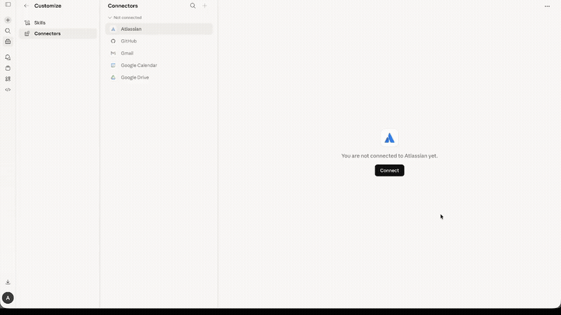

# MCP Telegram

[](https://www.npmjs.com/package/@overpod/mcp-telegram)
[](https://www.npmjs.com/package/@overpod/mcp-telegram)
[](https://nodejs.org/)
[](https://www.typescriptlang.org/)
[](https://modelcontextprotocol.io/)
[](LICENSE)
[](https://glama.ai/mcp/servers/overpod/mcp-telegram)

> **Hosted version available!** Don't want to self-host? Use [mcp-telegram.com](https://mcp-telegram.com) -- connect Telegram to Claude.ai or ChatGPT in 30 seconds with QR code. No API keys needed.

<p align="center">
  
</p>

An MCP (Model Context Protocol) server that connects AI assistants like Claude to Telegram via the MTProto protocol. Unlike bots, this runs as a **userbot** -- it operates under your personal Telegram account using [GramJS](https://github.com/nicedoc/gramjs), giving full access to your chats, contacts, and message history.

## Features

- **MTProto protocol** -- direct Telegram API access, not the limited Bot API
- **Userbot** -- operates as your personal account, not a bot
- **Full-featured** -- messaging, reactions, polls, scheduled messages, media, contacts, and more
- **QR code login** -- authenticate by scanning a QR code in the Telegram app
- **Session persistence** -- login once, stay connected across restarts
- **Human-readable output** -- sender names are resolved, not just numeric IDs
- **Works with any MCP client** -- Claude Code, Claude Desktop, ChatGPT, Cursor, VS Code, Mastra, etc.

## Prerequisites

- **Node.js** 18 or later
- **Telegram API credentials** -- `API_ID` and `API_HASH` from [my.telegram.org](https://my.telegram.org)

## Quick Start

### 1. Get Telegram API credentials

1. Go to [my.telegram.org](https://my.telegram.org) and log in with your phone number.
2. Navigate to **API development tools**.
3. Create a new application (any name and platform).
4. Copy the **App api_id** and **App api_hash**.

### 2. Login

```bash
TELEGRAM_API_ID=YOUR_ID TELEGRAM_API_HASH=YOUR_HASH npx @overpod/mcp-telegram login
```

A QR code will appear in the terminal. Open Telegram on your phone, go to **Settings > Devices > Link Desktop Device**, and scan the code. The session is saved to `~/.telegram-session` and reused automatically.

### 3. Add to Claude

```bash
claude mcp add telegram -s user \
  -e TELEGRAM_API_ID=YOUR_ID \
  -e TELEGRAM_API_HASH=YOUR_HASH \
  -- npx @overpod/mcp-telegram
```

That's it! Ask Claude to run `telegram-status` to verify.

## Installation Options

### npx (recommended, zero install)

No need to clone or install anything. Just use `npx @overpod/mcp-telegram`.

### Global install

```bash
npm install -g @overpod/mcp-telegram
mcp-telegram          # run server
mcp-telegram login    # QR login
```

### From source

```bash
git clone https://github.com/overpod/mcp-telegram.git
cd mcp-telegram
npm install && npm run build
```

## Usage with MCP Clients

### Claude Code (CLI)

```bash
claude mcp add telegram -s user \
  -e TELEGRAM_API_ID=YOUR_ID \
  -e TELEGRAM_API_HASH=YOUR_HASH \
  -- npx @overpod/mcp-telegram
```

### Claude Desktop

1. Open your config file:
   - **macOS**: `~/Library/Application Support/Claude/claude_desktop_config.json`
   - **Windows**: `%APPDATA%\Claude\claude_desktop_config.json`

2. Add the Telegram server:

```json
{
  "mcpServers": {
    "telegram": {
      "command": "npx",
      "args": ["@overpod/mcp-telegram"],
      "env": {
        "TELEGRAM_API_ID": "YOUR_ID",
        "TELEGRAM_API_HASH": "YOUR_HASH"
      }
    }
  }
}
```

3. Restart Claude Desktop.

4. Ask Claude: **"Run telegram-login"** -- a QR code will appear. If the image is not visible, Claude will provide a browser link to view the QR code. Scan it in Telegram (**Settings > Devices > Link Desktop Device**).

5. Ask Claude: **"Run telegram-status"** to verify the connection.

> **Note**: No terminal required! Login works entirely through Claude Desktop.

### Cursor / VS Code

Add the same JSON config above to your MCP settings (Cursor Settings > MCP, or VS Code MCP config).

### Mastra

```typescript
import { MCPClient } from "@mastra/mcp";

const telegramMcp = new MCPClient({
  id: "telegram-mcp",
  servers: {
    telegram: {
      command: "npx",
      args: ["@overpod/mcp-telegram"],
      env: {
        TELEGRAM_API_ID: process.env.TELEGRAM_API_ID!,
        TELEGRAM_API_HASH: process.env.TELEGRAM_API_HASH!,
      },
    },
  },
});
```

## Available Tools

### Connection

| Tool | Description |
|------|-------------|
| `telegram-status` | Check connection status and current account info |
| `telegram-login` | Authenticate via QR code |

### Messaging

| Tool | Description |
|------|-------------|
| `telegram-send-message` | Send a text message to a chat |
| `telegram-send-file` | Send a file (photo, document, video, etc.) to a chat |
| `telegram-send-reaction` | Send or remove an emoji reaction on a message |
| `telegram-send-scheduled` | Schedule a message for future delivery |
| `telegram-create-poll` | Create a poll (multiple choice or quiz mode) |
| `telegram-edit-message` | Edit a previously sent message |
| `telegram-delete-message` | Delete messages in a chat |
| `telegram-forward-message` | Forward messages between chats |

### Reading

| Tool | Description |
|------|-------------|
| `telegram-list-chats` | List recent dialogs with unread counts, bot/contact markers |
| `telegram-read-messages` | Read recent messages from a chat |
| `telegram-search-chats` | Search for chats, users, or channels by name |
| `telegram-search-messages` | Search messages in a chat by text |
| `telegram-get-unread` | Get chats with unread messages, bot/contact markers |
| `telegram-get-contact-requests` | Get incoming messages from non-contacts with preview |

### Chat Management

| Tool | Description |
|------|-------------|
| `telegram-mark-as-read` | Mark a chat as read |
| `telegram-get-chat-info` | Get detailed info about a chat (name, type, members, bot/contact status) |
| `telegram-get-chat-members` | List members of a group or channel |
| `telegram-join-chat` | Join a group or channel by username or invite link |
| `telegram-pin-message` | Pin a message in a chat |
| `telegram-unpin-message` | Unpin a message in a chat |

### Contacts & Moderation

| Tool | Description |
|------|-------------|
| `telegram-add-contact` | Add a user to your contacts (accept contact request) |
| `telegram-block-user` | Block a user from sending you messages |
| `telegram-report-spam` | Report a chat as spam to Telegram |

### User Info

| Tool | Description |
|------|-------------|
| `telegram-get-contacts` | Get your contacts list with phone numbers |
| `telegram-get-profile` | Get detailed profile info for a user (bio, photo, last seen) |

### Media

| Tool | Description |
|------|-------------|
| `telegram-download-media` | Download media from a message to a local file |

## Tool Parameters

### Common patterns

Most tools accept `chatId` as a string -- either a numeric ID (e.g., `"-1001234567890"`) or a username (e.g., `"@username"`).

### telegram-send-message

| Parameter | Type | Required | Description |
|-----------|------|----------|-------------|
| `chatId` | string | yes | Chat ID or @username |
| `text` | string | yes | Message text |
| `replyTo` | number | no | Message ID to reply to |
| `parseMode` | `"md"` / `"html"` | no | Message formatting mode |

### telegram-list-chats

| Parameter | Type | Required | Description |
|-----------|------|----------|-------------|
| `limit` | number | no | Number of chats to return (default: 20) |
| `offsetDate` | number | no | Unix timestamp for pagination |
| `filterType` | `"private"` / `"group"` / `"channel"` / `"contact_requests"` | no | Filter by chat type |

### telegram-read-messages

| Parameter | Type | Required | Description |
|-----------|------|----------|-------------|
| `chatId` | string | yes | Chat ID or @username |
| `limit` | number | no | Number of messages (default: 10) |
| `offsetId` | number | no | Message ID for pagination |

### telegram-send-file

| Parameter | Type | Required | Description |
|-----------|------|----------|-------------|
| `chatId` | string | yes | Chat ID or @username |
| `filePath` | string | yes | Absolute path to the file |
| `caption` | string | no | File caption |

### telegram-download-media

| Parameter | Type | Required | Description |
|-----------|------|----------|-------------|
| `chatId` | string | yes | Chat ID or @username |
| `messageId` | number | yes | Message ID containing media |
| `downloadPath` | string | yes | Absolute path to save the file |

### telegram-forward-message

| Parameter | Type | Required | Description |
|-----------|------|----------|-------------|
| `fromChatId` | string | yes | Source chat ID or @username |
| `toChatId` | string | yes | Destination chat ID or @username |
| `messageIds` | number[] | yes | Array of message IDs to forward |

### telegram-edit-message

| Parameter | Type | Required | Description |
|-----------|------|----------|-------------|
| `chatId` | string | yes | Chat ID or @username |
| `messageId` | number | yes | ID of the message to edit |
| `text` | string | yes | New message text |

### telegram-delete-message

| Parameter | Type | Required | Description |
|-----------|------|----------|-------------|
| `chatId` | string | yes | Chat ID or @username |
| `messageIds` | number[] | yes | Array of message IDs to delete |

### telegram-pin-message

| Parameter | Type | Required | Description |
|-----------|------|----------|-------------|
| `chatId` | string | yes | Chat ID or @username |
| `messageId` | number | yes | Message ID to pin |
| `silent` | boolean | no | Pin without notification (default: false) |

### telegram-join-chat

| Parameter | Type | Required | Description |
|-----------|------|----------|-------------|
| `target` | string | yes | Username (@group), link (t.me/group), or invite link (t.me/+xxx) |

### telegram-send-reaction

| Parameter | Type | Required | Description |
|-----------|------|----------|-------------|
| `chatId` | string | yes | Chat ID or @username |
| `messageId` | number | yes | Message ID to react to |
| `emoji` | string | no | Reaction emoji (e.g. 👍❤️🔥😂🎉). Omit to remove reaction |

### telegram-send-scheduled

| Parameter | Type | Required | Description |
|-----------|------|----------|-------------|
| `chatId` | string | yes | Chat ID or @username (use `"me"` or `"self"` for Saved Messages) |
| `text` | string | yes | Message text |
| `scheduleDate` | number | yes | Unix timestamp when to send (must be in the future) |
| `replyTo` | number | no | Message ID to reply to |
| `parseMode` | `"md"` / `"html"` | no | Message formatting mode |

### telegram-create-poll

| Parameter | Type | Required | Description |
|-----------|------|----------|-------------|
| `chatId` | string | yes | Chat ID or @username |
| `question` | string | yes | Poll question |
| `answers` | string[] | yes | Answer options (2-10 items) |
| `multipleChoice` | boolean | no | Allow multiple answers (default: false) |
| `quiz` | boolean | no | Quiz mode with one correct answer (default: false) |
| `correctAnswer` | number | no | Index of correct answer, 0-based (required for quiz mode) |

### telegram-search-messages

| Parameter | Type | Required | Description |
|-----------|------|----------|-------------|
| `chatId` | string | yes | Chat ID or @username |
| `query` | string | yes | Search text |
| `limit` | number | no | Max results (default: 20) |

### telegram-search-chats

| Parameter | Type | Required | Description |
|-----------|------|----------|-------------|
| `query` | string | yes | Search query (name or username) |
| `limit` | number | no | Max results (default: 10) |

### telegram-get-chat-members

| Parameter | Type | Required | Description |
|-----------|------|----------|-------------|
| `chatId` | string | yes | Chat ID or @username |
| `limit` | number | no | Number of members (default: 50) |

### telegram-get-contacts

| Parameter | Type | Required | Description |
|-----------|------|----------|-------------|
| `limit` | number | no | Number of contacts (default: 50) |

### telegram-get-profile

| Parameter | Type | Required | Description |
|-----------|------|----------|-------------|
| `userId` | string | yes | User ID or @username |

### telegram-get-unread

| Parameter | Type | Required | Description |
|-----------|------|----------|-------------|
| `limit` | number | no | Number of unread chats (default: 20) |

### telegram-get-contact-requests

| Parameter | Type | Required | Description |
|-----------|------|----------|-------------|
| `limit` | number | no | Number of contact requests (default: 20) |

### telegram-add-contact

| Parameter | Type | Required | Description |
|-----------|------|----------|-------------|
| `userId` | string | yes | User ID or @username to add |
| `firstName` | string | yes | First name for the contact |
| `lastName` | string | no | Last name for the contact |
| `phone` | string | no | Phone number for the contact |

### telegram-block-user

| Parameter | Type | Required | Description |
|-----------|------|----------|-------------|
| `userId` | string | yes | User ID or @username to block |

### telegram-report-spam

| Parameter | Type | Required | Description |
|-----------|------|----------|-------------|
| `chatId` | string | yes | Chat ID or @username to report |

## Development

```bash
npm run dev        # Start with file watching (tsx)
npm start          # Start the MCP server
npm run login      # QR code login in terminal
npm run build      # Compile TypeScript
npm run lint       # Check code with Biome
npm run lint:fix   # Auto-fix lint issues
npm run format     # Format code with Biome
```

## Project Structure

```
src/
  index.ts            -- MCP server entry point, tool definitions
  telegram-client.ts  -- TelegramService class (GramJS wrapper)
  qr-login-cli.ts     -- CLI utility for QR code login
```

## Tech Stack

- **[TypeScript](https://www.typescriptlang.org/)** -- ES2022, ESM modules
- **[GramJS](https://github.com/nicedoc/gramjs)** (`telegram`) -- Telegram MTProto client
- **[@modelcontextprotocol/sdk](https://modelcontextprotocol.io/)** -- MCP server framework
- **[Zod](https://zod.dev/)** -- Runtime schema validation for tool parameters
- **[Biome](https://biomejs.dev/)** -- Linter and formatter
- **[tsx](https://tsx.is/)** -- TypeScript execution without a build step
- **[dotenv](https://github.com/motdotla/dotenv)** -- Environment variable management

## Security

- API credentials are stored in `.env` (gitignored)
- Session is stored in `.telegram-session` (gitignored)
- Phone number is **not required** -- QR-only authentication
- This is a **userbot** (personal account), not a bot -- respect the [Telegram Terms of Service](https://core.telegram.org/api/terms)

## License

MIT
