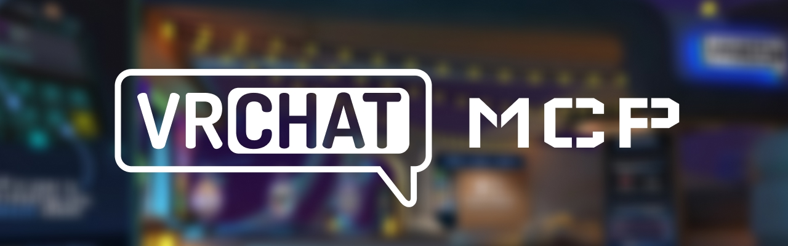

[](https://badge.fury.io/js/vrchat-mcp) [](https://opensource.org/licenses/MIT)

このプロジェクトは、VRChat APIと対話するためのModel Context Protocol (MCP)サーバーです。標準化されたプロトコルを使用してVRChatからさまざまな情報を取得することができます。

<a href="https://youtu.be/0MRxhzlFCkw">
  
</a>

<a href="https://glama.ai/mcp/servers/u763zoyi5a">
  
</a>

## 概要

VRChat MCPサーバーは、VRChatのAPIエンドポイントに構造化された方法でアクセスする手段を提供します。ユーザー認証、ユーザーおよびフレンド情報の取得、アバターやワールドデータへのアクセスなど、幅広い機能をサポートしています。

## 使用方法

サーバーを起動するには、必要な環境変数を設定してください：

```bash
export VRCHAT_USERNAME=your_username
export VRCHAT_AUTH_TOKEN=your_auth_token
```

> [!NOTE]
> #### AUTH TOKEN の取得方法
>
> 以下のコマンドで簡易ログインができ、authトークンを取得できます：
> ```
> $ npx vrchat-auth-token-checker
>
> VRChat Username: your-username
> Password: ********
>
> # If 2FA is enabled
> 2FA Code: 123456
>
> # Success output
> Auth Token: authcookie-xxxxx
> ```
> [コマンドのソースコード](https://github.com/sawa-zen/vrchat-auth-token-checker)
>
> **取得したトークンのライフタイムは非常に長いため慎重に扱ってください**

その後、以下のコマンドを実行します：

```bash
npx vrchat-mcp
```

これによりMCPサーバーが起動し、定義されたツールを通じてVRChat APIと対話できるようになります。

## Claude Desktopでの使用方法

Claude Desktopを起動する前に設定ファイルに以下の設定を追加してください。設定ファイルの json の場所は各OS以下のようになっています。

- MacOS: `~/Library/Application Support/Claude/claude_desktop_config.json`
- Windows: `%APPDATA%\Claude\claude_desktop_config.json`

```json
{
  "mcpServers": {
    "vrchat-mcp": {
      "command": "npx",
      "args": ["vrchat-mcp"],
      "env": {
        "VRCHAT_USERNAME": "your-username",
        "VRCHAT_AUTH_TOKEN": "your-auth-token"
      }
    }
  }
}
```

その後 Claude Desktop を起動してください。nodenvやnvmを使用している場合は、`npx`コマンドのフルパスを指定する必要があるかもしれません。

## 使用可能ツール

このModel Context Protocolサーバーは、以下のVRChat関連ツールを提供します：

### ユーザー関連
- vrchat_get_friends_list: フレンドリストの取得
- vrchat_send_friend_request: フレンドリクエストの送信

### アバター関連
- vrchat_search_avatars: アバターの検索
- vrchat_select_avatar: アバターの選択

### ワールド関連
- vrchat_search_worlds: ワールドの検索
- vrchat_list_favorited_worlds: お気に入りワールドの取得

### インスタンス関連
- vrchat_create_instance: インスタンスの作成
- vrchat_get_instance: インスタンス情報の取得

### グループ関連
- vrchat_search_groups: グループの検索
- vrchat_join_group: グループへの参加

### お気に入り関連
- vrchat_list_favorites: お気に入り一覧の取得
- vrchat_add_favorite: お気に入りの追加
- vrchat_list_favorite_groups: お気に入りグループ一覧の取得

### 招待関連
- vrchat_list_invite_messages: 招待メッセージ一覧の取得
- vrchat_request_invite: 招待リクエストの送信
- vrchat_get_invite_message: 招待メッセージの取得

### 通知関連
- vrchat_get_notifications: 通知リストの取得

## デバッグ

まず、プロジェクトをビルドします：

```bash
npm install
npm run build
```

MCP サーバーは stdio を介して実行されるため、デバッグが難しい場合があります。最適なデバッグ体験のために、MCP Inspector の使用を強く推奨します。

以下のコマンドで npm を通じて MCP Inspector を起動できます：

```bash
npx @modelcontextprotocol/inspector "./dist/main.js"
```

環境変数が適切に設定されていることを確認してください。

起動すると、Inspector はブラウザでアクセスできる URL を表示します。この URL にアクセスしてデバッグを開始できます。

## パッケージの公開

パッケージを公開するには、以下の手順に従ってください：

1. mainブランチの最新コードをローカルにpullする
   ```bash
   git checkout main
   git pull origin main
   ```

2. ビルドを実行する
   ```bash
   npm run build
   ```

4. npmにパッケージを公開する
   ```bash
   npm publish
   ```

5. 変更をリモートリポジトリにプッシュする
   ```bash
   git push origin main --tags
   ```

## コントリビューション

コントリビューションを歓迎します！改善やバグ修正のためのプルリクエストを提出する場合は、リポジトリをフォークしてください。

## ライセンス

このプロジェクトはMITライセンスの下で提供されています。詳細については、LICENSEファイルを参照してください。
