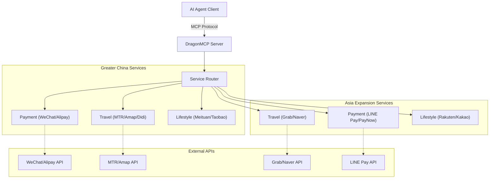

<div align="center">
  

  # DragonMCP

  **Das Nervenzentrum für Chinesische Local Life Agents**

  [English](README.md) | [简体中文](README_zh-CN.md) | [日本語](README_ja.md) | [한국어](README_ko.md) | [Français](README_fr.md) | [Deutsch](README_de.md)

  Lassen Sie Claude / DeepSeek / Qwen direkt Ihr Essen bestellen, ein DiDi rufen, Hochgeschwindigkeitszugtickets prüfen und Stromrechnungen bezahlen.

  [Produktanforderungen (PRD)](.trae/documents/dragon_mcp_prd.md) • [Architektur](.trae/documents/dragon_mcp_technical_architecture.md) • [Mitwirken](#-contributing--mitwirken)

  [](https://opensource.org/licenses/MIT)
  [](https://www.typescriptlang.org/)
  [](https://modelcontextprotocol.io/)
  [](https://nodejs.org/)
  [](https://github.com/arthurpanhku/DragonMCP/pulls)
</div>

---

## 🌟 Was ist DragonMCP?

DragonMCP ist ein Model Context Protocol (MCP) Server, der entwickelt wurde, um die Lücke zwischen KI-Agenten und lokalen Lebensdiensten in **Greater China (Festlandchina, Hongkong) und Asien** zu schließen.

Es zielt darauf ab, das "letzte Meile"-Problem zwischen KI-Agenten und realen Diensten zu lösen.

---

## 🔥 Live-Demo: MTR Echtzeit-Fahrplan

Wir haben das **MTR (Mass Transit Railway) Abfragetool** als unser erstes MVP implementiert. KI-Agenten können nun Echtzeit-Zugfahrpläne direkt von der offenen API der MTR abrufen.

**Szenario**:
> Benutzer: "Wann fährt der nächste Zug von Admiralty nach Central?"

**Agenten-Antwort**:
> "Next Island Line train from Admiralty to Central (towards Kennedy Town):
> - Arriving in: 2 min(s) (10:30:00)
> - Subsequent trains: 5 min(s) (10:33:00)"

*(Probieren Sie es selbst aus, indem Sie DragonMCP mit Ihrem MCP-Client verbinden!)*

---

## 🛠️ Unterstützte Dienste (Beta)

Wir erweitern aktiv unsere Unterstützung für lokale Dienste. Hier sind die derzeit integrierten Schnittstellen (einige sind Mocks/Platzhalter für die Entwicklung):

| Region                | Kategorie     | Dienst               | Tool-Name                | Beschreibung                                 | Status |
| :-------------------- | :------------ | :------------------- | :----------------------- | :------------------------------------------- | :----- |
| **Greater China**     | **Reisen**    | **MTR (HK)**         | `search_mtr_schedule`    | Echtzeit-Zugfahrplan (Island/Tsuen Wan Line) | ✅ Live |
|                       |               | **Amap (Gaode)**     | `amap_search_poi`        | POI-Suche (Restaurants, Hotels, etc.)        | ✅ Live |
|                       |               | **Amap (Gaode)**     | `amap_walking_direction` | Fußgängerroutenplanung                       | ✅ Live |
|                       |               | **DiDi**             | `book_taxi_didi`         | Preisschätzung und Fahrtbuchung              | 🚧 Mock |
|                       | **Zahlung**   | **WeChat Pay**       | `wechat_pay_create`      | Zahlungsauftrag erstellen                    | 🚧 Mock |
|                       |               | **Alipay**           | `alipay_pay_create`      | Zahlungsauftrag erstellen                    | 🚧 Mock |
|                       | **Lifestyle** | **Meituan**          | `meituan_search_food`    | Suche nach Essenslieferung                   | 🚧 Mock |
|                       | **Shopping**  | **Taobao**           | `taobao_search_product`  | Produktsuche                                 | 🚧 Mock |
| **Asien Erweiterung** | **Reisen**    | **Grab (SG/SEA)**    | `book_ride_grab`         | Fahrt schätzen und buchen                    | 🚧 Mock |
|                       |               | **Naver Maps (KR)**  | `naver_map_search`       | Ortssuche in Korea                           | 🚧 Mock |
|                       | **Zahlung**   | **LINE Pay (JP/TW)** | `line_pay_request`       | Zahlung anfordern                            | 🚧 Mock |

---

## ⚠️ Sicherheit & Haftungsausschluss

> **WICHTIG**: Dieses Projekt enthält Mock-Implementierungen für sensible Dienste wie Zahlungen (WeChat Pay, Alipay) und Fahrdienste (DiDi).

*   **Verwenden Sie NICHT** echte Finanzdaten oder persönliche Zugangsdaten in der aktuellen Version.
*   Die Zahlungstools (`wechat_pay_create`, `alipay_pay_create`) geben derzeit nur **gefälschte Daten** zu Demonstrationszwecken zurück. Es wird kein echtes Geld überwiesen.
*   Bei der Integration echter APIs in der Zukunft müssen Sie strenge Sicherheitsprotokolle (OAuth, HTTPS, Token-Management) befolgen.

---

## 🏗️ Architektur

DragonMCP fungiert als Middleware zwischen KI-Agenten und verschiedenen lokalen Dienst-APIs.



Weitere Details finden Sie im [Technischen Architekturdokument](.trae/documents/dragon_mcp_technical_architecture.md).

---

## 🗺️ Roadmap & Funktionen

### Phase 1: MVP (Aktuell)
- [x] **Kernframework**: Express + MCP SDK + TypeScript Setup.
- [x] **Reisen (MTR)**: Echtzeit-Fahrplanabfrage für Island Line & Tsuen Wan Line.
- [x] **Reisen (Amap)**: POI-Suche und Fußgängernavigation.
- [x] **Service Mocks**: Grundstruktur für WeChat/Alipay/DiDi/Meituan/Taobao.
- [ ] **Essenslieferung (Demo)**: Simulation des Bestellprozesses (Shop-Suche -> Menü -> Warenkorb).
- [ ] **Grundkonfiguration**: Umgebungsvariablen & Projektstruktur.

### Phase 2: Asien Erweiterung (Neu!)
- [x] **Struktur-Setup**: Service-Verzeichnisse für Singapur (Grab), Japan (LINE), Korea (Naver).
- [x] **Initiale Mocks**: Grab Fahrtbuchung, LINE Pay Anfrage, Naver Maps Suche.
- [ ] **Echte API-Integration**: Ersetzen von Mocks durch echte APIs (Grab Developer, LINE Pay API).
- [ ] **Mehr Dienste**: Kakao Pay (KR), Yahoo! Transit (JP), EZ-Link (SG).

### Phase 3: Ökosystem
- [ ] **Plugin-System**: Ermöglicht der Community, einzelne Diensttools beizutragen.
- [ ] **Benutzerauthentifizierung**: Sichere Benutzertokenverwaltung für persönliche Dienste.

---

## 🚀 Erste Schritte

### Voraussetzungen
*   Node.js >= 18
*   npm oder yarn

### Installation

1.  Repository klonen:
    ```bash
    git clone https://github.com/arthurpanhku/DragonMCP.git
    cd DragonMCP
    ```

2.  Abhängigkeiten installieren:
    ```bash
    npm install
    ```

3.  Umgebungsvariablen konfigurieren:
    ```bash
    cp .env.example .env
    # Bearbeiten Sie .env (AMAP_API_KEY für Kartendienste erforderlich)
    ```

### Server starten

Starten Sie den Entwicklungsserver mit SSE-Unterstützung:

```bash
npm run dev
```

Der Server startet unter `http://localhost:3000`.
SSE-Endpunkt: `http://localhost:3000/mcp/sse`

### Verbindung zu Claude Desktop

Fügen Sie Folgendes zu Ihrer `claude_desktop_config.json` hinzu:

```json
{
  "mcpServers": {
    "DragonMCP": {
      "command": "node",
      "args": ["/path/to/DragonMCP/dist/server.js"], 
      "env": {
        "NODE_ENV": "production"
      }
    }
  }
}
```
*(Hinweis: Für die lokale Entwicklung müssen Sie möglicherweise zuerst bauen oder auf den ts-node Wrapper verweisen)*

---

## ❓ FAQ & Fehlerbehebung

### F: Warum erhalte ich "Station not found" für die MTR-Abfrage?
A: Derzeit werden nur **Island Line** und **Tsuen Wan Line** unterstützt. Bitte überprüfen Sie, ob der Stationsname korrekt geschrieben ist (z. B. "Admiralty", "Central", "Mong Kok").

### F: Wie erhalte ich einen Amap (Gaode) API-Schlüssel?
A: Sie müssen sich auf der [Amap Open Platform](https://lbs.amap.com/) registrieren, eine "Web Service"-Anwendung erstellen und den Schlüssel als `AMAP_API_KEY` in Ihre `.env`-Datei kopieren.

### F: Kann ich dies für echte Zahlungen verwenden?
A: **Nein.** Die aktuellen Zahlungstools sind Mocks. Verwenden Sie sie nicht für echte Transaktionen.

---

## 🧪 Testen

Führen Sie Unit- und Integrationstests aus:

```bash
# Experimentelle VM-Module für Jest aktivieren (ESM-Unterstützung)
NODE_OPTIONS="$NODE_OPTIONS --experimental-vm-modules" npm test
```

---

## 🤝 Mitwirken

Wir begrüßen alle Beiträge! Egal ob Entwickler, Designer oder Produktvordenker.

### Wir brauchen Hilfe bei:
1.  **Playwright Skripte**: Simulation von Web-Flows für Essensliefer-Apps (Meituan/Ele.me).
2.  **Mehr MTR-Linien**: Hinzufügen von Stationsdaten für East Rail Line, Tuen Ma Line, usw.
3.  **Echte API-Integration**: Ersetzen von Mocks durch echte APIs für WeChat/Alipay/DiDi.

Siehe [CONTRIBUTING.md](CONTRIBUTING.md) (Demnächst) für Details.

---

## 🙏 Danksagung

*   **Anthropic**: Für die Erstellung des Model Context Protocol (MCP).
*   **MTR Corporation**: Für die Bereitstellung der Open Data API.
*   **Amap (Gaode)**: Für die Karten- und POI-Dienste.

---

## 📄 Lizenz

Dieses Projekt ist unter der MIT-Lizenz lizenziert - siehe die [LICENSE](LICENSE) Datei für Details.
