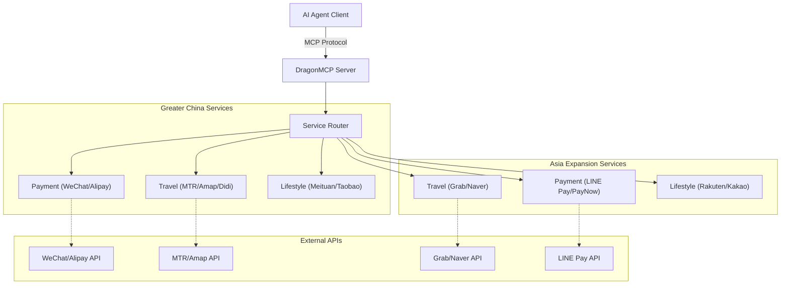

<div align="center">
  

  # DragonMCP

  **中文生活 Agent 的神经中枢**

  [English](README.md) | [简体中文](README_zh-CN.md) | [日本語](README_ja.md) | [한국어](README_ko.md) | [Français](README_fr.md) | [Deutsch](README_de.md)

  让 Claude / DeepSeek / Qwen 直接帮你点外卖、叫滴滴、查高铁余票、缴水电费。

  [产品需求文档 (PRD)](.trae/documents/dragon_mcp_prd.md) • [技术架构](.trae/documents/dragon_mcp_technical_architecture.md) • [贡献指南](#-contributing--贡献指南)

  [](https://opensource.org/licenses/MIT)
  [](https://www.typescriptlang.org/)
  [](https://modelcontextprotocol.io/)
  [](https://nodejs.org/)
  [](https://github.com/arthurpanhku/DragonMCP/pulls)
</div>

---

## 🌟 项目简介

DragonMCP 是一个专为 AI Agent 设计的 Model Context Protocol (MCP) 服务器，旨在打通 AI Agent 与**大中华区（中国内地、香港）及亚洲地区**本地生活服务之间的最后一公里。

---

## 🔥 实战演示：港铁实时班次

作为第一个 MVP（最小可行性产品），我们已经实现了**港铁（MTR）实时查询工具**。AI Agent 现在可以直接调用港铁开放 API 获取实时列车班次。

**场景**:
> 用户：“从金钟到中环的下一班车还有多久？”

**Agent 回复**:
> "Next Island Line train from Admiralty to Central (towards Kennedy Town):
> - Arriving in: 2 min(s) (10:30:00)
> - Subsequent trains: 5 min(s) (10:33:00)"

*(快连接 DragonMCP 亲自试一试吧！)*

---

## 🛠️ 支持的服务 (Beta)

我们正在积极拓展本地生活服务的支持。以下是目前已集成的接口（部分为开发用的 Mock/占位符）：

| 区域         | 分类     | 服务商                | 工具名称                 | 描述                           | 状态     |
| :----------- | :------- | :-------------------- | :----------------------- | :----------------------------- | :------- |
| **大中华区** | **出行** | **港铁 (MTR)**        | `search_mtr_schedule`    | 实时列车时刻表 (港岛线/荃湾线) | ✅ 已上线 |
|              |          | **高德地图**          | `amap_search_poi`        | 搜索 POI (餐厅、酒店等)        | ✅ 已上线 |
|              |          | **高德地图**          | `amap_walking_direction` | 步行路径规划                   | ✅ 已上线 |
|              |          | **高德地图**          | `amap_driving_direction` | 驾车路径规划 (最快)            | ✅ 已上线 |
|              |          | **高德地图**          | `amap_transit_direction` | 公交路径规划 (综合)            | ✅ 已上线 |
|              | **气象** | **香港天文台**        | `hk_weather_current`     | 香港实时天气报告               | ✅ 已上线 |
|              | **出行** | **滴滴出行**          | `book_taxi_didi`         | 预估价格并叫车                 | 🚧 模拟中 |
|              | **支付** | **微信支付**          | `wechat_pay_create`      | 创建支付订单                   | 🚧 模拟中 |
|              |          | **支付宝**            | `alipay_pay_create`      | 创建支付订单                   | 🚧 模拟中 |
|              | **生活** | **美团**              | `meituan_search_food`    | 搜索外卖美食                   | 🚧 模拟中 |
|              | **购物** | **淘宝**              | `taobao_search_product`  | 搜索商品                       | 🚧 模拟中 |
| **亚洲扩展** | **出行** | **Grab (新马泰)**     | `book_ride_grab`         | 预估价格并叫车                 | 🚧 模拟中 |
|              |          | **Naver Maps (韩国)** | `naver_map_search`       | 搜索韩国地点                   | 🚧 模拟中 |
|              | **支付** | **LINE Pay (日台泰)** | `line_pay_request`       | 发起支付请求                   | 🚧 模拟中 |

---

## ⚠️ 安全与免责声明

> **重要提示**: 本项目包含支付（微信、支付宝）和打车（滴滴）等敏感服务的 Mock 实现。

*   **请勿** 在当前版本中使用真实的财务数据或个人凭证。
*   支付工具 (`wechat_pay_create`, `alipay_pay_create`) 目前仅返回用于演示的 **虚假数据**。不会发生真实的资金转账。
*   未来集成真实 API 时，请务必遵守严格的安全协议（OAuth, HTTPS, Token 管理）。

---

## 🏗️ 架构设计

DragonMCP 作为 AI Agent 与各类本地服务 API 之间的中间件。



更多详情请参阅 [技术架构文档](.trae/documents/dragon_mcp_technical_architecture.md)。

---

## 🗺️ 路线图与功能

### 第一阶段：MVP（进行中）
- [x] **核心框架**: Express + MCP SDK + TypeScript 配置。
- [x] **出行 (MTR)**: 港岛线与荃湾线实时班次查询。
- [x] **出行 (高德)**: POI 搜索与步行导航。
- [x] **服务模拟**: 微信/支付宝/滴滴/美团/淘宝的基础结构。
- [ ] **外卖 (Demo)**: 模拟点单流程（搜店 -> 选品 -> 购物车）。
- [ ] **基础配置**: 环境变量与项目结构。

### 第二阶段：亚洲扩展（新增！）
- [x] **结构搭建**: 新加坡 (Grab)、日本 (LINE)、韩国 (Naver) 的服务目录。
- [x] **初步模拟**: Grab 叫车、LINE Pay 支付、Naver 地图搜索的 Mock 实现。
- [ ] **真实集成**: 用真实 API 替换 Mock（Grab Developer, LINE Pay API）。
- [ ] **更多服务**: Kakao Pay (韩国)、Yahoo! 换乘案内 (日本)、EZ-Link (新加坡)。

### 第三阶段：生态
- [ ] **插件系统**: 允许社区贡献独立服务工具。
- [ ] **用户鉴权**: 个人服务的安全令牌管理。

---

## 🚀 快速开始

### 前置要求
*   Node.js >= 18
*   npm 或 yarn

### 安装

1.  克隆仓库:
    ```bash
    git clone https://github.com/arthurpanhku/DragonMCP.git
    cd DragonMCP
    ```

2.  安装依赖:
    ```bash
    npm install
    ```

3.  配置环境变量:
    ```bash
    cp .env.example .env
    # 编辑 .env (地图服务需要 AMAP_API_KEY)
    ```

### 运行服务器

启动支持 SSE 的开发服务器:

```bash
npm run dev
```

服务器将在 `http://localhost:3000` 启动。
SSE 端点: `http://localhost:3000/mcp/sse`

### 使用 Docker 运行

1.  构建并启动容器:
    ```bash
    docker-compose up -d --build
    ```

2.  查看日志:
    ```bash
    docker-compose logs -f
    ```

3.  停止服务器:
    ```bash
    docker-compose down
    ```

### 连接到 Claude Desktop

在您的 `claude_desktop_config.json` 中添加以下内容：

```json
{
  "mcpServers": {
    "DragonMCP": {
      "command": "node",
      "args": ["/path/to/DragonMCP/dist/server.js"], 
      "env": {
        "NODE_ENV": "production"
      }
    }
  }
}
```
*(注意：本地开发可能需要先构建或指向 ts-node 包装器)*

---

## ❓ 常见问题 (FAQ)

### Q: 为什么 MTR 查询显示 "Station not found"？
A: 目前仅支持 **港岛线** 和 **荃湾线**。请检查站名拼写是否正确（如 "Admiralty", "金钟", "Mong Kok", "旺角"）。

### Q: 如何获取高德地图 (Amap) API Key？
A: 您需要在 [高德开放平台](https://lbs.amap.com/) 注册，创建“Web服务”应用，并将 Key 复制到 `.env` 文件的 `AMAP_API_KEY` 字段中。

### Q: 我可以用它进行真实支付吗？
A: **不行。** 目前的支付工具仅为 Mock（模拟）实现。请勿用于真实交易。

---

## 🧪 测试

运行单元测试和集成测试:

```bash
# 开启 Jest 的实验性 VM 模块支持以兼容 ESM
NODE_OPTIONS="$NODE_OPTIONS --experimental-vm-modules" npm test
```

---

## 🤝 贡献指南

我们热烈欢迎所有贡献！无论你是开发者、设计师还是产品思考者。

### 我们急需：
1.  **Playwright 脚本**: 模拟外卖平台（美团/饿了么）网页流程。
2.  **更多地铁线路**: 补充东铁线、屯马线等站点数据。
3.  **真实 API 集成**: 替换微信/支付宝/滴滴的 Mock 实现。

详情请参阅 [CONTRIBUTING.md](CONTRIBUTING.md)（即将推出）。

---

## 🙏 致谢

*   **Anthropic**: 创建了 Model Context Protocol (MCP)。
*   **MTR Corporation**: 提供了开放数据 API。
*   **高德地图 (Amap)**: 提供了地图和 POI 服务。

---

## 📄 许可证

本项目采用 MIT 许可证 - 详情请参阅 [LICENSE](LICENSE) 文件。
