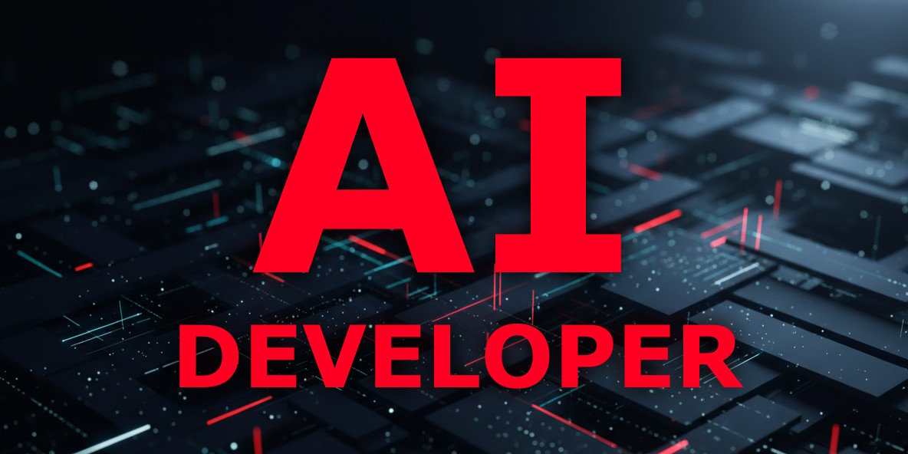
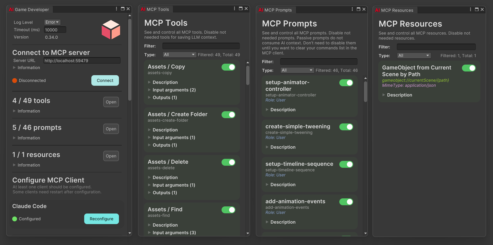

<div align="center" width="100%">
  <h1>✨ AI Game Developer — <i>Unity MCP</i></h1>

[](https://modelcontextprotocol.io/introduction)
[](https://openupm.com/packages/com.ivanmurzak.unity.mcp/)
[](https://hub.docker.com/r/ivanmurzakdev/unity-mcp-server)
[](https://unity.com/releases/editor/archive)
[](https://unity.com/releases/editor/archive)
[](https://github.com/IvanMurzak/Unity-MCP/actions/workflows/release.yml)</br>
[](https://discord.gg/cfbdMZX99G)
[](https://openupm.com/packages/com.ivanmurzak.unity.mcp/)
[](https://github.com/IvanMurzak/Unity-MCP/stargazers)
[](https://github.com/IvanMurzak/Unity-MCP/blob/main/LICENSE)
[](https://stand-with-ukraine.pp.ua)

  

  <p>
    <a href="https://claude.ai/download"></a>&nbsp;&nbsp;
    <a href="https://openai.com/index/introducing-codex/"></a>&nbsp;&nbsp;
    <a href="https://www.cursor.com/"></a>&nbsp;&nbsp;
    <a href="https://code.visualstudio.com/docs/copilot/overview"></a>&nbsp;&nbsp;
    <a href="https://gemini.google.com/"></a>&nbsp;&nbsp;
    <a href="https://antigravity.google/"></a>&nbsp;&nbsp;
    <a href="https://code.visualstudio.com/"></a>&nbsp;&nbsp;
    <a href="https://www.jetbrains.com/rider/"></a>&nbsp;&nbsp;
    <a href="https://visualstudio.microsoft.com/"></a>&nbsp;&nbsp;
    <a href="https://github.com/anthropics/claude-code"></a>&nbsp;&nbsp;
    <a href="https://github.com/cline/cline"></a>&nbsp;&nbsp;
    <a href="https://github.com/Kilo-Org/kilocode"></a>
  </p>

  <b>[中文](README.zh-CN.md) | [日本語](README.ja.md) | [Español](README.es.md)</b>

</div>

`Unity MCP` is an AI-powered game development assistant **for Editor & Runtime**. Connect **Claude**, **Cursor**, & **Windsurf** to Unity via MCP. Automate workflows, generate code, and **enable AI within your games**.

Unlike other tools, this plugin works **inside your compiled game**, allowing for real-time AI debugging and player-AI interaction.

> **[💬 Join our Discord Server](https://discord.gg/cfbdMZX99G)** - Ask questions, showcase your work, and connect with other developers!

## 

- ✔️ **AI agents** - Use the best agents from **Anthropic**, **OpenAI**, **Microsoft**, or any other provider with no limits
- ✔️ **TOOLS** - A wide range of default [MCP Tools](default-mcp-tools.md) for operating in Unity Editor
- ✔️ **SKILLS** - Automatically generates skills for each MCP tool
- ✔️ **Code and Tests** - Ask AI to write code and run tests
- ✔️ **Runtime (in-game)** - Use LLMs directly inside your compiled game for dynamic NPC behavior or debugging
- ✔️ **Debug support** - Ask AI to get logs and fix errors
- ✔️ **Natural conversation** - Chat with AI like you would with a human
- ✔️ **Flexible deployment** - Works locally (stdio) and remotely (http) via configuration
- ✔️ **Extensible** - Create [custom MCP Tools in your project code](#add-custom-mcp-tool)

[](https://github.com/IvanMurzak/Unity-MCP/releases/latest/download/AI-Game-Dev-Installer.unitypackage)




# Quick Start

Get up and running in three steps:

1. **[Install the Plugin](#step-1-install-unity-mcp-plugin)** — download the `.unitypackage` installer or run `openupm add com.ivanmurzak.unity.mcp`
   > **Alternative:** `npx unity-mcp-cli install-plugin ./MyUnityProject` — see [CLI documentation](https://github.com/IvanMurzak/Unity-MCP/blob/main/cli/README.md)
2. **[Pick an MCP Client](#step-2-install-mcp-client)** — Claude Code, Claude Desktop, GitHub Copilot, Cursor, or any other
3. **[Configure the client](#step-3-configure-mcp-client)** — open `Window/AI Game Developer — MCP` in Unity and click **Configure**

That's it. Ask your AI *"Create 3 cubes in a circle with radius 2"* and watch it happen. ✨

---

# Tools Reference

The plugin ships with 50+ built-in tools across three categories. All tools are available immediately after installation — no extra configuration required. See [default-mcp-tools.md](default-mcp-tools.md) for the full reference with detailed descriptions.

<details>
  <summary>Project & Assets</summary>

- `assets-copy` - Copy the asset at path and stores it at newPath
- `assets-create-folder` - Creates a new folder in the specified parent folder
- `assets-delete` - Delete the assets at paths from the project
- `assets-find` - Search the asset database using the search filter string
- `assets-find-built-in` - Search the built-in assets of the Unity Editor
- `assets-get-data` - Get asset data from the asset file including all serializable fields and properties
- `assets-material-create` - Create new material asset with default parameters
- `assets-modify` - Modify asset file in the project
- `assets-move` - Move the assets at paths in the project (also used for rename)
- `assets-prefab-close` - Close currently opened prefab
- `assets-prefab-create` - Create a prefab from a GameObject in the current active scene
- `assets-prefab-instantiate` - Instantiates prefab in the current active scene
- `assets-prefab-open` - Open prefab edit mode for a specific GameObject
- `assets-prefab-save` - Save a prefab in prefab editing mode
- `assets-refresh` - Refreshes the AssetDatabase
- `assets-shader-list-all` - List all available shaders in the project assets and packages
- `package-add` - Install a package from the Unity Package Manager registry, Git URL, or local path
- `package-list` - List all packages installed in the Unity project (UPM packages)
- `package-remove` - Remove (uninstall) a package from the Unity project
- `package-search` - Search for packages in both Unity Package Manager registry and installed packages

</details>

<details>
  <summary>Scene & Hierarchy</summary>

- `gameobject-component-add` - Add Component to GameObject
- `gameobject-component-destroy` - Destroy one or many components from target GameObject
- `gameobject-component-get` - Get detailed information about a specific Component on a GameObject
- `gameobject-component-list-all` - List C# class names extended from UnityEngine.Component
- `gameobject-component-modify` - Modify a specific Component on a GameObject
- `gameobject-create` - Create a new GameObject in opened Prefab or in a Scene
- `gameobject-destroy` - Destroy GameObject and all nested GameObjects recursively
- `gameobject-duplicate` - Duplicate GameObjects in opened Prefab or in a Scene
- `gameobject-find` - Finds specific GameObject by provided information
- `gameobject-modify` - Modify GameObjects and/or attached component's fields and properties
- `gameobject-set-parent` - Set parent GameObject to list of GameObjects
- `object-get-data` - Get data of the specified Unity Object
- `object-modify` - Modify the specified Unity Object
- `scene-create` - Create new scene in the project assets
- `scene-get-data` - Retrieves the list of root GameObjects in the specified scene
- `scene-list-opened` - Returns the list of currently opened scenes in Unity Editor
- `scene-open` - Open scene from the project asset file
- `scene-save` - Save opened scene to the asset file
- `scene-set-active` - Set the specified opened scene as the active scene
- `scene-unload` - Unload scene from the opened scenes in Unity Editor
- `screenshot-camera` - Captures a screenshot from a camera and returns it as an image
- `screenshot-game-view` - Captures a screenshot from the Unity Editor Game View
- `screenshot-scene-view` - Captures a screenshot from the Unity Editor Scene View

</details>

<details>
  <summary>Scripting & Editor</summary>

- `console-get-logs` - Retrieves Unity Editor logs with filtering options
- `editor-application-get-state` - Returns information about the Unity Editor application state (playmode, paused, compilation)
- `editor-application-set-state` - Control the Unity Editor application state (start/stop/pause playmode)
- `editor-selection-get` - Get information about the current Selection in the Unity Editor
- `editor-selection-set` - Set the current Selection in the Unity Editor
- `reflection-method-call` - Call any C# method with input parameters and return results
- `reflection-method-find` - Find method in the project using C# Reflection (even private methods)
- `script-delete` - Delete the script file(s)
- `script-execute` - Compiles and executes C# code dynamically using Roslyn
- `script-read` - Reads the content of a script file
- `script-update-or-create` - Updates or creates script file with the provided C# code
- `tests-run` - Execute Unity tests (EditMode/PlayMode) with filtering and detailed results

</details>

#### Additional tools

Install extensions when need more tools or [create your own](#add-custom-mcp-tool).

- [Animation](https://github.com/IvanMurzak/Unity-AI-Animation/)
- [ParticleSystem](https://github.com/IvanMurzak/Unity-AI-ParticleSystem/)
- [ProBuilder](https://github.com/IvanMurzak/Unity-AI-ProBuilder/)


# Contents

- [Quick Start](#quick-start)
- [Tools Reference](#tools-reference)
      - [Additional tools](#additional-tools)
- [Contents](#contents)
  - [More Documentation](#more-documentation)
- [Installation](#installation)
  - [Step 1: Install `Unity MCP Plugin`](#step-1-install-unity-mcp-plugin)
    - [Option 1 - Installer](#option-1---installer)
    - [Option 2 - OpenUPM-CLI](#option-2---openupm-cli)
    - [Option 3 - CLI](#option-3---cli)
  - [Step 2: Install `MCP Client`](#step-2-install-mcp-client)
  - [Step 3: Configure `MCP Client`](#step-3-configure-mcp-client)
    - [Automatic configuration](#automatic-configuration)
    - [Manual configuration](#manual-configuration)
      - [Command line configuration](#command-line-configuration)
- [AI Workflow Examples: Claude \& Gemini](#ai-workflow-examples-claude--gemini)
  - [Advanced Features for LLM](#advanced-features-for-llm)
    - [Core Capabilities](#core-capabilities)
    - [Reflection-Powered Features](#reflection-powered-features)
- [Customize MCP](#customize-mcp)
  - [Add custom `MCP Tool`](#add-custom-mcp-tool)
  - [Add custom `MCP Prompt`](#add-custom-mcp-prompt)
- [Runtime usage (in-game)](#runtime-usage-in-game)
  - [Sample: AI powered Chess game bot](#sample-ai-powered-chess-game-bot)
  - [Why runtime usage is needed?](#why-runtime-usage-is-needed)
- [Unity `MCP Server` setup](#unity-mcp-server-setup)
  - [Variables](#variables)
  - [Plugin Variables](#plugin-variables)
  - [Docker 📦](#docker-)
    - [`streamableHttp` Transport](#streamablehttp-transport)
    - [`stdio` Transport](#stdio-transport)
    - [Custom `port`](#custom-port)
  - [Binary executable](#binary-executable)
- [How Unity MCP Architecture Works](#how-unity-mcp-architecture-works)
  - [What is `MCP`](#what-is-mcp)
  - [What is `MCP Client`](#what-is-mcp-client)
  - [What is `MCP Server`](#what-is-mcp-server)
  - [What is `MCP Tool`](#what-is-mcp-tool)
    - [When to use `MCP Tool`](#when-to-use-mcp-tool)
  - [What is `MCP Resource`](#what-is-mcp-resource)
    - [When to use `MCP Resource`](#when-to-use-mcp-resource)
  - [What is `MCP Prompt`](#what-is-mcp-prompt)
    - [When to use `MCP Prompt`](#when-to-use-mcp-prompt)
- [Contribution 💙💛](#contribution-)

## More Documentation

| Document | Description |
| -------- | ----------- |
| [Default MCP Tools](default-mcp-tools.md) | Full reference of all built-in tools with descriptions |
| [MCP Server Setup](mcp-server.md) | Server configuration, environment variables, remote hosting |
| [Docker Deployment](DOCKER_DEPLOYMENT.md) | Step-by-step Docker deployment guide |
| [Development Guide](dev/Development.md) | Architecture, code style, CI/CD — for contributors |
| [Wiki](https://github.com/IvanMurzak/Unity-MCP/wiki) | Getting started, tutorials, API reference, FAQ |
| [CLI Tool](https://github.com/IvanMurzak/Unity-MCP/blob/main/cli/README.md) | Install plugins, configure, and connect via command line |


# Installation

## Step 1: Install `Unity MCP Plugin`

<details>
  <summary><b>⚠️ Requirements (click)</b></summary>

> [!IMPORTANT]
> **Project path cannot contain spaces**
>
> - ✅ `C:/MyProjects/Project`
> - ❌ `C:/My Projects/Project`

</details>

### Option 1 - Installer

- **[⬇️ Download Installer](https://github.com/IvanMurzak/Unity-MCP/releases/latest/download/AI-Game-Dev-Installer.unitypackage)**
- **📂 Import installer into Unity project**
  > - You can double-click on the file - Unity will open it automatically
  > - OR: Open Unity Editor first, then click on `Assets/Import Package/Custom Package`, and choose the file

### Option 2 - OpenUPM-CLI

- [⬇️ Install OpenUPM-CLI](https://github.com/openupm/openupm-cli#installation)
- 📟 Open the command line in your Unity project folder

```bash
openupm add com.ivanmurzak.unity.mcp
```

### Option 3 - CLI

Install the plugin via [`unity-mcp-cli`](https://github.com/IvanMurzak/Unity-MCP/blob/main/cli/README.md) — no Unity Editor needed:

```bash
npx unity-mcp-cli install-plugin ./MyUnityProject
```

Launch Unity with an active MCP connection:

```bash
npx unity-mcp-cli connect --path ./MyUnityProject --url http://localhost:8080
```

> See [full CLI documentation](https://github.com/IvanMurzak/Unity-MCP/blob/main/cli/README.md) for all available commands.

## Step 2: Install `MCP Client`

Choose a single `MCP Client` you prefer - you don't need to install all of them. This will be your main chat window to communicate with the LLM.

- [Claude Code](https://github.com/anthropics/claude-code) (highly recommended)
- [Claude Desktop](https://claude.ai/download)
- [GitHub Copilot in VS Code](https://code.visualstudio.com/docs/copilot/overview)
- [Antigravity](https://antigravity.google/)
- [Cursor](https://www.cursor.com/)
- [Windsurf](https://windsurf.com)
- Any other supported

> The MCP protocol is quite universal, which is why you may use any MCP client you prefer - it will work as smoothly as any other. The only important requirement is that the MCP client must support dynamic MCP Tool updates.

## Step 3: Configure `MCP Client`

### Automatic configuration

- Open Unity project
- Open `Window/AI Game Developer (Unity-MCP)`
- Click `Configure` at your MCP client


> If your MCP client is not in the list, use the raw JSON shown in the window to inject it into your MCP client. Read the instructions for your specific MCP client on how to do this.

### Manual configuration

If automatic configuration doesn't work for you for any reason, use the JSON from the `AI Game Developer (Unity-MCP)` window to configure any `MCP Client` manually.

#### Command line configuration

<details>
  <summary><b>Create <code>command</code></b></summary>

**1. Choose your `<command>` for your environment**

| Platform            | `<command>`                                                                                                 |
| ------------------- | ----------------------------------------------------------------------------------------------------------- |
| Windows x64         | `"<unityProjectPath>/Library/mcp-server/win-x64/unity-mcp-server.exe" port=<port> client-transport=stdio`   |
| Windows x86         | `"<unityProjectPath>/Library/mcp-server/win-x86/unity-mcp-server.exe" port=<port> client-transport=stdio`   |
| Windows arm64       | `"<unityProjectPath>/Library/mcp-server/win-arm64/unity-mcp-server.exe" port=<port> client-transport=stdio` |
| MacOS Apple-Silicon | `"<unityProjectPath>/Library/mcp-server/osx-arm64/unity-mcp-server" port=<port> client-transport=stdio`     |
| MacOS Apple-Intel   | `"<unityProjectPath>/Library/mcp-server/osx-x64/unity-mcp-server" port=<port> client-transport=stdio`       |
| Linux x64           | `"<unityProjectPath>/Library/mcp-server/linux-x64/unity-mcp-server" port=<port> client-transport=stdio`     |
| Linux arm64         | `"<unityProjectPath>/Library/mcp-server/linux-arm64/unity-mcp-server" port=<port> client-transport=stdio`   |

**2. Replace `<unityProjectPath>` with the full path to Unity project**

**3. Replace `<port>` with your port from AI Game Developer configuration**

**4. Add MCP server using command line**

</details>

<details>
  <summary> Gemini CLI</summary>

  ```bash
  gemini mcp add ai-game-developer <command>
  ```

  > Replace `<command>` from the table above
</details>

<details>
  <summary> Claude Code CLI</summary>

  ```bash
  claude mcp add ai-game-developer <command>
  ```

  > Replace `<command>` from the table above
</details>

<details>
  <summary> GitHub Copilot CLI</summary>

  ```bash
  copilot
  ```

  ```bash
  /mcp add
  ```

  Server name: `ai-game-developer`
  Server type: `local`
  Command: `<command>`
  > Replace `<command>` from the table above
</details>


# AI Workflow Examples: Claude & Gemini

Communicate with the AI (LLM) in your `MCP Client`. Ask it to do anything you want. The better you describe your task or idea, the better it will perform the job.

Some `MCP Clients` allow you to choose different LLM models. Pay attention to this feature, as some models may work much better than others.

**Example commands:**

```text
Explain my scene hierarchy
```

```text
Create 3 cubes in a circle with radius 2
```

```text
Create metallic golden material and attach it to a sphere gameObject
```

> Make sure `Agent` mode is turned on in your MCP client

## Advanced Features for LLM

Unity MCP provides advanced tools that enable the LLM to work faster and more effectively, avoiding mistakes and self-correcting when errors occur. Everything is designed to achieve your goals efficiently.

### Core Capabilities

- ✔️ **Agent-ready tools** - Find anything you need in 1-2 steps
- ✔️ **Instant compilation** - C# code compilation & execution using `Roslyn` for faster iteration
- ✔️ **Full asset access** - Read/write access to assets and C# scripts
- ✔️ **Intelligent feedback** - Well-described positive and negative feedback for proper issue understanding

### Reflection-Powered Features

- ✔️ **Object references** - Provide references to existing objects for instant C# code
- ✔️ **Project data access** - Get full access to entire project data in a readable format
- ✔️ **Granular modifications** - Populate & modify any piece of data in the project
- ✔️ **Method discovery** - Find any method in the entire codebase, including compiled DLL files
- ✔️ **Method execution** - Call any method in the entire codebase
- ✔️ **Advanced parameters** - Provide any property for method calls, even references to existing objects in memory
- ✔️ **Live Unity API** - Unity API instantly available - even when Unity changes, you get the fresh API
- ✔️ **Self-documenting** - Access human-readable descriptions of any `class`, `method`, or `property` via `Description` attributes


# Customize MCP

**[Unity MCP](https://github.com/IvanMurzak/Unity-MCP)** supports custom `MCP Tool`, `MCP Resource`, and `MCP Prompt` development by project owners. The MCP server takes data from the `Unity MCP Plugin` and exposes it to a client. Anyone in the MCP communication chain will receive information about new MCP features, which the LLM may decide to use at some point.

## Add custom `MCP Tool`

To add a custom `MCP Tool`, you need:

1. A class with the `McpPluginToolType` attribute
2. A method in the class with the `McpPluginTool` attribute
3. *Optional:* Add a `Description` attribute to each method argument to help the LLM understand it
4. *Optional:* Use `string? optional = null` properties with `?` and default values to mark them as `optional` for the LLM

> Note that the line `MainThread.Instance.Run(() =>` allows you to run code on the main thread, which is required for interacting with Unity's API. If you don't need this and running the tool in a background thread is acceptable, avoid using the main thread for efficiency purposes.

```csharp
[McpPluginToolType]
public class Tool_GameObject
{
    [McpPluginTool
    (
        "MyCustomTask",
        Title = "Create a new GameObject"
    )]
    [Description("Explain here to LLM what is this, when it should be called.")]
    public string CustomTask
    (
        [Description("Explain to LLM what is this.")]
        string inputData
    )
    {
        // do anything in background thread

        return MainThread.Instance.Run(() =>
        {
            // do something in main thread if needed

            return $"[Success] Operation completed.";
        });
    }
}
```

## Add custom `MCP Prompt`

`MCP Prompt` allows you to inject custom prompts into the conversation with the LLM. It supports two sender roles: User and Assistant. This is a quick way to instruct the LLM to perform specific tasks. You can generate prompts using custom data, providing lists or any other relevant information.

```csharp
[McpPluginPromptType]
public static class Prompt_ScriptingCode
{
    [McpPluginPrompt(Name = "add-event-system", Role = Role.User)]
    [Description("Implement UnityEvent-based communication system between GameObjects.")]
    public string AddEventSystem()
    {
        return "Create event system using UnityEvents, UnityActions, or custom event delegates for decoupled communication between game systems and components.";
    }
}
```


# Runtime usage (in-game)

Use **[Unity MCP](https://github.com/IvanMurzak/Unity-MCP)** in your game/app. Use Tools, Resources or Prompts. By default there are no tools, you would need to implement your custom.

```csharp
// Build MCP plugin
var mcpPlugin = UnityMcpPluginRuntime.Initialize(builder =>
    {
        builder.WithConfig(config =>
        {
            config.Host = "http://localhost:8080";
            config.Token = "your-token";
        });
        // Automatically register all tools from the current assembly
        builder.WithToolsFromAssembly(Assembly.GetExecutingAssembly());
    })
    .Build();

await mcpPlugin.Connect(); // Start active connection with retry to Unity-MCP-Server

await mcpPlugin.Disconnect(); // Stop active connection and close existed connection
```

## Sample: AI powered Chess game bot

There is a classic Chess game. Lets outsource to LLM the bot logic. Bot should do the turn using game rules.

```csharp
[McpPluginToolType]
public static class ChessGameAI
{
    [McpPluginTool("chess-do-turn", Title = "Do the turn")]
    [Description("Do the turn in the chess game. Returns true if the turn was accepted, false otherwise.")]
    public static Task<bool> DoTurn(int figureId, Vector2Int position)
    {
        return MainThread.Instance.RunAsync(() => ChessGameController.Instance.DoTurn(figureId, position));
    }

    [McpPluginTool("chess-get-board", Title = "Get the board")]
    [Description("Get the current state of the chess board.")]
    public static Task<BoardData> GetBoard()
    {
        return MainThread.Instance.RunAsync(() => ChessGameController.Instance.GetBoardData());
    }
}
```

## Why runtime usage is needed?

There are many use cases, lets imagine you are working on a Chess game with bot. You may outsource the bot decision making to LLM by writing few lines of code.


# Unity `MCP Server` setup

**[Unity MCP](https://github.com/IvanMurzak/Unity-MCP)** Server supports many different launch options and Docker deployment. Both transport protocols are supported: `streamableHttp` and `stdio`. If you need to customize or deploy Unity MCP Server to a cloud, this section is for you. [Read more...](mcp-server.md)

## Variables

Doesn't matter what launch option you choose, all of them support custom configuration using both Environment Variables and Command Line Arguments. It would work with default values, if you just need to launch it, don't waste your time for the variables. Just make sure Unity Plugin also has default values, especially the `--port`, they should be equal.

| Environment Variable         | Command Line Args    | Description                                                                  |
| ---------------------------- | -------------------- | ---------------------------------------------------------------------------- |
| `MCP_PLUGIN_PORT`            | `--port`             | **Client** -> **Server** <- **Plugin** connection port (default: 8080)       |
| `MCP_PLUGIN_CLIENT_TIMEOUT`   | `--plugin-timeout`   | **Plugin** -> **Server** connection timeout (ms) (default: 10000)            |
| `MCP_PLUGIN_CLIENT_TRANSPORT` | `--client-transport` | **Client** -> **Server** transport type: `stdio` or `streamableHttp` (default: `streamableHttp`) |

> Command line args support also the option with a single `-` prefix (`-port`) and an option without prefix at all (`port`).

> **Choosing a transport:** Use `stdio` when the MCP client launches the server binary directly (local use — this is the most common setup). Use `streamableHttp` when running the server as a standalone process or in Docker/cloud, and connecting over HTTP.

## Plugin Variables

The Unity MCP Plugin reads the following environment variables (and command-line arguments) on startup to override values from the saved config file. Overrides are applied at runtime; on first run or when a new authentication token is generated, the overridden values are **written to the config file**. On subsequent runs, overrides are applied in memory but are not automatically saved. The exception is `UNITY_MCP_TOOLS`, which uses `[JsonIgnore]` and is **never persisted** — it is runtime-only.

| Environment Variable        | Command Line Arg            | Values              | Description                                   |
| --------------------------- | --------------------------- | ------------------- | --------------------------------------------- |
| `UNITY_MCP_HOST`            | `-UNITY_MCP_HOST`           | URL string                    | Override the MCP Server host URL                                    |
| `UNITY_MCP_KEEP_CONNECTED`  | `-UNITY_MCP_KEEP_CONNECTED` | `true` / `false`              | Force enable or disable the active connection                       |
| `UNITY_MCP_AUTH_OPTION`     | `-UNITY_MCP_AUTH_OPTION`    | `none` / `required`           | Force set the authentication mode                                   |
| `UNITY_MCP_TOKEN`           | `-UNITY_MCP_TOKEN`          | string                        | Force set the authentication token                                  |
| `UNITY_MCP_TOOLS`           | `-UNITY_MCP_TOOLS`          | comma-separated tool IDs      | Enable only the listed tools; all others are disabled. Unknown IDs are logged as errors. |

> Command-line args take precedence over environment variables. Both override the saved config file value.

**Example (CI/CD batch mode):**

```bash
Unity.exe -batchmode -nographics \
  -UNITY_MCP_HOST=http://localhost:8080 \
  -UNITY_MCP_KEEP_CONNECTED=true \
  -UNITY_MCP_AUTH_OPTION=required \
  -UNITY_MCP_TOKEN=my-secret-token
```

## Docker 📦

[](https://hub.docker.com/r/ivanmurzakdev/unity-mcp-server)

Make sure Docker is installed. And please make sure Docker Desktop is launched if you are at Windows operation system.

[Read advanced Docker configuration instructions](DOCKER_DEPLOYMENT.md).

### `streamableHttp` Transport

```bash
docker run -p 8080:8080 ivanmurzakdev/unity-mcp-server
```

<details>
  <summary><code>MCP Client</code> config:</summary>

```json
{
  "mcpServers": {
    "ai-game-developer": {
      "url": "http://localhost:8080"
    }
  }
}
```

> Replace `url` with your real endpoint if it is hosted in cloud.

</details>

### `stdio` Transport

For using this variant, `MCP Client` should launch the `MCP Server` in the docker. It is achievable through the modified `MCP Client` configuration.

```bash
docker run -t -e MCP_PLUGIN_CLIENT_TRANSPORT=stdio -p 8080:8080 ivanmurzakdev/unity-mcp-server
```

<details>
  <summary><code>MCP Client</code> config:</summary>

```json
{
  "mcpServers": {
    "ai-game-developer": {
      "command": "docker",
      "args": [
        "run",
        "-t",
        "-e",
        "MCP_PLUGIN_CLIENT_TRANSPORT=stdio",
        "-p",
        "8080:8080",
        "ivanmurzakdev/unity-mcp-server"
      ]
    }
  }
}
```

</details>

### Custom `port`

```bash
docker run -e MCP_PLUGIN_PORT=123 -p 123:123 ivanmurzakdev/unity-mcp-server
```

<details>
  <summary><code>MCP Client</code> config:</summary>

```json
{
  "mcpServers": {
    "ai-game-developer": {
      "url": "http://localhost:123"
    }
  }
}
```

> Replace `url` with your real endpoint if it is hosted in cloud
</details>

## Binary executable

You may launch Unity `MCP Server` directly from a binary file. You would need to have a binary compiled specifically for your CPU architecture. Check [GitHub Release Page](https://github.com/IvanMurzak/Unity-MCP/releases), it contains pre-compiled binaries for all CPU architectures.

```bash
./unity-mcp-server --port 8080 --plugin-timeout 10000 --client-transport stdio
```

<details>
  <summary><code>MCP Client</code> config:</summary>

> Replace `<project>` with your Unity project path.

```json
{
  "mcpServers": {
    "ai-game-developer": {
      "command": "<project>/Library/mcp-server/win-x64/unity-mcp-server.exe",
      "args": [
        "--port=8080",
        "--plugin-timeout=10000",
        "--client-transport=stdio"
      ]
    }
  }
}
```

</details>


# How Unity MCP Architecture Works

**[Unity MCP](https://github.com/IvanMurzak/Unity-MCP)** serves as a bridge between LLMs and Unity. It exposes and explains Unity's tools to the LLM, which then understands the interface and utilizes the tools according to user requests.

Connect **[Unity MCP](https://github.com/IvanMurzak/Unity-MCP)** to LLM clients such as [Claude](https://claude.ai/download) or [Cursor](https://www.cursor.com/) using the integrated `AI Connector` window. Custom clients are also supported.

The system is highly extensible - you can define custom `MCP Tools`, `MCP Resource` or `MCP Prompt` directly in your Unity project codebase, exposing new capabilities to AI or automation clients. This makes Unity MCP a flexible foundation for building advanced workflows, rapid prototyping, and integrating AI-driven features into your development process.

## What is `MCP`

MCP - Model Context Protocol. In a few words, that is `USB Type-C` for AI, specifically for LLM (Large Language Model). It teaches LLM how to use external features. Such as Unity Engine in this case, or even your custom C# method in your code. [Official documentation](https://modelcontextprotocol.io/).

## What is `MCP Client`

It is an application with a chat window. It may have smart agents to operate better, it may have embedded advanced MCP Tools. In general well done MCP Client is 50% of the AI success of executing a task. That is why it is very important to choose the best one for usage.

## What is `MCP Server`

It is a bridge between `MCP Client` and "something else", in this particular case it is Unity Engine. This project includes `MCP Server`.

## What is `MCP Tool`

`MCP Tool` is a function or method that the LLM can call to interact with Unity. These tools act as the bridge between natural language requests and actual Unity operations. When you ask the AI to "create a cube" or "change material color," it uses MCP Tools to execute these actions.

**Key characteristics:**

- **Executable functions** that perform specific operations
- **Typed parameters** with descriptions to help the LLM understand what data to provide
- **Return values** that give feedback about the operation's success or failure
- **Thread-aware** - can run on main thread for Unity API calls or background thread for heavy processing

### When to use `MCP Tool`

- **Automate repetitive tasks** - Create tools for common operations you do frequently
- **Complex operations** - Bundle multiple Unity API calls into a single, easy-to-use tool
- **Project-specific workflows** - Build tools that understand your project's specific structure and conventions
- **Error-prone tasks** - Create tools that include validation and error handling
- **Custom game logic** - Expose your game's systems to AI for dynamic content creation

**Examples:**

- Creating and configuring GameObjects with specific components
- Batch processing assets (textures, materials, prefabs)
- Setting up lighting and post-processing effects
- Generating level geometry or placing objects procedurally
- Configuring physics settings or collision layers

## What is `MCP Resource`

`MCP Resource` provides read-only access to data within your Unity project. Unlike MCP Tools that perform actions, Resources allow the LLM to inspect and understand your project's current state, assets, and configuration. Think of them as "sensors" that give the AI context about your project.

**Key characteristics:**

- **Read-only access** to project data and Unity objects
- **Structured information** presented in a format the LLM can understand
- **Real-time data** that reflects the current state of your project
- **Contextual awareness** helping the AI make informed decisions

### When to use `MCP Resource`

- **Project analysis** - Let AI understand your project structure, assets, and organization
- **Debugging assistance** - Provide current state information for troubleshooting
- **Intelligent suggestions** - Give AI context to make better recommendations
- **Documentation generation** - Automatically create documentation based on project state
- **Asset management** - Help AI understand what assets are available and their properties

**Examples:**

- Exposing scene hierarchy and GameObject properties
- Listing available materials, textures, and their settings
- Showing script dependencies and component relationships
- Displaying current lighting setup and render pipeline configuration
- Providing information about audio sources, animations, and particle systems

## What is `MCP Prompt`

`MCP Prompt` allows you to inject pre-defined prompts into the conversation with the LLM. These are smart templates that can provide context, instructions, or knowledge to guide the AI's behavior. Prompts can be static text or dynamically generated based on your project's current state.

**Key characteristics:**

- **Contextual guidance** that influences how the AI responds
- **Role-based** - can simulate different personas (User requests or Assistant knowledge)
- **Dynamic content** - can include real-time project data
- **Reusable templates** for common scenarios and workflows

### When to use `MCP Prompt`

- **Provide domain knowledge** - Share best practices and coding standards specific to your project
- **Set coding conventions** - Establish naming conventions, architecture patterns, and code style
- **Give context about project structure** - Explain how your project is organized and why
- **Share workflow instructions** - Provide step-by-step procedures for common tasks
- **Inject specialized knowledge** - Add information about specific Unity features, third-party assets, or custom systems

**Examples:**

- "Always use PascalCase for public methods and camelCase for private fields"
- "This project uses a custom event system located in Scripts/Events/"
- "When creating UI elements, always add them to the Canvas in Scene/UI/MainCanvas"
- "Performance is critical - prefer object pooling for frequently instantiated objects"
- "This project follows SOLID principles - explain any architecture decisions"


# Contribution 💙💛

Contributions are highly appreciated. Bring your ideas and let's make game development simpler than ever before! Do you have an idea for a new `MCP Tool` or feature, or did you spot a bug and know how to fix it?

**Please give this project a star 🌟 if you find it useful!**

1. 👉 [Read Development documentation](dev/Development.md)
2. 👉 [Fork the project](https://github.com/IvanMurzak/Unity-MCP/fork)
3. Clone the fork and open the `./Unity-MCP-Plugin` folder in Unity
4. Implement new things in the project, commit, push it to GitHub
5. Create Pull Request targeting original [Unity-MCP](https://github.com/IvanMurzak/Unity-MCP/compare) repository, `main` branch.


