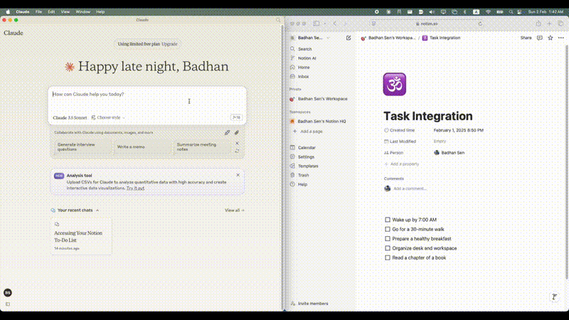
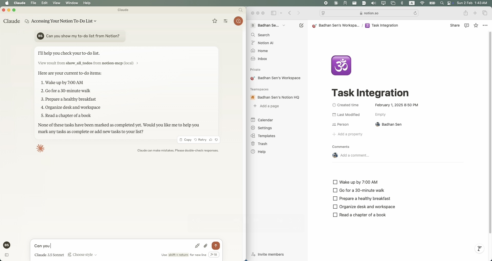
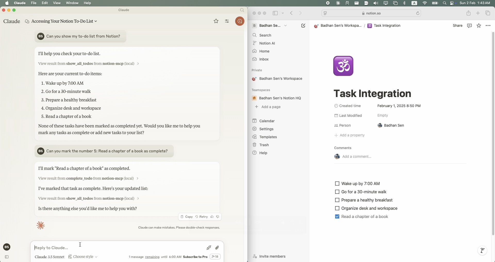
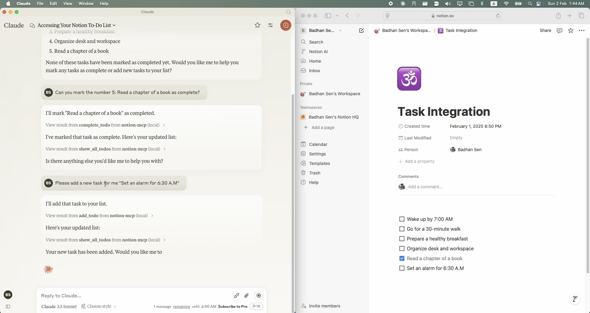

# notion-mcp

[](https://deepwiki.com/Badhansen/notion-mcp)

[](https://archestra.ai/mcp-catalog/badhansen__notion-mcp)
[](https://smithery.ai/server/@Badhansen/notion-mcp)

A simple Model Context Protocol (MCP) server that integrates with Notion's API to manage my personal todo list.

## Demo



## Visual Guide

#### Notion MCP Query 1



#### Notion MCP Query 2



#### Notion MCP Query 3



## Prerequisites

-   Python 3.11 or higher
-   A Notion account with API access
-   A Notion integration token
-   A Notion page where you want to manage your todo list
-   Claude Desktop clint

## Setup

### Installing via Smithery

To install Notion MCP for Claude Desktop automatically via [Smithery](https://smithery.ai/server/@Badhansen/notion-mcp):

```bash
npx -y @smithery/cli install @Badhansen/notion-mcp --client claude
```

1. Clone the repository:

```sh
git clone https://github.com/Badhansen/notion-mcp.git
cd notion-mcp
```

2. Set up Python environment:

```sh
uv venv
source .venv/bin/activate
uv pip install -e .
```

3. Create a Notion integration:
    - Go to https://www.notion.so/my-integrations
    - Create new integration
    - Copy the API key
4. Share your database/page with the integration:
    - Open your notion workspace with a database/table present or a page.
    - Click "..." menu → "Add connections"
    - Select your integration (Search by name)

## Configuration

1. Create `.env` file:

```sh
cp .env.example .env
```

2. Configure Notion credentials in `.env`:

```markdown
NOTION_TOKEN=<your-notion-api-token>
PAGE_ID=<your-notion-page-id>
NOTION_VERSION="2022-06-28"
NOTION_BASE_URL="https://api.notion.com/v1"
```

3. To use it with Claude Desktop as intended you need to adjust your `claude_desktop_config.json` file.
   Go to `Claude Desktop -> Settings -> Developer -> Edit Config`. Now add the `Notion` server configuration.

```json
{
    "mcpServers": {
        "notion-mcp": {
            "command": "uv",
            "args": [
                "--directory",
                "/Users/username/Projects/Python/notion-mcp/src" /* Path to your project */,
                "run",
                "server.py"
            ]
        }
    }
}
```

## Development

Project structure:

```markdown
notion-mcp/
├── docs/
├── src/
│ └── server.py
├── .env
├── .python-version
├── README.md
├── pyproject.toml
└── uv.lock
```

## Support Functions

#### Show Tasks

To show all tasks from your Notion workspace, use the `show_all_todos` function:

```json
{
    "name": "show_all_todos",
    "arguments": {}
}
```

#### Add Task

To add a new task to your Notion workspace, use the `add_todo` function:

```json
{
    "name": "add_todo",
    "arguments": {
        "task": "Your task description"
    }
}
```

#### Update Task

To update an existing task in your Notion workspace, use the `complete_todo` function:

```json
{
    "name": "complete_todo",
    "arguments": {
        "task_id": "your-task-id"
    }
}
```

## Contributing

1. Fork the repository
2. Create feature branch
3. Submit pull request

## License

MIT License. See LICENSE file for details.
