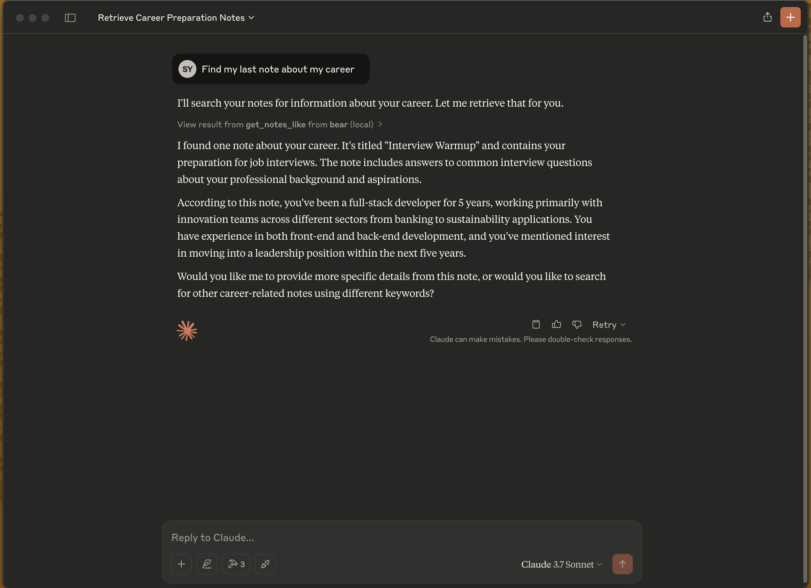

# Bear MCP Server

[](https://mseep.ai/app/akseyh-bear-mcp-server)

[](https://mseep.ai/app/4ba4aa63-76ae-41d7-9d41-851d9acf7013)

This project is a Model Context Protocol (MCP) server that provides access to the [Bear Notes](https://bear.app).

Bear stores notes on SQLite database. This MCP server runs some SQL commands to access this notes.
https://bear.app/faq/where-are-bears-notes-located



## Features

- Read notes
- Search notes by text
- List all tags

## Installation

```bash
# Clone the project
git clone https://github.com/akseyh/bear-mcp-server

# Change directory
cd bear-mcp-server

# Install dependencies
npm install

# Build the project
npm run build
```

## Claude Desktop Config

Update your claude_desktop_config.json

### Docker
```json
{
    "mcpServers": {
        "bear": {
            "command": "docker",
            "args": [
                "run",
                "-v",
                "/Users/[YOUR_USER_NAME]/Library/Group Containers/9K33E3U3T4.net.shinyfrog.bear/Application Data:/app/db",
                "-i",
                "akseyh/bear-mcp-server"
            ]
        }
    }
}
```

### NPM
```json
{
  "mcpServers": {
    "bear": {
      "command": "npx",
      "args": [
          "bear-mcp-server"
      ]
    }
  }
}
```

When the server is started, the following MCP tools become available:

- `get_notes`: Retrieves all notes
- `get_tags`: Lists all tags
- `get_notes_like`: Searches for notes containing specific text

## Requirements

- Node.js
- Bear note application (macOS)
- Access to Bear database

## License

ISC
