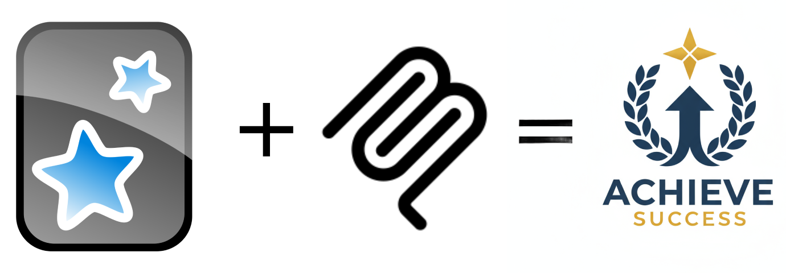

# Anki MCP Server

> **⚠️ IMPORTANT: Project Renamed (v0.8.2+)**
>
> This project has been renamed and moved:
> - **Package**: `anki-mcp-http` → `@ankimcp/anki-mcp-server`
> - **Commands**: `anki-mcp-http` → `ankimcp` or `anki-mcp-server`
> - **Repository**: `anki-mcp/anki-mcp-desktop` → `ankimcp/anki-mcp-server`
>
> The old `anki-mcp-http` package continues to be published for backward compatibility but is deprecated. Please migrate to the new package.
>
> **[Read more about this change →](https://ankimcp.ai/blog/organization-and-naming-update/)**

[](https://github.com/ankimcp/anki-mcp-server/actions/workflows/test.yml)
[](https://www.npmjs.com/package/@ankimcp/anki-mcp-server)

<div align="center">
  

  <p><strong>Seamlessly integrate <a href="https://apps.ankiweb.net">Anki</a> with AI assistants through the <a href="https://modelcontextprotocol.io">Model Context Protocol</a></strong></p>
</div>

**Beta** - This project is in active development. APIs and features may change.

A Model Context Protocol (MCP) server that enables AI assistants to interact with Anki, the spaced repetition flashcard application.

Transform your Anki experience with natural language interaction - like having a private tutor. The AI assistant doesn't just present questions and answers; it can explain concepts, make the learning process more engaging and human-like, provide context, and adapt to your learning style. It can create and edit notes on the fly, turning your study sessions into dynamic conversations. More features coming soon!

## Examples and Tutorials

For comprehensive guides, real-world examples, and step-by-step tutorials on using this MCP server with Claude Desktop, visit:

**[ankimcp.ai](https://ankimcp.ai)** - Complete documentation with practical examples and use cases

## Available Tools

### Review & Study
- `sync` - Sync with AnkiWeb
- `get_due_cards` - Get cards for review
- `present_card` - Show card for review
- `rate_card` - Rate card performance

### Deck Management
- `deckActions` - Unified deck operations:
  - `listDecks` - List all decks with optional statistics
  - `createDeck` - Create new decks (max 2 levels: "Parent::Child")
  - `deckStats` - Get comprehensive deck statistics
  - `changeDeck` - Move cards to a different deck

### Note Management
- `addNote` - Create a single note
- `addNotes` - Create multiple notes in batch (up to 100, partial success supported)
- `findNotes` - Search for notes using Anki query syntax
- `notesInfo` - Get detailed information about notes (fields, tags, CSS)
- `updateNoteFields` - Update existing note fields (CSS-aware, supports HTML)
- `deleteNotes` - Delete notes and their cards

### Media Management
- `mediaActions` - Manage media files (audio/images)
  - `storeMediaFile` - Upload media from base64 data, file paths, or URLs
  - `retrieveMediaFile` - Download media as base64
  - `getMediaFilesNames` - List media files with optional pattern filtering
  - `deleteMediaFile` - Remove media files

**💡 Best Practice for Images:**
- ✅ **Use file paths** (e.g., `/Users/you/image.png`) - Fast and efficient
- ✅ **Use URLs** (e.g., `https://example.com/image.jpg`) - Direct download
- ❌ **Avoid base64** - Extremely slow and token-inefficient

Just tell Claude where the image is, and it will handle the upload automatically using the most efficient method.

### Model/Template Management
- `modelNames` - List note types
- `modelFieldNames` - Get fields for a note type
- `modelStyling` - Get CSS styling for a note type

## Prerequisites

- [Anki](https://apps.ankiweb.net/) with [AnkiConnect](https://github.com/FooSoft/anki-connect) plugin installed
- Node.js 20.19.0+

## Installation

This server works in two modes:

- **Local mode (STDIO)** - For Claude Desktop on your computer (recommended for most users)
- **Remote mode (HTTP)** - For web-based AI assistants like ChatGPT or Claude.ai

### Option 1: MCPB Bundle (Recommended - Local Mode)

The easiest way to install this MCP server for Claude Desktop:

1. Download the latest `.mcpb` bundle from the [Releases](https://github.com/ankimcp/anki-mcp-server/releases) page
2. In Claude Desktop, install the extension:
   - **Method 1**: Go to Settings → Extensions, then drag and drop the `.mcpb` file
   - **Method 2**: Go to Settings → Developer → Extensions → Install Extension, then select the `.mcpb` file
3. Configure AnkiConnect URL if needed (defaults to `http://localhost:8765`)
4. Restart Claude Desktop

That's it! The bundle includes everything needed to run the server locally.

### Option 2: NPM Package with STDIO (For Other MCP Clients)

Want to use Anki with MCP clients like **Cursor IDE**, **Cline**, or **Zed Editor**? Use the npm package with the `--stdio` flag:

**Supported Clients:**
- [Cursor IDE](https://www.cursor.com/) - AI-powered code editor
- [Cline](https://github.com/cline/cline) - VS Code extension for AI assistance
- [Zed Editor](https://zed.dev/) - Fast, modern code editor
- Other MCP clients that support STDIO transport

**Configuration - Choose one method:**

**Method 1: Using npx (recommended - no installation needed)**

```json
{
  "mcpServers": {
    "anki-mcp": {
      "command": "npx",
      "args": ["-y", "@ankimcp/anki-mcp-server", "--stdio"],
      "env": {
        "ANKI_CONNECT_URL": "http://localhost:8765"
      }
    }
  }
}
```

**Method 2: Using global installation**

First, install globally:
```bash
npm install -g @ankimcp/anki-mcp-server
```

Then configure:
```json
{
  "mcpServers": {
    "anki-mcp": {
      "command": "ankimcp",
      "args": ["--stdio"],
      "env": {
        "ANKI_CONNECT_URL": "http://localhost:8765"
      }
    }
  }
}
```

**Configuration file locations:**
- **Cursor IDE**: `~/.cursor/mcp.json` (macOS/Linux) or `%USERPROFILE%\.cursor\mcp.json` (Windows)
- **Cline**: Accessible via settings UI in VS Code
- **Zed Editor**: Install as MCP extension through extension marketplace

For client-specific features and troubleshooting, consult your MCP client's documentation.

### Option 3: HTTP Mode (For Remote AI Assistants)

Want to use Anki with ChatGPT or Claude.ai in your browser? This mode lets you connect web-based AI tools to your local Anki.

**How it works (simple explanation):**
1. You run a small server on your computer (where Anki is installed)
2. Use the built-in `--ngrok` flag to automatically create a public tunnel URL
3. Share that URL with ChatGPT or Claude.ai
4. Now the AI can talk to your Anki through the internet!

**New in v0.8.0:** Integrated ngrok support with the `--ngrok` flag - no need to run ngrok separately!

**Setup - Choose one method:**

**Method 1: Using npx (recommended - no installation needed)**

```bash
# Quick start
npx @ankimcp/anki-mcp-server

# With ngrok tunnel (recommended for web-based AI)
npx @ankimcp/anki-mcp-server --ngrok

# With custom options
npx @ankimcp/anki-mcp-server --port 8080 --host 0.0.0.0
npx @ankimcp/anki-mcp-server --anki-connect http://localhost:8765
```

**Method 2: Using global installation**

```bash
# Install once
npm install -g @ankimcp/anki-mcp-server

# Run the server
ankimcp

# With ngrok tunnel (recommended for web-based AI)
ankimcp --ngrok

# With custom options
ankimcp --port 8080 --host 0.0.0.0
ankimcp --anki-connect http://localhost:8765
```

**Method 3: Install from source (for development)**

```bash
npm install
npm run build
npm run start:prod:http
```

**CLI Options:**

```bash
ankimcp [options]

Options:
  --stdio                        Run in STDIO mode (for MCP clients)
  -p, --port <port>              Port to listen on (HTTP mode, default: 3000)
  -h, --host <host>              Host to bind to (HTTP mode, default: 127.0.0.1)
  -a, --anki-connect <url>       AnkiConnect URL (default: http://localhost:8765)
  --ngrok                        Start ngrok tunnel (requires global ngrok installation)
  --read-only                    Run in read-only mode (blocks all write operations)
  --help                         Show help message

Usage with npx (no installation needed):
  npx @ankimcp/anki-mcp-server                        # HTTP mode
  npx @ankimcp/anki-mcp-server --port 8080            # Custom port
  npx @ankimcp/anki-mcp-server --stdio                # STDIO mode
  npx @ankimcp/anki-mcp-server --ngrok                # HTTP mode with ngrok tunnel
  npx @ankimcp/anki-mcp-server --read-only            # Read-only mode

Usage with global installation:
  npm install -g @ankimcp/anki-mcp-server             # Install once
  ankimcp                                             # HTTP mode
  ankimcp --port 8080                                 # Custom port
  ankimcp --stdio                                     # STDIO mode
  ankimcp --ngrok                                     # HTTP mode with ngrok tunnel
  ankimcp --read-only                                 # Read-only mode
```

**Read-Only Mode:**

The `--read-only` flag prevents any modifications to your Anki collection. When enabled:
- All read operations work normally (browsing decks, viewing cards, searching notes)
- Review operations are allowed (sync, answerCards, suspend/unsuspend)
- Content modifications are blocked (addNote, deleteNotes, createDeck, updateNoteFields, etc.)
- Useful for safely exploring Anki data without risk of accidental changes

```bash
# HTTP mode with read-only
ankimcp --read-only

# STDIO mode with read-only
ankimcp --stdio --read-only

# Can combine with other flags
ankimcp --ngrok --read-only
```

You can also enable read-only mode via environment variable:
```bash
READ_ONLY=true ankimcp
```

Or in MCP client configuration:
```json
{
  "mcpServers": {
    "anki-mcp": {
      "command": "npx",
      "args": ["-y", "@ankimcp/anki-mcp-server", "--stdio", "--read-only"],
      "env": {
        "ANKI_CONNECT_URL": "http://localhost:8765"
      }
    }
  }
}
```

**Using with ngrok:**

**Method 1: Integrated (Recommended - One Command)**

```bash
# One-time setup (if you haven't already):
npm install -g ngrok
ngrok config add-authtoken <your-token>  # Get token from https://dashboard.ngrok.com

# Start server with ngrok tunnel in one command:
ankimcp --ngrok

# The tunnel URL will be displayed in the startup banner
# Example output:
# 🌐 Ngrok tunnel: https://abc123.ngrok-free.app
```

**Method 2: Manual (Two Terminals)**

```bash
# Terminal 1: Start the server
ankimcp

# Terminal 2: Create tunnel
ngrok http 3000

# Copy the ngrok URL (looks like: https://abc123.ngrok-free.app)
# Share this URL with your AI assistant
```

**Benefits of `--ngrok` flag:**
- ✅ One command instead of two terminals
- ✅ Automatic cleanup when you press Ctrl+C
- ✅ URL displayed directly in the startup banner
- ✅ Works with custom ports: `ankimcp --port 8080 --ngrok`

**Security note:** Anyone with your ngrok URL can access your Anki, so keep that URL private!

### Option 4: Manual Installation from Source (Local Mode)

For development or advanced usage:

```bash
npm install
npm run build
```

## Connect to Claude Desktop (Local Mode)

You can configure the server in Claude Desktop by either:
- Going to: Settings → Developer → Edit Config
- Or manually editing the config file

### Configuration

Add the following to your Claude Desktop config:

```json
{
  "mcpServers": {
    "anki-mcp": {
      "command": "node",
      "args": ["/path/to/anki-mcp-server/dist/main-stdio.js"],
      "env": {
        "ANKI_CONNECT_URL": "http://localhost:8765"
      }
    }
  }
}
```

Replace `/path/to/anki-mcp-server` with your actual project path.

### Config File Locations

- **macOS**: `~/Library/Application Support/Claude/claude_desktop_config.json`
- **Windows**: `%APPDATA%\Claude\claude_desktop_config.json`
- **Linux**: `~/.config/Claude/claude_desktop_config.json`

For more details, see the [official MCP documentation](https://modelcontextprotocol.io/docs/develop/connect-local-servers).

## Environment Variables (Optional)

| Variable | Description | Default |
|----------|-------------|---------|
| `ANKI_CONNECT_URL` | AnkiConnect URL | `http://localhost:8765` |
| `ANKI_CONNECT_API_VERSION` | API version | `6` |
| `ANKI_CONNECT_API_KEY` | API key if configured in AnkiConnect | - |
| `ANKI_CONNECT_TIMEOUT` | Request timeout in ms | `5000` |
| `READ_ONLY` | Enable read-only mode (`true` or `1`) | `false` |

## Usage Examples

### Searching and Updating Notes

```
# Search for notes in a specific deck
findNotes(query: "deck:Spanish")

# Get detailed information about notes
notesInfo(notes: [1234567890, 1234567891])

# Update a note's fields (HTML content supported)
updateNoteFields(note: {
  id: 1234567890,
  fields: {
    "Front": "<b>¿Cómo estás?</b>",
    "Back": "How are you?"
  }
})

# Delete notes (requires confirmation)
deleteNotes(notes: [1234567890], confirmDeletion: true)
```

### Anki Query Syntax Examples

The `findNotes` tool supports Anki's powerful query syntax:

- `"deck:DeckName"` - All notes in a specific deck
- `"tag:important"` - Notes with the "important" tag
- `"is:due"` - Cards that are due for review
- `"is:new"` - New cards that haven't been studied
- `"added:7"` - Notes added in the last 7 days
- `"front:hello"` - Notes with "hello" in the front field
- `"flag:1"` - Notes with red flag
- `"prop:due<=2"` - Cards due within 2 days
- `"deck:Spanish tag:verb"` - Spanish deck notes with verb tag (AND)
- `"deck:Spanish OR deck:French"` - Notes from either deck

### Important Notes

#### CSS and HTML Handling
- The `notesInfo` tool returns CSS styling information for proper rendering awareness
- The `updateNoteFields` tool supports HTML content in fields and preserves CSS styling
- Each note model has its own CSS styling - use `modelStyling` to get model-specific CSS

#### Update Warning
⚠️ **IMPORTANT**: When using `updateNoteFields`, do NOT view the note in Anki's browser while updating, or the fields will not update properly. Close the browser or switch to a different note before updating. See [Known Issues](#known-issues) for more details.

#### Deletion Safety
The `deleteNotes` tool requires explicit confirmation (`confirmDeletion: true`) to prevent accidental deletions. Deleting a note removes ALL associated cards permanently.

## Known Issues

For a comprehensive list of known issues and limitations, please visit our documentation:

**[Known Issues Documentation](https://ankimcp.ai/docs/known-issues/)**

### Critical Limitations

#### Note Updates Fail When Viewed in Browser
⚠️ **IMPORTANT**: When updating notes using `updateNoteFields`, the update will silently fail if the note is currently being viewed in Anki's browser window. This is an upstream AnkiConnect limitation.

**Workaround**: Always close the browser or navigate to a different note before updating.

For more details and other known issues, see the [full documentation](https://ankimcp.ai/docs/known-issues/).

## Troubleshooting

### ERR_REQUIRE_ESM Error

If you see an error like:
```
Error [ERR_REQUIRE_ESM]: require() of ES Module not supported
```

This means your Node.js version is not supported. The server requires **Node.js 20.19.0+ or 22.12.0+**.

> **Note:** Node.js 21.x is not supported. The `require(esm)` feature was added in Node 22 and backported to Node 20.17+, but was never available in Node 21. See [#16](https://github.com/ankimcp/anki-mcp-server/issues/16) for details.

**Check your version:**
```bash
node --version
```

**Solution:** Update Node.js to version 20.19.0+ or 22.12.0+. You can download it from [nodejs.org](https://nodejs.org/) or use a version manager like [nvm](https://github.com/nvm-sh/nvm).

## Development

### Transport Modes

This server supports two MCP transport modes via **separate entry points**:

#### STDIO Mode (Default)
- For local MCP clients like Claude Desktop
- Uses standard input/output for communication
- **Entry point**: `dist/main-stdio.js`
- **Run**: `npm run start:prod:stdio` or `node dist/main-stdio.js`
- **MCPB bundle**: Uses STDIO mode

#### HTTP Mode (Streamable HTTP)
- For remote MCP clients and web-based integrations
- Uses MCP Streamable HTTP protocol
- **Entry point**: `dist/main-http.js`
- **Run**: `npm run start:prod:http` or `node dist/main-http.js`
- **Default port**: 3000 (configurable via `PORT` env var)
- **Default host**: `127.0.0.1` (configurable via `HOST` env var)
- **MCP endpoint**: `http://127.0.0.1:3000/` (root path)

#### Building

```bash
npm run build  # Builds once, creates dist/ with both entry points
```

Both `main-stdio.js` and `main-http.js` are in the same `dist/` directory. Choose which to run based on your needs.

#### HTTP Mode Configuration

**Environment Variables:**
- `PORT` - HTTP server port (default: 3000)
- `HOST` - Bind address (default: 127.0.0.1 for localhost-only)
- `ALLOWED_ORIGINS` - Comma-separated list of allowed origins for CORS (default: localhost)
- `LOG_LEVEL` - Logging level (default: info)

**Security:**
- Origin header validation (prevents DNS rebinding attacks)
- Binds to localhost (127.0.0.1) by default
- No authentication in current version (OAuth support planned)

**Example: Running Modes**
```bash
# Development - STDIO mode (watch mode with auto-rebuild)
npm run start:dev:stdio

# Development - HTTP mode (watch mode with auto-rebuild)
npm run start:dev:http

# Production - STDIO mode
npm run start:prod:stdio
# or
node dist/main-stdio.js

# Production - HTTP mode
npm run start:prod:http
# or
PORT=8080 HOST=0.0.0.0 node dist/main-http.js
```

### Building an MCPB Bundle

To create a distributable MCPB bundle:

```bash
npm run mcpb:bundle
```

This command will:
1. Sync version from `package.json` to `manifest.json`
2. Remove old `.mcpb` files
3. Build the TypeScript project
4. Package `dist/` and `node_modules/` into an `.mcpb` file
5. Run `mcpb clean` to remove devDependencies (optimizes bundle from ~47MB to ~10MB)

The output file will be named `anki-mcp-server-X.X.X.mcpb` and can be distributed for one-click installation.

#### What Gets Bundled

The MCPB package includes:
- Compiled JavaScript (`dist/` directory - includes both entry points)
- Production dependencies only (`node_modules/` - devDependencies removed by `mcpb clean`)
- Package metadata (`package.json`)
- Manifest configuration (`manifest.json` - configured to use `main-stdio.js`)
- Icon (`icon.png`)

Source files, tests, and development configs are automatically excluded via `.mcpbignore`.

### Logging in Claude Desktop

When running as an MCPB extension in Claude Desktop, logs are written to:

**Log Location**: `~/Library/Logs/Claude/` (macOS)

The logs are split across multiple files:
- **main.log** - General Claude Desktop application logs
- **mcp-server-Anki MCP Server.log** - MCP protocol messages for this extension
- **mcp.log** - Combined MCP logs from all servers

**Note**: The pino logger output (INFO, ERROR, WARN messages from the server code) goes to stderr and appears in the MCP-specific log files. Claude Desktop determines which log file receives which messages, but generally:
- Application startup and MCP protocol communication → MCP-specific log
- Server internal logging (pino) → Both MCP-specific log and sometimes main.log

To view logs in real-time:
```bash
tail -f ~/Library/Logs/Claude/mcp-server-Anki\ MCP\ Server.log
```

### Debugging the MCP Server

You can debug the MCP server using the MCP Inspector and attaching a debugger from your IDE (WebStorm, VS Code, etc.).

**Note for HTTP Mode:** When testing HTTP mode (Streamable HTTP) with MCP Inspector, use "Connection Type: Via Proxy" to avoid CORS errors.

#### Step 1: Configure Debug Server in MCP Inspector

The `mcp-inspector-config.json` already includes a debug server configuration:

```json
{
  "mcpServers": {
    "stdio-server-debug": {
      "type": "stdio",
      "command": "node",
      "args": ["--inspect-brk=9229", "dist/main-stdio.js"],
      "env": {
        "MCP_SERVER_NAME": "anki-mcp-stdio-debug",
        "MCP_SERVER_VERSION": "1.0.0",
        "LOG_LEVEL": "debug"
      },
      "note": "Anki MCP server with debugging enabled on port 9229"
    }
  }
}
```

#### Step 2: Start the Debug Server

Run the MCP Inspector with the debug server:

```bash
npm run inspector:debug
```

This will start the server with Node.js debugging enabled on port 9229 and pause execution at the first line.

#### Step 3: Attach Debugger from Your IDE

##### WebStorm
1. Go to **Run → Edit Configurations**
2. Add a new **Attach to Node.js/Chrome** configuration
3. Set the port to `9229`
4. Click **Debug** to attach

##### VS Code
1. Open the Debug panel (Ctrl+Shift+D / Cmd+Shift+D)
2. Select **Debug MCP Server (Attach)** configuration
3. Press F5 to attach

#### Step 4: Set Breakpoints and Debug

Once attached, you can:
- Set breakpoints in your TypeScript source files
- Step through code execution
- Inspect variables and call stack
- Use the debug console for evaluating expressions

The debugger will work with source maps, allowing you to debug the original TypeScript code rather than the compiled JavaScript.

### Debugging with Claude Desktop

You can also debug the MCP server while it runs inside Claude Desktop by enabling the Node.js debugger and attaching your IDE.

#### Step 1: Configure Claude Desktop for Debugging

Update your Claude Desktop config to enable debugging:

**macOS**: `~/Library/Application Support/Claude/claude_desktop_config.json`
**Windows**: `%APPDATA%\Claude\claude_desktop_config.json`
**Linux**: `~/.config/Claude/claude_desktop_config.json`

```json
{
  "mcpServers": {
    "anki-mcp": {
      "command": "node",
      "args": [
        "--inspect=9229",
        "<path_to_project>/anki-mcp-server/dist/main-stdio.js"
      ],
      "env": {
        "ANKI_CONNECT_URL": "http://localhost:8765"
      }
    }
  }
}
```

**Key change**: Add `--inspect=9229` before the path to `dist/main-stdio.js`

**Debug options**:
- `--inspect=9229` - Start debugger immediately, doesn't block (recommended)
- `--inspect-brk=9229` - Pause execution until debugger attaches (for debugging startup issues)

#### Step 2: Restart Claude Desktop

After saving the config, restart Claude Desktop. The MCP server will now run with debugging enabled on port 9229.

#### Step 3: Attach Debugger from Your IDE

##### WebStorm

1. Go to **Run → Edit Configurations**
2. Click the **+** button and select **Attach to Node.js/Chrome**
3. Configure:
   - **Name**: `Attach to Anki MCP (Claude Desktop)`
   - **Host**: `localhost`
   - **Port**: `9229`
   - **Attach to**: `Node.js < 8` or `Chrome or Node.js > 6.3` (depending on WebStorm version)
4. Click **OK**
5. Click **Debug** (Shift+F9) to attach

##### VS Code

1. Add to `.vscode/launch.json`:

```json
{
  "version": "0.2.0",
  "configurations": [
    {
      "type": "node",
      "request": "attach",
      "name": "Attach to Anki MCP (Claude Desktop)",
      "port": 9229,
      "skipFiles": ["<node_internals>/**"],
      "sourceMaps": true,
      "outFiles": ["${workspaceFolder}/dist/**/*.js"]
    }
  ]
}
```

2. Open the Debug panel (Ctrl+Shift+D / Cmd+Shift+D)
3. Select **Attach to Anki MCP (Claude Desktop)**
4. Press F5 to attach

#### Step 4: Debug in Real-Time

Once attached, you can:
- Set breakpoints in your TypeScript source files (e.g., `src/mcp/primitives/essential/tools/create-model.tool.ts`)
- Use Claude Desktop normally - breakpoints will hit when tools are invoked
- Step through code execution
- Inspect variables and call stack
- Use the debug console

**Example**: Set a breakpoint in `create-model.tool.ts` at line 119, then ask Claude to create a new model. The debugger will pause at your breakpoint!

**Note**: The debugger stays attached as long as Claude Desktop is running. You can detach/reattach anytime without restarting Claude Desktop.

### Build Commands

```bash
npm run build              # Build the project (compile TypeScript to JavaScript)
npm run start:dev:stdio    # STDIO mode with watch (auto-rebuild)
npm run start:dev:http     # HTTP mode with watch (auto-rebuild)
npm run type-check         # Run TypeScript type checking
npm run lint               # Run ESLint
npm run mcpb:bundle        # Sync version, clean, build, and create MCPB bundle
```

### NPM Package Testing (Local)

Test the npm package locally before publishing:

```bash
# 1. Create local package
npm run pack:local         # Builds and creates @ankimcp/anki-mcp-server-*.tgz

# 2. Install globally from local package
npm run install:local      # Installs from ./@ankimcp/anki-mcp-server-*.tgz

# 3. Test the command
ankimcp                    # Runs HTTP server on port 3000

# 4. Uninstall when done testing
npm run uninstall:local    # Removes global installation
```

**How it works:**
- `npm pack` creates a `.tgz` file identical to what npm publish would create
- Installing from `.tgz` simulates what users get from `npm install -g ankimcp`
- This lets you test the full user experience before publishing to npm

### Testing Commands

```bash
npm test              # Run all tests
npm run test:unit     # Run unit tests only
npm run test:tools    # Run tool-specific tests
npm run test:workflows # Run workflow integration tests
npm run test:e2e      # Run end-to-end tests
npm run test:cov      # Run tests with coverage report
npm run test:watch    # Run tests in watch mode
npm run test:debug    # Run tests with debugger
npm run test:ci       # Run tests for CI (silent, with coverage)
```

### Test Coverage

The project maintains 70% minimum coverage thresholds for:
- Branches
- Functions
- Lines
- Statements

Coverage reports are generated in the `coverage/` directory.

## Versioning

This project follows [Semantic Versioning](https://semver.org/) with a pre-1.0 development approach:

- **0.x.x** - Beta/Development versions (current phase)
  - **0.1.x** - Bug fixes and patches
  - **0.2.0+** - New features or minor improvements
  - **Breaking changes** are acceptable in 0.x versions

- **1.0.0** - First stable release
  - Will be released when the API is stable and tested
  - Breaking changes will require major version bumps (2.0.0, etc.)

**Current Status**: `0.14.0` - Active beta development. Recent features include batch note creation (`addNotes`), integrated ngrok tunneling (`--ngrok` flag), media file management, model/template management, and comprehensive deck statistics. APIs may change based on feedback and testing.

## Similar Projects

If you're exploring Anki MCP integrations, here are other projects in this space:

### [scorzeth/anki-mcp-server](https://github.com/scorzeth/anki-mcp-server)
- **Status**: Appears to be abandoned (no recent updates)
- Early implementation of Anki MCP integration

### [nailuoGG/anki-mcp-server](https://github.com/nailuoGG/anki-mcp-server)
- **Approach**: Lightweight, single-file implementation
- **Architecture**: Procedural code structure with all tools in one file
- **Good for**: Simple use cases, minimal dependencies

**Why this project differs:**
- **Enterprise-grade architecture**: Built on NestJS with dependency injection
- **Modular design**: Each tool is a separate class with clear separation of concerns
- **Maintainability**: Easy to extend with new features without touching existing code
- **Testing**: Comprehensive test suite with 70% coverage requirement
- **Type safety**: Strict TypeScript with Zod validation
- **Error handling**: Robust error handling with helpful user feedback
- **Production-ready**: Proper logging, progress reporting, and MCPB bundle support
- **Scalability**: Can easily grow from basic tools to complex workflows

**Use case**: If you need a solid foundation for building advanced Anki integrations or plan to extend functionality significantly, this project's architectural approach makes it easier to maintain and scale over time.

## Useful Links

- [Model Context Protocol Documentation](https://modelcontextprotocol.io/docs)
- [AnkiConnect API Documentation](https://git.sr.ht/~foosoft/anki-connect)
- [Claude Desktop Download](https://claude.ai/download)
- [Building Desktop Extensions (Anthropic Blog)](https://www.anthropic.com/engineering/desktop-extensions)
- [MCP Servers Repository](https://github.com/modelcontextprotocol/servers)
- [NestJS Documentation](https://docs.nestjs.com)
- [Anki Official Website](https://apps.ankiweb.net/)

## License & Attribution

This project is licensed under the GNU Affero General Public License v3.0 or later (AGPL-3.0-or-later).

### Why AGPL-3.0?

This license was chosen to maintain compatibility with Anki's AGPL-3.0 license for potential future integration scenarios.

**What this means:**
- **Personal use**: Use the software freely
- **Running as a service for others**: You must provide source code access (AGPL Section 13)
- **Modifying and distributing**: Share your improvements under AGPL-3.0-or-later

For complete license terms, see the [LICENSE](LICENSE) file.

### Third-Party Attributions

- **Anki®** is a registered trademark of Ankitects Pty Ltd. This project is an unofficial third-party tool and is not affiliated with, endorsed by, or sponsored by Ankitects Pty Ltd. The Anki logo is used under the alternative license for referencing Anki with a link to [https://apps.ankiweb.net](https://apps.ankiweb.net). For the official Anki application, visit [https://apps.ankiweb.net](https://apps.ankiweb.net).

- **Model Context Protocol (MCP)** is an open standard by Anthropic. The MCP logo is from the official [MCP documentation repository](https://github.com/modelcontextprotocol/docs) and is used under the MIT License. For more information about MCP, visit [https://modelcontextprotocol.io](https://modelcontextprotocol.io).

- This is an independent project that bridges Anki and MCP technologies. All trademarks, service marks, trade names, product names, and logos are the property of their respective owners.
