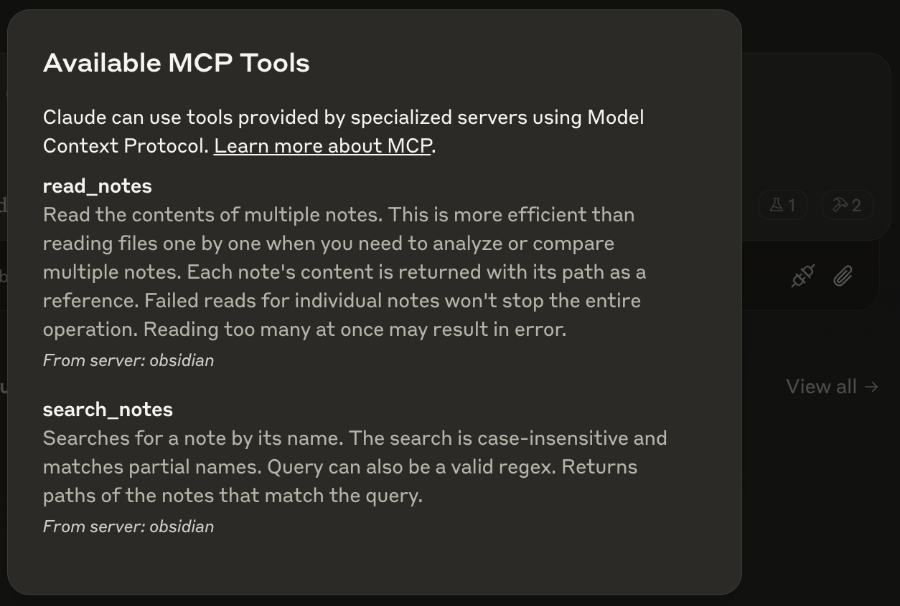

# Obsidian Model Context Protocol

[](https://smithery.ai/server/mcp-obsidian)

This is a connector to allow Claude Desktop (or any MCP client) to read and search any directory containing Markdown notes (such as an Obsidian vault).

## Installation

Make sure Claude Desktop and `npm` is installed.

### Installing via Smithery

To install Obsidian Model Context Protocol for Claude Desktop automatically via [Smithery](https://smithery.ai/server/mcp-obsidian):

```bash
npx -y @smithery/cli install mcp-obsidian --client claude
```

Then, restart Claude Desktop and you should see the following MCP tools listed:



### Usage with VS Code

For quick installation, use one of the one-click install buttons below:

[](https://insiders.vscode.dev/redirect/mcp/install?name=obsidian&inputs=%5B%7B%22type%22%3A%22promptString%22%2C%22id%22%3A%22vaultPath%22%2C%22description%22%3A%22Path%20to%20Obsidian%20vault%22%7D%5D&config=%7B%22command%22%3A%22npx%22%2C%22args%22%3A%5B%22-y%22%2C%22mcp-obsidian%22%2C%22%24%7Binput%3AvaultPath%7D%22%5D%7D) [](https://insiders.vscode.dev/redirect/mcp/install?name=obsidian&inputs=%5B%7B%22type%22%3A%22promptString%22%2C%22id%22%3A%22vaultPath%22%2C%22description%22%3A%22Path%20to%20Obsidian%20vault%22%7D%5D&config=%7B%22command%22%3A%22npx%22%2C%22args%22%3A%5B%22-y%22%2C%22mcp-obsidian%22%2C%22%24%7Binput%3AvaultPath%7D%22%5D%7D&quality=insiders)

For manual installation, add the following JSON block to your User Settings (JSON) file in VS Code. You can do this by pressing `Ctrl + Shift + P` and typing `Preferences: Open User Settings (JSON)`.

Optionally, you can add it to a file called `.vscode/mcp.json` in your workspace. This will allow you to share the configuration with others.

> Note that the `mcp` key is not needed in the `.vscode/mcp.json` file.

```json
{
  "mcp": {
    "inputs": [
      {
        "type": "promptString",
        "id": "vaultPath",
        "description": "Path to Obsidian vault"
      }
    ],
    "servers": {
      "obsidian": {
        "command": "npx",
        "args": ["-y", "mcp-obsidian", "${input:vaultPath}"]
      }
    }
  }
}
```
