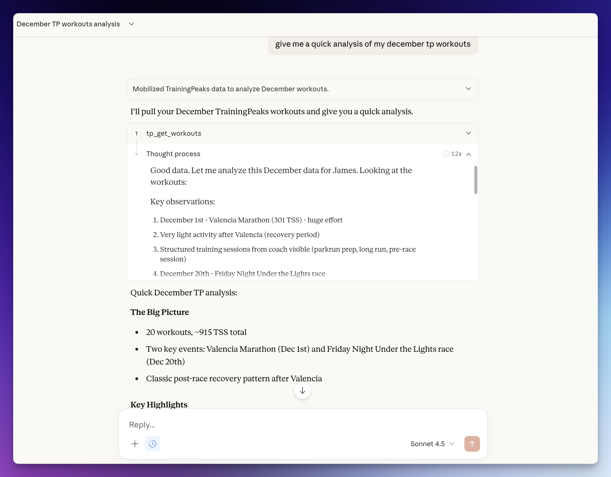

# TrainingPeaks MCP Server

<a href="https://glama.ai/mcp/servers/@JamsusMaximus/TrainingPeaks-MCP">
  
</a>

Connect TrainingPeaks to Claude and other AI assistants via the Model Context Protocol (MCP). Query your workouts, analyze training load, compare power data, and track fitness trends through natural conversation.

**No API approval required.** The official Training Peaks API is approval-gated, but this server uses secure cookie authentication that any user can set up in minutes. Your cookie is stored in your system keyring, never transmitted anywhere except to TrainingPeaks.

## What You Can Do



Ask your AI assistant questions like:
- "Compare my FTP progression this year vs last year"
- "What was my TSS ramp rate in the 6 weeks before my best 20-min power?"
- "Am I ready to race? Show my form trend and recent workout quality"
- "Which days of the week do I typically train hardest?"
- "Find weeks where I exceeded 800 TSS and show what happened to my form after"

## Features

| Tool | Description |
|------|-------------|
| `tp_auth_status` | Check authentication status |
| `tp_get_profile` | Get athlete profile and ID |
| `tp_get_workouts` | Query workouts by date range (planned and completed) |
| `tp_get_workout` | Get detailed metrics for a single workout |
| `tp_analyze_workout` | Detailed workout analysis with time-series data, zones, and laps |
| `tp_create_workout` | Create a planned workout (date, sport, title, duration) |
| `tp_get_peaks` | Compare power PRs (5sec to 90min) and running PRs (400m to marathon) |
| `tp_get_fitness` | Track CTL, ATL, and TSB (fitness, fatigue, form) |
| `tp_get_workout_prs` | See personal records set in a specific session |
| `tp_refresh_auth` | Re-authenticate if your session expires (extracts fresh cookie from browser) |

---

## Setup Options

### Option A: Auto-Setup with Claude Code

If you have [Claude Code](https://claude.ai/code), paste this prompt:

```
Set up the TrainingPeaks MCP server from https://github.com/JamsusMaximus/trainingpeaks-mcp - clone it, create a venv, install it, then walk me through getting my TrainingPeaks cookie from my browser and run tp-mcp auth. Finally, add it to my Claude Desktop config.
```

Claude will handle the installation and guide you through authentication step-by-step.

### Option B: Manual Setup

#### Step 1: Install

```bash
git clone https://github.com/JamsusMaximus/trainingpeaks-mcp.git
cd trainingpeaks-mcp
python3 -m venv .venv
source .venv/bin/activate  # Windows: .venv\Scripts\activate
pip install -e .
```

#### Step 2: Authenticate

**Option A: Auto-extract from browser (easiest)**

If you're logged into TrainingPeaks in your browser:

```bash
pip install tp-mcp[browser]  # One-time: install browser support
tp-mcp auth --from-browser chrome  # Or: firefox, safari, edge, auto
```

> **macOS note:** You may see security prompts for Keychain or Full Disk Access. This is normal - browser cookies are encrypted and require permission to read.

**Option B: Manual cookie entry**

1. Log into [app.trainingpeaks.com](https://app.trainingpeaks.com)
2. Open DevTools (`F12`) → **Application** tab → **Cookies**
3. Find `Production_tpAuth` and copy its value
4. Run `tp-mcp auth` and paste when prompted

**Other auth commands:**
```bash
tp-mcp auth-status  # Check if authenticated
tp-mcp auth-clear   # Remove stored cookie
```

#### Step 3: Add to Claude Desktop

Run this to get your config snippet:

```bash
tp-mcp config
```

Edit `~/Library/Application Support/Claude/claude_desktop_config.json` (macOS) or `%APPDATA%\Claude\claude_desktop_config.json` (Windows) and paste it inside `mcpServers`. Example with multiple servers:

```json
{
  "mcpServers": {
    "some-other-server": {
      "command": "npx",
      "args": ["some-other-mcp"]
    },
    "trainingpeaks": {
      "command": "/Users/you/trainingpeaks-mcp/.venv/bin/tp-mcp",
      "args": ["serve"]
    }
  }
}
```

Restart Claude Desktop. You're ready to go!

---

## Tool Reference

### tp_get_workouts
List workouts in a date range. Max 90 days per query.

```json
{ "start_date": "2026-01-01", "end_date": "2026-01-07", "type": "completed" }
```

### tp_get_workout
Get full details for one workout including power, HR, cadence, TSS.

```json
{ "workout_id": "123456789" }
```

### tp_analyze_workout
Get detailed workout analysis including metrics, zones, and lap data. Full time-series data is saved to a JSON file for further analysis.

```json
{ "workout_id": "123456789" }
```

### tp_create_workout
Create a planned workout on a given date.

```json
{ "date": "2026-02-01", "sport": "Run", "title": "Easy 5K", "duration_minutes": 30 }
```

**Sports:** `Bike`, `Run`, `Swim`, `Strength`, `DayOff`, `Other`

**Optional fields:** `description` (max 2000 chars), `distance_km`, `tss_planned`

### tp_get_peaks
Get ranked personal records. Bike: power metrics. Run: pace/speed metrics.

```json
{ "sport": "Bike", "pr_type": "power20min", "days": 365 }
```

**Bike types:** `power5sec`, `power1min`, `power5min`, `power10min`, `power20min`, `power60min`, `power90min`, `hR5sec`, `hR1min`, `hR5min`, `hR10min`, `hR20min`, `hR60min`, `hR90min`

**Run types:** `speed400Meter`, `speed800Meter`, `speed1K`, `speed1Mi`, `speed5K`, `speed5Mi`, `speed10K`, `speed10Mi`, `speedHalfMarathon`, `speedMarathon`, `speed50K`, `hR5sec`, `hR1min`, `hR5min`, `hR10min`, `hR20min`, `hR60min`, `hR90min`

### tp_get_fitness
Get training load metrics over time.

```json
{ "days": 90 }
```

Alternatively, query a specific date range:

```json
{ "start_date": "2025-01-01", "end_date": "2025-03-31" }
```

Returns daily CTL (chronic training load / fitness), ATL (acute training load / fatigue), and TSB (training stress balance / form).

### tp_get_workout_prs
Get PRs set during a specific workout.

```json
{ "workout_id": "123456789" }
```

## What is MCP?

[Model Context Protocol](https://modelcontextprotocol.io) is an open standard for connecting AI assistants to external data sources. MCP servers expose tools that AI models can call to fetch real-time data, enabling assistants like Claude to access your Training Peaks account through natural language.

## Security

**TL;DR: Your cookie is encrypted on disk, exchanged for short-lived OAuth tokens, never shown to Claude, and only ever sent to TrainingPeaks. The server has no network ports.**

This server is designed with defense-in-depth. Your TrainingPeaks session cookie is sensitive - it grants access to your training data - so we treat it accordingly.

> **Write access:** `tp_create_workout` can create planned workouts. All other tools are read-only. The server cannot modify or delete existing workouts.

### Cookie Storage

| Platform | Primary Storage | Fallback |
|----------|----------------|----------|
| macOS | System Keychain | Encrypted file |
| Windows | Windows Credential Manager | Encrypted file |
| Linux | Secret Service (GNOME/KDE) | Encrypted file |

Your cookie is **never** stored in plaintext. The encrypted file fallback uses AES-256-GCM authenticated encryption with a PBKDF2-derived key (600,000 iterations) and a machine-specific salt.

### Cookie Never Leaks to AI

The AI assistant (Claude) **never sees your cookie value**. Multiple layers ensure this:

1. **Return value sanitization**: Tool results are scrubbed for any keys containing `cookie`, `token`, `auth`, `credential`, `password`, or `secret` before being sent to Claude
2. **Masked repr()**: The `BrowserCookieResult` and `CredentialResult` classes override `__repr__` to show `cookie=<present>` instead of the actual value
3. **Sanitized exceptions**: Error messages use only exception type names, never full messages that could contain data
4. **No logging**: Cookie values are never written to any log

### Domain Hardcoding (Cannot Be Changed)

The browser cookie extraction **only** accesses `.trainingpeaks.com`:

```python
# From src/tp_mcp/auth/browser.py - HARDCODED, not a parameter
cj = func(domain_name=".trainingpeaks.com")
```

Claude cannot modify this via tool parameters. The only parameter is `browser` (chrome/firefox/etc), not the domain. To change the domain would require modifying the source code.

### Read-Only Access

This server provides **limited write** access to TrainingPeaks:
- ✅ Query workouts, fitness metrics, personal records
- ✅ Create planned workouts
- ❌ Cannot modify or delete existing workouts
- ❌ Cannot change account settings
- ❌ Cannot access billing or payment info

### No Network Exposure

The MCP server uses **stdio transport only** - it communicates with Claude Desktop via stdin/stdout, not over the network. There is no HTTP server, no open ports, no remote access.

### What This Server Cannot Do

| Action | Possible? |
|--------|-----------|
| Read your workouts | ✅ Yes |
| Read your fitness metrics | ✅ Yes |
| Create planned workouts | ✅ Yes |
| Modify or delete existing workouts | ❌ No |
| Access other websites | ❌ No (domain hardcoded) |
| Send your cookie/token anywhere except TrainingPeaks | ❌ No |
| Expose your cookie to Claude | ❌ No (sanitized) |
| Open network ports | ❌ No (stdio only) |

### Open Source

This server is fully open source. You can audit every line of code before running it. Key security files:
- [`src/tp_mcp/auth/browser.py`](src/tp_mcp/auth/browser.py) - Cookie extraction with hardcoded domain
- [`src/tp_mcp/auth/encrypted.py`](src/tp_mcp/auth/encrypted.py) - AES-256-GCM credential encryption
- [`src/tp_mcp/tools/_validation.py`](src/tp_mcp/tools/_validation.py) - Pydantic input validation
- [`src/tp_mcp/tools/refresh_auth.py`](src/tp_mcp/tools/refresh_auth.py) - Result sanitization
- [`tests/test_tools/test_refresh_auth_security.py`](tests/test_tools/test_refresh_auth_security.py) - Security tests

## Authentication Flow

The server uses a two-step authentication process:

1. **Cookie → OAuth Token**: Your stored cookie is exchanged for a short-lived OAuth access token (expires in 1 hour)
2. **Automatic Refresh**: Tokens are cached in memory and automatically refreshed before expiry

This means:
- You only need to authenticate once with `tp-mcp auth`
- API calls use proper Bearer token auth, not cookies
- If your session cookie expires (typically after several weeks), use `tp_refresh_auth` in Claude or run `tp-mcp auth` again

## Development

```bash
pip install -e ".[dev]"
pytest tests/ -v
mypy src/
ruff check src/
```

## License

MIT
