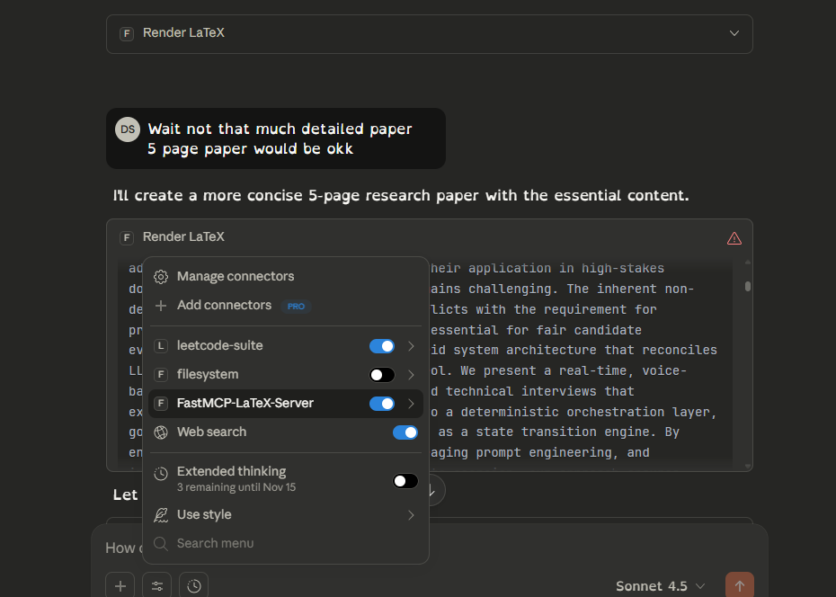
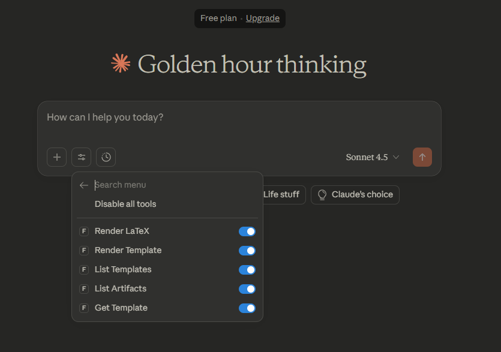
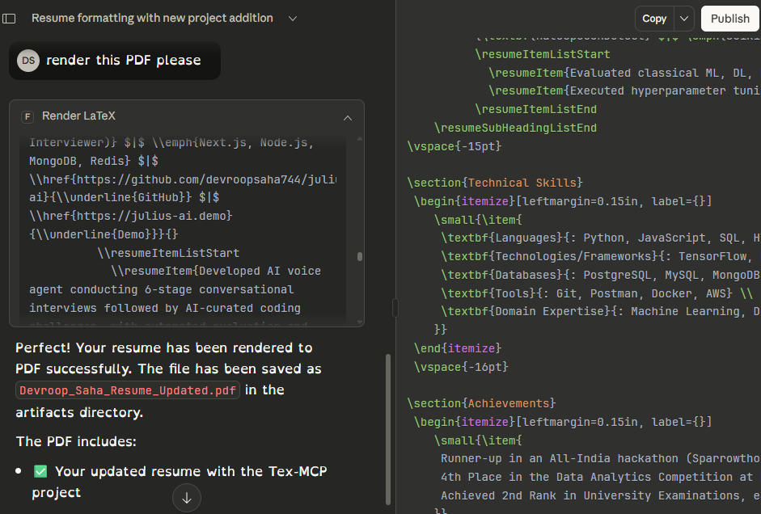

[](https://mseep.ai/app/devroopsaha744-texmcp)

# FastMCP LaTeX Server (tex-mcp)

A small FastMCP-based Microservice that renders LaTeX to PDF. The server exposes MCP tools
to render raw LaTeX or templates and produces artifacts (a .tex file and  .pdf)
under `src/artifacts/`.

This repository is prepared to run locally and to be loaded by Claude Desktop (via the
Model Context Protocol). The default entrypoint is `run_server.py`.

## Demo



---

## Quick features
- Render raw LaTeX to `.tex` and (optionally) `.pdf` using pdflatex
- Render Jinja2 templates and compile to PDF
- Designed to run as an MCP server for Claude Desktop and other MCP-capable clients

Tools exposed by this MCP server
- Total tools: 5
  - render_latex_document — write LaTeX and optionally compile to PDF
  - render_template_document — render a Jinja2 template and optionally compile
  - list_templates — list available templates
  - list_artifacts — list files produced in `src/artifacts/`
  - get_template — return the raw contents of a template file so clients can inspect it before rendering
---

## Getting started (local development)

Prerequisites
- Python 3.10+ (the project uses modern pydantic/fastapi stack)
- LaTeX toolchain (pdflatex) for PDF compilation (optional; if missing, server returns .tex only)

1) Create a project virtualenv and install deps

Clone from GitHub

If you want to work from the canonical repository on GitHub, clone it first:

```powershell
git clone https://github.com/devroopsaha744/TexMCP.git
cd TexMCP
```

After cloning you can follow the venv creation and install steps below.


```powershell
python -m venv .venv
. .\\.venv\\Scripts\\Activate.ps1
python -m pip install --upgrade pip
pip install -r requirements.txt
```

2) Run the server directly (stdio mode - used by Claude Desktop)

```powershell
. .\\.venv\\Scripts\\Activate.ps1
python .\\run_server.py
# or run the venv python explicitly if you don't activate
.# .venv\\Scripts\\python.exe run_server.py
```

If run in stdio mode the server will speak MCP over stdin/stdout (this is what Claude Desktop
expects when it spawns the process). If you prefer HTTP, edit `run_server.py` and switch the
transport to `http` (see commented code) and run via `uv run` or `uvicorn`.

3) Artifacts

Rendered outputs are placed in `src/artifacts/`. For each job you should see a `.tex` file and
— if `pdflatex` is available — a matching `.pdf`.

Templates
 - Several example templates live in `src/mcp_server/templates/`. There are 15 templates included (for example `sample_invoice.tex.j2`, `sample_letter.tex.j2`, `sample_resume.tex.j2`). Use `list_templates` to get the full list programmatically. The templates are deliberately simple and ready to customize — add your own `.tex.j2` files to that folder to expand the catalog.

Included templates (in `src/mcp_server/templates/`)

- `default.tex.j2` (base example template)
- `sample_invoice.tex.j2`
- `sample_invoice2.tex.j2`
- `sample_letter.tex.j2`
- `sample_report.tex.j2`
- `sample_resume.tex.j2`
- `sample_presentation.tex.j2`
- `sample_certificate.tex.j2`
- `sample_coverletter.tex.j2`
- `sample_poster.tex.j2`
- `sample_thesis.tex.j2`
- `sample_receipt.tex.j2`
- `sample_recipe.tex.j2`
- `sample_poem.tex.j2`
- `sample_cv.tex.j2`

---

## Integration with Claude Desktop (quick)

Recommended: use the `fastmcp` CLI installer which will set things up to run from the project directory and use the project venv.

From your project root (with the venv already created and deps installed):

```powershell
fastmcp install claude-desktop run_server.py --project C:\\Users\\DEVROOP\\Desktop\\tex-mcp
```

This ensures `uv` runs inside the project directory and uses the project's environment. After the installer runs, fully quit and restart Claude Desktop.

Manual Claude Desktop config
If you edit Claude's config yourself (Windows: `%APPDATA%\\Claude\\claude_desktop_config.json`), add a single server entry that points to the project Python executable. Example (replace paths if needed):

```json
{
  "mcpServers": {
    "FastMCP-LaTeX-Server": {
      "command": "C:\\\\Users\\\\DEVROOP\\\\Desktop\\\\tex-mcp\\\\venv\\\\Scripts\\\\python.exe",
      "args": [
        "C:\\\\Users\\\\DEVROOP\\\\Desktop\\\\tex-mcp\\\\run_server.py"
      ],
      "cwd": "C:\\\\Users\\\\DEVROOP\\\\Desktop\\\\tex-mcp",
      "transport": "stdio"
    }
  }
}
```

Notes
- Do NOT point Claude at the virtualenv `activate` script — it is a shell helper and not an executable. Point Claude to the `python.exe` inside the venv (or to `uv.exe` inside the venv if you installed `uv`).
- After any config changes, fully restart Claude Desktop.

---

## Docker

This project includes a Dockerfile so you can run the MCP server in a container.

Build (no LaTeX):

```bash
docker build -t fastmcp-latex:latest .
```

Build with LaTeX (larger image):

```bash
docker build --build-arg INSTALL_TEX=1 -t fastmcp-latex:with-tex .
```

Run (HTTP mode exposed on port 8000):

```bash
docker run -p 8000:8000 --rm --name fastmcp-latex fastmcp-latex:latest
```

Notes
- The container sets `MCP_TRANSPORT=http` by default. Inside the container the server binds to `0.0.0.0:8000`.
- If you want to run the server in `stdio` mode in a container you can override the env var:

```bash
docker run -e MCP_TRANSPORT=stdio ...
```

Artifact persistence
- To persist rendered artifacts on the host, bind mount the `src/artifacts` directory:

```bash
docker run -p 8000:8000 -v $(pwd)/src/artifacts:/app/src/artifacts fastmcp-latex:latest
```

---

You can  Use a Model Context Protocol / FastMCP client library (Like OpenAI Responses API) in your agent code to call tools programmatically. For example, in Python you can use the `mcp` or `fastmcp` client (see library docs) to connect to `http://localhost:8000/mcp` and call `render_latex_document` with arguments.

Security notes
- If you expose the HTTP endpoint beyond localhost, secure it (TLS, firewall, or authentication) — rendering arbitrary LaTeX can pose risks (shell commands in templates, large resource use).

---

## Contributing

Thanks for wanting to contribute! See `CONTRIBUTING.md` for the development workflow, commit style, and how to open issues and pull requests.

---

## License

This project is released under the MIT License — see `LICENSE`.

