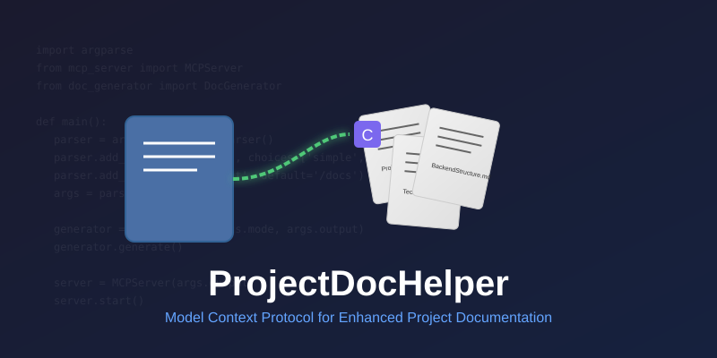

# 项目文档助手



[](https://opensource.org/licenses/MIT)
[](https://www.python.org/)
[](https://github.com/stark1937/ProjectDocHelper)
[](https://github.com/stark1937/ProjectDocHelper)

[English](README.md) | [简体中文](README_CN.md)

## 📝 介绍

项目文档助手是一个 MCP（模型上下文协议）服务器，旨在自动生成项目文档，并通过 MCP 使其可供 AI 开发工具（如 Cursor）访问，从而提高 AI 响应的准确性和相关性。

## ✨ 主要功能

- 🚀 **智能文档生成**：根据项目类型自动生成文档集
- 🔄 **多种生成模式**：支持简单和详细模式以满足不同需求
- 📊 **进度可视化**：在文档生成过程中显示进度条
- 🔌 **MCP 服务支持**：服务启动后，Cursor 可以访问生成的文档
- 📋 **问答集成**：支持将用户与 AI 的交互纳入文档中

## 🛠️ 技术栈

- Python 3.12+
- argparse：命令行参数解析
- Jinja2：模板引擎
- MCP 协议：与 AI 工具（如 Cursor）的集成

## 🚀 快速开始

### 安装

```bash
pip install projectdochelper
```

### 基本用法

```bash
# 生成项目文档（简单模式）
projectdochelper generate --mode simple

# 生成项目文档（详细模式）
projectdochelper generate --mode detailed

# 启动 MCP 服务器
projectdochelper serve --port 8080
```

## 📚 文档生成

项目文档助手根据项目类型生成不同的文档集：

| 项目类型 | 生成的文档 |
| -------- | ----------- |
| 前端     | ProjectRequirements.md, FrontendGuidelines.md, TechStack.md |
| 后端     | ProjectRequirements.md, BackendStructure.md, TechStack.md |
| 全栈     | ProjectRequirements.md, FrontendGuidelines.md, BackendStructure.md, TechStack.md |

## 🔗 Cursor 集成

1. 启动项目文档助手服务
2. 在 Cursor 中配置 MCP 服务地址
3. 开始享受增强的 AI 辅助开发

## 📋 问答集成功能

项目文档助手智能地将用户与 AI 的交互集成到相关文档中：

- 自动识别相关的问答内容
- 将有价值的信息添加到相应的文档中
- 维护结构化和可读的文档

## 🤝 贡献

欢迎贡献！请查看我们的贡献指南以获取详细信息。

## 📄 许可证

本项目根据 MIT 许可证进行许可 - 详见 LICENSE 文件。

💡 注意：项目文档助手正在积极开发中。欢迎反馈和建议！