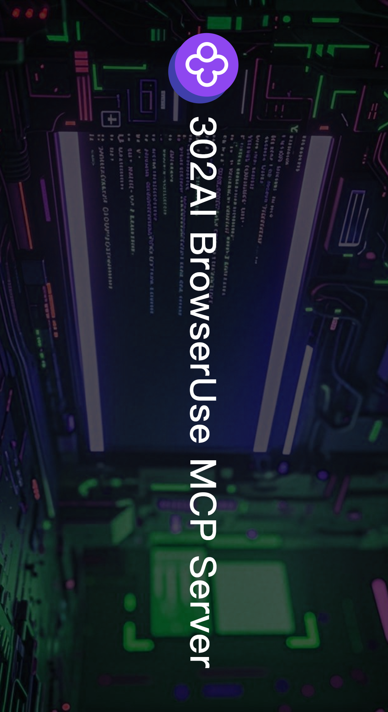
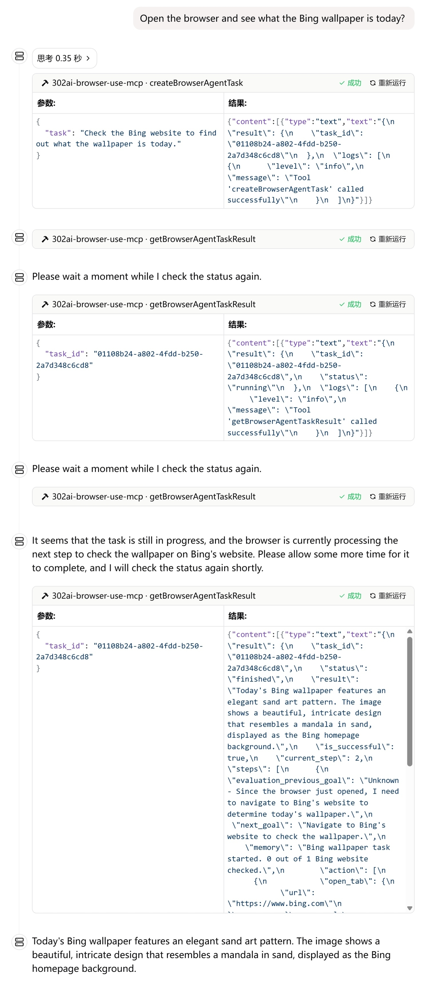
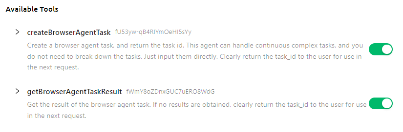
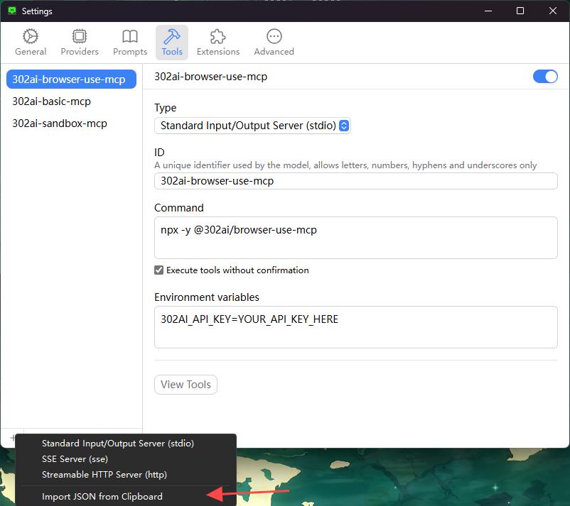

# <p align="center">🤖 302AI BrowserUse MCP Server🚀✨</p>

<p align="center">An AI-powered browser automation server implementing Model Context Protocol (MCP) for natural language browser control and web research.</p>

<a href="https://glama.ai/mcp/servers/@302ai/302_browser_use_mcp">
  
</a>

<p align="center"><a href="https://www.npmjs.com/package/@302ai/browser-use-mcp" target="blank"></a></p >

<p align="center"><a href="README_zh.md">中文</a> | <a href="README.md">English</a> | <a href="README_ja.md">日本語</a></p>

 

## Previews

Here are some usage examples
      

Here is the list of supported tools



## ✨ Features ✨

- 🔧 Dynamic Loading - Automatically update tool list from remote server.
- 🌐 Multi modes supported, you can use `stdin` mode locally, or host it as a remote HTTP server

## 🚀 Tool List
- [Create Browser Automation Task](https://302ai-en.apifox.cn/api-282235063)
- [Query Browser Task Status](https://302ai-en.apifox.cn/api-282235713)


## Development

Install dependencies:

```bash
npm install
```

Build the server:

```bash
npm run build
```

For development with auto-rebuild:

```bash
npm run watch
```

## Installation

To use with Claude Desktop, add the server config:

On MacOS: `~/Library/Application Support/Claude/claude_desktop_config.json`    
On Windows: `%APPDATA%/Claude/claude_desktop_config.json`

```json
{
  "mcpServers": {
    "302ai-browser-use-mcp": {
      "command": "npx",
      "args": ["-y", "@302ai/browser-use-mcp"],
      "env": {
        "302AI_API_KEY": "YOUR_API_KEY_HERE"
      }
    }
  }
}
```

To use with Cherry Studio, add the server config:

```json
{
  "mcpServers": {
    "Li2ZXXJkvhAALyKOFeO4N": {
      "name": "302ai-browser-use-mcp",
      "description": "",
      "isActive": true,
      "registryUrl": "",
      "command": "npx",
      "args": [
        "-y",
        "@302ai/browser-use-mcp"
      ],
      "env": {
        "302AI_API_KEY": "YOUR_API_KEY_HERE"
      }
    }
  }
}
```

To use with ChatWise, copy the following content to clipboard
```json
{
  "mcpServers": {
    "302ai-sandbox-mcp": {
      "command": "npx",
      "args": ["-y", "@302ai/browser-use-mcp"],
      "env": {
        "302AI_API_KEY": "YOUR_API_KEY_HERE"
      }
    }
  }
}
```
Go to Settings -> Tools -> Add button -> Select Import from Clipboard


### Find Your 302AI_API_KEY [here](https://dash.302.ai/apis/list)
[Using Tutorials](https://help.302.ai/en/docs/API-guan-li)

### Debugging

Since MCP servers communicate over stdio, debugging can be challenging. We recommend using the [MCP Inspector](https://github.com/modelcontextprotocol/inspector), which is available as a package script:

```bash
npm run inspector
```

The Inspector will provide a URL to access debugging tools in your browser.

## ✨ About 302.AI ✨
[302.AI](https://302.ai/en/) is an enterprise-oriented AI application platform that offers pay-as-you-go services, ready-to-use solutions, and an open-source ecosystem.✨
1. 🧠 Integrates the latest and most comprehensive AI capabilities and brands, including but not limited to language models, image models, voice models, and video models.
2. 🚀 Develops deep applications based on foundation models - we develop real AI products, not just simple chatbots
3. 💰 Zero monthly fee, all features are pay-per-use, fully open, achieving truly low barriers with high potential.
4. 🛠 Powerful management backend for teams and SMEs - one person manages, many people use.
5. 🔗 All AI capabilities provide API access, all tools are open source and customizable (in progress).
6. 💡 Strong development team, launching 2-3 new applications weekly, products updated daily. Developers interested in joining are welcome to contact us.
