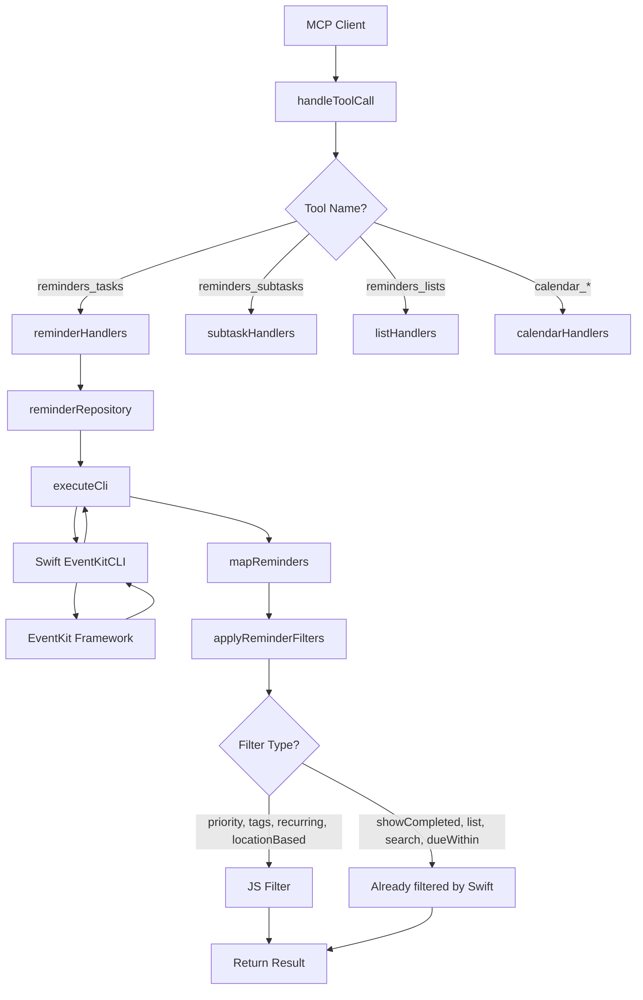

# Architecture

## Overview

This document describes the architectural changes required to implement the code review fixes.

---

## Current Architecture

```
┌─────────────────────────────────────────────────────────────┐
│                      MCP Client                              │
└─────────────────────────────────────────────────────────────┘
                              │
                              ▼
┌─────────────────────────────────────────────────────────────┐
│                    tools/index.ts                            │
│  ┌─────────────────────────────────────────────────────┐    │
│  │              handleToolCall()                        │    │
│  │  - Routes to appropriate handler                     │    │
│  │  - Validates action parameter                        │    │
│  └─────────────────────────────────────────────────────┘    │
└─────────────────────────────────────────────────────────────┘
                              │
                              ▼
┌─────────────────────────────────────────────────────────────┐
│                handlers/reminderHandlers.ts                  │
│  ┌─────────────────────────────────────────────────────┐    │
│  │  handleReadReminders()                               │    │
│  │  - Validates input via Zod                           │    │
│  │  - Calls reminderRepository.findReminders()          │    │
│  └─────────────────────────────────────────────────────┘    │
└─────────────────────────────────────────────────────────────┘
                              │
                              ▼
┌─────────────────────────────────────────────────────────────┐
│              utils/reminderRepository.ts                     │
│  ┌─────────────────────────────────────────────────────┐    │
│  │  findReminders()                                     │    │
│  │  1. Build CLI args with filters                      │    │
│  │  2. executeCli() -> Swift binary                     │    │
│  │  3. applyReminderFilters() -> JS filtering           │    │
│  └─────────────────────────────────────────────────────┘    │
└─────────────────────────────────────────────────────────────┘
                              │
                              ▼
┌─────────────────────────────────────────────────────────────┐
│                 Swift EventKitCLI                           │
│  - Handles: showCompleted, filterList, search, dueWithin    │
│  - Uses Calendar.current for locale-aware date filtering    │
└─────────────────────────────────────────────────────────────┘
```

---

## Proposed Architecture

### Change 1: Simplified Filter Flow

```
Before:
┌─────────────────┐    ┌─────────────────┐    ┌─────────────────┐
│ TypeScript      │───▶│ Swift CLI       │───▶│ JS Filtering    │
│ (build args)    │    │ (filter data)   │    │ (re-filter)     │
└─────────────────┘    └─────────────────┘    └─────────────────┘

After:
┌─────────────────┐    ┌─────────────────┐    ┌─────────────────┐
│ TypeScript      │───▶│ Swift CLI       │───▶│ JS Filtering    │
│ (build args)    │    │ (filter data)   │    │ (tags/priority  │
│                 │    │                 │    │  only)          │
└─────────────────┘    └─────────────────┘    └─────────────────┘
```

### Change 2: Filter Responsibility Matrix

| Filter | Before | After |
|--------|--------|-------|
| showCompleted | CLI + JS | CLI only |
| list (filterList) | CLI + JS | CLI only |
| search | CLI + JS | CLI only |
| dueWithin | CLI + JS | CLI only |
| priority | JS | JS |
| recurring | JS | JS |
| locationBased | JS | JS |
| tags | JS | JS |

---

## Component Details

### 1. reminderRepository.ts Changes

**Location:** `src/utils/reminderRepository.ts`

**Current Code (lines 143-164):**
```typescript
async findReminders(filters: ReminderFilters = {}): Promise<Reminder[]> {
  const args = ['--action', 'read'];
  addOptionalBooleanArg(args, '--showCompleted', filters.showCompleted ?? true);
  addOptionalArg(args, '--filterList', filters.list);
  addOptionalArg(args, '--search', filters.search);
  addOptionalArg(args, '--dueWithin', filters.dueWithin);

  const { reminders } = await executeCli<ReminderReadResult>(args);
  const normalizedReminders = this.mapReminders(reminders);

  return applyReminderFilters(normalizedReminders, {
    ...filters,  // All filters passed to JS
    showCompleted: undefined,
    list: undefined,
    search: undefined,
    dueWithin: undefined,
  });
}
```

**Proposed Code:**
```typescript
async findReminders(filters: ReminderFilters = {}): Promise<Reminder[]> {
  const args = ['--action', 'read'];
  addOptionalBooleanArg(args, '--showCompleted', filters.showCompleted ?? false);
  addOptionalArg(args, '--filterList', filters.list);
  addOptionalArg(args, '--search', filters.search);
  addOptionalArg(args, '--dueWithin', filters.dueWithin);

  const { reminders } = await executeCli<ReminderReadResult>(args);
  const normalizedReminders = this.mapReminders(reminders);

  // Only JS-side filters (not handled by Swift CLI)
  return applyReminderFilters(normalizedReminders, {
    priority: filters.priority,
    recurring: filters.recurring,
    locationBased: filters.locationBased,
    tags: filters.tags,
  });
}
```

### 2. dateUtils.ts Changes

**Location:** `src/utils/dateUtils.ts`

**Current Code (lines 25-35):**
```typescript
export function getWeekStart(): Date {
  const today = getTodayStart();
  const dayOfWeek = today.getDay(); // 0=Sunday, 6=Saturday
  const weekStart = new Date(today);
  weekStart.setDate(today.getDate() - dayOfWeek);
  return weekStart;
}
```

**Proposed Code:**
```typescript
export function getWeekStart(locale?: string): Date {
  const today = getTodayStart();
  const dayOfWeek = today.getDay(); // 0=Sunday, 6=Saturday

  let firstDay = 0; // Default: Sunday

  try {
    const resolvedLocale = locale ?? Intl.DateTimeFormat().resolvedOptions().locale;
    const localeObj = new Intl.Locale(resolvedLocale);
    const weekInfo = (localeObj as Intl.Locale & { weekInfo?: { firstDay?: number } }).weekInfo;
    if (weekInfo?.firstDay !== undefined) {
      firstDay = weekInfo.firstDay === 7 ? 0 : weekInfo.firstDay;
    }
  } catch {
    // Fallback to Sunday
  }

  const weekStart = new Date(today);
  weekStart.setDate(today.getDate() - ((dayOfWeek - firstDay + 7) % 7));
  return weekStart;
}
```

### 3. schemas.ts Changes

**Location:** `src/validation/schemas.ts`

**Current Code (lines 21-22):**
```typescript
const URL_PATTERN =
  /^https?:\/\/(?!(?:127\.|192\.168\.|10\.|localhost|0\.0\.0\.0))[a-zA-Z0-9]([a-zA-Z0-9-]{0,61}[a-zA-Z0-9])?(\.[a-zA-Z0-9]([a-zA-Z0-9-]{0,61}[a-zA-Z0-9])?)*(?:\/[^\s<>"{}|\\^`[\]]*)?$/i;
```

**Proposed Code:**
```typescript
const URL_PATTERN = new RegExp(
  '^https?://' +
  '(?!' +
    '(?:127\\.|192\\.168\\.|10\\.|172\\.(?:1[6-9]|2[0-9]|3[01])\\.|169\\.254\\.|0\\.0\\.0\\.0|localhost)' +
    '|(?:\\[?::1\\]?|\\[?::\\]?|\\[?fe[89ab][0-9a-f]:)' +
    '|(?:169\\.254\\.169\\.254|100\\.100\\.100\\.200|metadata\\.google\\.internal)' +
  ')' +
  '[a-zA-Z0-9]([a-zA-Z0-9-]{0,61}[a-zA-Z0-9])?' +
  '(\\.[a-zA-Z0-9]([a-zA-Z0-9-]{0,61}[a-zA-Z0-9])?)*' +
  '(?:\\/[^\\s<>"{}|\\\\^`\\[\\]]*)?' +
  '$',
  'i'
);
```

### 4. errorHandling.ts Changes

**Location:** `src/utils/errorHandling.ts`

**Proposed Addition:**
```typescript
function isDevelopmentMode(): boolean {
  const nodeEnv = process.env.NODE_ENV?.toLowerCase();
  const debugMode = process.env.DEBUG?.toLowerCase();

  return nodeEnv === 'development' ||
         nodeEnv === 'dev' ||
         debugMode === 'true' ||
         debugMode === '1';
}
```

### 5. New Test File

**Location:** `src/tools/reminders_subtasks.test.ts`

```typescript
describe('reminders_subtasks tool routing', () => {
  it.each([
    ['read', handleReadSubtasks, { action: 'read' as const, reminderId: 'reminder-123' }],
    ['create', handleCreateSubtask, { action: 'create' as const, reminderId: 'reminder-123', title: 'New subtask' }],
    ['update', handleUpdateSubtask, { action: 'update' as const, reminderId: 'reminder-123', subtaskId: 'abc', title: 'Updated' }],
    ['delete', handleDeleteSubtask, { action: 'delete' as const, reminderId: 'reminder-123', subtaskId: 'abc' }],
    ['toggle', handleToggleSubtask, { action: 'toggle' as const, reminderId: 'reminder-123', subtaskId: 'abc' }],
    ['reorder', handleReorderSubtasks, { action: 'reorder' as const, reminderId: 'reminder-123', order: ['a', 'b', 'c'] }],
  ])('should route action=%s correctly', async (_action, mockHandler, args) => {
    const expectedResult = { content: [{ type: 'text', text: 'Success' }], isError: false };
    (mockHandler as jest.Mock).mockResolvedValue(expectedResult);

    const result = await handleToolCall('reminders_subtasks', args);

    expect(mockHandler).toHaveBeenCalledWith(args);
    expect(result).toEqual(expectedResult);
  });
});
```

---

## Data Flow Diagram



---

## File Modification Summary

| File | Lines Changed | Change Type |
|------|---------------|-------------|
| `src/utils/reminderRepository.ts` | 143-164 | Simplify filter handling |
| `src/utils/dateUtils.ts` | 25-46 | Add locale-aware week start |
| `src/validation/schemas.ts` | 21-22 | Enhance URL pattern |
| `src/utils/errorHandling.ts` | 39-58 | Add isDevelopmentMode() |
| `src/utils/cliExecutor.ts` | 148-160 | Add JSDoc documentation |
| `src/tools/reminders_subtasks.test.ts` | New file | Add test coverage |

---

## Risk Assessment

| Risk | Likelihood | Impact | Mitigation |
|------|------------|--------|------------|
| Intl.Locale not available | Low | Low | Fallback to Sunday |
| Breaking existing filter behavior | Low | Medium | Update tests, document change |
| SSRF regex false positives | Low | Low | Test against known URL patterns |
| Environment detection edge cases | Low | Low | Default to production-safe |
