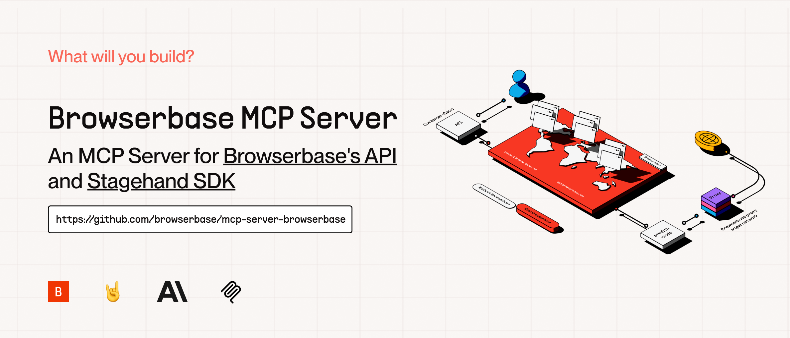
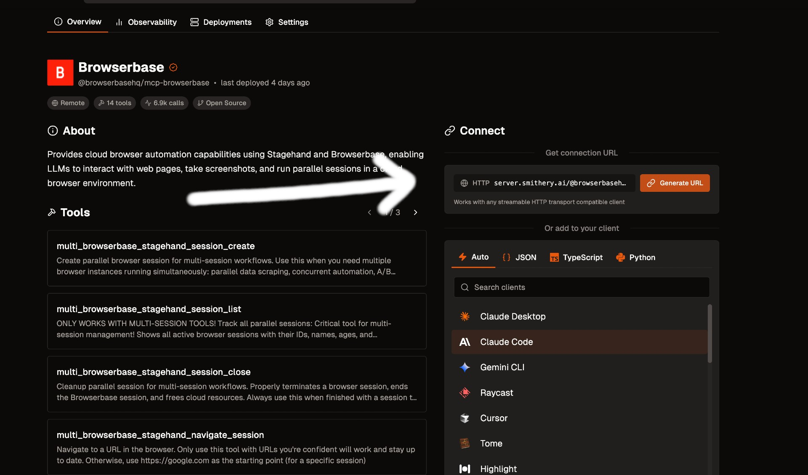

# Browserbase MCP Server

[](https://smithery.ai/server/@browserbasehq/mcp-browserbase)



[The Model Context Protocol (MCP)](https://modelcontextprotocol.io/introduction) is an open protocol that enables seamless integration between LLM applications and external data sources and tools. Whether you're building an AI-powered IDE, enhancing a chat interface, or creating custom AI workflows, MCP provides a standardized way to connect LLMs with the context they need.

This server provides cloud browser automation capabilities using [Browserbase](https://www.browserbase.com/) and [Stagehand](https://github.com/browserbase/stagehand). It enables LLMs to interact with web pages, take screenshots, extract information, and perform automated actions with atomic precision.

## What's New in Stagehand v3

Powered by [Stagehand v3.0](https://github.com/browserbase/stagehand), this MCP server now includes:

- **20-40% Faster Performance**: Speed improvements across all core operations (`act`, `extract`, `observe`) through automatic caching
- **Enhanced Extraction**: Targeted extraction and observation across iframes and shadow roots
- **Improved Schemas**: Streamlined extract schemas for more intuitive data extraction
- **Advanced Selector Support**: CSS selector support with improved element targeting
- **Multi-Browser Support**: Compatible with Playwright, Puppeteer, and Patchright
- **New Primitives**: Built-in `page`, `locator`, `frameLocator`, and `deepLocator` for simplified automation
- **Experimental Features**: Enable cutting-edge capabilities with the `--experimental` flag

For more details, visit the [Stagehand v3 documentation](https://docs.stagehand.dev/).

## Features

| Feature            | Description                                                 |
| ------------------ | ----------------------------------------------------------- |
| Browser Automation | Control and orchestrate cloud browsers via Browserbase      |
| Data Extraction    | Extract structured data from any webpage                    |
| Web Interaction    | Navigate, click, and fill forms with ease                   |
| Screenshots        | Capture full-page and element screenshots                   |
| Model Flexibility  | Supports multiple models (OpenAI, Claude, Gemini, and more) |
| Vision Support     | Use annotated screenshots for complex DOMs                  |
| Session Management | Create, manage, and close browser sessions                  |
| High Performance   | 20-40% faster operations with automatic caching (v3)        |
| Advanced Selectors | Enhanced CSS selector support for precise element targeting |

## How to Setup

### Quickstarts:

#### Add to Cursor

Copy and Paste this link in your Browser:

```text
cursor://anysphere.cursor-deeplink/mcp/install?name=browserbase&config=eyJjb21tYW5kIjoibnB4IEBicm93c2VyYmFzZWhxL21jcCIsImVudiI6eyJCUk9XU0VSQkFTRV9BUElfS0VZIjoiIiwiQlJPV1NFUkJBU0VfUFJPSkVDVF9JRCI6IiIsIkdFTUlOSV9BUElfS0VZIjoiIn19
```

We currently support 2 transports for our MCP server, STDIO and SHTTP. We recommend you use SHTTP with our remote hosted url to take advantage of the server at full capacity.

## SHTTP:

To use the Browserbase MCP Server through our remote hosted URL, add the following to your configuration.

Go to [smithery.ai](https://smithery.ai/server/@browserbasehq/mcp-browserbase) and enter your API keys and configuration to get a remote hosted URL.
When using our remote hosted server, we provide the LLM costs for Gemini, the [best performing model](https://www.stagehand.dev/evals) in [Stagehand](https://www.stagehand.dev).



If your client supports SHTTP:

```json
{
  "mcpServers": {
    "browserbase": {
      "type": "http",
      "url": "your-smithery-url.com"
    }
  }
}
```

If your client doesn't support SHTTP:

```json
{
  "mcpServers": {
    "browserbase": {
      "command": "npx",
      "args": ["mcp-remote", "your-smithery-url.com"]
    }
  }
}
```

## STDIO:

You can either use our Server hosted on NPM or run it completely locally by cloning this repo.

> **❗️ Important:** If you want to use a different model you have to add --modelName to the args and provide that respective key as an arg. More info below.

### To run on NPM (Recommended)

Go into your MCP Config JSON and add the Browserbase Server:

```json
{
  "mcpServers": {
    "browserbase": {
      "command": "npx",
      "args": ["@browserbasehq/mcp-server-browserbase"],
      "env": {
        "BROWSERBASE_API_KEY": "",
        "BROWSERBASE_PROJECT_ID": "",
        "GEMINI_API_KEY": ""
      }
    }
  }
}
```

That's it! Reload your MCP client and Claude will be able to use Browserbase.

### To run 100% local:

#### Option 1: Direct installation

```bash
# Clone the Repo
git clone https://github.com/browserbase/mcp-server-browserbase.git
cd mcp-server-browserbase

# Install the dependencies and build the project
npm install && npm run build
```

#### Option 2: Docker

```bash
# Clone the Repo
git clone https://github.com/browserbase/mcp-server-browserbase.git
cd mcp-server-browserbase

# Build the Docker image
docker build -t mcp-browserbase .
```

Then in your MCP Config JSON run the server. To run locally we can use STDIO or self-host SHTTP.

### STDIO:

#### Using Direct Installation

To your MCP Config JSON file add the following:

```json
{
  "mcpServers": {
    "browserbase": {
      "command": "node",
      "args": ["/path/to/mcp-server-browserbase/cli.js"],
      "env": {
        "BROWSERBASE_API_KEY": "",
        "BROWSERBASE_PROJECT_ID": "",
        "GEMINI_API_KEY": ""
      }
    }
  }
}
```

#### Using Docker

To your MCP Config JSON file add the following:

```json
{
  "mcpServers": {
    "browserbase": {
      "command": "docker",
      "args": [
        "run",
        "--rm",
        "-i",
        "-e",
        "BROWSERBASE_API_KEY",
        "-e",
        "BROWSERBASE_PROJECT_ID",
        "-e",
        "GEMINI_API_KEY",
        "mcp-browserbase"
      ],
      "env": {
        "BROWSERBASE_API_KEY": "",
        "BROWSERBASE_PROJECT_ID": "",
        "GEMINI_API_KEY": ""
      }
    }
  }
}
```

Then reload your MCP client and you should be good to go!

## Configuration

The Browserbase MCP server accepts the following command-line flags:

| Flag                       | Description                                                                 |
| -------------------------- | --------------------------------------------------------------------------- |
| `--proxies`                | Enable Browserbase proxies for the session                                  |
| `--advancedStealth`        | Enable Browserbase Advanced Stealth (Only for Scale Plan Users)             |
| `--keepAlive`              | Enable Browserbase Keep Alive Session                                       |
| `--contextId <contextId>`  | Specify a Browserbase Context ID to use                                     |
| `--persist`                | Whether to persist the Browserbase context (default: true)                  |
| `--port <port>`            | Port to listen on for HTTP/SHTTP transport                                  |
| `--host <host>`            | Host to bind server to (default: localhost, use 0.0.0.0 for all interfaces) |
| `--browserWidth <width>`   | Browser viewport width (default: 1024)                                      |
| `--browserHeight <height>` | Browser viewport height (default: 768)                                      |
| `--modelName <model>`      | The model to use for Stagehand (default: gemini-2.0-flash)                  |
| `--modelApiKey <key>`      | API key for the custom model provider (required when using custom models)   |
| `--experimental`           | Enable experimental features (default: false)                               |

These flags can be passed directly to the CLI or configured in your MCP configuration file.

### NOTE:

Currently, these flags can only be used with the local server (npx @browserbasehq/mcp-server-browserbase or Docker).

### Using Configuration Flags with Docker

When using Docker, you can pass configuration flags as additional arguments after the image name. Here's an example with the `--proxies` flag:

```json
{
  "mcpServers": {
    "browserbase": {
      "command": "docker",
      "args": [
        "run",
        "--rm",
        "-i",
        "-e",
        "BROWSERBASE_API_KEY",
        "-e",
        "BROWSERBASE_PROJECT_ID",
        "-e",
        "GEMINI_API_KEY",
        "mcp-browserbase",
        "--proxies"
      ],
      "env": {
        "BROWSERBASE_API_KEY": "",
        "BROWSERBASE_PROJECT_ID": "",
        "GEMINI_API_KEY": ""
      }
    }
  }
}
```

You can also run the Docker container directly from the command line:

```bash
docker run --rm -i \
  -e BROWSERBASE_API_KEY=your_api_key \
  -e BROWSERBASE_PROJECT_ID=your_project_id \
  -e GEMINI_API_KEY=your_gemini_key \
  mcp-browserbase --proxies
```

## Configuration Examples

### Proxies

Here are our docs on [Proxies](https://docs.browserbase.com/features/proxies).

To use proxies, set the --proxies flag in your MCP Config:

```json
{
  "mcpServers": {
    "browserbase": {
      "command": "npx",
      "args": ["@browserbasehq/mcp-server-browserbase", "--proxies"],
      "env": {
        "BROWSERBASE_API_KEY": "",
        "BROWSERBASE_PROJECT_ID": "",
        "GEMINI_API_KEY": ""
      }
    }
  }
}
```

### Advanced Stealth

Here are our docs on [Advanced Stealth](https://docs.browserbase.com/features/stealth-mode#advanced-stealth-mode).

To use advanced stealth, set the --advancedStealth flag in your MCP Config:

```json
{
  "mcpServers": {
    "browserbase": {
      "command": "npx",
      "args": ["@browserbasehq/mcp-server-browserbase", "--advancedStealth"],
      "env": {
        "BROWSERBASE_API_KEY": "",
        "BROWSERBASE_PROJECT_ID": "",
        "GEMINI_API_KEY": ""
      }
    }
  }
}
```

### Contexts

Here are our docs on [Contexts](https://docs.browserbase.com/features/contexts)

To use contexts, set the --contextId flag in your MCP Config:

```json
{
  "mcpServers": {
    "browserbase": {
      "command": "npx",
      "args": [
        "@browserbasehq/mcp-server-browserbase",
        "--contextId",
        "<YOUR_CONTEXT_ID>"
      ],
      "env": {
        "BROWSERBASE_API_KEY": "",
        "BROWSERBASE_PROJECT_ID": "",
        "GEMINI_API_KEY": ""
      }
    }
  }
}
```

### Browser Viewport Sizing

The default viewport sizing for a browser session is 1024 x 768. You can adjust the Browser viewport sizing with browserWidth and browserHeight flags.

Here's how to use it for custom browser sizing. We recommend to stick with 16:9 aspect ratios (ie: 1920 x 1080, 1280 x 720, 1024 x 768)

```json
{
  "mcpServers": {
    "browserbase": {
      "command": "npx",
      "args": [
        "@browserbasehq/mcp-server-browserbase",
        "--browserHeight 1080",
        "--browserWidth 1920"
      ],
      "env": {
        "BROWSERBASE_API_KEY": "",
        "BROWSERBASE_PROJECT_ID": "",
        "GEMINI_API_KEY": ""
      }
    }
  }
}
```

### Experimental Features

Stagehand v3 includes experimental features that can be enabled with the `--experimental` flag. These features provide cutting-edge capabilities that are actively being developed and refined.

To enable experimental features:

```json
{
  "mcpServers": {
    "browserbase": {
      "command": "npx",
      "args": ["@browserbasehq/mcp-server-browserbase", "--experimental"],
      "env": {
        "BROWSERBASE_API_KEY": "",
        "BROWSERBASE_PROJECT_ID": "",
        "GEMINI_API_KEY": ""
      }
    }
  }
}
```

_Note: Experimental features may change or be removed in future releases. Use them at your own discretion._

### Model Configuration

Stagehand defaults to using Google's Gemini 2.0 Flash model, but you can configure it to use other models like GPT-4o, Claude, or other providers.

**Important**: When using any custom model (non-default), you must provide your own API key for that model provider using the `--modelApiKey` flag.

Here's how to configure different models:

```json
{
  "mcpServers": {
    "browserbase": {
      "command": "npx",
      "args": [
        "@browserbasehq/mcp-server-browserbase",
        "--modelName",
        "anthropic/claude-sonnet-4.5",
        "--modelApiKey",
        "your-anthropic-api-key"
      ],
      "env": {
        "BROWSERBASE_API_KEY": "",
        "BROWSERBASE_PROJECT_ID": ""
      }
    }
  }
}
```

_Note: The model must be supported in Stagehand. Check out the docs [here](https://docs.stagehand.dev/examples/custom_llms#supported-llms). When using any custom model, you must provide your own API key for that provider._

### Resources

The server provides access to screenshot resources:

1. **Screenshots** (`screenshot://<screenshot-name>`)
   - PNG images of captured screenshots

## Key Features

- **AI-Powered Automation**: Natural language commands for web interactions
- **Multi-Model Support**: Works with OpenAI, Claude, Gemini, and more
- **Screenshot Capture**: Full-page and element-specific screenshots
- **Data Extraction**: Intelligent content extraction from web pages
- **Proxy Support**: Enterprise-grade proxy capabilities
- **Stealth Mode**: Advanced anti-detection features
- **Context Persistence**: Maintain authentication and state across sessions

For more information about the Model Context Protocol, visit:

- [MCP Documentation](https://modelcontextprotocol.io/docs)
- [MCP Specification](https://spec.modelcontextprotocol.io/)

For the official MCP Docs:

- [Browserbase MCP](https://docs.browserbase.com/integrations/mcp/introduction)

## License

Licensed under the Apache 2.0 License.

Copyright 2025 Browserbase, Inc.
