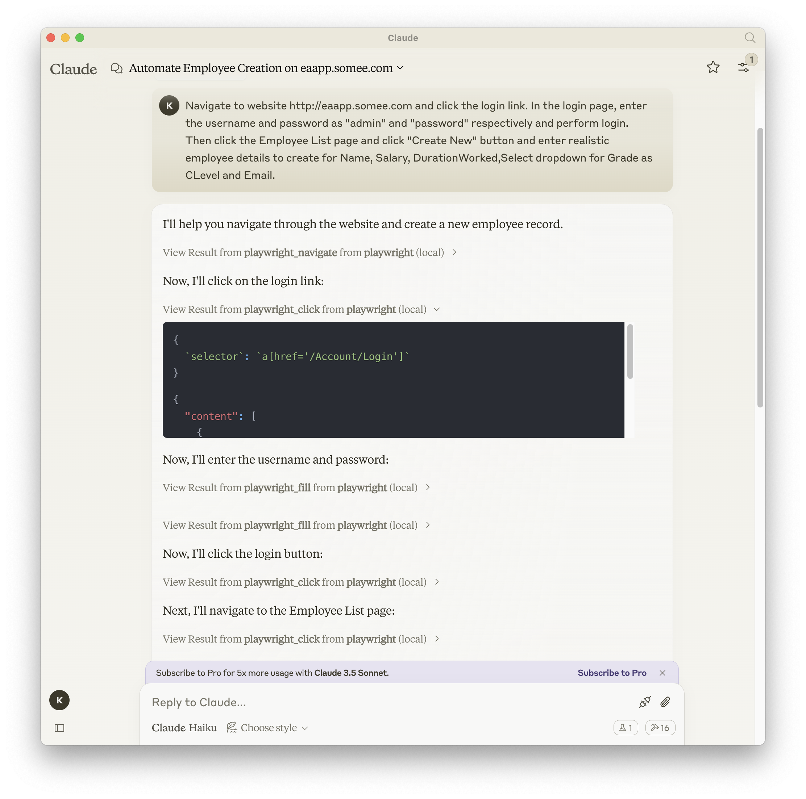

<div align="center" markdown="1">
  <table>
    <tr>
      <td align="center" valign="middle">
        <a href="https://mseep.ai/app/executeautomation-mcp-playwright">
          
        </a>
      </td>
    </tr>
    <tr>
      <td align="center"><sub>MseeP.ai Security Assessment</sub></td>
    </tr>
  </table>
</div>
<hr>

# Playwright MCP Server 🎭

[](https://archestra.ai/mcp-catalog/executeautomation__mcp-playwright)
[](https://smithery.ai/server/@executeautomation/playwright-mcp-server)

A Model Context Protocol server that provides browser automation capabilities using Playwright. This server enables LLMs to interact with web pages, take screenshots, generate test code, web scrapes the page and execute JavaScript in a real browser environment.

<a href="https://glama.ai/mcp/servers/yh4lgtwgbe"></a>

## ✨ What's New in v1.0.10

### 🎯 Device Emulation with 143 Real Device Presets!

Test your web applications on **real device profiles** with a simple command:

```javascript
// Test on iPhone 13 with automatic user-agent, touch support, and device pixel ratio
await playwright_resize({ device: "iPhone 13" });

// Switch to iPad with landscape orientation
await playwright_resize({ device: "iPad Pro 11", orientation: "landscape" });

// Test desktop view
await playwright_resize({ device: "Desktop Chrome" });
```

**Natural Language Support for AI Assistants:**
- "Test on iPhone 13" 
- "Switch to iPad view"
- "Rotate to landscape"

**Supports 143 devices:** iPhone, iPad, Pixel, Galaxy, and Desktop browsers with proper emulation of viewport, user-agent, touch events, and device pixel ratios.

📚 [View Device Quick Reference](https://executeautomation.github.io/mcp-playwright/docs/playwright-web/Device-Quick-Reference) | [Prompt Guide](https://executeautomation.github.io/mcp-playwright/docs/playwright-web/Resize-Prompts-Guide)

## Screenshot


## [Documentation](https://executeautomation.github.io/mcp-playwright/) | [API reference](https://executeautomation.github.io/mcp-playwright/docs/playwright-web/Supported-Tools)

## Installation

You can install the package using either npm, mcp-get, or Smithery:

Using npm:
```bash
npm install -g @executeautomation/playwright-mcp-server
```

Using mcp-get:
```bash
npx @michaellatman/mcp-get@latest install @executeautomation/playwright-mcp-server
```
Using Smithery

To install Playwright MCP for Claude Desktop automatically via [Smithery](https://smithery.ai/server/@executeautomation/playwright-mcp-server):

```bash
npx @smithery/cli install @executeautomation/playwright-mcp-server --client claude
```

Using Claude Code:
```bash
claude mcp add --transport stdio playwright npx @executeautomation/playwright-mcp-server
```


#### Installation in VS Code

Install the Playwright MCP server in VS Code using one of these buttons:

<!--
// Generate using?:
const config = JSON.stringify({ name: 'playwright', command: 'npx', args: ["-y", "@executeautomation/playwright-mcp-server"] });
const urlForWebsites = `vscode:mcp/install?${encodeURIComponent(config)}`;
// Github markdown does not allow linking to `vscode:` directly, so you can use our redirect:
const urlForGithub = `https://insiders.vscode.dev/redirect?url=${encodeURIComponent(urlForWebsites)}`;
-->

[](https://insiders.vscode.dev/redirect?url=vscode%3Amcp%2Finstall%3F%257B%2522name%2522%253A%2522playwright%2522%252C%2522command%2522%253A%2522npx%2522%252C%2522args%2522%253A%255B%2522-y%2522%252C%2522%2540executeautomation%252Fplaywright-mcp-server%2522%255D%257D) 
[](https://insiders.vscode.dev/redirect?url=vscode-insiders%3Amcp%2Finstall%3F%257B%2522name%2522%253A%2522playwright%2522%252C%2522command%2522%253A%2522npx%2522%252C%2522args%2522%253A%255B%2522-y%2522%252C%2522%2540executeautomation%252Fplaywright-mcp-server%2522%255D%257D)

Alternatively, you can install the Playwright MCP server using the VS Code CLI:

```bash
# For VS Code
code --add-mcp '{"name":"playwright","command":"npx","args":["@executeautomation/playwright-mcp-server"]}'
```

```bash
# For VS Code Insiders
code-insiders --add-mcp '{"name":"playwright","command":"npx","args":["@executeautomation/playwright-mcp-server"]}'
```

After installation, the ExecuteAutomation Playwright MCP server will be available for use with your GitHub Copilot agent in VS Code.

## Browser Installation

### Automatic Installation (Recommended)

The Playwright MCP Server **automatically installs browser binaries** when you first use it. When the server detects that a browser is missing, it will:

1. Automatically download and install the required browser (Chromium, Firefox, or WebKit)
2. Display installation progress in the console
3. Retry your request once installation completes

**No manual setup required!** Just start using the server, and it handles browser installation for you.

### Manual Installation (Optional)

If you prefer to install browsers manually or encounter any issues with automatic installation:

```bash
# Install all browsers
npx playwright install

# Or install specific browsers
npx playwright install chromium
npx playwright install firefox
npx playwright install webkit
```

### Browser Storage Location

Browsers are installed to:
- **Windows:** `%USERPROFILE%\AppData\Local\ms-playwright`
- **macOS:** `~/Library/Caches/ms-playwright`
- **Linux:** `~/.cache/ms-playwright`

## Configuration to use Playwright Server

### Standard Mode (stdio)

This is the **recommended mode for Claude Desktop**.

```json
{
  "mcpServers": {
    "playwright": {
      "command": "npx",
      "args": ["-y", "@executeautomation/playwright-mcp-server"]
    }
  }
}
```

**Note:** In stdio mode, logging is automatically directed to files only (not console) to maintain clean JSON-RPC communication. Logs are written to `~/playwright-mcp-server.log`.

### HTTP Mode (Standalone Server)

When running headed browser on systems without display or from worker processes of IDEs, you can run the MCP server as a standalone HTTP server:

> **Note for Claude Desktop Users:** Claude Desktop currently requires stdio mode (command/args configuration). HTTP mode is recommended for VS Code, custom clients, and remote deployments. See [CLAUDE_DESKTOP_CONFIG.md](CLAUDE_DESKTOP_CONFIG.md) for details.

#### Starting the HTTP Server

```bash
# Using npx
npx @executeautomation/playwright-mcp-server --port 8931

# Or after global installation
playwright-mcp-server --port 8931
```

The server will start and display available endpoints:

```
==============================================
Playwright MCP Server (HTTP Mode)
==============================================
Port: 8931

ENDPOINTS:
- SSE Stream:     GET  http://localhost:8931/sse
- Messages:       POST http://localhost:8931/messages?sessionId=<id>
- MCP (unified):  GET  http://localhost:8931/mcp
- MCP (unified):  POST http://localhost:8931/mcp?sessionId=<id>
- Health Check:   GET  http://localhost:8931/health
==============================================
```

#### Client Configuration for HTTP Mode

> **⚠️ CRITICAL:** The `"type": "http"` field is **REQUIRED** for HTTP/SSE transport!

**For VS Code GitHub Copilot:**
```json
{
  "github.copilot.chat.mcp.servers": {
    "playwright": {
      "url": "http://localhost:8931/mcp",
      "type": "http"
    }
  }
}
```

**For Custom MCP Clients:**
```json
{
  "mcpServers": {
    "playwright": {
      "url": "http://localhost:8931/mcp",
      "type": "http"
    }
  }
}
```

**Important:** Without `"type": "http"`, the connection will fail.

**For Claude Desktop:** Use stdio mode instead (see Standard Mode above)

#### Use Cases for HTTP Mode

- Running headed browsers on systems without display (e.g., remote servers)
- Integrating with VS Code GitHub Copilot
- Running the server as a background service
- Accessing the server from multiple clients
- Debugging with the `/health` endpoint
- Custom MCP client integrations

**Monitoring:** The server includes a monitoring system that starts on a dynamically allocated port (avoiding conflicts). Check the console output for the actual port.

**Note:** For Claude Desktop, continue using stdio mode (Standard Mode above) for now.

## Troubleshooting

### "No transport found for sessionId" Error

**Symptom:** 400 error with message "Bad Request: No transport found for sessionId"

**Solution:**
1. **Check configuration includes `"type": "http"`**
   ```json
   {
     "url": "http://localhost:8931/mcp",
     "type": "http"  // ← This is REQUIRED!
   }
   ```

2. **Verify server logs show connection:**
   ```bash
   # Should see these in order:
   # 1. "Incoming request" - GET /mcp
   # 2. "Transport registered" - with sessionId
   # 3. "POST message received" - with same sessionId
   ```

3. **Restart both server and client**

### Connection Issues

- **Server not starting:** Check if port 8931 is available
- **External access blocked:** This is by design (security). Server binds to localhost only
- **For remote access:** Use SSH tunneling:
  ```bash
  ssh -L 8931:localhost:8931 user@remote-server
  ```

## Testing

This project uses Jest for testing. The tests are located in the `src/__tests__` directory.

### Running Tests

You can run the tests using one of the following commands:

```bash
# Run tests using the custom script (with coverage)
node run-tests.cjs

# Run tests using npm scripts
npm test           # Run tests without coverage
npm run test:coverage  # Run tests with coverage
npm run test:custom    # Run tests with custom script (same as node run-tests.cjs)
```

The test coverage report will be generated in the `coverage` directory.

### Running evals

The evals package loads an mcp client that then runs the index.ts file, so there is no need to rebuild between tests. You can load environment variables by prefixing the npx command. Full documentation can be found [here](https://www.mcpevals.io/docs).

```bash
OPENAI_API_KEY=your-key  npx mcp-eval src/evals/evals.ts src/tools/codegen/index.ts
```

## Contributing

When adding new tools, please be mindful of the tool name length. Some clients, like Cursor, have a 60-character limit for the combined server and tool name (`server_name:tool_name`).

Our server name is `playwright-mcp`. Please ensure your tool names are short enough to not exceed this limit.

## Star History

[](https://star-history.com/#executeautomation/mcp-playwright&Date)
