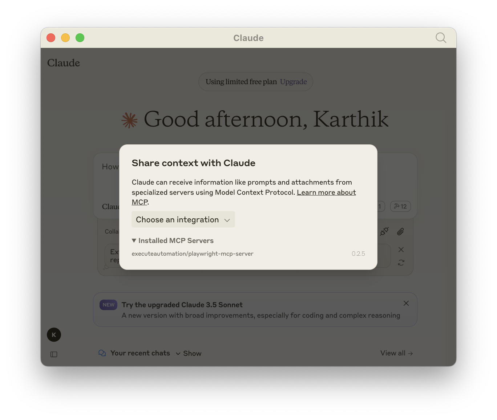
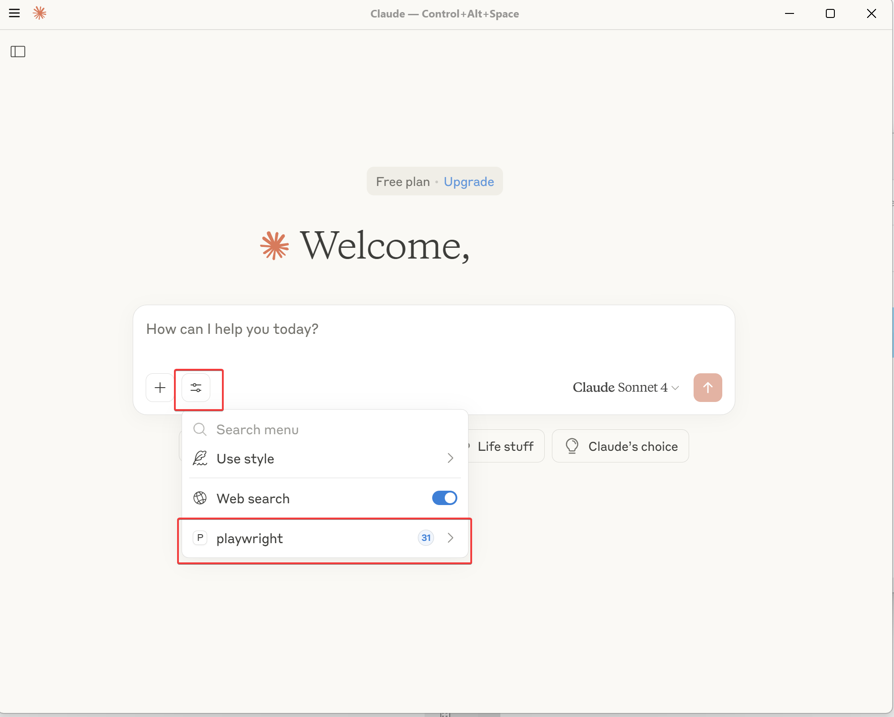

## Build and Run Playwright MCP Server locally
To build/run Playwright MCP Server in your local machine follow the below steps

### Step 1 : Clone Repository

```bash
git clone https://github.com/executeautomation/mcp-playwright.git
```

## Step 2: Install Dependencies
```bash
cd mcp-playwright
npm install
```

## Step 3: Build Code
```bash
npm install --save-dev typescript
npm run build
npm link
```

## Step 4: Configuring Playwright MCP in Claude Desktop 

Modify your `claude-desktop-config.json` file as shown below to work with local playwright mcp server
The file is generally located at `C:\Users\{yourusername}\AppData\Roaming\Claude`

```json
{
  "mcpServers": {
    "playwright": {
      "command": "npx",
      "args": [
        "--directory",
        "/your-playwright-mcp-server-clone-directory",
        "run",
        "@executeautomation/playwright-mcp-server"
      ]
    }
  }
}
```
if you are using windows, and let's say your clone directory is `D:/automation/mcp-playwright`, 
then you should replace "/your-playwright-mcp-server-clone-directory" with `D:/automation/mcp-playwright` 
not \ but we have to use / for config file.


:::warning Important  
After modifying the `claude-desktop-config.json` file, you **must** completely close Claude Desktop and **manually terminate** any running processes from **Task Manager** (Windows 10/11).  

⚠️ If you skip this step, the configuration changes **may not take effect**.  
:::

## Reward
If your setup is all correct, you should see Playwright MCP Server pointing your local machine source code



