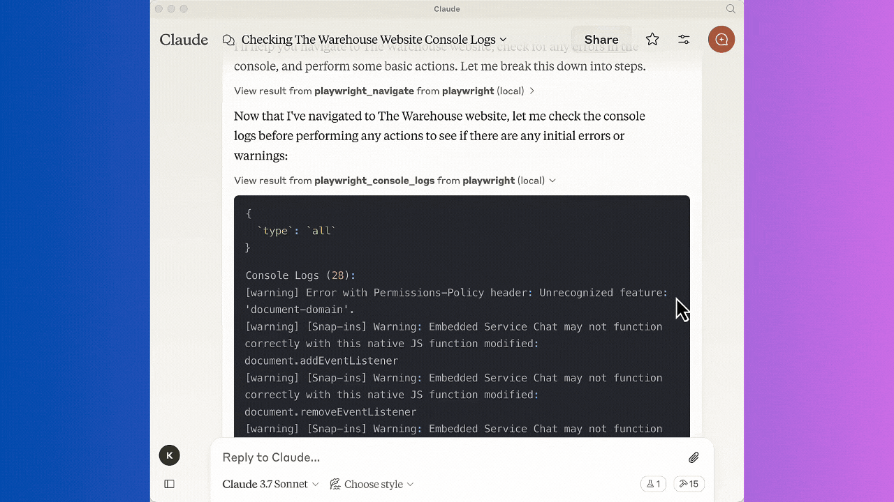

# 📁 Support of Console Logs

Playwright MCP Server now supports Console logging of browsers with the power of Playwright.
This feature is especially useful when you want to capture the logs of the browser console while performing any action during development and testing.

Following logs types are supported 
  - `log`
  - `info`
  - `warn`
  - `error`
  - `debug`
  - `all`

:::tip Usage Example
To invoke `Playwright_console_logs` via MCP Playwright, use the following prompt:

```plaintext
Get the console log from the browser whenever you perform any action.
:::

---
:::info


Demo of how the console logs are captured in Playwright MCP Server
:::


