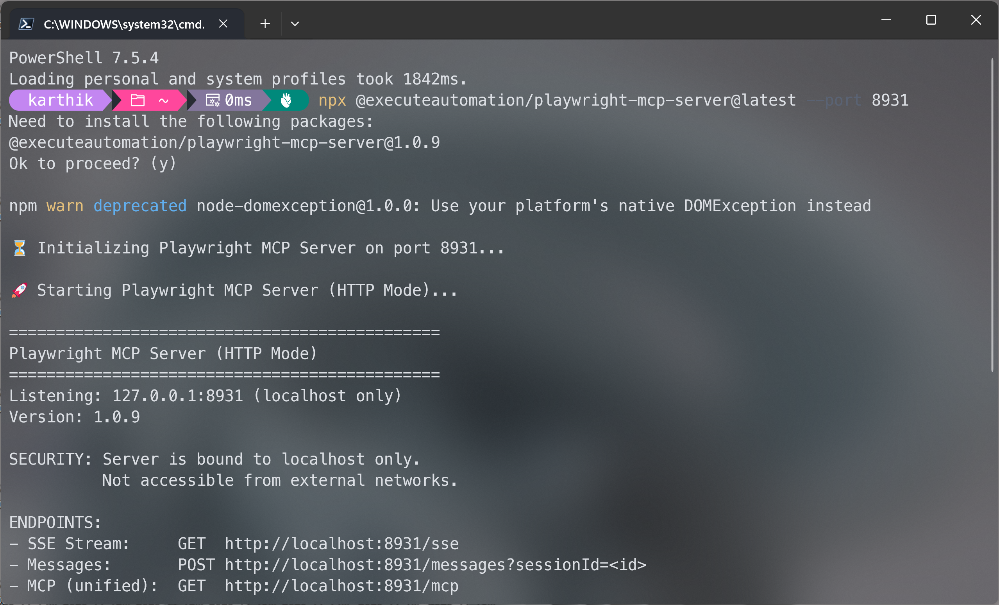

# HTTP/SSE Transport Mode

Starting with version 1.0.7, Playwright MCP Server supports HTTP/SSE (Server-Sent Events) transport mode in addition to the standard stdio mode. This enables new deployment scenarios and use cases.

## Overview

The HTTP/SSE transport allows the MCP server to run as a standalone HTTP server, enabling:
- Remote server deployments
- Multiple concurrent client connections
- Better integration with certain IDEs (e.g., VS Code)
- Health monitoring and debugging endpoints
- Background service operation
- DRY-compliant implementation for maximum maintainability

## Transport Modes Comparison

| Feature | stdio Mode | HTTP/SSE Mode |
|---------|-----------|---------------|
| **Default** | ✅ Yes | ❌ No |
| **Claude Desktop** | ✅ Supported | ⏳ Coming Soon |
| **VS Code Copilot** | ✅ Supported | ✅ Supported |
| **Remote Deployment** | ❌ No | ✅ Yes |
| **Multiple Clients** | ❌ No | ✅ Yes |
| **Health Endpoint** | ❌ No | ✅ Yes |
| **Setup Complexity** | Simple | Medium |

## Quick Start

### Starting the HTTP Server

#### Recommended: Using npx (Version 1.0.9+)

```bash
npx @executeautomation/playwright-mcp-server --port 8931
```



:::info Version Requirement
**npx support requires version 1.0.9 or later.** If you're using an older version, you'll need to use global installation (see below).
:::

#### Alternative: Global Installation

If you prefer global installation or are using version 1.0.8 or earlier:

```bash
# Install globally
npm install -g @executeautomation/playwright-mcp-server

# Run the server
playwright-mcp-server --port 8931
```

:::tip Which method to use?
- **npx** (recommended): Always uses the latest version, no installation needed
- **Global install**: Faster startup, uses specific installed version
:::

#### Troubleshooting npx

If `npx` doesn't show console output (versions < 1.0.9):

```bash
# Option 1: Update to latest version
npx @executeautomation/playwright-mcp-server@latest --port 8931

# Option 2: Use global installation instead
npm install -g @executeautomation/playwright-mcp-server
playwright-mcp-server --port 8931
```

### Server Output

When started successfully, you'll see:

```
⏳ Initializing Playwright MCP Server on port 8931...

🚀 Starting Playwright MCP Server (HTTP Mode)...

==============================================
Playwright MCP Server (HTTP Mode)
==============================================
Listening: 127.0.0.1:8931 (localhost only)
Version: 1.0.9

SECURITY: Server is bound to localhost only.
          Not accessible from external networks.

ENDPOINTS:
- SSE Stream:     GET  http://localhost:8931/sse
- Messages:       POST http://localhost:8931/messages?sessionId=<id>
- MCP (unified):  GET  http://localhost:8931/mcp
- MCP (unified):  POST http://localhost:8931/mcp?sessionId=<id>
- Health Check:   GET  http://localhost:8931/health

CLIENT CONFIGURATION:
{
  "mcpServers": {
    "playwright": {
      "url": "http://localhost:8931/mcp",
      "type": "http"
    }
  }
}
==============================================

Monitoring HTTP server listening on port 55123
Health check: http://localhost:55123/health
Metrics: http://localhost:55123/metrics
```

:::warning No Output Visible?
If you don't see the console output above:
1. **Check your version**: Run `npx @executeautomation/playwright-mcp-server@latest --port 8931`
2. **Use global install**: `npm install -g @executeautomation/playwright-mcp-server` then `playwright-mcp-server --port 8931`
3. **Verify server is running**: `curl http://localhost:8931/health` (should return `{"status":"ok"}`)
:::

## Client Configuration

### For VS Code GitHub Copilot

**Step 1:** Start the HTTP server
```bash
playwright-mcp-server --port 8931
```

**Step 2:** Add to VS Code settings (`.vscode/settings.json` or User Settings):
```json
{
  "github.copilot.chat.mcp.servers": {
    "playwright": {
      "url": "http://localhost:8931/mcp",
      "type": "http"
    }
  }
}
```

:::warning IMPORTANT
The `"type": "http"` field is **required** for HTTP/SSE transport. Without it, the client will not connect properly.
:::

**Step 3:** Reload VS Code

### For Claude Desktop

:::warning
Claude Desktop currently requires stdio mode. Use the standard configuration instead:

```json
{
  "mcpServers": {
    "playwright": {
      "command": "npx",
      "args": ["-y", "@executeautomation/playwright-mcp-server"]
    }
  }
}
```

HTTP transport support for Claude Desktop is expected in future updates.
:::

### For Custom MCP Clients

```json
{
  "mcpServers": {
    "playwright": {
      "url": "http://localhost:8931/mcp",
      "type": "http"
    }
  }
}
```

**Required Fields:**
- `url` - The HTTP endpoint URL
- `type` - **Must be "http"** for HTTP/SSE transport

Without `"type": "http"`, the client may attempt stdio mode and fail to connect.

## Available Endpoints

### Health Check

```bash
curl http://localhost:8931/health
```

**Response:**
```json
{
  "status": "ok",
  "version": "1.0.7",
  "activeSessions": 0
}
```

### SSE Stream (Legacy)

```bash
curl -N http://localhost:8931/sse
```

Establishes an SSE connection and returns the endpoint for sending messages.

### MCP Unified Endpoint (Recommended)

```bash
curl -N http://localhost:8931/mcp
```

The unified endpoint that handles both SSE streaming and message sending.

### Monitoring Metrics

The monitoring system runs on PORT+1:

```bash
curl http://localhost:8932/health
curl http://localhost:8932/metrics
```

## Command-Line Options

```bash
playwright-mcp-server [OPTIONS]

OPTIONS:
  --port <number>    Run in HTTP mode on the specified port
  --help, -h         Show help message

EXAMPLES:
  # Run in stdio mode (default)
  playwright-mcp-server

  # Run in HTTP mode on port 8931
  playwright-mcp-server --port 8931

  # Run in HTTP mode on custom port
  playwright-mcp-server --port 3000
```

## Use Cases

### 1. Remote Server Deployment

Run the server on a remote machine:

```bash
# On remote server
ssh user@remote-server
playwright-mcp-server --port 8931

# Configure client to connect remotely
{
  "mcpServers": {
    "playwright": {
      "url": "http://remote-server:8931/mcp"
    }
  }
}
```

### 2. Background Service

Run as a persistent background service:

```bash
# Using nohup
nohup playwright-mcp-server --port 8931 > server.log 2>&1 &

# Check status
curl http://localhost:8931/health

# View logs
tail -f server.log
```

### 3. Docker Deployment

```dockerfile
FROM node:20

WORKDIR /app

RUN npm install -g @executeautomation/playwright-mcp-server

EXPOSE 8931

CMD ["playwright-mcp-server", "--port", "8931"]
```

Run the container:
```bash
docker build -t playwright-mcp .
docker run -p 8931:8931 playwright-mcp
```

### 4. Multiple Concurrent Clients

HTTP mode supports multiple clients simultaneously:

```bash
# Start server
playwright-mcp-server --port 8931

# Client 1 connects
# Client 2 connects
# Client 3 connects

# Check active sessions
curl http://localhost:8931/health
# Returns: {"status":"ok","activeSessions":3}
```

## Session Management

Each client connection creates a unique session:

- **Session ID**: Automatically generated UUID
- **Isolation**: Each session has its own browser instance
- **Cleanup**: Automatic cleanup on connection close
- **Monitoring**: Track active sessions via health endpoint

### Example Session Flow

1. **Client connects** → GET `/mcp`
2. **Server responds** → Returns session endpoint
3. **Client sends messages** → POST `/mcp?sessionId=<id>`
4. **Server processes** → Returns results via SSE
5. **Client disconnects** → Session automatically cleaned up

## Testing HTTP Mode

### Automated Testing

```bash
# Clone the repository
git clone https://github.com/executeautomation/mcp-playwright.git
cd mcp-playwright

# Build
npm run build

# Run automated tests
./test-http-mode.sh
```

The test script validates:
- ✅ Server startup
- ✅ Health endpoint
- ✅ SSE connections
- ✅ Error handling
- ✅ Session management
- ✅ Monitoring endpoints

### Manual Testing

```bash
# Terminal 1: Start server
playwright-mcp-server --port 8931

# Terminal 2: Test endpoints
curl http://localhost:8931/health
curl -N http://localhost:8931/mcp | head -5
curl http://localhost:8932/metrics
```

### Using MCP Inspector

```bash
# Start server
playwright-mcp-server --port 8931

# Test with official MCP inspector
npx @modelcontextprotocol/inspector http://localhost:8931/mcp
```

## Monitoring and Debugging

### Health Monitoring

The `/health` endpoint provides real-time status:

```bash
curl http://localhost:8931/health | jq
```

**Monitoring points:**
- Server status
- Version information
- Active session count
- Response time

### Metrics Collection

The monitoring server uses **dynamic port allocation** to avoid conflicts. Check the console output for the actual port:

```bash
# Server output shows:
# Monitoring HTTP server listening on port 59055
# Health check: http://localhost:59055/health
# Metrics: http://localhost:59055/metrics
```

Access detailed metrics:

```bash
# Use the port from server output
curl http://localhost:59055/metrics | jq
```

**Available metrics:**
- Request counts
- Response times
- Error rates
- Memory usage
- System health

**Note:** The monitoring port is dynamically allocated (using port 0) to prevent conflicts with other services.

### Logs

Server logs are written to stdout/stderr in JSON format:

```bash
# View logs in real-time
tail -f server.log

# Filter by level
grep '"level":"error"' server.log

# Track specific session
grep '"sessionId":"abc-123"' server.log

# Monitor all incoming requests
grep '"message":"Incoming request"' server.log
```

**Log Levels:**
- `info` - Normal operations (requests, connections, transport events)
- `warn` - Potential issues (unknown sessions, missing parameters)
- `error` - Failures (connection errors, handler exceptions)

**Key Log Messages:**

```json
// Client connects
{"level":"info","message":"Incoming request","context":{"method":"GET","path":"/mcp"}}
{"level":"info","message":"SSE connection request received","context":{"endpoint":"/mcp"}}
{"level":"info","message":"Transport registered","context":{"sessionId":"...","activeTransports":1}}

// Client sends message
{"level":"info","message":"Incoming request","context":{"method":"POST","path":"/mcp"}}
{"level":"info","message":"POST message received","context":{"sessionId":"...","availableTransports":[...]}}

// Client disconnects
{"level":"info","message":"SSE connection closed","context":{"sessionId":"...","endpoint":"/mcp"}}
{"level":"info","message":"Transport unregistered","context":{"activeTransports":0}}
```

## Code Quality

The HTTP server implementation follows software engineering best practices:

### DRY Principle (Don't Repeat Yourself)

All endpoint logic is centralized in reusable helper functions:

**Before (with duplication):**
```typescript
// /sse endpoint - 26 lines of code
app.get('/sse', async (req, res) => {
  // SSE connection logic...
});

// /mcp endpoint - 26 lines of identical code
app.get('/mcp', async (req, res) => {
  // Same SSE connection logic...
});
```

**After (DRY compliant):**
```typescript
// Reusable helper - 29 lines total
const handleSseConnection = async (endpoint, messageEndpoint, req, res) => {
  // SSE connection logic (single source of truth)
};

// Simple endpoint definitions - 2 lines total
app.get('/sse', (req, res) => handleSseConnection('/sse', '/messages', req, res));
app.get('/mcp', (req, res) => handleSseConnection('/mcp', '/mcp', req, res));
```

### Benefits

- **40% code reduction** in endpoint handlers
- **Zero duplication** - single source of truth
- **Consistent behavior** - all endpoints work the same way
- **Easy maintenance** - update once, applies everywhere
- **Lower bug risk** - no chance of inconsistent implementations

### Maintainability

The implementation prioritizes long-term maintainability:
- Clear separation of concerns
- Reusable, testable functions
- Comprehensive error handling
- Context-aware logging
- Type-safe TypeScript implementation

## Architecture

### Components

```
┌─────────────────────┐
│   HTTP Server       │
│   (Express)         │
└──────────┬──────────┘
           │
    ┌──────┴──────┐
    │             │
┌───▼───┐    ┌───▼────┐
│  SSE  │    │ Health │
│ Trans │    │  Check │
│ port  │    │        │
└───┬───┘    └────────┘
    │
┌───▼────────────────┐
│  MCP Server Core   │
│  - Request Handler │
│  - Tool Handler    │
│  - Browser Manager │
└────────────────────┘
```

### Transport Layer

The implementation uses MCP SDK's native `SSEServerTransport` with DRY-compliant helper functions:

```typescript
import { SSEServerTransport } from "@modelcontextprotocol/sdk/server/sse.js";

// Reusable helper function handles all SSE connections
const handleSseConnection = async (endpoint, messageEndpoint, req, res) => {
  const transport = new SSEServerTransport(messageEndpoint, res);
  await server.connect(transport);
  // ... session management, logging, error handling
};

// All endpoints use the same logic
app.get('/sse', (req, res) => handleSseConnection('/sse', '/messages', req, res));
app.get('/mcp', (req, res) => handleSseConnection('/mcp', '/mcp', req, res));
```

**Benefits of this approach:**
- Single source of truth for endpoint logic
- Consistent behavior across all endpoints
- Easy to maintain and update
- Reduced code duplication (40% less code)
- Lower bug risk

### Session Lifecycle

```
Client Request
     ↓
GET /mcp
     ↓
Create Session
     ↓
Return Session ID
     ↓
Client POSTs Messages
     ↓
Server Processes via SSE
     ↓
Connection Closes
     ↓
Cleanup Session
```

## Security Considerations

:::warning IMPORTANT SECURITY NOTE
The server binds to **127.0.0.1 (localhost only)** by default. This is a critical security feature that prevents external access.
:::

### Network Binding

**SECURITY:** The server binds to `127.0.0.1` (localhost only):
- ✅ Accessible only from the local machine
- ✅ Not exposed to external networks
- ✅ Secure by default
- ✅ Suitable for local development
- ✅ No accidental external exposure
- ✅ Protects against unauthorized access

**Why This Matters:**
- Prevents external machines from accessing your MCP server
- Protects browser automation capabilities from network exposure
- Ensures no accidental exposure in shared network environments
- Follows security best practices for local development tools

### Remote Access (Secure Method)

**DO NOT** modify the code to bind to 0.0.0.0. Instead, use SSH tunneling:

```bash
# On the remote server (server still binds to localhost)
playwright-mcp-server --port 8931

# On your local machine (create secure tunnel)
ssh -L 8931:localhost:8931 user@remote-server

# Now access securely via localhost:8931
```

**Benefits of SSH Tunneling:**
- ✅ Encrypted connection
- ✅ Authentication required
- ✅ Server stays bound to localhost
- ✅ Industry standard practice

### Production Deployment

For production environments, use a reverse proxy:

```nginx
# nginx example
server {
    listen 80;
    server_name your-domain.com;

    location /mcp {
        proxy_pass http://127.0.0.1:8931;
        # Add authentication
        auth_basic "MCP Server";
        auth_basic_user_file /etc/nginx/.htpasswd;
    }
}
```

**Benefits:**
- ✅ Server stays on localhost
- ✅ Add authentication layer
- ✅ Enable SSL/TLS
- ✅ Implement rate limiting
- ✅ Better logging and monitoring

### Example: SSH Tunnel

```bash
# On local machine
ssh -L 8931:localhost:8931 user@remote-server

# Server now accessible at localhost:8931
```

## Troubleshooting

### Debugging Tools

Version 1.0.7 includes comprehensive logging to help diagnose issues:

**Request Logging:**
Every HTTP request is logged with:
- Method (GET, POST)
- Path and URL
- Query parameters
- Headers (Accept, Content-Type)

**Session Tracking:**
Monitor SSE sessions with:
- Transport registration logs
- Active transport counts
- Session ID tracking
- Connection close events

**Example Debug Output:**
```json
{"level":"info","message":"Incoming request","context":{"method":"GET","path":"/mcp"}}
{"level":"info","message":"Transport registered","context":{"sessionId":"abc-123","activeTransports":1}}
{"level":"info","message":"POST message received","context":{"sessionId":"abc-123","endpoint":"/mcp"}}
```

### Common Issues

#### Issue: npx Shows No Console Output

**Symptom:** Running `npx @executeautomation/playwright-mcp-server --port 8931` shows no output or seems to hang.

**Cause:** Versions prior to 1.0.9 had an output buffering issue with npx.

**Solutions:**

1. **Update to latest version (recommended):**
   ```bash
   npx @executeautomation/playwright-mcp-server@latest --port 8931
   ```

2. **Use global installation:**
   ```bash
   npm install -g @executeautomation/playwright-mcp-server
   playwright-mcp-server --port 8931
   ```

3. **Verify server is actually running:**
   ```bash
   # Even without visible output, the server might be running
   curl http://localhost:8931/health
   ```
   If this returns `{"status":"ok","version":"1.0.x","activeSessions":0}`, the server is running successfully despite no console output.

**Why this happens:**
- Node.js buffers `console.log()` output when stdout is not a TTY
- Fixed in version 1.0.9 by using `process.stdout.write()`
- Global installation doesn't have this issue

#### Issue: "No transport found for sessionId"

**Symptom:** Client receives 400 error with message about missing transport.

**Causes:**
1. GET request to establish SSE connection didn't complete
2. Client using stale/cached sessionId
3. Server restarted but client kept old sessionId

**Solution:**
```bash
# Check logs for "Transport registered" - should appear before POST messages
# Look for this sequence:
# 1. "Incoming request" GET /mcp
# 2. "SSE connection request received"
# 3. "Transport registered" with sessionId
# 4. "POST message received" with same sessionId

# If sequence is wrong, client needs to reconnect
```

### Port Already in Use

```bash
# Check what's using the port
lsof -i :8931

# Use a different port
playwright-mcp-server --port 9000
```

### Connection Refused

```bash
# Verify server is running
ps aux | grep playwright-mcp-server

# Check server logs
tail -f server.log

# Test with curl
curl -v http://localhost:8931/health
```

### SSE Connection Issues

**Check if SSE stream is established:**
```bash
# Should show continuous stream, not immediate close
curl -N http://localhost:8931/mcp

# Look for:
# event: endpoint
# data: /mcp?sessionId=<uuid>
```

**Verify session is registered:**
```bash
# In server logs, look for:
grep "Transport registered" server.log

# Should show sessionId matching what client uses
```

### Browser Issues

```bash
# Install Playwright browsers
npx playwright install chromium

# For headless mode on servers without display
export DISPLAY=:99
```

### Session Not Found

This error occurs when:
- Session has expired
- Server was restarted
- Client used invalid session ID

**Solution:** Reconnect to establish a new session.

## Performance Considerations

### Concurrent Connections

The server handles multiple concurrent clients efficiently:
- Each session is isolated
- Browser instances are managed per session
- Automatic resource cleanup

### Resource Limits

Monitor resource usage:
```bash
# Check memory usage
curl http://localhost:8932/metrics | jq '.memory'

# Check active sessions
curl http://localhost:8931/health | jq '.activeSessions'
```

## Migration Guide

### From stdio to HTTP Mode

**Before (stdio):**
```json
{
  "mcpServers": {
    "playwright": {
      "command": "npx",
      "args": ["-y", "@executeautomation/playwright-mcp-server"]
    }
  }
}
```

**After (HTTP):**

1. Start the server:
```bash
playwright-mcp-server --port 8931
```

2. Update configuration:
```json
{
  "mcpServers": {
    "playwright": {
      "url": "http://localhost:8931/mcp"
    }
  }
}
```

### Backward Compatibility

- stdio mode remains the default
- All existing tools work in both modes
- No breaking changes to API
- Configurations are independent

## FAQ

### Q: Should I use npx or global installation?

**Use npx (recommended):**
- ✅ Always uses latest version
- ✅ No installation needed
- ✅ Easy to update
- ⚠️ Requires version 1.0.9+ for console output

**Use global installation:**
- ✅ Faster startup (no download)
- ✅ Works with all versions
- ✅ More predictable (pinned version)
- ⚠️ Needs manual updates

**Quick test which works for you:**
```bash
# Try npx first
npx @executeautomation/playwright-mcp-server@latest --port 8931

# If no output, use global install
npm install -g @executeautomation/playwright-mcp-server
playwright-mcp-server --port 8931
```

### Q: Should I use HTTP or stdio mode?

**Use stdio mode if:**
- You're using Claude Desktop
- You want simpler setup
- You're running locally only

**Use HTTP mode if:**
- You need remote access
- You want multiple clients
- You need health monitoring
- You're using VS Code Copilot

### Q: Can I run both modes simultaneously?

Yes! Run them on different ports or different machines.

### Q: How do I secure HTTP mode?

Consider:
- SSH tunneling for remote access
- Reverse proxy with authentication
- Network firewall rules
- HTTPS/TLS certificates

### Q: What's the performance difference?

Both modes have similar performance. HTTP mode has slightly higher overhead due to HTTP protocol, but it's negligible for typical use cases.

## Additional Resources

- [GitHub Repository](https://github.com/executeautomation/mcp-playwright)
- [Quick Reference Guide](https://github.com/executeautomation/mcp-playwright/blob/main/QUICK_REFERENCE.md)
- [Testing Guide](https://github.com/executeautomation/mcp-playwright/blob/main/TESTING_GUIDE.md)
- [Claude Desktop Config](https://github.com/executeautomation/mcp-playwright/blob/main/CLAUDE_DESKTOP_CONFIG.md)

## Support

If you encounter issues:

1. Check the [troubleshooting section](#troubleshooting)
2. Run the automated test: `./test-http-mode.sh`
3. Review server logs
4. Open an issue on [GitHub](https://github.com/executeautomation/mcp-playwright/issues)

---

**Version Added:** 1.0.7  
**Protocol Version:** MCP 2024-11-05+  
**Status:** Stable
