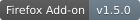

# Browser Control MCP

[](https://addons.mozilla.org/en-US/firefox/addon/browser-control-mcp/)

An MCP server paired with a Firefox browser extension that provides AI assistants with access to tab management, browsing history, and webpage text content.

## Features

The MCP server supports the following tools:
- Open or close tabs
- Get the list of opened tabs
- Create tab groups with name and color
- Reorder opened tabs
- Read and search the browser's history
- Read a webpage's text content and links (requires user consent)
- Find and highlight text in a browser tab (requires user consent)

## Example use-cases:

### Tab management
- *"Close all non-work-related tabs in my browser."*
- *"Group all development related tabs in my browser into a new group called 'Development'."*
- *"Rearrange tabs in my browser in an order that makes sense."*
- *"Close all tabs in my browser that haven't been accessed within the past 24 hours"*

### Browser history search
- *"Help me find an article in my browser history about the Milford track in NZ."*
- *"Open all the articles about AI that I visited during the last week, up to 10 articles, avoid duplications."*

### Browsing and research 
- *"Open hackernews in my browser, then open the top story, read it, also read the comments. Do the comments agree with the story?"*
- *"In my browser, use Google Scholar to search for papers about L-theanine in the last 3 years. Open the 3 most cited papers. Read them and summarize them for me."*
- *"Use Google search in my browser to look for flower shops. Open the 10 most relevant results. Show me a table of each flower shop with location and opening hours."*

## Comparison to web automation MCP servers

The MCP server and Firefox extension combo is designed to be more secure than web automation MCP servers, enabling safer use with the user's personal browser.

* It does not support web page modification, page interactions, or arbitrary scripting.
* Reading webpage content requires the user's explicit consent in the browser for each domain. This is enforced at the extension's manifest level.
* It uses a local-only connection with a shared secret between the MCP server and extension.
* No remote data collection or tracking.
* It provides an extension-side audit log for tool calls and tool enable/disable configuration.
* The extension includes no runtime third-party dependencies.

**Important note**: Browser Control MCP is still experimental. Use at your own risk. You should practice caution as with any other MCP server and authorize/monitor tool calls carefully.

## Installation

### Option 1: Install the Firefox and Claude Desktop extensions

The Firefox extension / add-on is [available on addons.mozilla.org](https://addons.mozilla.org/en-US/firefox/addon/browser-control-mcp/). You can also download and open the latest pre-built version from this GitHub repository: [browser-control-mcp-1.5.0.xpi](https://github.com/eyalzh/browser-control-mcp/releases/download/v1.5.0/browser-control-1.5.0.xpi). Complete the installation based on the instructions in the "Manage extension" page, which will open automatically after installation.

The add-on's "Manage extension" page will include a link to the Claude Desktop DXT file. You can also download it here: [mcp-server-v1.5.1.dxt](
https://github.com/eyalzh/browser-control-mcp/releases/download/v1.5.1/mcp-server-v1.5.1.dxt). After downloading the file, open it or drag it into Claude Desktop's settings window. Make sure to enable the DXT extension after installing it. This will only work with the latest versions of Claude Desktop. If you wish to install the MCP server locally, see the MCP configuration below.

### Option 2: Build from code

To build from code, clone this repository, then run the following commands in the main repository directory to build both the MCP server and the browser extension.
```
npm install
npm run build
```

#### Installing a Firefox Temporary Add-on 

To install the extension on Firefox as a Temporary Add-on:

1. Type `about:debugging` in the Firefox URL bar
2. Click on "This Firefox"
3. click on "Load Temporary Add-on..."
4. Select the `manifest.json` file under the `firefox-extension` folder in this project
5. The extension's preferences page will open. Copy the secret key to your clipboard. It will be used to configure the MCP server.

Alternatively, to install a permanent add-on, you can install the [Browser Control MCP on addons.mozilla.org](https://addons.mozilla.org/en-US/firefox/addon/browser-control-mcp/) and then configure the MCP Server as detailed below.

If you prefer not to run the extension on your personal Firefox browser, an alternative is to download a separate Firefox instance (such as Firefox Developer Edition, available at https://www.mozilla.org/en-US/firefox/developer/).


#### MCP Server configuration

After installing the browser extension, add the following configuration to your mcpServers configuration (e.g. `claude_desktop_config.json` for Claude Desktop):
```json
{
    "mcpServers": {
        "browser-control": {
            "command": "node",
            "args": [
                "/path/to/repo/mcp-server/dist/server.js"
            ],
            "env": {
                "EXTENSION_SECRET": "<secret_on_firefox_extension_options_page>",
                "EXTENSION_PORT": "8089" 
            }
        }
    }
}
```
Replace `/path/to/repo` with the correct path.

Set the EXTENSION_SECRET to the value shown on the extension's preferences page in Firefox (you can access it at `about:addons`). You can also set the EXTENSION_PORT environment variable to specify the port that the MCP server will use to communicate with the extension (default is 8089).

It might take a few seconds for the MCP server to connect to the extension.

##### Configure the MCP server with Docker

Alternatively, you can use a Docker-based configuration. To do so, build the mcp-server Docker image:
```
docker build -t browser-control-mcp .
```

and use the following mcpServers configuration:

```json
{
    "mcpServers": {
        "browser-control": {
            "command": "docker",
            "args": [
                "run",
                "--rm",
                "-i",
                "-p", "127.0.0.1:8089:8089",
                "-e", "EXTENSION_SECRET=<secret_from_extension>",
                "-e", "CONTAINERIZED=true",
                "browser-control-mcp"
            ]
        }
    }
}
```

