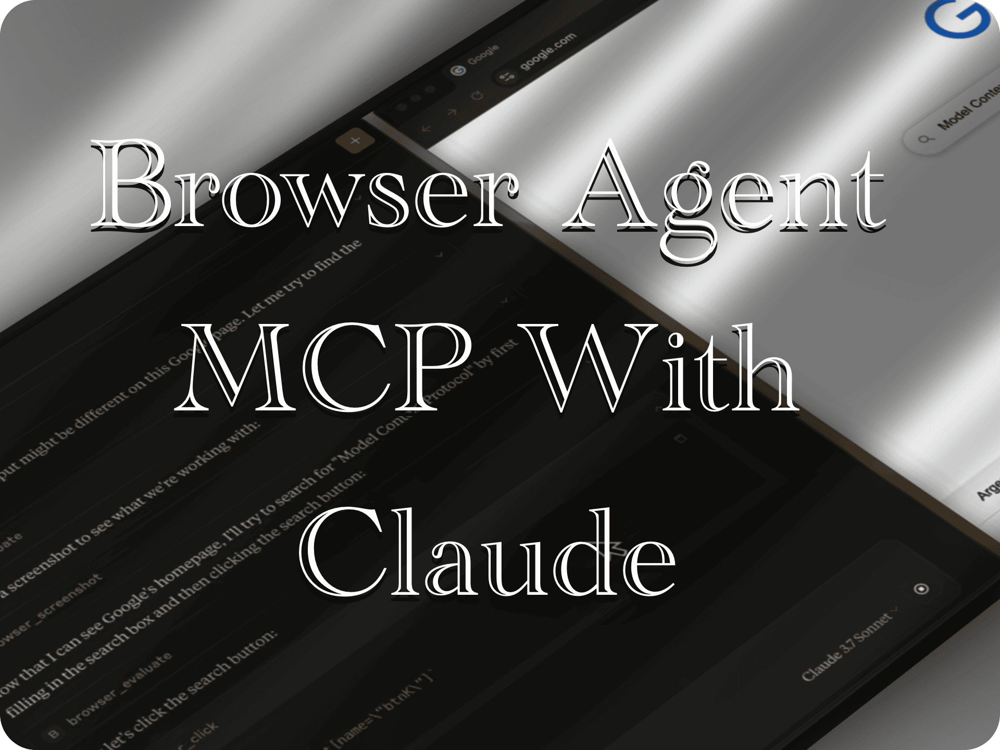

# MCP Browser Agent

[](https://archestra.ai/mcp-catalog/imprvhub__mcp-browser-agent)
[](https://smithery.ai/server/@imprvhub/mcp-browser-agent)

<table style="border-collapse: collapse; width: 100%; table-layout: fixed;">
<tr>
<td style="width: 40%; padding: 15px; vertical-align: middle; border: none;">A powerful Model Context Protocol (MCP) integration that provides Claude Desktop with autonomous browser automation capabilities.</td>
<td style="width: 60%; padding: 0; vertical-align: middle; border: none; min-width: 300px; text-align: center;"><a href="https://glama.ai/mcp/servers/@imprvhub/mcp-browser-agent">
  
</a></td>
</tr>
</table>

## Features

- **Advanced Browser Automation**
  - Navigate to any URL with customizable load strategies
  - Capture full-page or element-specific screenshots
  - Perform precise DOM interactions (click, fill, select, hover)
  - Execute arbitrary JavaScript in browser context with console logs capture

- **Powerful API Client**
  - Execute HTTP requests (GET, POST, PUT, PATCH, DELETE)
  - Configure request headers and body content
  - Process response data with JSON formatting
  - Error handling with detailed feedback

- **MCP Resource Management**
  - Access browser console logs as resources
  - Retrieve screenshots through MCP resource interface
  - Persistent session with headful browser instance

- **AI Agent Capabilities**
  - Chain multiple browser operations for complex tasks
  - Follow multi-step instructions with intelligent error recovery
  - Technical task automation through natural language instructions

## Demo

<p>
  <a href="https://www.youtube.com/watch?v=0lMsKiTy7TE">
    
  </a>
</p>

<details>
<summary> Timestamps: </summary>

Click on any timestamp to jump to that section of the video

[**00:00**](https://www.youtube.com/watch?v=0lMsKiTy7TE&t=0s) - **Google Search for MCP**  
Navigation to Google homepage and search for "Model Context Protocol". Demonstration of Claude Desktop using the MCP integration to perform a basic web search and process the results.

[**00:33**](https://www.youtube.com/watch?v=0lMsKiTy7TE&t=33s) - **Screenshot Capture**  
Taking a screenshot of the search results with a custom filename and showcasing it in Finder. Shows how Claude can capture and save visual content from web pages during browser automation.

[**01:00**](https://www.youtube.com/watch?v=0lMsKiTy7TE&t=60s) - **Wikipedia Search**  
Navigation to Wikipedia.org and search for "Model Context Protocol". Illustrates Claude's ability to interact with different websites and their search functionality through the MCP integration.

[**01:38**](https://www.youtube.com/watch?v=0lMsKiTy7TE&t=98s) - **Dropdown Menu Interaction I**  
Navigation to a test website (the-internet.herokuapp.com/dropdown) and selection of "Option 1" from a dropdown menu. Demonstrates Claude's capability to interact with form elements and make selections.

[**01:56**](https://www.youtube.com/watch?v=0lMsKiTy7TE&t=116s) - **Dropdown Menu Interaction II**  
Changing the selection to "Option 2" from the same dropdown menu. Shows Claude's ability to manipulate the same form element multiple times and make different selections.

[**02:09**](https://www.youtube.com/watch?v=0lMsKiTy7TE&t=129s) - **Login Form Completion**  
Navigation to a login page (the-internet.herokuapp.com/login) and filling in the username field with "tomsmith" and password field with "SuperSecretPassword!". Demonstrates form filling automation.

[**02:28**](https://www.youtube.com/watch?v=0lMsKiTy7TE&t=148s) - **Login Submission**  
Submitting the login credentials and completing the authentication process. Shows Claude's ability to trigger form submissions and navigate through multi-step processes.

[**02:36**](https://www.youtube.com/watch?v=0lMsKiTy7TE&t=156s) - **API Request Execution**  
Performing a GET request to JSONPlaceholder API endpoint. Demonstrates Claude's capability to make direct API calls and process the returned data through the MCP integration.
</details>

## Requirements

- Node.js 16 or higher
- Claude Desktop
- Playwright dependencies

### Browser Support

```bash
npm init playwright@latest
```

This package includes Playwright and the necessary dependencies for running browser automation. When you run `npm install`, the required Playwright dependencies will be installed. The package supports the following browsers:

- Chrome (default)
- Firefox
- Microsoft Edge
- WebKit (Safari engine)

When you first use a browser type, Playwright will automatically install the corresponding browser drivers as needed. You can also install them manually with the following commands:

```
npx playwright install chrome
npx playwright install firefox
npx playwright install webkit
npx playwright install msedge
```

> **Note about Safari**: Playwright doesn't provide direct support for Safari browser. Instead, it uses WebKit, which is the browser engine that powers Safari.
>
> **Note about Edge**: When selecting Edge as the browser type, the agent will actually launch Microsoft Edge (not Chromium). Technically, in Playwright, Edge is launched using the Chromium browser instance with the 'msedge' channel parameter because Microsoft Edge is based on Chromium.
## Installation

### Installing Manually
1. Clone or download this repository:
```
git clone https://github.com/imprvhub/mcp-browser-agent
cd mcp-browser-agent
```

2. Install dependencies:
```
npm install
```

3. Build the project:
```
npm run build
```

## Running the MCP Server

There are two ways to run the MCP server:

### Option 1: Running manually

1. Open a terminal or command prompt
2. Navigate to the project directory
3. Run the server directly:

```
node dist/index.js
```

Keep this terminal window open while using Claude Desktop. The server will run until you close the terminal.

### Option 2: Auto-starting with Claude Desktop (recommended for regular use)

The Claude Desktop can automatically start the MCP server when needed. To set this up:

#### Configuration

The Claude Desktop configuration file is located at:

- **macOS**: `~/Library/Application Support/Claude/claude_desktop_config.json`
- **Windows**: `%APPDATA%\Claude\claude_desktop_config.json`
- **Linux**: `~/.config/Claude/claude_desktop_config.json`

Edit this file to add the Browser Agent MCP configuration. If the file doesn't exist, create it:

```json
{
  "mcpServers": {
    "browserAgent": {
      "command": "node",
      "args": ["ABSOLUTE_PATH_TO_DIRECTORY/mcp-browser-agent/dist/index.js",
      "--browser",
      "chrome"
    ]
    }
  }
}
```

**Important**: Replace `ABSOLUTE_PATH_TO_DIRECTORY` with the **complete absolute path** where you installed the MCP
  - macOS/Linux example: `/Users/username/mcp-browser-agent`
  - Windows example: `C:\\Users\\username\\mcp-browser-agent`

If you already have other MCPs configured, simply add the "browserAgent" section inside the "mcpServers" object. Here's an example of a configuration with multiple MCPs:

```json
{
  "mcpServers": {
    "otherMcp1": {
      "command": "...",
      "args": ["..."]
    },
    "otherMcp2": {
      "command": "...",
      "args": ["..."]
    },
    "browserAgent": {
      "command": "node",
      "args": [
        "ABSOLUTE_PATH_TO_DIRECTORY/mcp-browser-agent/dist/index.js",
      "--browser",
      "chrome"
    ]
    }
  }
}
```

## Browser Selection

The MCP Browser Agent supports multiple browser types. By default, it uses Chrome, but you can specify a different browser in several ways:

### Option 1: Configuration File

Create or edit the file `.mcp_browser_agent_config.json` in your home directory:

```json
{
  "browserType": "chrome"
}
```

Supported values for `browserType` are:
- `chrome` - Uses installed Chrome (default)
- `firefox` - Uses Firefox 'Nightly' browser
- `webkit` - Uses WebKit engine (Note: This is not Safari itself but the WebKit rendering engine that powers Safari)
- `edge` - Uses Microsoft Edge

> **Note about Safari**: Playwright doesn't provide direct support for Safari browser. Instead, it uses WebKit, which is the browser engine that powers Safari. The WebKit implementation in Playwright provides similar functionality but is not identical to the Safari browser experience.

### Option 2: Command Line Argument

When starting the MCP server manually, you can specify the browser type:

```
node dist/index.js --browser firefox
```

### Option 3: Environment Variable

Set the `MCP_BROWSER_TYPE` environment variable:

```
MCP_BROWSER_TYPE=firefox node dist/index.js
```

### Option 4: Claude Desktop Configuration

When configuring the MCP in Claude Desktop's `claude_desktop_config.json`, you can specify the browser type:

```json
{
  "mcpServers": {
    "browserAgent": {
      "command": "node",
      "args": [
        "ABSOLUTE_PATH_TO_DIRECTORY/mcp-browser-agent/dist/index.js",
        "--browser",
        "chrome"
      ]
    }
  }
}
```

## Technical Implementation

MCP Browser Agent is built on the Model Context Protocol, enabling Claude to interact with a headful browser through Playwright. The implementation consists of four main components:

1. **Server (index.ts)**
   - Initializes the MCP server with Model Context Protocol standard protocol
   - Configures server capabilities for tools and resources
   - Establishes communication with Claude through the stdio transport

2. **Tools Registry (tools.ts)**
   - Defines browser and API tool schemas
   - Specifies parameters, validation rules, and descriptions
   - Registers tools with the MCP server for Claude's discovery

3. **Request Handlers (handlers.ts)**
   - Manages MCP protocol requests for tools and resources
   - Exposes browser logs and screenshots as queryable resources
   - Routes tool execution requests to the appropriate handlers

4. **Executor (executor.ts)**
   - Manages browser and API client lifecycle
   - Implements browser automation functions using Playwright
   - Handles API requests with proper error handling and response parsing
   - Maintains stateful browser session between commands

### Agent Capabilities

Unlike basic integrations, MCP Browser Agent functions as a true AI agent by:

- Maintaining persistent browser state across multiple commands
- Capturing detailed console logs for debugging
- Storing screenshots for reference and review
- Managing complex interaction sequences
- Providing detailed error information for recovery
- Supporting chained operations for complex workflows

## Available Tools

### Browser Tools

| Tool Name | Description | Parameters |
|-----------|-------------|------------|
| `browser_navigate` | Navigate to a URL | `url` (required), `timeout`, `waitUntil` |
| `browser_screenshot` | Capture screenshot | `name` (required), `selector`, `fullPage`, `mask`, `savePath` |
| `browser_click` | Click element | `selector` (required) |
| `browser_fill` | Fill form input | `selector` (required), `value` (required) |
| `browser_select` | Select dropdown option | `selector` (required), `value` (required) |
| `browser_hover` | Hover over element | `selector` (required) |
| `browser_evaluate` | Execute JavaScript | `script` (required) |

### API Tools

| Tool Name | Description | Parameters |
|-----------|-------------|------------|
| `api_get` | GET request | `url` (required), `headers` |
| `api_post` | POST request | `url` (required), `data` (required), `headers` |
| `api_put` | PUT request | `url` (required), `data` (required), `headers` |
| `api_patch` | PATCH request | `url` (required), `data` (required), `headers` |
| `api_delete` | DELETE request | `url` (required), `headers` |

## Resource Access

The MCP Browser Agent exposes the following resources:

- `browser://logs` - Access browser console logs
- `screenshot://[name]` - Access screenshots by name


## Example Usage

Here are some realistic examples of how to use the MCP Browser Agent with Claude:

### Basic Browser Navigation

```
Navigate to the Google homepage at https://www.google.com
```

```
Take a screenshot of the current page and name it "google-homepage"
```

```
Type "weather forecast" in the search box
```

### Simple Interactions

```
Navigate to https://www.wikipedia.org and search for "Model Context Protocol"
```

```
Go to https://the-internet.herokuapp.com/dropdown and select the option "Option 1" from the dropdown
```

### Basic Form Filling

```
Navigate to https://the-internet.herokuapp.com/login and fill in the username field with "tomsmith" and the password field with "SuperSecretPassword!"
```

```
Go to https://the-internet.herokuapp.com/login, fill in the username and password fields, then click the login button
```

### Simple JavaScript Execution

```
Go to https://example.com and execute a JavaScript script to return the page title
```

```
Navigate to https://www.google.com and execute a JavaScript script to count the number of links on the page
```

### Basic API Requests

```
Perform a GET request to https://jsonplaceholder.typicode.com/todos/1
```

```
Make a POST request to https://jsonplaceholder.typicode.com/posts with appropriate JSON data
```

These examples represent the actual capabilities of the MCP Browser Agent and are more realistic about what it can accomplish in its current state.

## Troubleshooting

### "Server disconnected" error
If you see the error "MCP Browser Agent: Server disconnected" in Claude Desktop:

1. **Verify the server is running**:
   - Open a terminal and manually run `node dist/index.js` from the project directory
   - If the server starts successfully, use Claude while keeping this terminal open

2. **Check your configuration**:
   - Ensure the absolute path in `claude_desktop_config.json` is correct for your system
   - Double-check that you've used double backslashes (`\\`) for Windows paths
   - Verify you're using the complete path from the root of your filesystem

### Browser not appearing
If the browser doesn't launch or you don't see it:

1. **Check if the specified browser is installed**
   - Verify that you have the browser (Chrome, Firefox, Edge, or Safari/WebKit) installed on your system
   - The browser drivers are handled automatically by Playwright

2. **Restart the server and Claude Desktop**
   - Kill any existing node processes that might be running the server
   - Restart Claude Desktop to establish a fresh connection

### Browser process not closing properly
There are known issues with Chromium and Chrome browsers where the process sometimes doesn't terminate properly after use. If you experience this issue:

1. **Manually close the browser process**:
   - **Windows**: Press Ctrl+Shift+Esc to open Task Manager, find the Chrome/Chromium process and end it
   - **macOS**: Open Activity Monitor (Applications > Utilities > Activity Monitor), find the Chrome/Chromium process and click the X to terminate it
   - **Linux**: Run `ps aux | grep chrome` or `ps aux | grep chromium` to find the process, then `kill <PID>` to terminate it

2. **Note about browser compatibility**:
   - This issue has been observed primarily with Chromium and Chrome
   - Firefox and Playwright's built-in browser don't typically experience this problem

> [!CAUTION]
> This MCP integration is built on Playwright, which has known issues and bugs that may affect its operation. Please report any issues you encounter with the browser automation to [Playwright's GitHub issues](https://github.com/microsoft/playwright/issues). The Playwright team is continuously working to address these issues, but this agent provides a foundation for browser automation capabilities with Claude Desktop despite these limitations.

## Development

### Project Structure

- `src/index.ts`: Main entry point and MCP server initialization
- `src/tools.ts`: Tool schemas and registration
- `src/handlers.ts`: MCP request handlers for tools and resources
- `src/executor.ts`: Tool implementation logic using Playwright

### Building

```
npm run build
```

### Watching for Changes

```
npm run watch
```

## Testing

The project includes tests to verify core functionality and browser handling.

```
npm test               # Run tests
npm run test:watch     # Watch mode
npm run test:coverage  # Coverage report
```

Tests verify configuration integrity, browser automation features, error handling, and process cleanup. The test suite focuses particularly on ensuring proper handling of browser processes due to known issues with Chrome/Chromium termination.

## Security Considerations

> [!IMPORTANT]
> This MCP integration provides Claude with autonomous browser control capabilities. Please review our [Security Policy](SECURITY.md) for important information about prohibited uses, security implications, and best practices.

The MCP Browser Agent is designed for legitimate automation tasks but could potentially be misused. Users are responsible for ensuring their use complies with all applicable laws, terms of service, and ethical guidelines. See our detailed [Security Policy](SECURITY.md) for more information.

## Contributing

Contributions to the MCP Browser Agent are welcome! Here are some areas where you can help:

- Adding new browser automation capabilities
- Improving error handling and recovery
- Enhancing screenshot and resource management
- Creating useful workflows and examples
- Optimizing performance for complex operations

## License

This project is licensed under the Mozilla Public License 2.0 - see the [LICENSE](https://github.com/imprvhub/mcp-browser-agent/blob/main/LICENSE) file for details.

## Related Links

- [Model Context Protocol](https://modelcontextprotocol.io/)
- [Claude Desktop](https://claude.ai/download)
- [Playwright Documentation](https://playwright.dev/docs/intro)
- [MCP Series](https://github.com/mcp-series)
