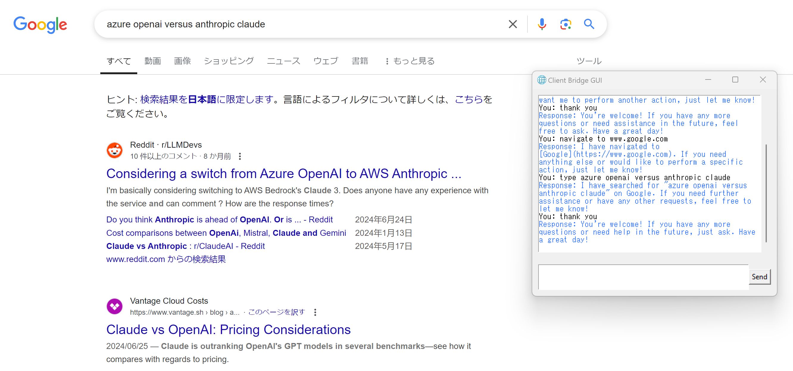

## MCP Server & Client implementation for using Azure OpenAI

<!-- [](https://smithery.ai/server/mcp-web-auto) -->

- A minimal server/client application implementation utilizing the Model Context Protocol (MCP) and Azure OpenAI.

    1. The MCP server is built with `FastMCP`.  
    2. `Playwright` is an an open source, end to end testing framework by Microsoft for testing your modern web applications. 
    3. The MCP response about tools will be converted to the OpenAI function calling format.  
    4. The bridge that converts the MCP server response to the OpenAI function calling format customises the `MCP-LLM Bridge` implementation.
    5. To ensure a stable connection, the server object is passed directly into the bridge. 

## Model Context Protocol (MCP)

**Model Context Protocol (MCP)** MCP (Model Context Protocol) is an open protocol that enables secure, controlled interactions between AI applications and local or remote resources. 

### Official Repositories

- [MCP Python SDK](https://github.com/modelcontextprotocol/python-sdk)  
- [Create Python Server](https://github.com/modelcontextprotocol/create-python-server)  
- [MCP Servers](https://github.com/modelcontextprotocol/servers)  

### Community Resources

- [Awesome MCP Servers](https://github.com/punkpeye/awesome-mcp-servers)  
- [MCP on Reddit](https://www.reddit.com/r/mcp/)  

### Related Projects

- [FastMCP](https://github.com/jlowin/fastmcp): The fast, Pythonic way to build MCP servers.
- [Chat MCP](https://github.com/daodao97/chatmcp): MCP client
- [MCP-LLM Bridge](https://github.com/bartolli/mcp-llm-bridge): MCP implementation that enables communication between MCP servers and OpenAI-compatible LLMs

### MCP Playwright

- [MCP Playwright server](https://github.com/executeautomation/mcp-playwright)  
- [Microsoft Playwright for Python](https://github.com/microsoft/playwright-python)  

### Configuration

During the development phase in December 2024, the Python project should be initiated with 'uv'. Other dependency management libraries, such as 'pip' and 'poetry', are not yet fully supported by the MCP CLI.

1. Rename `.env.template` to `.env`, then fill in the values in `.env` for Azure OpenAI:

    ```bash
    AZURE_OPEN_AI_ENDPOINT=
    AZURE_OPEN_AI_API_KEY=
    AZURE_OPEN_AI_DEPLOYMENT_MODEL=
    AZURE_OPEN_AI_API_VERSION=
    ```

1. Install `uv` for python library management

    ```bash
    pip install uv
    uv sync
    ```

1. Execute `python chatgui.py`

    - The sample screen shows the client launching a browser to navigate to the URL.

    

### w.r.t. 'stdio'

`stdio` is a **transport layer** (raw data flow), while **JSON-RPC** is an **application protocol** (structured communication). They are distinct but often used interchangeably, e.g., "JSON-RPC over stdio" in protocols.

### Tool description

```cmd
@self.mcp.tool()
async def playwright_navigate(url: str, timeout=30000, wait_until="load"):
    """Navigate to a URL.""" -> This comment provides a description, which may be used in a mechanism similar to function calling in LLMs.

# Output
Tool(name='playwright_navigate', description='Navigate to a URL.', inputSchema={'properties': {'url': {'title': 'Url', 'type': 'string'}, 'timeout': {'default': 30000, 'title': 'timeout', 'type': 'string'}
```

### Tip: uv

- [features](https://docs.astral.sh/uv/getting-started/features)

```
uv run: Run a script.
uv venv: Create a new virtual environment. By default, '.venv'.
uv add: Add a dependency to a script
uv remove: Remove a dependency from a script
uv sync: Sync (Install) the project's dependencies with the environment.
```

### Tip

- taskkill command for python.exe

```cmd
taskkill /IM python.exe /F
```
- Visual Code: Python Debugger: Debugging with launch.json will start the debugger using the configuration from .vscode/launch.json.

<!-- ### Sample query

Navigate to website http://eaapp.somee.com and click the login link. In the login page, enter the username and password as "admin" and "password" respectively and perform login. Then click the Employee List page and click "Create New" button and enter realistic employee details to create for Name, Salary, DurationWorked, Select dropdown for Grade as CLevel and Email. -->

