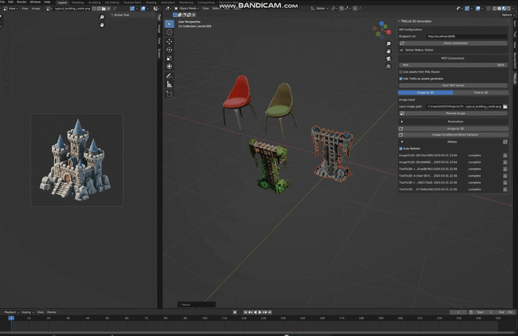

# TRELLIS & TRELLIS.2 Blender Addon
**Update: add support for TRELLIS.2**

A Blender addon that integrates the 3D generation capabilities of [TRELLIS](https://github.com/microsoft/TRELLIS) and [TRELLIS2](https://github.com/microsoft/TRELLIS.2) into blender.



## Features

##### TRELLIS 
* Text-to-3D: native generation of textured 3D mesh from text  
* Image-to-3D: native generation of textured 3D mesh from a single RGB image
* Text-conditioned Detail Variation: generating textures for a mesh given text
* Image-conditioned Detail Variation: generating textures for a mesh given a single RGB image

##### TRELLIS2
* Text-to-3D: generation of textured 3D mesh from text (t2i using z-image-turbo, and then image2mesh using trellis.2) 
* Image-to-3D: native generation of textured 3D mesh from a single RGB image (native trellis.2)

##### MCP integration
Integrates with MCP and can communicate with Cursor/Windsurf. Refer to [Trellis MCP](https://github.com/FishWoWater/trellis_mcp) 


## Installation

### Requirements
- Blender 3.6.0 or higher
- [**Option1**] Running TRELLIS API server (Refer to [my TreLLIS fork](https://github.com/FishWoWater/TRELLIS/blob/dev/README_api.md))
- [**Option2**] Running TRELLIS.2 API server (Refer to [my TreLLIS.2 fork](https://github.com/FishWoWater/TRELLIS.2/README_api.md))

You can also start both servers and switch the backend in the blender addon.

### Enable the plugin
1. Download the plugin files (clone this repo)
2. In Blender, go to Edit > Preferences > Add-ons
3. Click "Install" and select the `trellis_for_blender.py` file
4. Enable the addon by checking the box next to "3D View: TRELLIS"

### Native Workflow
1. Access the panel (open 3d viewport and press n to open sidebar), find TRELLIS.
2. (Optionally) Select an object in the scene, select an image as conditional input.
3. Adjust generation parameters (empirically can use fewer steps)
4. The plugin will upload both the object(if selected) and the image/text to the API backend.
5. When finished, the model can be downloaded and imported into the scene. 

You can see the historical requests in the main panel 

### MCP Workflow 
1. Access the panel (open 3d viewport and press n to open sidebar), find TRELLIS, click `Start MCP Server`
2. Open Claude/Cursor/Windsurf, paste following configuration: 
``` text 
"mcpServers": {
        "trellis": {
            "command": "uvx",
            "args": [
                "trellis-mcp"
            ]
        }
    }
```


## Generation Parameters

- **Sparse Structure Settings**
  - Sample Steps (sampling steps for structure diffusion, by default 12)
  - CFG Strength (classifier-free-guidance, by default 7.5, higher value will better align the input image)
- **Structured Latent Settings**
  - Sample Steps (sampling steps for SLAT diffusion, by default 12)
  - CFG Strength (classifier-free-guidance, by default 7.5, higher value will better align the input image)
- **Postprocessing Mesh Options**
  - Simplify Ratio (# of triangles to remove, by default 0.95)
  - Texture Size (by default 1024, can set to 2048 for higher quality, but slower)
  - Texture Bake Mode ('fast' or 'opt', 'opt' can be slow but has higher quality)


Any issue/discussion/contribution is welcomed!
