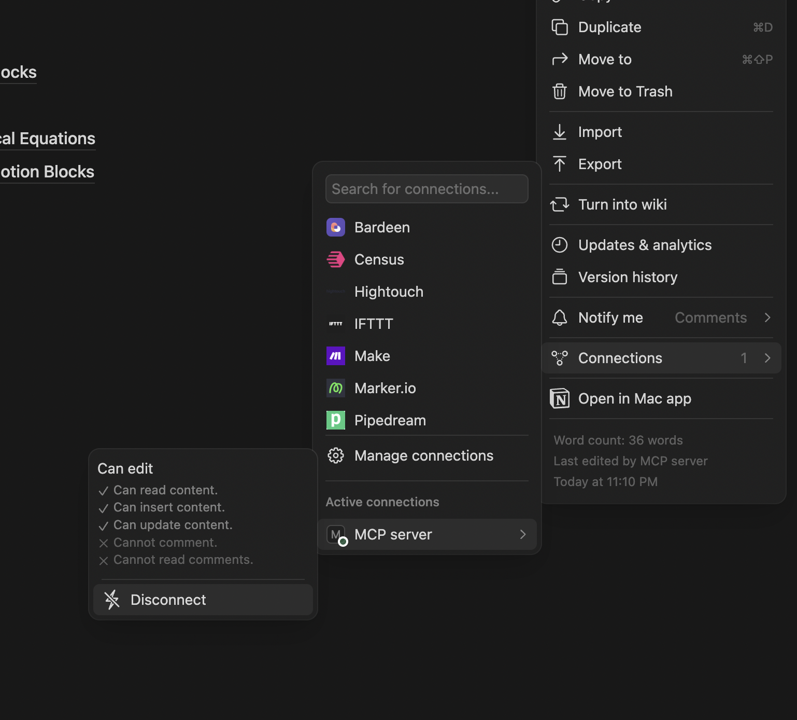

# Notion MCP Server


[](https://smithery.ai/server/@awkoy/notion-mcp-server)


**Notion MCP Server** is a Model Context Protocol (MCP) server implementation that enables AI assistants to interact with Notion's API. This production-ready server provides a complete set of tools and endpoints for reading, creating, and modifying Notion content through natural language interactions.

> 🚧 **Active Development**: Database support is now available! Comments and user management tools have been added. If you find this project useful, please consider giving it a star - it helps me know that this work is valuable to the community and motivates further development.

<a href="https://glama.ai/mcp/servers/zrh07hteaa">
  
</a>

## 📑 Table of Contents

- [Getting Started & Integration](#-getting-started--integration)
  - [Setup Process](#setup-process)
  - [Cursor Integration](#cursor-integration)
  - [Claude Desktop Integration](#claude-desktop-integration)
- [Features](#-features)
- [Documentation](#-documentation)
  - [Available Tools](#available-tools)
  - [Available Resources](#available-resources)
- [Development](#-development)
- [Technical Details](#-technical-details)
- [Troubleshooting](#-troubleshooting)
- [Contributing](#-contributing)
- [License](#-license)

## 🚀 Getting Started & Integration

### Setup Process

1. **Obtain a Notion API Key**
   - Create an integration at [Notion Developers](https://www.notion.so/my-integrations)
   - Copy your API key
   
2. **Enable Integration for Your Pages**
   - Select an existing page or create a new one in Notion
   - Click the "..." menu in the top right corner
   - Go to "Connections" 
   - Find and enable your integration from the list
   
   

3. **Choose Your Integration Method**
   - Follow one of the integration options below based on your preferred MCP client

4. **Ask Your AI Assistant to Interact with Notion**
   - "Create a new page with today's tasks"
   - "Update my meeting notes in Notion"
   - "Add bullet points to my meeting notes page"
   - "Create a new database for tracking projects"
   - "Add new entries to my task database"
   - "Add a comment to my project page"
   - "Show me all comments on this document"
   - "List all users in my workspace"
   - "Get information about a specific user"

### Cursor Integration

#### Method 1: Using mcp.json

1. Create or edit the `.cursor/mcp.json` file in your project directory:

```json
{
  "mcpServers": {
    "notion-mcp-server": {
      "command": "env NOTION_TOKEN=YOUR_KEY NOTION_PAGE_ID=YOUR_PAGE_ID npx",
      "args": ["-y", "notion-mcp-server"]
    }
  }
}
```

2. Replace `YOUR_KEY` and `YOUR_PAGE_ID` with your actual Notion API key and page ID
3. Restart Cursor to apply the changes

#### Method 2: Manual Mode

1. Open Cursor and go to Settings
2. Navigate to the "MCP" or "Model Context Protocol" section
3. Click "Add Server" or equivalent
4. Enter the following command in the appropriate field:

```
env NOTION_TOKEN=YOUR_KEY NOTION_PAGE_ID=YOUR_PAGE_ID npx -y notion-mcp-server
```

5. Replace `YOUR_KEY` and `YOUR_PAGE_ID` with your actual Notion API key and page ID
6. Save the settings and restart Cursor if necessary

### Claude Desktop Integration

1. Create or edit the `mcp.json` file in your configuration directory:

```json
{
  "mcpServers": {
    "notion-mcp-server": {
      "command": "npx",
      "args": ["-y", "notion-mcp-server"],
      "env": {
        "NOTION_TOKEN": "YOUR_KEY",
        "NOTION_PAGE_ID": "YOUR_PAGE_ID"
      }
    }
  }
}
```

2. Replace `YOUR_KEY` and `YOUR_PAGE_ID` with your actual Notion API key and page ID
3. Restart Claude Desktop to apply the changes

## 🌟 Features

- **📝 Notion Integration** - Interact with Notion databases, pages, and blocks
- **🔌 Universal MCP Compatibility** - Works with all MCP clients including Cursor, Claude Desktop, Cline, and Zed
- **🔍 Data Retrieval** - Fetch information from Notion pages, blocks, and databases
- **✏️ Content Creation** - Create and update Notion pages and blocks
- **📊 Block Management** - Append, update, and delete blocks within Notion pages
- **💾 Database Operations** - Create, query, and update databases
- **🔄 Batch Operations** - Perform multiple operations in a single request
- **🗑️ Archive & Restore** - Archive and restore Notion pages
- **🔎 Search Functionality** - Search Notion pages and databases by title
- **💬 Comments Management** - Get, create, and reply to comments on pages and discussions
- **👥 User Management** - Retrieve workspace users and user information

## 📚 Documentation

### Available Tools

The server provides the following consolidated tools for interacting with Notion:

#### `notion_pages`

A comprehensive tool for page operations including:
- Creating new pages with specified content
- Updating page properties
- Archiving pages (moving to trash)
- Restoring previously archived pages
- Searching for pages by title

Example operations:
```javascript
{
  "payload": {
    "action": "create_page", // One of: "create_page", "archive_page", "restore_page", "search_pages", "update_page_properties"
    "params": {
      // Parameters specific to the chosen action
    }
  }
}
```

#### `notion_blocks`

A complete toolkit for block operations including:
- Retrieving block content
- Fetching child blocks
- Appending new blocks to a parent
- Updating existing blocks
- Deleting blocks
- Performing batch operations (append, update, delete, mixed)

Example operations:
```javascript
{
  "payload": {
    "action": "append_block_children", // One of: "append_block_children", "retrieve_block", "retrieve_block_children", "update_block", "delete_block", "batch_append_block_children", "batch_update_blocks", "batch_delete_blocks", "batch_mixed_operations"
    "params": {
      // Parameters specific to the chosen action
    }
  }
}
```

#### `notion_database`

A powerful tool for database interactions including:
- Creating new databases with custom properties
- Querying databases with filters and sorting
- Updating database structure and properties

Example operations:
```javascript
{
  "payload": {
    "action": "create_database", // One of: "create_database", "query_database", "update_database"
    "params": {
      // Parameters specific to the chosen action
    }
  }
}
```

#### `notion_comments`

A tool for managing comments on Notion content:
- Retrieving comments from pages and blocks
- Adding new comments to pages
- Replying to existing discussions

Example operations:
```javascript
{
  "payload": {
    "action": "get_comments", // One of: "get_comments", "add_page_comment", "add_discussion_comment"
    "params": {
      // Parameters specific to the chosen action
    }
  }
}
```

#### `notion_users`

A tool for accessing user information:
- Listing all workspace users
- Getting details about specific users
- Retrieving information about the current bot user

Example operations:
```javascript
{
  "payload": {
    "action": "list_users", // One of: "list_users", "get_user", "get_bot_user"
    "params": {
      // Parameters specific to the chosen action
    }
  }
}
```

### Available Resources

The server currently does not expose any resources, focusing instead on tool-based operations.

## 🛠 Development

1. **Clone the Repository**
   ```
   git clone https://github.com/awkoy/notion-mcp-server.git
   cd notion-mcp-server
   ```

2. **Install Dependencies**
   ```
   npm install
   ```

3. **Set Up Environment Variables**
   - Create a `.env` file with:
     ```
     NOTION_TOKEN=your_notion_api_key
     NOTION_PAGE_ID=your_notion_page_id
     ```

4. **Build the Project**
   ```
   npm run build
   ```

5. **Run the Inspector**
   ```
   npm run inspector
   ```

## 🔧 Technical Details

- Built using TypeScript and the MCP SDK (version 1.7.0+)
- Uses the official Notion API client (@notionhq/client v2.3.0+)
- Follows the Model Context Protocol specification
- Implements tools for CRUD operations on Notion pages, blocks, and databases
- Supports efficient batch operations for performance optimization
- Validates input/output with Zod schemas

## ❓ Troubleshooting

- **Common Issues**
  - **Authentication Errors**: Ensure your Notion token has the correct permissions and integration is enabled for your pages/databases
  - **Page Access Issues**: Make sure your integration has been added to the pages you're attempting to access
  - **Rate Limiting**: Notion API has rate limits - use batch operations to optimize requests

- **Getting Help**
  - Create an issue on the [GitHub repository](https://github.com/awkoy/notion-mcp-server/issues)
  - Check the [Notion API documentation](https://developers.notion.com/reference/intro)
  - Visit the MCP community channels for assistance

## 🤝 Contributing

Contributions are welcome! Please feel free to submit a Pull Request.

1. Fork the repository
2. Create your feature branch (`git checkout -b feature/amazing-feature`)
3. Commit your changes (`git commit -m 'Add some amazing feature'`)
4. Push to the branch (`git push origin feature/amazing-feature`)
5. Open a Pull Request

## 📄 License

This project is licensed under the MIT License - see the LICENSE file for details.

