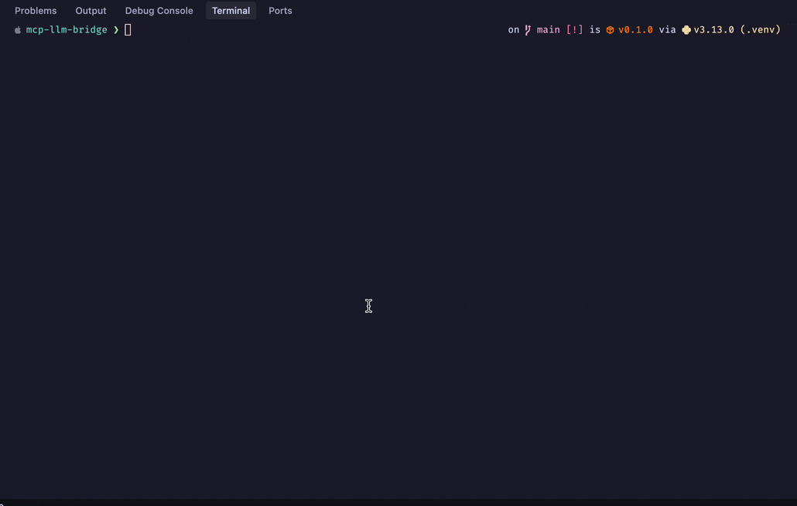

# MCP LLM Bridge

A bridge connecting Model Context Protocol (MCP) servers to OpenAI-compatible LLMs. Primary support for OpenAI API, with additional compatibility for local endpoints that implement the OpenAI API specification.

The implementation provides a bidirectional protocol translation layer between MCP and OpenAI's function-calling interface. It converts MCP tool specifications into OpenAI function schemas and handles the mapping of function invocations back to MCP tool executions. This enables any OpenAI-compatible language model to leverage MCP-compliant tools through a standardized interface, whether using cloud-based models or local implementations like Ollama.

Read more about MCP by Anthropic here:

- [Resources](https://modelcontextprotocol.io/docs/concepts/resources)
- [Prompts](https://modelcontextprotocol.io/docs/concepts/prompts)
- [Tools](https://modelcontextprotocol.io/docs/concepts/tools)
- [Sampling](https://modelcontextprotocol.io/docs/concepts/sampling)

Demo:



## Quick Start

```bash
# Install
curl -LsSf https://astral.sh/uv/install.sh | sh
git clone https://github.com/bartolli/mcp-llm-bridge.git
cd mcp-llm-bridge
uv venv
source .venv/bin/activate
uv pip install -e .

# Create test database
python -m mcp_llm_bridge.create_test_db
```

## Configuration

### OpenAI (Primary)

Create `.env`:

```bash
OPENAI_API_KEY=your_key
OPENAI_MODEL=gpt-4o # or any other OpenAI model that supports tools
```

Note: reactivate the environment if needed to use the keys in `.env`: `source .venv/bin/activate`

Then configure the bridge in [src/mcp_llm_bridge/main.py](src/mcp_llm_bridge/main.py)

```python
config = BridgeConfig(
    mcp_server_params=StdioServerParameters(
        command="uvx",
        args=["mcp-server-sqlite", "--db-path", "test.db"],
        env=None
    ),
    llm_config=LLMConfig(
        api_key=os.getenv("OPENAI_API_KEY"),
        model=os.getenv("OPENAI_MODEL", "gpt-4o"),
        base_url=None
    )
)
```

### Additional Endpoint Support

The bridge also works with any endpoint implementing the OpenAI API specification:

#### Ollama

```python
llm_config=LLMConfig(
    api_key="not-needed",
    model="mistral-nemo:12b-instruct-2407-q8_0",
    base_url="http://localhost:11434/v1"
)
```

Note: After testing various models, including `llama3.2:3b-instruct-fp16`, I found that `mistral-nemo:12b-instruct-2407-q8_0` handles complex queries more effectively.

#### LM Studio

```python
llm_config=LLMConfig(
    api_key="not-needed",
    model="local-model",
    base_url="http://localhost:1234/v1"
)
```

I didn't test this, but it should work.

## Usage

```bash
python -m mcp_llm_bridge.main

# Try: "What are the most expensive products in the database?"
# Exit with 'quit' or Ctrl+C
```

## Running Tests

Install the package with test dependencies:

```bash
uv pip install -e ".[test]"
```

Then run the tests:

```bash
python -m pytest -v tests/
```
## License

[MIT](LICENSE.md)

## Contributing

PRs welcome.
