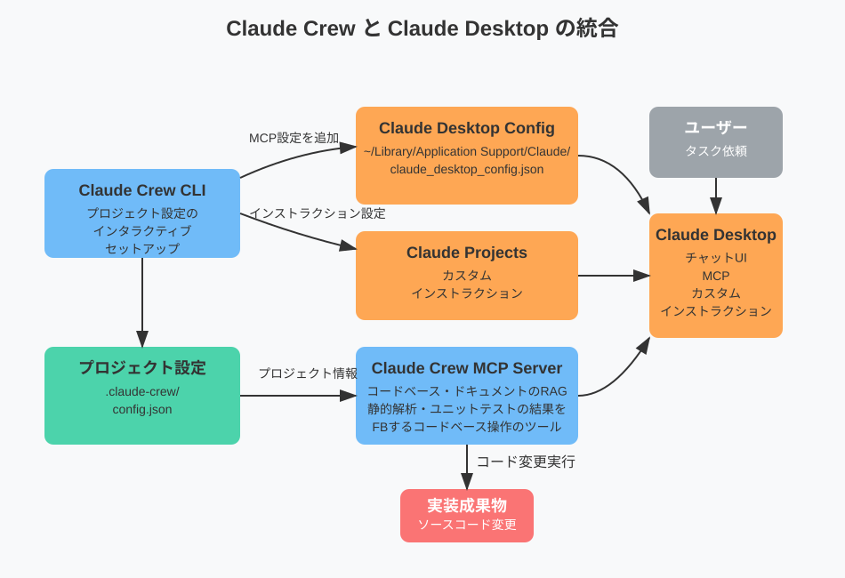

# Claude Crew 🤖

[](https://badge.fury.io/js/claude-crew)
[](https://opensource.org/licenses/MIT)

[English](README.md) | 日本語

Claude Crew は、Claude Desktop と Model Context Protocol (MCP) を活用して、OpenHands のような自律的なコーディングエージェントを作成するためのツールです。

Cline 等のリアルタイムでの協業を重視するコーディングアシスタントとは異なり、LLM が自律的に開発タスクを進行します。複雑度の低いタスクを委任するようなケースや、非エンジニアが自然言語オンリーで実装を進めるケースを得意とします。

## コンセプト

Claude Crew は、Claude Desktop の性能を最大限に引き出すために、以下の3つの要素に注力しています：

- 🎯 コンテキストウィンドウの効率的な利用によるコスト効率の最大化
- 🧪 ブラウザ連携ではなくユニットテストによるトークンコストパフォーマンスに長けた動作検証を重視
- 🔄 汎用的なファイルシステム操作・シェルの MCP ではなく、プロジェクトに最適化された MCP 及びコンテキスト情報の提供

## 必要要件

- Claude Desktop
- Embedding 用の OpenAI API キー（任意 - ただしコンテキスト理解の向上のため強く推奨）
- Node.js >= v20

## How it works

Claude Crew は、設定用の CLI と MCP Server を提供します。



CLI を介してインタラクティブにプロジェクトの情報を設定し、プロジェクト情報を反映した MCP ツール・カスタムインストラクションを提供します。

以下のような流れでタスクを処理します：

1. **タスクの受付**

   - ユーザーからタスクの依頼を受け取る

2. **プロジェクト情報の提供**

   - `prepare` ツールが呼び出され：
     - 依存関係の更新
     - RAG インデックスの更新
     - Gitリポジトリの最新化（設定されている場合）
   - LLM に以下の情報を提供：
     - プロジェクトの構造
     - 関連するソースコード
     - 関連ドキュメント
     - メモリバンクの知識

3. **自律的なタスク実行**
   - LLM が提供された情報を基に作業を開始
     - ファイル操作に伴い、自動的にリンター・ユニットテストが実行され、フィードバック
   - フィードバック結果を基に必要な修正を実施

各ステップで得られる情報は最適化され、LLM のコンテキストウィンドウを効率的に使用します。

## Quick Start

### プロジェクト側のセットアップ

プロジェクトディレクトリに移動してセットアップを実行します：

```bash
$ cd /path/to/your-project
$ npx claude-crew@latest setup
```

対話形式で各種設定を入力すると、`.claude-crew` 以下に設定ファイルが生成されます。

> **Note**: Claude Crewは複数のプロジェクトで同時に利用できます。各プロジェクトごとに固有の設定が生成され、命名の衝突を防ぐため、それぞれのプロジェクトで独自のツール設定が作成されます。例えば：

```json
// プロジェクトA: /path/to/project-a/.claude-crew/mcp.json
{
  "tools": {
    "project_a_run_test": { ... },
    "project_a_check_types": { ... }
  }
}

// プロジェクトB: /path/to/project-b/.claude-crew/mcp.json
{
  "tools": {
    "project_b_run_test": { ... },
    "project_b_check_types": { ... }
  }
}
```

> **Tip**: プロジェクトの管理を容易にするため、Claude Crewを利用するプロジェクトは別のリポジトリとしてcloneすることをお勧めします。これにより、各プロジェクトの設定や状態を独立して管理できます。

### Claude Desktop のセットアップ

1. `.claude-crew/mcp.json` に生成された MCP の設定を `~/Library/Application Support/Claude/claude_desktop_config.json` に追加します
2. Claude Desktop を起動し、Projects を新規で作成します
3. `.claude-crew/instruction.md` の内容をプロジェクトのカスタム指示に追加します

以上でセットアップ完了です 🎉

## トラブルシューティング

Claude Crewの使用中に問題が発生した場合、以下の一般的な解決方法を試してください：

### MCPサーバーが起動しない

MCPサーバーが起動しない場合、古い設定フォーマットを使用している可能性があります。以下を試してください：

1. `claude_desktop_config.json` の内容が `.claude-crew/mcp.json` のフォーマットと一致しているか確認する
2. Claude Desktopの MCP 設定を `.claude-crew/mcp.json` の最新フォーマットで更新する
3. 問題が解決しない場合は、プロジェクトルートの `config.example.json` を参考に設定を調整してください

### 設定例

利用可能なすべてのオプションとインテグレーション設定を含む Claude Crew の設定例については、プロジェクトルートの `config.example.json` を参照してください。

### データベースの問題

データベース関連の問題が発生した場合、データベースをリセットして再初期化できます：

```bash
# 既存のデータベースコンテナとボリュームをクリーンアップ
$ npx claude-crew clean

# データベースを再初期化
$ npx claude-crew setup-db
```

## 設定項目

`.claude-crew/config.json` で以下の設定をカスタマイズできます：

| カテゴリ     | 設定項目              | デフォルト値               | 説明                                                                |
| ------------ | --------------------- | -------------------------- | ------------------------------------------------------------------- |
| **基本設定** |
|              | `name`                | プロジェクト名             | プロジェクト名                                                      |
|              | `directory`           | カレントディレクトリ       | プロジェクトのルートディレクトリ                                    |
|              | `language`            | "日本語"                   | Claude との対話言語                                                 |
| **Git設定**  |
|              | `git.defaultBranch`   | "main"                     | Gitのデフォルトブランチ名                                           |
|              | `git.autoPull`        | true                       | prepare時に自動的に最新の変更を取得するかどうか                     |
| **コマンド** |
|              | `commands.install`    | "pnpm i"                   | 依存関係のインストールコマンド                                      |
|              | `commands.build`      | "pnpm build"               | ビルドコマンド                                                      |
|              | `commands.test`       | "pnpm test"                | テスト実行コマンド                                                  |
|              | `commands.testFile`   | "pnpm vitest run <file>"   | 単一ファイルのテストコマンド。<file> が絶対パスに置換されます。     |
|              | `commands.checks`     | ["pnpm tsc -p . --noEmit"] | 型チェックなどの検証コマンド                                        |
|              | `commands.checkFiles` | ["pnpm eslint <files>"]    | 特定ファイルの検証コマンド。<files>が絶体パスの一覧に置換されます。 |

## インテグレーション

Claude Crew は、拡張機能として複数のインテグレーションを提供しています。設定ファイルの `integrations` セクションで有効化および設定できます。

## 他のMCPツールとの協業

Claude Crew は他のMCPツールと併用することができますが、以下のガイドラインに従うことを推奨します：

### 同種のツールの無効化を推奨

`filesystem`や`claude-code`などの同種のツールは無効にすることを推奨します。

**理由：**

- 選択肢が少ないほど、AIエージェントは迷いなくタスクを進めることができます
- 重複する機能があると、AIエージェントが最適なツールを選択するのに余計なコンテキストを消費する可能性があります

### ブラウザ操作ツールの利用

`playwright-mcp`などのブラウザ操作ツールを併用することで、ブラウザアクセスを含むタスクも実行可能です。ただし、以下の点を考慮してください：

- ブラウザ操作による動作確認は、ユニットテストに比べてコンテキストを多く消費する傾向があります
- ユニットテストで十分な検証が可能な場合は、ブラウザ操作ツールの使用は非推奨です
- ユニットテストでの確認が難しい場合（例：UIの視覚的な確認、複雑なユーザーインタラクションの検証など）は、ブラウザ操作ツールの使用を検討してください

### カスタムインストラクションの追加

現時点では、他のツールの利用に関するカスタムインストラクションを自動的に統合する機能は提供されていません。

代替手段：

- CLIで生成されたインストラクション（`.claude-crew/instruction.md`）に手動で追記する
- 追加のツールに関する指示は、プロジェクトのカスタムインストラクションに直接追加してください

### 利用可能なインテグレーション

#### TypeScript インテグレーション

TypeScript プロジェクトのサポートを強化するインテグレーションです。

```json
{
  "name": "typescript",
  "config": {
    "tsConfigFilePath": "./tsconfig.json"
  }
}
```

| 設定項目           | 説明                              |
| ------------------ | --------------------------------- |
| `tsConfigFilePath` | TypeScript の設定ファイルへのパス |

**提供するツール:**

- `{project_name}-search-typescript-declaration` - 識別子（関数名、クラス名、インターフェース名など）からTypeScriptの宣言を検索

#### RAG インテグレーション (Retrieval-Augmented Generation)

プロジェクト内の関連ドキュメントや情報を検索するための拡張機能です。

```json
{
  "name": "rag",
  "config": {
    "provider": {
      "type": "openai",
      "apiKey": "your-openai-api-key",
      "model": "text-embedding-ada-002"
    }
  }
}
```

| 設定項目          | デフォルト値             | 説明                                                         |
| ----------------- | ------------------------ | ------------------------------------------------------------ |
| `provider.type`   | "openai"                 | 埋め込みプロバイダーのタイプ（現在は "openai" のみサポート） |
| `provider.apiKey` | -                        | OpenAI API キー                                              |
| `provider.model`  | "text-embedding-ada-002" | 使用する埋め込みモデル                                       |

**提供するツール:**

- `{project_name}-find-relevant-documents` - クエリに基づいて関連ドキュメントを検索
- `{project_name}-find-relevant-resources` - クエリに基づいて関連リソースを検索

## メモリバンク

Claude Crew は `.claude-crew/memory-bank.md` ファイルを作成し、プロジェクトの永続的な知識を保存します。このファイルは各タスクの開始時に自動的に読み込まれ、以下のセクションが含まれています：

- プロジェクト概要
- プロダクトコンテキスト
- システムパターン
- コーディングガイドライン

メモリバンクはプロジェクト開発を通じて更新され、AIエージェントのための知識リポジトリとして機能します。

## スニペット

Claude DesktopにはMCPツールの自動承認機能がないため、自動承認のためのスクリプトを提供しています。これはオプションであり、必須ではありません。

スニペットは以下の機能を提供します：

### 主な機能

- **自動ツール承認**: 信頼できるツール（`claude-crew-` というプレフィックスを持つツール）の実行を自動的に承認
- **メッセージ送信コントロール**: 特に非英語入力に推奨。Ctrl+Enterでのメッセージ送信を可能にします（オプション）

### 使用方法

1. スニペットを生成:

```bash
# 基本的な使用方法
npx claude-crew@latest create-snippet

# Enterキーでのメッセージ送信を無効化
npx claude-crew@latest create-snippet --disable-send-enter
```

2. Claude Desktopに適用:
   - Claude Desktopを起動
   - `Cmd + Alt + Shift + i` を押してデベロッパーコンソールを開く
   - 生成されたスニペットの内容をコンソールに貼り付けて実行

### オプション

| オプション             | デフォルト値 | 説明                                              |
| ---------------------- | ------------ | ------------------------------------------------- |
| `--disable-send-enter` | `false`      | `true`の場合、Enterキーでのメッセージ送信を無効化 |
| `config-path`          | -            | 設定ファイルのパス（必須）                        |

## CLIコマンド

Claude Crewは以下のCLIコマンドを提供しています：

- `setup` - インタラクティブなプロジェクトセットアップ
- `setup-db` - 手動でのデータベースセットアップ（再インストール時に便利）
- `clean` - PGlite データベースをリセット
- `serve-mcp` - Claude Desktop統合用のMCPサーバーを実行
- `create-snippet` - Claude Desktop用のヘルパースクリプトを作成
  - `--disable-send-enter` - Enterキーでのメッセージ送信を無効化（デフォルト: false）
  - `--outfile` - 出力ファイルパス（デフォルト: claude_crew_snippet.js）

## 貢献

貢献を歓迎します！以下の方法で参加できます：

- バグや機能リクエストをIssuesで報告
- Pull Requestで改善を提案

詳細については、[/docs/contribute/README.md](./docs/contribute/README.md)をご確認ください。

## ライセンス

このプロジェクトはMITライセンスの下でリリースされています。詳細は[LICENSE](LICENSE)ファイルをご覧ください。
