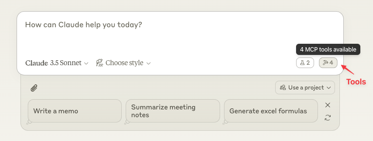
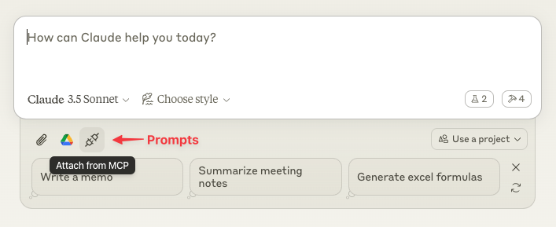

# mcp-servers

The [Model Context Protocol](https://modelcontextprotocol.io/) servers on my machine. 

## Requirements
- Claude Desktop ([Download](https://claude.ai/download))
- uv ([Install](https://docs.astral.sh/uv/getting-started/installation/))

## Install

### Prepare the environment
```shell
gh repo clone goofansu/mcp-servers
cd mcp-servers
uv venv
uv sync
source .venv/bin/activate.fish # depending on your shell
```

### Install MCP servers
```shell
mcp install weather.py
```

Restart the Claude Desktop app and you'll find tools.

### Inspect MCP servers
If Claude Desktop reports errors about MCP servers, you can debug with the MCP Inspector by running:
```
mcp dev weather.py
```

## Usage
- Select tools from "Available MCP Tools"


- Select prompts by "Attach from MCP"


## Nix user
If `uv` is installed using Nix, you'll make changes in `~/Library/Application Support/Claude/claude_desktop_config.json`:

```diff
{
  "mcpServers": {
    "weather": {
-     "command": "uv",
+     "command": "/etc/profiles/per-user/james/bin/uv",
      "args": [
+       "--directory",
+       "/Users/james/src/mcp-servers",
        "run",
        "--with",
        "mcp",
        "mcp",
        "run",
        "/Users/james/src/mcp-servers/weather.py"
      ]
    }
  }
}
```

## References
- https://modelcontextprotocol.io/quickstart/server
- https://modelcontextprotocol.io/quickstart/user
- https://github.com/modelcontextprotocol/python-sdk
