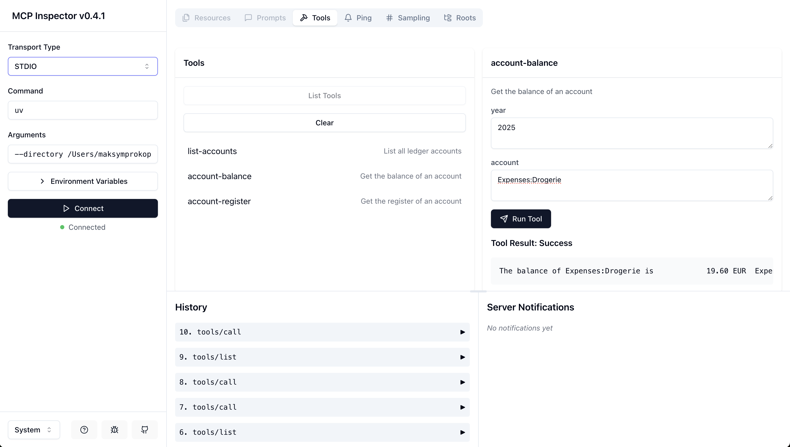

# ledger-service MCP server

MCP Server for accessing and managing ledger files through Claude.

## Components

### Tools

The server implements three tools for ledger management:

- **list-accounts**: Lists all accounts in the ledger
  - Takes "year" as a required argument
  - Returns formatted list of all available accounts

- **account-balance**: Gets the balance for a specific account
  - Takes "year" and "account" as required arguments
  - Returns the current balance for the specified account

- **account-register**: Shows the transaction register for an account
  - Takes "year" and "account" as required arguments
  - Returns detailed transaction history for the specified account

## Installation

### Prerequisites

- Python 3.13 or higher
- `uv` package manager
- Node.js and npm (for debugging)

### Install from PyPI

```bash
uv pip install ledger-service
```

## Debugging

Using the inspector to debug the server:

```bash
npx @modelcontextprotocol/inspector \
  uv \
  --directory /path/to/ledger-service \
  run \
  ledger-service
```



### Configure Claude Desktop

Add the server configuration to Claude Desktop's config file:

On MacOS: `~/Library/Application\ Support/Claude/claude_desktop_config.json`
On Windows: `%APPDATA%/Claude/claude_desktop_config.json`

<details>
  <summary>Development Configuration</summary>
  
  ```json
  "mcpServers": {
    "ledger-service": {
      "command": "uv",
      "args": [
        "--directory",
        "/path/to/ledger-service",
        "run",
        "ledger-service"
      ]
    }
  }
  ```
</details>

<details>
  <summary>Production Configuration</summary>
  
  ```json
  "mcpServers": {
    "ledger-service": {
      "command": "uvx",
      "args": [
        "ledger-service"
      ]
    }
  }
  ```
</details>

## Development

### Local Setup

1. Clone the repository
2. Create and activate a virtual environment
3. Install dependencies:


The base path can be configured by modifying the `LEDGER_BASE_PATH` constant in `server.py`.

## License

GNU GENERAL PUBLIC LICENSE Version 3, 29 June 2007