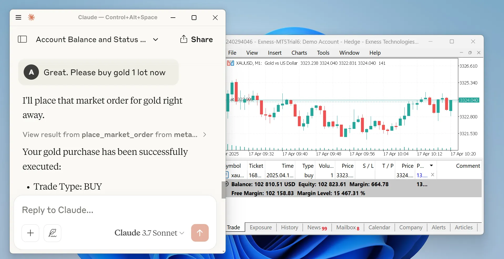

<div align="center">
  <h1>MetaTrader MCP Server</h1>
</div>

<br />

<div align="center">

[](https://pypi.org/project/metatrader-mcp-server/)
[](https://www.python.org/downloads/)
[](https://opensource.org/licenses/MIT)

**Let AI assistants trade for you using natural language**

[Features](#-features) • [Quick Start](#-quick-start) • [Documentation](#-documentation) • [Examples](#-usage-examples) • [Support](#-getting-help)



</div>

<br />

---

## 🌟 What is This?

**MetaTrader MCP Server** is a bridge that connects AI assistants (like Claude, ChatGPT) to the MetaTrader 5 trading platform. Instead of clicking buttons, you can simply tell your AI assistant what to do:

> "Show me my account balance"
> "Buy 0.01 lots of EUR/USD"
> "Close all profitable positions"

The AI understands your request and executes it on MetaTrader 5 automatically.

### How It Works

```
You → AI Assistant → MCP Server → MetaTrader 5 → Your Trades
```

## ✨ Features

- **🗣️ Natural Language Trading** - Talk to AI in plain English to execute trades
- **🤖 Multi-AI Support** - Works with Claude Desktop, ChatGPT (via Open WebUI), and more
- **📊 Full Market Access** - Get real-time prices, historical data, and symbol information
- **💼 Complete Account Control** - Check balance, equity, margin, and trading statistics
- **⚡ Order Management** - Place, modify, and close orders with simple commands
- **🔒 Secure** - All credentials stay on your machine
- **🌐 Flexible Interfaces** - Use as MCP server or REST API
- **📖 Well Documented** - Comprehensive guides and examples

## 🎯 Who Is This For?

- **Traders** who want to automate their trading using AI
- **Developers** building trading bots or analysis tools
- **Analysts** who need quick access to market data
- **Anyone** interested in combining AI with financial markets

## ⚠️ Important Disclaimer

**Please read this carefully:**

Trading financial instruments involves significant risk of loss. This software is provided as-is, and the developers accept **no liability** for any trading losses, gains, or consequences of using this software.

By using this software, you acknowledge that:
- You understand the risks of financial trading
- You are responsible for all trades executed through this system
- You will not hold the developers liable for any outcomes
- You are using this software at your own risk

**This is not financial advice. Always trade responsibly.**

---

## 📋 Prerequisites

Before you begin, make sure you have:

1. **Python 3.10 or higher** - [Download here](https://www.python.org/downloads/)
2. **MetaTrader 5 terminal** - [Download here](https://www.metatrader5.com/en/download)
3. **MT5 Trading Account** - Demo or live account credentials
   - Login number
   - Password
   - Server name (e.g., "MetaQuotes-Demo")

## 🚀 Quick Start

### Step 1: Install the Package

Open your terminal or command prompt and run:

```bash
pip install metatrader-mcp-server
```

### Step 2: Enable Algorithmic Trading

1. Open MetaTrader 5
2. Go to `Tools` → `Options`
3. Click the `Expert Advisors` tab
4. Check the box for `Allow algorithmic trading`
5. Click `OK`

### Step 3: Choose Your Interface

Pick one based on how you want to use it:

#### Option A: Use with Claude Desktop (Recommended for beginners)

1. Find your Claude Desktop config file:
   - **Windows**: `%APPDATA%\Claude\claude_desktop_config.json`
   - **Mac**: `~/Library/Application Support/Claude/claude_desktop_config.json`

2. Open the file and add this configuration:

```json
{
  "mcpServers": {
    "metatrader": {
      "command": "metatrader-mcp-server",
      "args": [
        "--login",    "YOUR_MT5_LOGIN",
        "--password", "YOUR_MT5_PASSWORD",
        "--server",   "YOUR_MT5_SERVER"
      ]
    }
  }
}
```

**Optional: Specify Custom MT5 Terminal Path**

If your MT5 terminal is installed in a non-standard location, add the `--path` argument:

```json
{
  "mcpServers": {
    "metatrader": {
      "command": "metatrader-mcp-server",
      "args": [
        "--login",    "YOUR_MT5_LOGIN",
        "--password", "YOUR_MT5_PASSWORD",
        "--server",   "YOUR_MT5_SERVER",
        "--path",     "C:\\Program Files\\MetaTrader 5\\terminal64.exe"
      ]
    }
  }
}
```

3. Replace `YOUR_MT5_LOGIN`, `YOUR_MT5_PASSWORD`, and `YOUR_MT5_SERVER` with your actual credentials

4. Restart Claude Desktop

5. Start chatting! Try: *"What's my account balance?"*

#### Option B: Use with Open WebUI (For ChatGPT and other LLMs)

1. Start the HTTP server:

```bash
metatrader-http-server --login YOUR_LOGIN --password YOUR_PASSWORD --server YOUR_SERVER --host 0.0.0.0 --port 8000
```

**Optional: Specify Custom MT5 Terminal Path**

If your MT5 terminal is installed in a non-standard location, add the `--path` argument:

```bash
metatrader-http-server --login YOUR_LOGIN --password YOUR_PASSWORD --server YOUR_SERVER --path "C:\Program Files\MetaTrader 5\terminal64.exe" --host 0.0.0.0 --port 8000
```

2. Open your browser to `http://localhost:8000/docs` to see the API documentation

3. In Open WebUI:
   - Go to **Settings** → **Tools**
   - Click **Add Tool Server**
   - Enter `http://localhost:8000`
   - Save

4. Now you can use trading tools in your Open WebUI chats!

---

## 💡 Usage Examples

### With Claude Desktop

Once configured, you can chat naturally:

**Check Your Account:**
> You: "Show me my account information"
>
> Claude: *Returns balance, equity, margin, leverage, etc.*

**Get Market Data:**
> You: "What's the current price of EUR/USD?"
>
> Claude: *Shows bid, ask, and spread*

**Place a Trade:**
> You: "Buy 0.01 lots of GBP/USD with stop loss at 1.2500 and take profit at 1.2700"
>
> Claude: *Executes the trade and confirms*

**Manage Positions:**
> You: "Close all my losing positions"
>
> Claude: *Closes positions and reports results*

**Analyze History:**
> You: "Show me all my trades from last week for EUR/USD"
>
> Claude: *Returns trade history as a table*

### With HTTP API

```bash
# Get account info
curl http://localhost:8000/api/v1/account/info

# Get current price
curl "http://localhost:8000/api/v1/market/price?symbol_name=EURUSD"

# Place a market order
curl -X POST http://localhost:8000/api/v1/order/market \
  -H "Content-Type: application/json" \
  -d '{
    "symbol": "EURUSD",
    "volume": 0.01,
    "type": "BUY",
    "stop_loss": 1.0990,
    "take_profit": 1.1010
  }'

# Get all open positions
curl http://localhost:8000/api/v1/positions

# Close a specific position
curl -X DELETE http://localhost:8000/api/v1/positions/12345
```

### As a Python Library

```python
from metatrader_client import MT5Client

# Connect to MT5
config = {
    "login": 12345678,
    "password": "your_password",
    "server": "MetaQuotes-Demo"
}
client = MT5Client(config)
client.connect()

# Get account statistics
stats = client.account.get_trade_statistics()
print(f"Balance: ${stats['balance']}")
print(f"Equity: ${stats['equity']}")

# Get current price
price = client.market.get_symbol_price("EURUSD")
print(f"EUR/USD Bid: {price['bid']}, Ask: {price['ask']}")

# Place a market order
result = client.order.place_market_order(
    type="BUY",
    symbol="EURUSD",
    volume=0.01,
    stop_loss=1.0990,
    take_profit=1.1010
)
print(result['message'])

# Close all positions
client.order.close_all_positions()

# Disconnect
client.disconnect()
```

---

## 📚 Available Operations

### Account Management
- `get_account_info` - Get balance, equity, profit, margin level, leverage, currency

### Market Data
- `get_symbols` - List all available trading symbols
- `get_symbol_price` - Get current bid/ask price for a symbol
- `get_candles_latest` - Get recent price candles (OHLCV data)
- `get_candles_by_date` - Get historical candles for a date range
- `get_symbol_info` - Get detailed symbol information

### Order Execution
- `place_market_order` - Execute instant BUY/SELL orders
- `place_pending_order` - Place limit/stop orders for future execution
- `modify_position` - Update stop loss or take profit
- `modify_pending_order` - Modify pending order parameters

### Position Management
- `get_all_positions` - View all open positions
- `get_positions_by_symbol` - Filter positions by trading pair
- `get_positions_by_id` - Get specific position details
- `close_position` - Close a specific position
- `close_all_positions` - Close all open positions
- `close_all_positions_by_symbol` - Close all positions for a symbol
- `close_all_profitable_positions` - Close only winning trades
- `close_all_losing_positions` - Close only losing trades

### Pending Orders
- `get_all_pending_orders` - List all pending orders
- `get_pending_orders_by_symbol` - Filter pending orders by symbol
- `cancel_pending_order` - Cancel a specific pending order
- `cancel_all_pending_orders` - Cancel all pending orders
- `cancel_pending_orders_by_symbol` - Cancel pending orders for a symbol

### Trading History
- `get_deals` - Get historical completed trades
- `get_orders` - Get historical order records

---

## 🔧 Advanced Configuration

### Using Environment Variables

Instead of putting credentials in the command line, create a `.env` file:

```env
LOGIN=12345678
PASSWORD=your_password
SERVER=MetaQuotes-Demo

# Optional: Specify custom MT5 terminal path (auto-detected if not provided)
# PATH=C:\Program Files\MetaTrader 5\terminal64.exe
```

Then start the server without arguments:

```bash
metatrader-http-server
```

The server will automatically load credentials from the `.env` file.

### Custom Port and Host

```bash
metatrader-http-server --host 127.0.0.1 --port 9000
```

### Connection Parameters

The MT5 client supports additional configuration:

```python
config = {
    "login": 12345678,
    "password": "your_password",
    "server": "MetaQuotes-Demo",
    "path": None,               # Path to MT5 terminal executable (default: auto-detect)
    "timeout": 60000,           # Connection timeout in milliseconds (default: 60000)
    "portable": False,          # Use portable mode (default: False)
    "max_retries": 3,           # Maximum connection retry attempts (default: 3)
    "backoff_factor": 1.5,      # Delay multiplier between retries (default: 1.5)
    "cooldown_time": 2.0,       # Seconds to wait between connections (default: 2.0)
    "debug": True               # Enable debug logging (default: False)
}
```

**Configuration Options:**

- **login** (int, required): Your MT5 account login number
- **password** (str, required): Your MT5 account password
- **server** (str, required): MT5 server name (e.g., "MetaQuotes-Demo")
- **path** (str, optional): Full path to the MT5 terminal executable. If not specified, the client will automatically search standard installation directories
- **timeout** (int, optional): Connection timeout in milliseconds. Default: 60000 (60 seconds)
- **portable** (bool, optional): Enable portable mode for the MT5 terminal. Default: False
- **max_retries** (int, optional): Maximum number of connection retry attempts. Default: 3
- **backoff_factor** (float, optional): Exponential backoff factor for retry delays. Default: 1.5
- **cooldown_time** (float, optional): Minimum time in seconds between connection attempts. Default: 2.0
- **debug** (bool, optional): Enable detailed debug logging for troubleshooting. Default: False

---

## 🗺️ Roadmap

| Feature | Status |
|---------|--------|
| MetaTrader 5 Connection | ✅ Complete |
| Python Client Library | ✅ Complete |
| MCP Server | ✅ Complete |
| Claude Desktop Integration | ✅ Complete |
| HTTP/REST API Server | ✅ Complete |
| Open WebUI Integration | ✅ Complete |
| OpenAPI Documentation | ✅ Complete |
| PyPI Package | ✅ Published |
| Google ADK Integration | 🚧 In Progress |
| WebSocket Support | 📋 Planned |
| Docker Container | 📋 Planned |

---

## 🛠️ Development

### Setting Up Development Environment

```bash
# Clone the repository
git clone https://github.com/ariadng/metatrader-mcp-server.git
cd metatrader-mcp-server

# Install in development mode
pip install -e .

# Install development dependencies
pip install pytest python-dotenv

# Run tests
pytest tests/
```

### Project Structure

```
metatrader-mcp-server/
├── src/
│   ├── metatrader_client/      # Core MT5 client library
│   │   ├── account/            # Account operations
│   │   ├── connection/         # Connection management
│   │   ├── history/            # Historical data
│   │   ├── market/             # Market data
│   │   ├── order/              # Order execution
│   │   └── types/              # Type definitions
│   ├── metatrader_mcp/         # MCP server implementation
│   └── metatrader_openapi/     # HTTP/REST API server
├── tests/                      # Test suite
├── docs/                       # Documentation
└── pyproject.toml             # Project configuration
```

---

## 🤝 Contributing

Contributions are welcome! Here's how you can help:

1. **Report Bugs** - [Open an issue](https://github.com/ariadng/metatrader-mcp-server/issues)
2. **Suggest Features** - Share your ideas in issues
3. **Submit Pull Requests** - Fix bugs or add features
4. **Improve Documentation** - Help make docs clearer
5. **Share Examples** - Show how you're using it

### Contribution Guidelines

- Fork the repository
- Create a feature branch (`git checkout -b feature/amazing-feature`)
- Make your changes
- Write or update tests
- Ensure tests pass (`pytest`)
- Commit your changes (`git commit -m 'Add amazing feature'`)
- Push to the branch (`git push origin feature/amazing-feature`)
- Open a Pull Request

---

## 📖 Documentation

- **[Developer Documentation](docs/README.md)** - Detailed technical docs
- **[API Reference](docs/api-reference.md)** - Complete API documentation
- **[Examples](docs/examples/)** - Code examples and tutorials
- **[Roadmap](docs/roadmap/version-checklist.md)** - Feature development timeline

---

## 🆘 Getting Help

- **Issues**: [GitHub Issues](https://github.com/ariadng/metatrader-mcp-server/issues)
- **Discussions**: [GitHub Discussions](https://github.com/ariadng/metatrader-mcp-server/discussions)
- **LinkedIn**: [Connect with me](https://linkedin.com/in/ariadhanang)

### Common Issues

**"Connection failed"**
- Ensure MT5 terminal is running
- Check that algorithmic trading is enabled
- Verify your login credentials are correct

**"Module not found"**
- Make sure you've installed the package: `pip install metatrader-mcp-server`
- Check your Python version is 3.10 or higher

**"Order execution failed"**
- Verify the symbol exists on your broker
- Check that the market is open
- Ensure you have sufficient margin

---

## 📝 License

This project is licensed under the MIT License - see the [LICENSE](LICENSE) file for details.

---

## 🙏 Acknowledgments

- Built with [FastMCP](https://github.com/jlowin/fastmcp) for MCP protocol support
- Uses [MetaTrader5](https://pypi.org/project/MetaTrader5/) Python package
- Powered by [FastAPI](https://fastapi.tiangolo.com/) for the REST API

---

## 📊 Project Stats

- **Version**: 0.2.9
- **Python**: 3.10+
- **License**: MIT
- **Status**: Active Development

---

<div align="center">

**Made with ❤️ by [Aria Dhanang](https://github.com/ariadng)**

⭐ Star this repo if you find it useful!

[PyPI](https://pypi.org/project/metatrader-mcp-server/) • [GitHub](https://github.com/ariadng/metatrader-mcp-server) • [Issues](https://github.com/ariadng/metatrader-mcp-server/issues)

</div>
