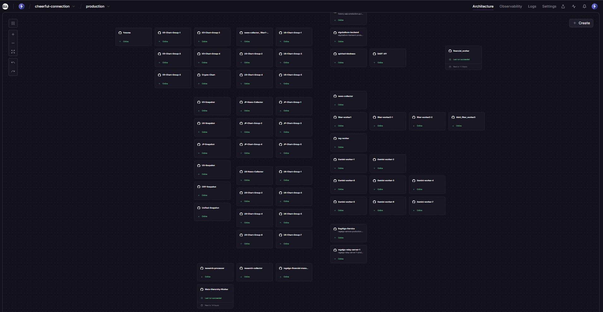

# RagAlgo: Dynamic RAG Engine for AI Reliability

[](https://www.npmjs.com/package/ragalgo-mcp-server)
[](https://www.npmjs.com/package/ragalgo-mcp-server)
[](https://github.com/kokogo100/ragalgo-mcp-server)
[](https://opensource.org/licenses/MIT)
[](https://modelcontextprotocol.io)

> **"Your AI is an Analyst, NOT a Day Trader."**


RagAlgo is an **MCP Server** that provides **mathematically scored financial context** (Korean Stocks/Crypto) to AI agents.
We focus on **"State-of-Truth"** (Daily Closed Data) to prevent AI hallucinations caused by real-time market noise.

- **Analyst, Not Broker:** We provide "Daily Analysis Reports" (Post-Market), not real-time tick data.
- **Scored Context:** Instead of raw prices, we give you "Scores" (0~100) and "Zones" (Forest vs Tree).
- **Global Market Specialist:** Optimized for US, UK, JP, KR, and Crypto.

👉 **[Official Website (ragalgo.com)](https://www.ragalgo.com)**

---

## 📖 Architecture & Whitepaper

Discover why RagAlgo is the **"Hippocampus"** for Agentic AI, not just another RAG.

### 🏗️ Data Pipeline Architecture

Our production system on Railway processes global financial data 24/7:

```
┌─────────────────────────────────────────────────────────────────────────────┐
│                        RagAlgo Data Pipeline (Railway)                      │
├─────────────────────────────────────────────────────────────────────────────┤
│                                                                             │
│  📥 COLLECT              🔍 FILTER              🏷️ TAG           📊 SCORE  │
│  ─────────────          ──────────────         ─────────        ──────────  │
│  • KR-News-Collector    • filter-worker-1      • tag-worker     • Gemini-1  │
│  • US-News-Collector    • filter-worker-2      • Meta-Hierarchy • Gemini-2  │
│  • UK-News-Collector    • filter-worker-3      •   Worker       • ...       │
│  • JP-News-Collector    • ibkr_filter_worker3  │                • Gemini-7  │
│  • research-collector   │                      │                │           │
│                         │                      │                │           │
│  ════════════════════════════════════════════════════════════════════════  │
│                                    ↓                                        │
│                      📦 SNAPSHOT (Daily 18:00 KST)                          │
│                      ──────────────────────────────                         │
│                      • KR-Snapshot  • US-Snapshot                           │
│                      • UK-Snapshot  • JP-Snapshot                           │
│                      • CRY-Snapshot • Unified-Snapshot                      │
│                                    ↓                                        │
│                          🚀 SERVE (MCP Server)                              │
│                          ─────────────────────                              │
│                          • RagAlgo-Service (SSE/stdio)                      │
│                          • ragalgo-relay-server (WebSocket)                 │
│                                                                             │
└─────────────────────────────────────────────────────────────────────────────┘
```



*   **[Vision Whitepaper (The Hook)](./docs/RagAlgo_Report_EN.md)**
    *   **Concept**: Why RagAlgo is a "Semantic Digital Twin" (SDT) using the Hippocampus analogy.
    *   **Value**: Explains the "Self-Growing Taxonomy" and "Data Flywheel" effect.
*   **[Technical Report (The Proof)](./docs/CKN_Architecture_EN.md)**
    *   **Deep Dive**: Detailed anatomy of the Contextual Knowledge Network (CKN).
    *   **2025 Trend**: How RagAlgo serves as the memory layer for **Agentic AI** (e.g., PepsiCo/Salesforce Agentforce).

---

## 💡 Why "Daily Close"?

Users often ask: *"Why isn't the chart data real-time?"*

**Because AI performs better with clarity.**
Real-time tick data is full of noise and volatility. If you feed an LLM raw live prices, it often hallucinates patterns that don't exist.

RagAlgo acts like a **Professional Technical Analyst** who works after the market closes:
1.  **Wait for the dust to settle** (Market Close).
2.  **Analyze the day's battle** (Daily Candle & Aux Indicators).
3.  **Deliver a "Confirmed Strategy"** to your AI.

Use RagAlgo to build **"Investment Advisors"**, not "High-Frequency Trading Bots".

---

## 🚀 Quick Start

### Claude Desktop Configuration

Add this to your config file:
- **Windows:** `%APPDATA%\Claude\claude_desktop_config.json`
- **Mac:** `~/Library/Application Support/Claude/claude_desktop_config.json`

#### ☁️ Cloud Mode (Recommended - No installation required)
```json
{
  "mcpServers": {
    "ragalgo": {
      "url": "https://ragalgo-service-production.up.railway.app/sse",
      "env": {
        "RAGALGO_API_KEY": "YOUR_API_KEY_HERE"
      }
    }
  }
}
```

#### 📦 Local Mode (Requires Node.js)
```json
{
  "mcpServers": {
    "ragalgo": {
      "command": "npx",
      "args": ["-y", "ragalgo-mcp-server", "--stdio"],
      "env": {
        "RAGALGO_API_KEY": "YOUR_API_KEY_HERE"
      }
    }
  }
}
```

> **Tip:** You can get a **Free 1,000 Call Key** instantly at [RagAlgo Dashboard](https://www.ragalgo.com/dashboard).

---

## 📚 Usage Examples (Cookbook)

We have a **dedicated repository** for practical examples to help you get started quickly.
Please visit the **[RagAlgo Examples Repository](https://github.com/kokogo100/ragalgo-examples)**.

### What's Inside?
- **8 Step-by-Step Recipes:** From basic data fetching to advanced AI agents.
- **Skeleton Code + Prompts:** Copy-paste ready resources.
- **Scenarios:**
  - 🐣 **Basic:** Get stock scores in 5 minutes.
  - 🧪 **Intermediate:** Verify technical signals with AI.
  - 🚀 **Advanced:** Build an autonomous reasoning agent (Mock Trading Audit).
  - ☕ **Morning Briefing:** Create a bot that emails you a daily market summary.

> **"Skeleton + Prompt" Approach:** We provide the ingredients. You ask ChatGPT/Claude to cook!

---

## 🌍 Supported Markets & Roadmap

RagAlgo is expanding its CKN coverage globally. Currently, **US, UK, Japan, Korea, and Crypto** markets are fully supported.

| Market | Asset Class | Status |
| :--- | :--- | :--- |
| **🇰🇷 Korea** | KOSPI / KOSDAQ | **🟢 Live** (Real-time Sentiment & Charts) |
| **🇺🇸 USA** | NYSE / NASDAQ | **🟢 Live** (Daily Scored Context) |
| **🇯🇵 Japan** | Nikkei 225 | **🟢 Live** (Daily Scored Context) |
| **🇬🇧 UK** | LSE | **🟢 Live** (Daily Scored Context) |
| **🪙 Crypto** | Global (Upbit/Binance) | **🟢 Live** (Real-time Sentiment & Charts) |

---

## 🛠 Tools

> **⚠️ CORE CONCEPT: Scored vs Raw**
> - **`get_news_scored` (Default):** Returns only significant news (Scores ≠ 0). Best for AI decision making.
> - **`get_news` (Raw):** Returns ALL news including noise. Use this ONLY if you need raw data feed.

| Tool | Description |
|------|-------------|
| `get_news_scored` | **[RECOMMENDED]** News **WITH** AI Sentiment Scores (-10 ~ +10). Filters out noise. |
| `get_news` | **[Advanced]** Raw News **WITHOUT** scores. Includes 0-score noise. Use only if you build your own scorer. |
| `get_chart_stock` | **[Core]** Global Stock (US/UK/JP/KR) Technical Analysis (Daily Close). |
| `get_chart_coin` | **[Core]** Global Crypto Technical Analysis (Daily Close). |
| `get_snapshots` | **[Best]** Market Overview (News + Chart + Trend) in one call. |
| `get_financials` | Corporate Financials (Quarterly/Yearly). |
| `search_tags` | Convert names (e.g., "Samsung") to RagAlgo Tags. |

---

## 📡 Real-time WebSocket (Business Tier)

For users who *really* need live data (e.g., for monitoring dashboards), we offer a WebSocket stream.
*Note: This is strictly for monitoring, not for LLM inference context.*

- **Access:** Business Plan subscribers (Includes 30 connections).
- **Address:** `wss://ragalgo-relay-server-1-production.up.railway.app`
- **Guide:** See [Developer Docs](https://www.ragalgo.com/docs) for implementation details.

---

## 💬 Support

- **Website:** [ragalgo.com](https://www.ragalgo.com)
- **Email:** support@ragalgo.com
