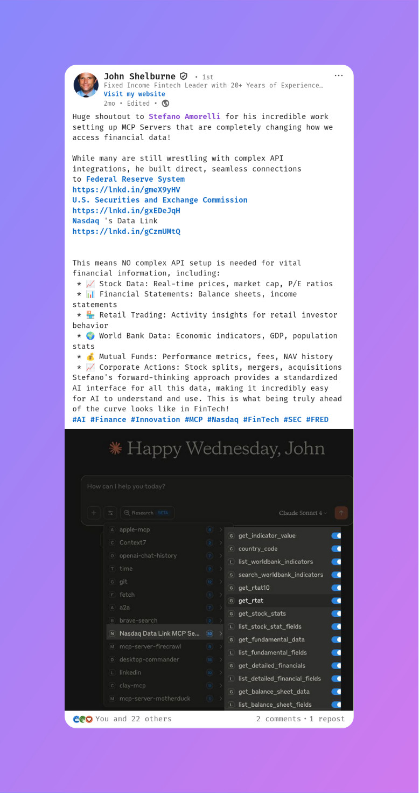

# Federal Reserve Economic Data MCP Server

[](https://smithery.ai/server/@stefanoamorelli/fred-mcp-server)
[](https://www.npmjs.com/package/fred-mcp-server)
[](https://doi.org/10.5281/zenodo.14536707)
[](https://www.gnu.org/licenses/agpl-3.0)
[](https://github.com/stefanoamorelli/fred-mcp-server/actions/workflows/test.yml)

> [!IMPORTANT]
> *Disclaimer*: This open-source project is not affiliated with, sponsored by, or endorsed by the *Federal Reserve* or the *Federal Reserve Bank of St. Louis*. "FRED" is a registered trademark of the *Federal Reserve Bank of St. Louis*, used here for descriptive purposes only.

A Model Context Protocol (`MCP`) server providing universal access to all 800,000+ Federal Reserve Economic Data ([FRED®](https://fred.stlouisfed.org/)) time series through three powerful tools.

https://github.com/user-attachments/assets/66c7f3ad-7b0e-4930-b1c5-a675a7eb1e09

> [!TIP]
> If you use this project in your research or work, please cite it using the [CITATION.cff](CITATION.cff) file, or use the following citation:

**APA Format:**
```
Amorelli, S. (2025). Federal Reserve Economic Data MCP (Model Context Protocol) Server (Version 1.0.2) [Computer software]. Zenodo. https://doi.org/10.5281/zenodo.14536707
```

**BibTeX:**
```bibtex
@software{amorelli_2025_14536707,
  author       = {Amorelli, Stefano},
  title        = {{Federal Reserve Economic Data MCP (Model Context
                   Protocol) Server}},
  month        = jan,
  year         = 2025,
  publisher    = {Zenodo},
  version      = {1.0.2},
  doi          = {10.5281/zenodo.14536707},
  url          = {https://doi.org/10.5281/zenodo.14536707}
}
```


## Installation

### Installing via Smithery

To install Federal Reserve Economic Data Server for Claude Desktop automatically via [Smithery](https://smithery.ai/server/@stefanoamorelli/fred-mcp-server):

```bash
npx -y @smithery/cli install @stefanoamorelli/fred-mcp-server --client claude
```

### Manual Installation

1.  Clone the repository:
    ```bash
    git clone https://github.com/stefanoamorelli/fred-mcp-server.git
    cd fred-mcp-server
    ```
2.  Install dependencies:
    ```bash
    pnpm install
    ```
3.  Build the project:
    ```bash
    pnpm build
    ```

## Configuration

This server requires a FRED® API key. You can obtain one from the [FRED® website](https://fred.stlouisfed.org/docs/api/api_key.html).

Install the server, for example, on [Claude Desktop](https://claude.ai/download), modify the `claude_desktop_config.json` file and add the following configuration:

```json
{
  "mcpServers": {
    "FRED MCP Server": {
      "command": "/usr/bin/node",
      "args": [
        "<PATH_TO_YOUR_CLONED_REPO>/fred-mcp-server/build/index.js"
      ],
      "env": {
        "FRED_API_KEY": "<YOUR_API_KEY>"
      }
    }
  }
}
```

### Using Docker

You can also run the FRED MCP Server using Docker. Add this configuration to your `claude_desktop_config.json`:

```json
{
  "mcpServers": {
    "fred-mcp": {
      "command": "docker",
      "args": [
        "run",
        "-i",
        "--rm",
        "-e",
        "FRED_API_KEY=<your-key-here>",
        "stefanoamorelli/fred-mcp-server:latest"
      ],
      "env": {}
    }
  }
}
```

Replace `<your-key-here>` with your actual FRED API key.

### Using Streamable HTTP Transport

For network deployments, you can run the server with Streamable HTTP transport instead of stdio:

```bash
# Using CLI flag
node build/index.js --http

# Or using environment variable
TRANSPORT=http node build/index.js

# Custom port (default is 3000)
PORT=8080 node build/index.js --http
```

The server will be available at `http://localhost:3000/mcp` (or your custom port).

**Example client request:**
```bash
# Initialize session
curl -X POST http://localhost:3000/mcp \
  -H "Content-Type: application/json" \
  -H "Accept: application/json, text/event-stream" \
  -d '{"jsonrpc":"2.0","id":1,"method":"initialize","params":{"protocolVersion":"2024-11-05","capabilities":{},"clientInfo":{"name":"my-client","version":"1.0.0"}}}'

# Use the mcp-session-id from the response header for subsequent requests
curl -X POST http://localhost:3000/mcp \
  -H "Content-Type: application/json" \
  -H "Accept: application/json, text/event-stream" \
  -H "mcp-session-id: <session-id-from-init>" \
  -d '{"jsonrpc":"2.0","id":2,"method":"tools/list"}'
```

## Available Tools

This MCP server provides three comprehensive tools to access all 800,000+ FRED® economic data series:

### `fred_browse`

**Description**: Browse FRED's complete catalog through categories, releases, or sources.

**Parameters**:
* `browse_type` (required): Type of browsing - "categories", "releases", "sources", "category_series", "release_series"
* `category_id` (optional): Category ID for browsing subcategories or series within a category
* `release_id` (optional): Release ID for browsing series within a release
* `limit` (optional): Maximum number of results (default: 50)
* `offset` (optional): Number of results to skip for pagination
* `order_by` (optional): Field to order results by
* `sort_order` (optional): "asc" or "desc"

### `fred_search`

**Description**: Search for FRED economic data series by keywords, tags, or filters.

**Parameters**:
* `search_text` (optional): Text to search for in series titles and descriptions
* `search_type` (optional): "full_text" or "series_id"
* `tag_names` (optional): Comma-separated list of tag names to filter by
* `exclude_tag_names` (optional): Comma-separated list of tag names to exclude
* `limit` (optional): Maximum number of results (default: 25)
* `offset` (optional): Number of results to skip for pagination
* `order_by` (optional): Field to order by (e.g., "popularity", "last_updated")
* `sort_order` (optional): "asc" or "desc"
* `filter_variable` (optional): Filter by "frequency", "units", or "seasonal_adjustment"
* `filter_value` (optional): Value to filter the variable by

### `fred_get_series`

**Description**: Retrieve data for any FRED series by its ID with support for transformations and date ranges.

**Parameters**:
* `series_id` (required): The FRED series ID (e.g., "GDP", "UNRATE", "CPIAUCSL")
* `observation_start` (optional): Start date in YYYY-MM-DD format
* `observation_end` (optional): End date in YYYY-MM-DD format
* `limit` (optional): Maximum number of observations
* `offset` (optional): Number of observations to skip
* `sort_order` (optional): "asc" or "desc"
* `units` (optional): Data transformation:
  - "lin" (levels/no transformation)
  - "chg" (change from previous period)
  - "ch1" (change from year ago)
  - "pch" (percent change)
  - "pc1" (percent change from year ago)
  - "pca" (compounded annual rate of change)
  - "cch" (continuously compounded rate of change)
  - "log" (natural log)
* `frequency` (optional): Frequency aggregation ("d", "w", "m", "q", "a")
* `aggregation_method` (optional): "avg" (average), "sum", or "eop" (end of period)

## Example Usage

With these three tools, you can:
- Browse all economic categories and discover available data
- Search for specific indicators by keywords or tags
- Retrieve any of the 800,000+ series with custom transformations
- Access real-time economic data including GDP, unemployment, inflation, interest rates, and more

## Social Media Shoutouts 📣

> [!NOTE]
> Want to be featured? Tag [Stefano Amorelli](https://www.linkedin.com/in/stefanoamorelli/) on LinkedIn or [@stefanoamorelli](https://x.com/stefanoamorelli) on X in your post about using FRED MCP Server, or [submit a PR](https://github.com/stefanoamorelli/fred-mcp-server/pulls) to add your shoutout!

We're grateful for the community support! Here are some mentions from amazing people:

<details open>
<summary><b>Scott G</b> - "One of my breakthrough moments for 'getting' what is possible with Claude was this fred-mcp-server project..."</summary>
<br>
<a href="https://www.linkedin.com/posts/sgoley_as-many-of-us-continue-to-use-llms-more-and-activity-7372401049669885952-ha6M">
  
</a>
<br>
<i>Scott G - Fintech & Data Analytics Professional</i> | <a href="https://www.linkedin.com/in/sgoley/">LinkedIn Profile</a>
</details>

<details open>
<summary><b>John Shelburne</b> - "The FRED MCP Server is a game-changer for financial analysis..."</summary>
<br>
<a href="https://www.linkedin.com/posts/shelburne_ai-finance-innovation-activity-7341141860880478210-JQe4">
  
</a>
<br>
<i>John Shelburne - Fixed Income Fintech Leader with 20+ Years of Experience | Machine Learning & Cloud Computing Specialist</i> | <a href="https://www.linkedin.com/in/shelburne/">LinkedIn Profile</a>
</details>

<!-- Add more social media posts here using the format above -->

## Testing

See [TESTING.md](./TESTING.md) for more details.

```bash
# Run all tests
pnpm test

# Run specific tests
pnpm test:registry
```

## License ⚖️

This open-source project is licensed under the GNU Affero General Public License v3.0 (AGPL-3.0). This means:

- You can use, modify, and distribute this software
- If you modify and distribute it, you must release your changes under AGPL-3.0
- If you run a modified version on a server, you must provide the source code to users
- See the [LICENSE](LICENSE) file for full details

For commercial licensing options or other licensing inquiries, please contact [stefano@amorelli.tech](mailto:stefano@amorelli.tech).

© 2025 [Stefano Amorelli](https://amorelli.tech)
