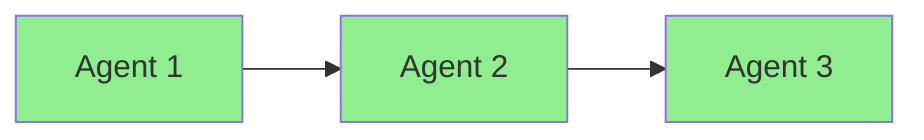
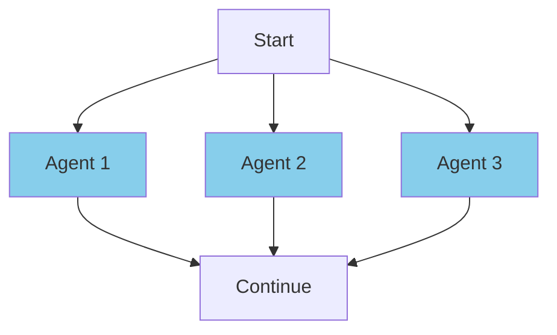
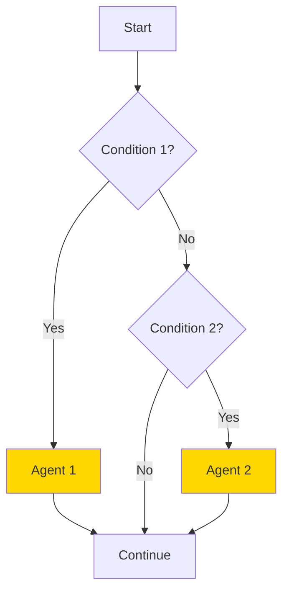
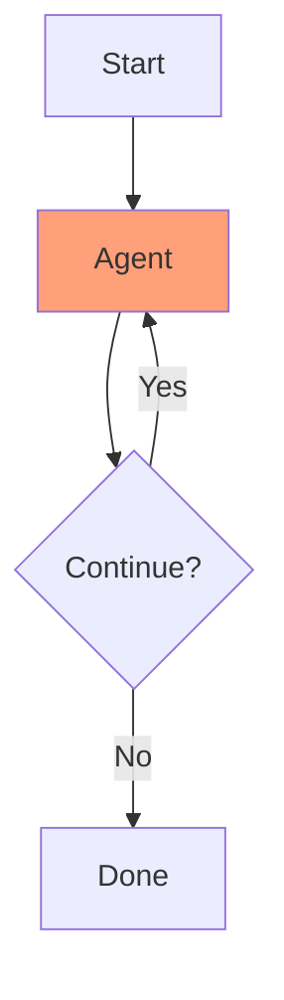
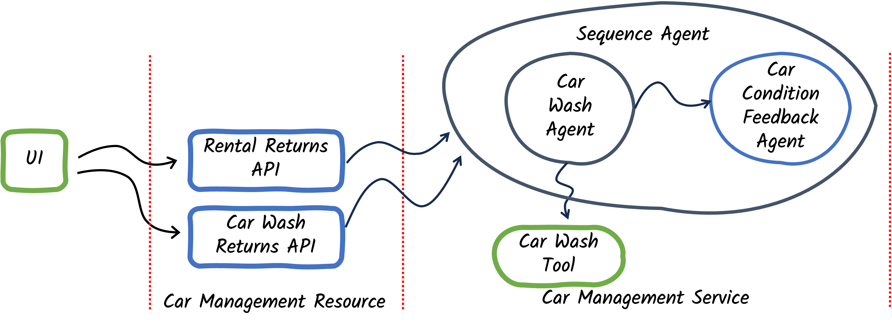
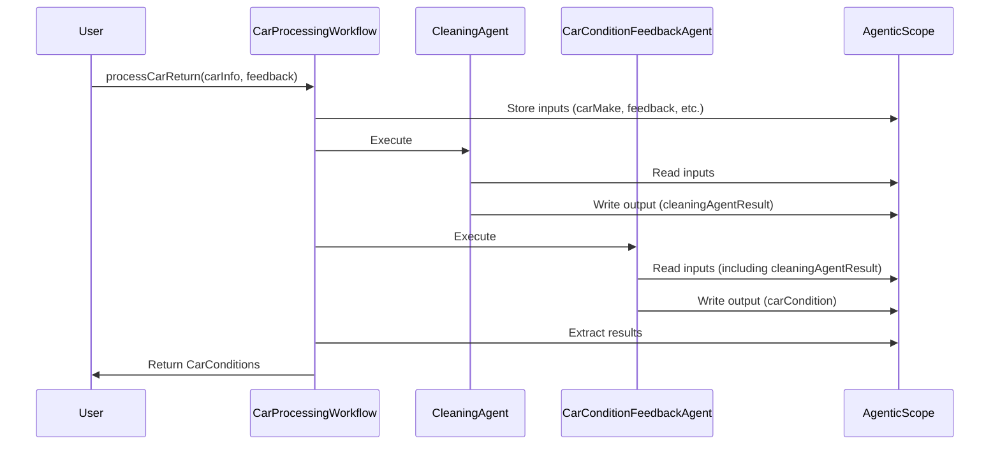
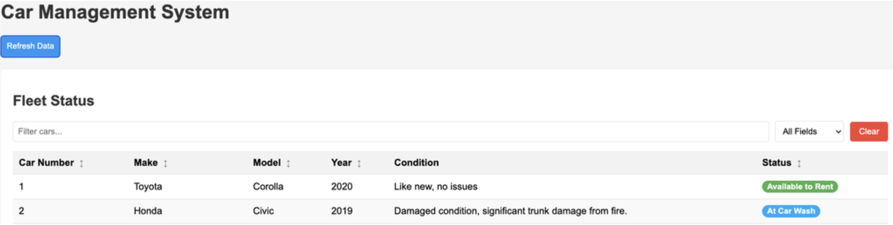
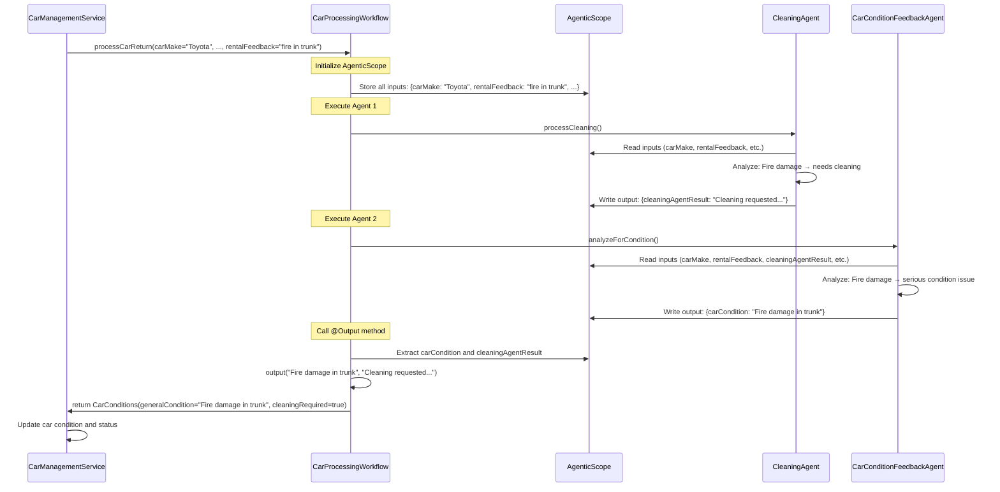

# Step 02 - Composing Simple Agentic Workflows

## Agentic Workflows

In the previous step, you created an agent that could autonomously determine whether a returned car needed a cleaning or not.
In the end, implementing this agent was not much different from creating a single AI service like we did in the [previous section](../section-1/step-01.md){target="_blank"}.
It did, however, set us up for building a more advanced agentic system, which is what we're going to start building now.
In this step, we're going to take a look at how we can orchestrate multiple agents using an **Agentic Workflow**.

## New Requirement: Track Car Conditions

The Miles of Smiles management team now wants to keep track of the condition of each car in their fleet.

Currently, when cars are returned (either from rentals or from the cleaning), feedback is provided but not systematically recorded.
This leads to inconsistent records and makes it difficult to track the overall condition of the fleet.
Management wants the system to:

1. **Automatically analyze feedback** from **both** rental and cleaning returns
2. **Update the car's condition** based on this feedback
3. **Display the current condition** in the fleet management UI

In this step, you'll learn how to compose **multiple agents into workflows** that work together to solve more complex problems.

!!!note
    "Workflow" is a pattern to compose agents with limited autonomy as you defined the control flow (when each agent is called).
    This is different from the supervisor pattern where a special agent determines when to call _sub-agents_.

---

## What You'll Learn

In this step, you will:

- Understand the different types of **agentic workflows** ([sequential](https://docs.langchain4j.dev/tutorials/agents#sequential-workflow){target="_blank"}, [parallel](https://docs.langchain4j.dev/tutorials/agents#parallel-workflow){target="_blank"}, [loop](https://docs.langchain4j.dev/tutorials/agents#loop-workflow){target="_blank"}, and [conditional](https://docs.langchain4j.dev/tutorials/agents#conditional-workflow){target="_blank"})
- Build a **sequential workflow** that runs agents one after another
- Learn about [**AgenticScope**](https://docs.langchain4j.dev/tutorials/agents#introducing-the-agenticscope){target="_blank"}, the shared context that enables agents to pass data between each other
- Use the [**declarative workflow API**](https://docs.langchain4j.dev/tutorials/agents#declarative-api){target="_blank"} to build workflows
- See how to extract and use results from multi-agent workflows

---

## Understanding Workflows

With Quarkus LangChain4j, you can compose multiple agents to work together as a _team_.
Much like the building blocks of a programming language, `quarkus-langchain4j-agentic` provides a few basic patterns to build different types of workflows.

LangChain4j provides 4 fundamental workflow patterns that can be combined to create sophisticated agentic systems:

### Sequential Workflows (`@SequenceAgent`)

With sequential workflows, agents execute **one after another** in a defined order.
(This is why it's also called "Prompt Chaining")



**When to use:** Each agent needs the output from the previous agent.

**Example:** Process feedback → Update condition → Send notification

---

### Parallel Workflows (`@ParallelAgent`)

Parallel workflows allow agents to be executed **simultaneously** on separate threads.



**When to use:** When agents can work independently and you want faster execution, and/or you want to aggregate the results of both.

**Example:** Analyze for cleaning needs AND maintenance needs at the same time

**Performance benefit:** If each agent takes 2 seconds, sequential = 4 seconds total, parallel = ~2 seconds total!

---

### Conditional Workflows (`@ConditionalAgent`)

Conditional Workflows will execute agents **only if their activation condition is met**.



**When to use:** When different execution paths are needed based on runtime data (e.g. the output of a previous agent execution).

**Example:** If maintenance needed → send to maintenance, else if cleaning needed → send to cleaning

---

### Loop Workflows (`@LoopAgent`)

With Loop workflows, agents run **repeatedly until a condition is met**.



**When to use:** When iterative refinement or retries are needed.

**Example:** Keep refining a report until quality threshold is met (with e.g. a max of 5 attempts)

---

### Composing Workflows

These basic workflows can be **nested within workflows** to create more advanced logic.
You can use probabilistic AI when it makes sense, and create deterministic workflows to control the flow.

!!!note "Autonomous and Goal Oriented Agentic AI Patterns"
    LangChain4j also provides additional building blocks to create more advanced and custom goal-oriented agentic AI patterns, such as the [supervisor pattern](https://docs.langchain4j.dev/tutorials/agents#supervisor-design-and-customization){target="_blank"}, [goal-oriented pattern](https://docs.langchain4j.dev/tutorials/agents#goal-oriented-agentic-pattern){target="_blank"}, [peer-to-peer](https://docs.langchain4j.dev/tutorials/agents#peer-to-peer-agentic-pattern){target="_blank"}, [human in the loop](https://docs.langchain4j.dev/tutorials/agents#human-in-the-loop){target="_blank"}, etc.
    
    We will visit these further along in this workshop. For now, let's focus on the basics.

In this step, we'll use a **sequential workflow** to:

1. First, run the `CleaningAgent` to determine if cleaning is needed
2. Then, run the `CarConditionFeedbackAgent` to update the car's condition

---

## What Are We Going to Build?

{: .center}

We'll enhance the car management system with:

1. **CarConditionFeedbackAgent**: Analyzes feedback to determine the current condition of a car
2. **CarProcessingWorkflow**: A sequential workflow that orchestrates the cleaning agent and condition feedback agent
3. **Updated UI**: Displays the current condition of each car

**The Flow:**



---

## Prerequisites

Before starting:

- Completed [Step 01](step-01.md){target="_blank"} (or have the `section-2/step-01` code available)
- Application from Step 01 is stopped (Ctrl+C)

=== "Option 1: Continue from Step 01"

    If you want to continue building on your Step 01 code, you'll need to copy some updated UI files and the updated `CarInfo.java` from `step-02`:

    === "Linux / macOS"
        ```bash
        cd section-2/step-01
        cp ../step-02/src/main/resources/META-INF/resources/css/styles.css ./src/main/resources/META-INF/resources/css/styles.css
        cp ../step-02/src/main/resources/META-INF/resources/js/app.js ./src/main/resources/META-INF/resources/js/app.js
        cp ../step-02/src/main/resources/META-INF/resources/index.html ./src/main/resources/META-INF/resources/index.html
        cp ../step-02/src/main/resources/import.sql ./src/main/resources/import.sql
        cp ../step-02/src/main/java/com/carmanagement/model/CarInfo.java ./src/main/java/com/carmanagement/model/CarInfo.java
        ```

    === "Windows"
        ```cmd
        cd section-2\step-01
        copy ..\step-02\src\main\resources\META-INF\resources\css\styles.css .\src\main\resources\META-INF\resources\css\styles.css
        copy ..\step-02\src\main\resources\META-INF\resources\js\app.js .\src\main\resources\META-INF\resources\js\app.js
        copy ..\step-02\src\main\resources\META-INF\resources\index.html .\src\main\resources\META-INF\resources\index.html
        copy ..\step-02\src\main\resources\import.sql .\src\main\resources\import.sql
        copy ..\step-02\src\main\java\com\carmanagement\model\CarInfo.java .\src\main\java\com\carmanagement\model\CarInfo.java
        ```

    These files add the "Condition" column to the UI and update the data model to track car conditions.

=== "Option 2: Start Fresh from Step 02"

    Alternatively, navigate to the complete `section-2/step-02` directory:

    ```bash
    cd section-2/step-02
    ```

---

## Create the CarConditionFeedbackAgent

Create a new agent that analyzes feedback to determine a car's current condition.

In `src/main/java/com/carmanagement/agentic/agents`, create `CarConditionFeedbackAgent.java`:

```java title="CarConditionFeedbackAgent.java"
--8<-- "../../section-2/step-02/src/main/java/com/carmanagement/agentic/agents/CarConditionFeedbackAgent.java"
```

**Let's break it down:**

### `@SystemMessage`

Defines the agent's role as a **car condition analyzer**:

- Analyzes feedback to determine current condition
- Considers the previous condition when making assessments
- Provides concise condition descriptions
- Does not add headers or prefixes (for clean output)

### `@UserMessage`

Provides all the context needed:

- Car details: `{carMake}`, `{carModel}`, `{carYear}`
- **Previous condition**: `{carCondition}` — allows the agent to understand changes
- Feedback from multiple sources: `{rentalFeedback}`, `{cleaningFeedback}`

### `@Agent` with `outputKey`

Notice the new **`outputKey` parameter**:

```java
@Agent(outputKey = "carCondition", ...)
```

This tells the framework to store the agent's result in the `AgenticScope`'s state under the key `"carCondition"`.
Other agents or the workflow can then access this value.

!!!note "**Understanding AgenticScope**"
    To enable agents to work together, they need a way to **share data**.
    This is where `AgenticScope` comes in.

    **What is AgenticScope?**
    
    - A **shared context** that keeps track throughout a workflow execution.
    - Contains a **map** of key-value pairs that agents can read from and write to: the _state_.
    - This state is automatically populated with **inputs** from the workflow method signature.
    - This state is automatically updated with **outputs** from each agent using their `outputKey`.
    
    **How It Works:**
    
    ```mermaid
    graph LR
        A[Workflow Inputs] -->|Populate| B[AgenticScope]
        B -->|Read state| C[Agent 1]
        C -->|Write state| B
        B -->|Read state| D[Agent 2]
        D -->|Write state| B
        B -->|Extract| E[Workflow Result]
    ```
    
    When an agent completes, its result is stored in the `AgenticScope`'s state using the `outputKey` specified in the `@Agent` annotation.
    The next agent in the workflow can access this value as an input parameter using the name specified in the `outputKey` annotation.

---

## Create the CarConditions Model

Before creating the workflow, we need a data model to return both the car condition and whether a cleaning is required.

In `src/main/java/com/carmanagement/model`, create `CarConditions.java`:

```java title="CarConditions.java"
--8<-- "../../section-2/step-02/src/main/java/com/carmanagement/model/CarConditions.java"
```

This simple record combines the results from both agents in our workflow.

---

## Update the CleaningAgent

The `CleaningAgent` needs to specify an `outputKey` so its result can be accessed by the workflow.

Update `src/main/java/com/carmanagement/agentic/agents/CleaningAgent.java`:

```java hl_lines="35" title="CleaningAgent.java"
--8<-- "../../section-2/step-02/src/main/java/com/carmanagement/agentic/agents/CleaningAgent.java"
```

**Key change:**

The `@Agent` annotation adds `outputKey = "cleaningAgentResult"`. This stores the agent's response in the `AgenticScope`'s state, making it available to subsequent agents and the workflow output method.

---

## Create the Workflow Directory

If continuing from Step 01, create the workflow directory:

=== "Linux / macOS"
    ```bash
    mkdir -p ./src/main/java/com/carmanagement/agentic/workflow
    ```

=== "Windows"
    ```cmd
    mkdir .\src\main\java\com\carmanagement\agentic\workflow
    ```

---

## Define the CarProcessingWorkflow

Now, create the workflow that orchestrates both agents.

In `src/main/java/com/carmanagement/agentic/workflow`, create `CarProcessingWorkflow.java`:

```java hl_lines="17-19" title="CarProcessingWorkflow.java"
--8<-- "../../section-2/step-02/src/main/java/com/carmanagement/agentic/workflow/CarProcessingWorkflow.java"
```

**Let's break it down:**

### `@SequenceAgent` Annotation

This annotation defines a **sequential workflow**:

```java
    @SequenceAgent(
            outputKey = "carConditions",
            subAgents = { CleaningAgent.class, CarConditionFeedbackAgent.class })
```

- **`outputKey`**: Where to store the final workflow result in `AgenticScope`'s state
- **`subAgents`**: The list of agents to execute in order
  - Agent 1: `CleaningAgent`: determines if cleaning is needed
  - Agent 2: `CarConditionFeedbackAgent`: updates the car condition

The agents execute sequentially: `CleaningAgent` → `CarConditionFeedbackAgent`

### Method Signature

The workflow method signature defines **all the inputs** needed by any agent in the workflow:

```java
CarConditions processCarReturn(
    String carMake,
    String carModel,
    Integer carYear,
    Integer carNumber,
    String carCondition,
    String rentalFeedback,
    String cleaningFeedback
)
```

These parameters are automatically populated into the `AgenticScope` when the workflow is invoked.

### `@Output`

The output method defines **how to extract the final result** from the `AgenticScope`'s state:

```java
@Output
static CarConditions output(String carCondition, String cleaningAgentResult) {
    boolean cleaningRequired = !cleaningAgentResult.toUpperCase().contains("NOT_REQUIRED");
    return new CarConditions(carCondition, cleaningRequired);
}
```

**How it works:**

1. The method parameters (`carCondition`, `cleaningAgentResult`) are automatically extracted from the `AgenticScope` by matching their names with the `outputKey` values from the agents
2. The method processes these values (in this case, checking if a cleaning is required)
3. Returns a `CarConditions` object combining both results

!!!success "Combining Outputs"
    This is more powerful than just returning the last agent's result: you can combine outputs from multiple agents into a single output!

---

## Update the CarManagementService

Now update the service to use the workflow instead of calling agents directly.

Update `src/main/java/com/carmanagement/service/CarManagementService.java`:

```java hl_lines="17-18 34-42 44-50" title="CarManagementService.java"
--8<-- "../../section-2/step-02/src/main/java/com/carmanagement/service/CarManagementService.java"
```

**What changed?**

### 1: Injection

```java
@Inject
CarProcessingWorkflow carProcessingWorkflow;
```

The workflow interface is injected just like any other CDI bean.
Quarkus LangChain4j generates the implementation automatically.

### 2: Workflow Invocation

```java
CarConditions carConditions = carProcessingWorkflow.processCarReturn(
                carInfo.make,
                carInfo.model,
                carInfo.year,
                carNumber,
                carInfo.condition,
                rentalFeedback != null ? rentalFeedback : "",
                cleaningFeedback != null ? cleaningFeedback : "");
```

Instead of calling agents individually, we call the workflow.
It returns a `CarConditions` object containing results from both agents.

### 3: Using the Results

```java
// Update the car's condition with the result from CarConditionFeedbackAgent
carInfo.condition = carConditions.generalCondition();

// If cleaning was not required, make the car available to rent
if (!carConditions.cleaningRequired()) {
  carInfo.status = CarStatus.AVAILABLE;            
}
```

We extract both the updated condition and whether a cleaning is required, then update the car accordingly.

---

## Try It Out

Start the application:

```bash
./mvnw quarkus:dev
```

Open your browser to [http://localhost:8080](http://localhost:8080){target="_blank"}.

### Notice the New UI

The **Fleet Status** section now has a **"Condition"** column showing each car's current state:

{: .center}

### Test the Workflow

In the `Returns > Rental Return` section, enter feedback that indicates a problem with a car:

```text
there has clearly been a fire in the trunk of this car
```

Click **Return**.

**What happens?**

1. The `CleaningAgent` analyzes the feedback and likely requests cleaning (interior/exterior)
2. The `CarConditionFeedbackAgent` analyzes the feedback and updates the condition to reflect fire damage
3. The car's status is updated to `AT_CLEANING`
4. The **Condition** column in the Fleet Status updates to show the new condition

### Check the Logs

You should see both agents executing in sequential:

```
🚗 CleaningTool result: Cleaning requested for Toyota Camry (2021), Car #4:
- Interior cleaning
- Exterior wash
Additional notes: Fire damage requires thorough cleaning

[CarConditionFeedbackAgent response]: Fire damage in trunk, requires inspection and repair
```

Notice how the workflow **coordinated both agents** automatically!

---

## How Data Flows Through the Workflow

Let's trace a complete example:

### Example: "Fire in the trunk"



**Key Points:**

1. All workflow inputs are stored in `AgenticScope`'s state
2. Each agent reads what it needs from the scope's state
3. Each agent writes its result back to the scope's state using its `outputKey`
4. The `@Output` method extracts specific values from the scope to build the final result

---

## Understanding the Declarative Workflow API

The declarative API uses annotations to define workflows, making them:

- **Type-safe**: Compile-time checking of agent interfaces
- **Readable**: Clear structure showing the flow
- **Composable**: Easily combine different agents even workflow-based agents
- **Maintainable**: Easy to add/remove/reorder agents
- **Automatic**: No manual `AgenticScope` management

---

## Key Takeaways

- **Workflows enable collaboration**: Multiple agents work together to solve complex problems
- **`AgenticScope` enables data sharing**: Agents pass data through a shared context without tight coupling
- **Sequential workflows run in order**: Perfect when Agent B needs Agent A's output
- **The declarative API is powerful**: Annotate interfaces, get automatic implementations
- **Type safety matters**: The compiler helps catch errors before runtime

---

## Experiment Further

### 1. Inspect the `AgenticScope`

Try adding different types of feedback and observe how both agents respond. Notice how they're working with the same context!

### 2. Add More Input to the Condition Agent

What if you wanted to pass the car's mileage to the condition agent? How would you:

1. Add it to the workflow method signature?
2. Add it to the agent's method signature?
3. Update the service to provide the mileage?

### 3. Try Different Feedback Combinations

Test these scenarios:

```text
Rental feedback: "Scratch on door"
Cleaning feedback: "Scratch remains after cleaning"
```

How does the condition agent synthesize feedback from multiple sources?

---

## Understanding Parallel vs. Sequential

!!! note "Why Sequential Instead of Parallel?"
    You might notice that `CarConditionFeedbackAgent` doesn't actually use the output from `CleaningAgent`, it only looks at the original feedback.
    This means these agents could run in **parallel** for better response time.

    We chose a **sequential** workflow in this step because:

    1. It's simpler to understand as your first workflow
    2. It sets us up for [Step 03](step-03.md){target="_blank"}, where we'll add more agents that DO depend on each other

    Feel free to try converting this to a parallel workflow as an experiment! Replace `@SequenceAgent` with `@ParallelAgent` and see what happens.

---

## Troubleshooting

??? warning "Error: Cannot find symbol 'CarConditions'"
    Make sure you created the `CarConditions.java` record in the `com.carmanagement.model` package.

??? warning "Workflow not updating car condition"
    Check that:

    - The `CleaningAgent` has `outputKey = "cleaningAgentResult"`
    - The `CarConditionFeedbackAgent` has `outputKey = "carCondition"`
    - The `@Output` method parameter names match these output names exactly

??? warning "UI not showing Condition column"
    Make sure you copied the updated UI files from `step-02` (see "Option 1: Continue from Step 01" section above)

---

## What's Next?

You've successfully built your first multi-agent workflow!
You learned how agents collaborate through `AgenticScope` and how sequential workflows coordinate their execution.

In **Step 03**, you'll learn about **composing Multiple Agentic Workflows**, combining sequential, parallel, and conditional workflows to build sophisticated agent systems!

[Continue to Step 03 - Composing Multiple Agentic Workflows](step-03.md)
