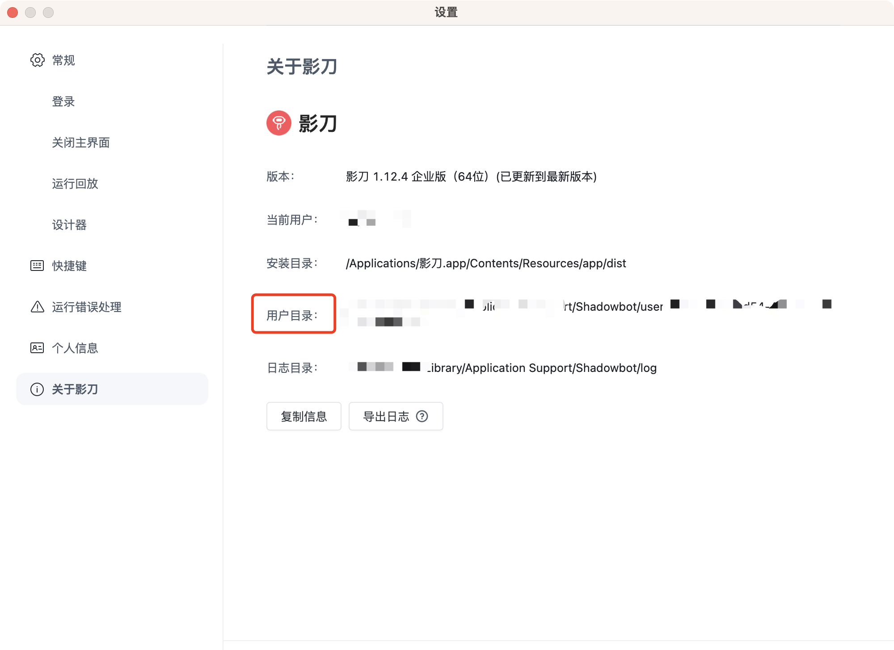

<p>

</p>
# YindDao AI Power - RPA MCP Server

<p>
  <a href="README.md">[English]</a> |
  <a href="README.zh.md">[Chinese]</a>
</p>

[YingDao AI Power](https://www.yingdao.com/ai-power): An AI low-code platform that quickly creates AI agents and AI workflows, helping users leverage AI effectively.
<br/>

[YingDao RPA](https://www.yingdao.com): An RPA low-code platform, a user-friendly RPA automation product that frees people from repetitive labor.

Yingdao RPA MCP Server is implemented based on the Model Context Protocol (MCP), providing a bridge for interaction between YindDao AI Power and other tools that can serve as MCP Hosts (such as Claude Desktop, Cursor, etc.). It enables AI to utilize RPA capabilities.

It supports both SSE Server and Stdio Server modes.

# Getting Started

There are two ways to run YindDao RPA:

## Local Mode

Set environment variables:

```bash
RPA_MODEL=local
SHADOWBOT_PATH={your_shadowbot_path} //Path to YindDao RPA executable
USER_FOLDER={your_user_folder}       //Path to YindDao RPA user folder
```

### Path to YindDao RPA executable

Windows

```bash
D:\Program Files\{installation directory}\ShadowBot.exe
```

Mac

```bash
/Applications/影刀.app
```

### Path to YindDao RPA user folder

Find the user folder option in YindDao RPA settings



## Open API Mode (Enterprise users only)

Set environment variables:

```bash
RPA_MODEL=openApi
ACCESS_KEY_ID={your_access_key_id}
ACCESS_KEY_SECRET={your_access_key_secret}
```

### How to obtain

Enterprise administrators can obtain this by logging into the YindDao RPA console. Please refer to [YindDao RPA Help Documentation - Authentication](https://www.yingdao.com/yddoc/rpa/710499792859115520)

# Stdio Server Startup

Configure in the client:

```json
{
  "mcpServers": {
    "YingDao RPA MCP Server": {
      "command": "npx",
      "args": ["-y", "@automa-ai-power/rpa-mcp-servers", "-stdio"],
      "env":{
        "RPA_MODEL":"openApi",
        "ACCESS_KEY_ID":"{your_access_key_id}",
        "ACCESS_KEY_SECRET":"{your_access_key_secret}"
      }
    }
  }
}
```

# SSE Server Configuration

## Build

Clone the repository and build:

```bash
git clone https://github.com/AutomaApp/aipower-rpa-mcp-server.git
cd aipower-rpa-mcp-servers
npm install
npm run build
```

## Configuration

Add a .env file with configuration items as described above

## Startup

```bash
npm run start:server
```

## Client Configuration

AI Power client configuration:

```json
{
  "mcpServers": {
    "YingDao RPA MCP Server": {
      "url": "http://localhost:3000/sse",
      "description": "Yingdao RPA MCP Server"
    }
  }
}
```

The default port is 3000

# Capabilities

## Local Mode

1. **queryRobotParam**: Query RPA application parameters
2. **queryApplist**: Query RPA application list
3. **runApp**: Run RPA application

## Open API Mode

1. **uploadFile**: Upload files to the RPA platform
2. **queryRobotParam**: Query RPA application parameters
3. **queryApplist**: Get paginated RPA application list
4. **startJob**: Start an RPA job
5. **queryJob**: Query RPA job status
6. **queryClientList**: Query the list of RPA robot clients

### License

MIT