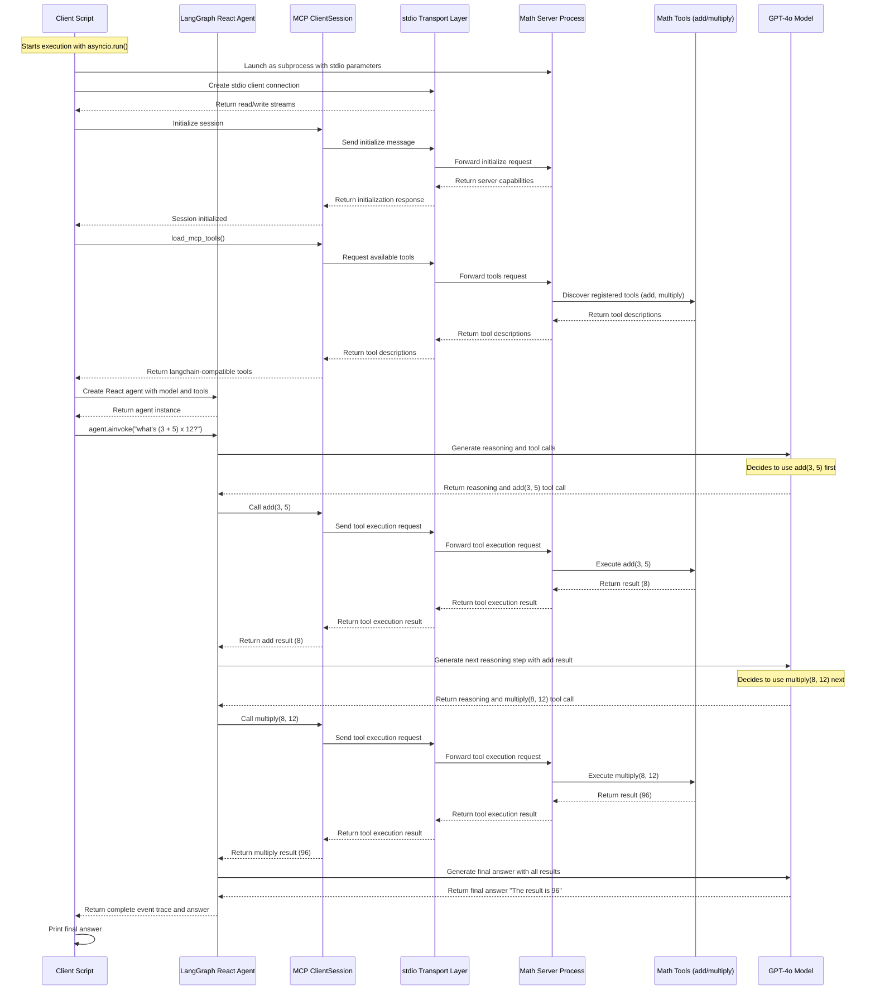

# Understanding MCP Architecture: Single-Server vs Multi-Server Clients

Modern AI-driven applications require efficient and scalable architectures to interact with multiple external services. The **Multi-Client Protocol (MCP)** provides a robust framework to communicate with various tool servers, enabling seamless interaction between AI models and external computations. In this blog, we'll explore the advantages of MCP architecture by comparing **single-server** and **multi-server** clients.

## Math Server (`math_server.py`)
The **Math Server** acts as an MCP tool server that provides basic mathematical operations like addition and multiplication. It listens for incoming requests, processes tool invocations, and responds with results.

### Code Breakdown
```python
from mcp.server.fastmcp import FastMCP

mcp = FastMCP("Math")

@mcp.tool()
def add(a: int, b: int) -> int:
    """Add two numbers"""
    return a + b

@mcp.tool()
def multiply(a: int, b: int) -> int:
    """Multiply two numbers"""
    return a * b

if __name__ == "__main__":
    mcp.run(transport="stdio")
```
- Defines an MCP server named **Math**.
- Registers `add(a, b)` and `multiply(a, b)` as available tools.
- Runs with **stdio** transport, allowing communication via standard input/output.

## Single-Server Client
A **single-server client** connects to one MCP server, which exposes a set of tools to be used in computations. Let's analyze the `single_server_client.py` script, which interacts with `math_server.py` to perform mathematical operations.

### How It Works
1. **Start the Math Server**: The `math_server.py` runs as an MCP server exposing two tools: `add(a, b)` and `multiply(a, b)`.
2. **Initialize a Stdio Connection**: The client creates a subprocess to communicate with the math server via **stdio transport**.
3. **Load Available Tools**: The client fetches the available tools (`add`, `multiply`) from the server.
4. **Invoke AI Model**: The AI model, `GPT-4o`, uses LangGraph’s **ReAct (Reasoning + Acting) agent** to decide how to solve the given mathematical expression.
5. **Perform Computation**: The model generates tool calls, invoking `add(3,5)` first, then `multiply(8,12)`, and finally returns the computed answer.

### Code Breakdown (single_server_client.py)
```python
server_params = StdioServerParameters(
    command="python",
    args=["server/math_server.py"],
)

async with stdio_client(server_params) as (read, write):
    async with ClientSession(read, write) as session:
        await session.initialize()
        tools = await load_mcp_tools(session)
        agent = create_react_agent(model, tools)
        events = await agent.ainvoke({"messages": "what's (3 + 5) x 12?"})
```
The output prints:
```
----------------------------------------------------------------------------
The result is 96
```

## MCP Communication Flow (Sequence Diagram)



## Weather Server (`weather_server.py`)
The **Weather Server** is another MCP tool server that provides real-time weather information. It listens for incoming weather queries and responds with the latest weather data.

**Command to start the server:**
```bash
python server/weather_server.py
```

### Code Breakdown
```python
from mcp.server.fastmcp import FastMCP

mcp = FastMCP("Weather")

@mcp.tool()
async def get_weather(location: str) -> str:
    """Get weather for location."""
    return "It's always sunny in New York"

if __name__ == "__main__":
    mcp.run(transport="sse")
```
- Defines an MCP server named **Weather**.
- Registers `get_weather(location)` as an available tool.
- Runs with **SSE (Server-Sent Events)** transport, allowing real-time event streaming.

## Multi-Server Client
A **multi-server client** can interact with multiple MCP servers simultaneously. The `multi_server_client.py` script demonstrates this by communicating with both `math_server.py` and `weather_server.py`.

### How It Works
1. **Initialize Multiple Servers**: The client connects to the **Math** server using `stdio` and the **Weather** server via **SSE (Server-Sent Events)**.
2. **Load Tools from Multiple Servers**: The AI model gains access to tools from both servers.
3. **Parallel Processing**: The client can now invoke tools from different servers within the same execution.
4. **AI-driven Responses**: The model processes both math expressions and weather queries using multiple MCP servers.

### Code Breakdown (multi_server_client.py)
```python
async with MultiServerMCPClient(
    {
        "math": {
            "command": "python",
            "args": ["server/math_server.py"],
            "transport": "stdio",
        },
        "weather": {
            "url": "http://localhost:8000/sse",
            "transport": "sse",
        },
    }
) as client:
    agent = create_react_agent(model, client.get_tools())
    math_response = await agent.ainvoke({"messages": "what's (3 + 5) x 12?"})
    weather_response = await agent.ainvoke({"messages": "what is the weather in nyc?"})
```

### Multi-Server Client Response
The output from the multi-server client looks like this:

```json
{
  "math_response": "The result of (3 + 5) x 12 is 96.",
  "weather_response": "The weather in NYC is currently sunny."
}
```

### Benefits of MCP Architecture
- **Scalability**: Easily extendable to multiple services.
- **Parallel Execution**: Allows concurrent queries to different servers.
- **Flexible Communication**: Supports multiple transport layers (`stdio`, `sse`, etc.).
- **AI Integration**: Seamlessly connects AI models with external computation services.

## Code Setup and Execution
To clone and execute the code, follow these steps:
```bash
git clone https://github.com/commitbyrajat/langgraph-mcp-integration.git
cd langgraph-mcp-integration
rye sync  # Sync dependencies
rye run python server/weather_server.py &
rye run python client/single_server_client.py
rye run python client/multi_server_client.py
```

MCP architecture enables developers to build powerful AI-driven applications that interact with multiple services efficiently. 🚀

---