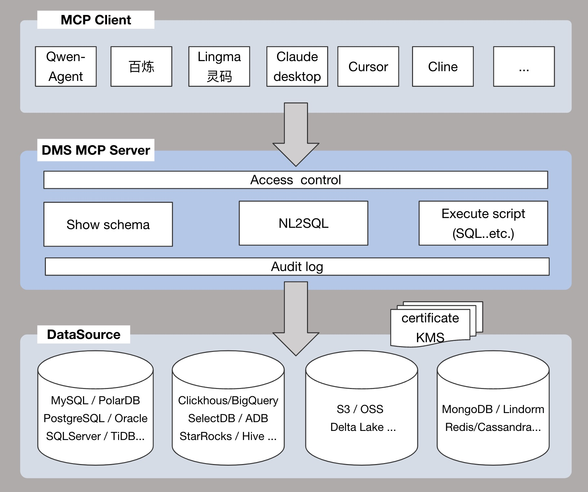

<!-- 顶部语言切换 -->

<p align="center">English | <a href="/doc/README-zh-cn.md">中文</a><br></p>


# AlibabaCloud DMS MCP Server

**AI-Era Data Security Access Gateway ｜Intelligent Data Query Engine｜Supports 40+ Data Sources**

---

## Core Features
**Secure Access**
- **Account and Password Security Management**：Safely manage database account passwords without manual maintenance, effectively preventing sensitive information leakage.
- **Intranet Access Support**：Enables database access through an internal network, keeping data within the premises and significantly enhancing data security and privacy protection.
- **Fine-grained Permission Control**：Supports instance, database, table, field, and row-level access control, precisely restricting caller permissions to prevent unauthorized operations and ensure data security.
- **High-risk SQL Identification and Blocking**: Built-in rich rule engine that identifies and blocks potential high-risk SQL in real time to mitigate security risks.
- **SQL Audit Trail**: Records all SQL operation logs, supporting full traceability and compliance audits to meet regulatory requirements.

**Intelligent Data Inquiry**
- **Built-in NL2SQL Algorithm**: Based on natural language input questions, it intelligently matches data tables, understands business semantics within tables, generates and executes SQL queries, and quickly obtains results.
- **Personalized Knowledge Base**: Built-in metadata and [knowledge base](https://help.aliyun.com/zh/dms/knowledge-base-management?) for data inquiry, supports custom business knowledge and query patterns to build tailored intelligent data inquiry capabilities aligned with business scenarios.

**Multi-data Source Support**
- **Wide Range of Data Source Support**: Supports over 40 mainstream databases/data warehouses, enabling unified access and integration from multiple sources.
- **Unified Management Across Environments**: Supports centralized management of database instances across development, testing, and production environments to improve operational efficiency.
- **Seamless Integration Across Platforms**: Covers major cloud platforms such as Alibaba Cloud and AWS, as well as self-built databases/data warehouses, effectively reducing maintenance costs.

---

## Supported Ecosystem
- Supports all Alibaba Cloud data sources: RDS, PolarDB, ADB series, Lindorm series, TableStore series, Maxcompute series.
- Supports mainstream databases/data warehouses: MySQL, MariaDB, PostgreSQL, Oracle, SQLServer, Redis, MongoDB, StarRocks, Clickhouse, SelectDB, DB2, OceanBase, Gauss, BigQuery, etc.
---

## Core Architecture


[//]: # ()


---

## Usage Methods  
DMS MCP Server currently supports two usage modes.

### Mode One: Multi-instance Mode  
- Supports adding instances to DMS, allowing access to multiple database instances.  
- Suitable for scenarios where managing and accessing multiple database instances is required.  
#### Scenario Example:  
You are a company DBA who needs to manage and access various types of database instances (e.g., MySQL, Oracle, PostgreSQL) in production, test, and development environments. With DMS MCP Server, you can achieve unified access and centralized management of these heterogeneous databases.  

**Typical Question Examples:**  
- Which of my instances are in the production environment?
- Get a list of all databases named `test`.  
- Retrieve details of the `test_db` database from the `myHost:myPort` instance.  
- What tables are in the `test_db` database?  
- Use a tool to query data from the `test_db` database and answer: "What is today's user traffic?"

### Mode Two: Single Database Mode  
- Directly specify the target database by configuring the `CONNECTION_STRING` parameter in the server (format: `dbName@host:port`).  
- Suitable for scenarios that focus on accessing a single database.  
#### Scenario Example 1:  
You are a developer who frequently accesses a fixed database (e.g., `mydb@192.168.1.100:3306`) for development and testing. Set the `CONNECTION_STRING` parameter in the DMS MCP Server configuration as follows:  
```ini
CONNECTION_STRING = mydb@192.168.1.100:3306
```
Afterward, every time the service starts, the DMS MCP Server will directly access this specified database without needing to switch instances.

**Typical Question Examples:**  
- What tables do I have?  
- Show the field structure of the `test_table` table.  
- Retrieve the first 20 rows from the `test_table` table.  
- Use a tool to answer: "What is today's user traffic?"

#### Scenario Example 2:
You are a data analyst at an e-commerce company, needing to frequently query and analyze business data such as orders, users, and products. The company's core business database is located at ecommerce@10.20.30.40:3306.

Configure the following parameters in DMS MCP Server:
```ini
CONNECTION_STRING = ecommerce@10.20.30.40:3306
```
Simply ask questions in natural language, and DMS MCP will parse the question into SQL and return the results.

**Typical Question Examples:**
- What is the total number of orders today?
- How are the order counts ranked by province?
- What is the number of new users each day over the past 7 days?
- Which product category has the highest sales revenue?

---
## Tool List  
| Tool Name          | Description                                                                                                               | Applicable Mode                |
|--------------------|---------------------------------------------------------------------------------------------------------------------------|-------------------------------|
| addInstance        | Adds an instance to DMS. Only Aliyun instances are supported. | Multi-instance Mode            |
| listInstances      | Search for instances from DMS.                                                                                            | Multi-instance Mode            |
| getInstance        | Retrieves detailed information about an instance based on host and port.                                                  | Multi-instance Mode            |
| searchDatabase     | Searches databases based on schemaName.                                                                                   | Multi-instance Mode            |
| getDatabase        | Retrieves detailed information about a specific database.                                                                 | Multi-instance Mode            |
| listTables          | Lists tables under a specified database.                                                                                  | Multi-instance Mode & Single Database Mode |
| getTableDetailInfo | Retrieves detailed information about a specific table.                                                                    | Multi-instance Mode & Single Database Mode |
| executeScript      | Executes an SQL script and returns the result.                                                                            | Multi-instance Mode & Single Database Mode |
| createDataChangeOrder | Creates a data change order in DMS.                                                                                    | Multi-instance Mode & Single Database Mode |
| getOrderInfo       | Retrieves order information from DMS.                                                                                     | Multi-instance Mode & Single Database Mode |
| submitOrderApproval | Submits the order for approval in DMS.                                                                                   | Multi-instance Mode & Single Database Mode |
| approveOrder       | Approves or rejects an order in DMS.                                                                                      | Multi-instance Mode & Single Database Mode |
| generateSql        | Converts natural language questions into SQL queries.                                                                     | Multi-instance Mode            |
| askDatabase        | Natural language querying of a database (NL2SQL + execute SQL).                                                           | Single Database Mode           |
| fixSql             | Analyzes and fixes SQL errors.                                                                                            | Multi-instance Mode & Single Database Mode |
| answerSqlSyntax    | Answers SQL syntax-related questions.                                                                                     | Multi-instance Mode & Single Database Mode |
| optimizeSql        | Analyzes and optimizes SQL performance.                                                                                   | Multi-instance Mode & Single Database Mode |

<p> For a full list of tools, please refer to: <a href="/doc/Tool-List-en.md">Tool List</a><br></p>


---

## Supported Data Sources
| DataSource/Tool       | **NL2SQL** *nlsql* | **Execute script** *executeScript* | **Show schema** *getTableDetailInfo* | **Access control** *default* | **Audit log** *default* |
|-----------------------|-----------------|---------------------------------|--------------------------------------|-----------------------------|------------------------|
| MySQL                 | ✅               | ✅                               | ✅                                    | ✅                           | ✅                      |
| MariaDB               | ✅               | ✅                               | ✅                                    | ✅                           | ✅                      |
| PostgreSQL            | ✅               | ✅                               | ✅                                    | ✅                           | ✅                      |
| Oracle                | ✅               | ✅                               | ✅                                    | ✅                           | ✅                      |
| SQLServer             | ✅               | ✅                               | ✅                                    | ✅                           | ✅                      |
| Redis                 | ❌               | ❌                                | ✅                                    | ✅                           | ✅                      |
| MongoDB               | ❌               | ❌                                | ✅                                    | ✅                           | ✅                      |
| StarRocks             | ✅               | ✅                               | ✅                                    | ✅                           | ✅                      |
| Clickhouse            | ✅               | ✅                               | ✅                                    | ✅                           | ✅                      |
| SelectDB              | ✅               | ✅                               | ✅                                    | ✅                           | ✅                      |
| DB2                   | ✅               | ✅                               | ✅                                    | ✅                           | ✅                      |
| OceanBase             | ✅               | ✅                               | ✅                                    | ✅                           | ✅                      |
| Gauss                 | ✅               | ✅                               | ✅                                    | ✅                           | ✅                      |
| BigQuery              | ✅               | ✅                               | ✅                                    | ✅                           | ✅                      |
| PolarDB               | ✅               | ✅                               | ✅                                    | ✅                           | ✅                      |
| PolarDB-X             | ✅               | ✅                               | ✅                                    | ✅                           | ✅                      |
| AnalyticDB            | ✅               | ✅                               | ✅                                    | ✅                           | ✅                      |
| Lindorm               | ✅               | ✅                               | ✅                                    | ✅                           | ✅                      |
| TableStore            | ❌               | ❌                                | ✅                                    | ✅                           | ✅                      |
| Maxcompute            | ✅               | ✅                               | ✅                                    | ✅                           | ✅                      |
| Hologres              | ✅               | ✅                               | ✅                                    | ✅                           | ✅                      |

---
## Prerequisites  
- [uv](https://docs.astral.sh/uv/getting-started/installation/) is installed  
- Python 3.10+ is installed  
- An [AK/SK](https://www.alibabacloud.com/help/en/doc-detail/116811.html) or [STS Token](https://www.alibabacloud.com/help/en/ram/product-overview/what-is-sts) with access rights to Alibaba Cloud DMS(AliyunDMSFullAccess).Add permission operations, see [Authorization Management](https://www.alibabacloud.com/help/en/ram/user-guide/authorization-management/).

---
## Pre-configuration  
Before accessing a database instance via DMS, you must first add the instance to DMS.  

There are two methods to add an instance:

**Method One: Use the `addInstance` tool provided by DMS MCP to add an instance**  
The DMS MCP Server provides the `addInstance` tool for quickly adding an instance to DMS.  
For more details, see the description of the `addInstance` tool in the "Tool List."  

**Method Two: Add an instance via the DMS console**  
1. Log in to the [DMS Console](https://dms.aliyun.com/).  
2. On the home page of the console, click the **Add Instance** icon in the database instance area on the left.  
3. On the Add Instance page, enter the instance information (e.g., instance address, port, username, password).  
4. Click **Submit** to complete the instance addition.  
---


## Getting Started
### Option 1: Run from Source Code
#### Download the Code
```bash
git clone https://github.com/aliyun/alibabacloud-dms-mcp-server.git
```

#### Configure MCP Client
Add the following content to the configuration file:

**Multi-instance Mode**
```json
{
  "mcpServers": {
    "dms-mcp-server": {
      "command": "uv",
      "args": [
        "--directory",
        "/path/to/alibabacloud-dms-mcp-server/src/alibabacloud_dms_mcp_server",
        "run",
        "server.py"
      ],
      "env": {
        "ALIBABA_CLOUD_ACCESS_KEY_ID": "access_id",
        "ALIBABA_CLOUD_ACCESS_KEY_SECRET": "access_key",
        "ALIBABA_CLOUD_SECURITY_TOKEN": "sts_security_token optional, required when using STS Token"
      }
    }
  }
}
```

**Single Database Mode**
```json
{
  "mcpServers": {
    "dms-mcp-server": {
      "command": "uv",
      "args": [
        "--directory",
        "/path/to/alibabacloud-dms-mcp-server/src/alibabacloud_dms_mcp_server",
        "run",
        "server.py"
      ],
      "env": {
        "ALIBABA_CLOUD_ACCESS_KEY_ID": "access_id",
        "ALIBABA_CLOUD_ACCESS_KEY_SECRET": "access_key",
        "ALIBABA_CLOUD_SECURITY_TOKEN": "sts_security_token optional, required when using STS Token",
        "CONNECTION_STRING": "dbName@host:port"
      }
    }
  }
}
```
### Option 2: Run via PyPI Package
**Multi-instance Mode**
```json
{
  "mcpServers": {
    "dms-mcp-server": {
      "command": "uvx",
      "args": [
        "alibabacloud-dms-mcp-server@latest"
      ],
      "env": {
        "ALIBABA_CLOUD_ACCESS_KEY_ID": "access_id",
        "ALIBABA_CLOUD_ACCESS_KEY_SECRET": "access_key",
        "ALIBABA_CLOUD_SECURITY_TOKEN": "sts_security_token optional, required when using STS Token"
      }
    }
  }
}
```
**Single Database Mode**
```json
{
  "mcpServers": {
    "dms-mcp-server": {
      "command": "uvx",
      "args": [
        "alibabacloud-dms-mcp-server@latest"
      ],
      "env": {
        "ALIBABA_CLOUD_ACCESS_KEY_ID": "access_id",
        "ALIBABA_CLOUD_ACCESS_KEY_SECRET": "access_key",
        "ALIBABA_CLOUD_SECURITY_TOKEN": "sts_security_token optional, required when using STS Token",
        "CONNECTION_STRING": "dbName@host:port"
      }
    }
  }
}
```

---

## Contact us

For any questions or suggestions, join the [Alibaba Cloud DMS MCP Group](https://h5.dingtalk.com/circle/joinCircle.html?corpId=dinga0bc5ccf937dad26bc961a6cb783455b&token=2f373e6778dcde124e1d3f22119a325b&groupCode=v1,k1,NqFGaQek4YfYPXVECdBUwn+OtL3y7IHStAJIO0no1qY=&from=group&ext=%7B%22channel%22%3A%22QR_GROUP_NORMAL%22%2C%22extension%22%3A%7B%22groupCode%22%3A%22v1%2Ck1%2CNqFGaQek4YfYPXVECdBUwn%2BOtL3y7IHStAJIO0no1qY%3D%22%2C%22groupFrom%22%3A%22group%22%7D%2C%22inviteId%22%3A2823675041%2C%22orgId%22%3A784037757%2C%22shareType%22%3A%22GROUP%22%7D&origin=11) (DingTalk Group ID: 129600002740) .


[//]: # ()


## License
This project is licensed under the Apache 2.0 License.

---

## Agent Skills (Independent of MCP)

In addition to the MCP Server, this project also hosts **AI Agent skills** for DMS Enterprise. These skills enable any AI agent (Codex, ChatGPT, Cursor, etc.) to manage DMS resources directly via OpenAPI — no MCP protocol required.

### Quick Start (Skills)

1. Read the skill definition:  
   [`skills/database/dms/alicloud-database-dms-enterprise/SKILL.md`](skills/database/dms/alicloud-database-dms-enterprise/SKILL.md)

2. Discover available APIs:
   ```bash
   python3 skills/database/dms/alicloud-database-dms-enterprise/scripts/list_openapi_meta_apis.py
   ```

3. Configure AccessKey:
   ```bash
   export ALICLOUD_ACCESS_KEY_ID="your-ak"
   export ALICLOUD_ACCESS_KEY_SECRET="your-sk"
   export ALICLOUD_REGION_ID="cn-hangzhou"
   ```

### Skill Capabilities

| Category | Operations |
|---|---|
| Instance Management | Register, list, update, delete database instances |
| SQL Execution & Audit | Execute scripts, NL2SQL, SQL review & optimization |
| Permission Management | Create permission orders, grant/revoke user permissions |
| Data Security | Sensitive column identification, data masking, audit logs |
| Task Orchestration | Create, execute, monitor task flows (DAG) |
| Metadata Knowledge | Get/edit table business knowledge |

### Prompt Examples

See [`skills/examples/prompts/`](skills/examples/prompts/) for DMS scenario-based prompt templates:
- Instance management & resource query
- SQL execution & audit
- Permission & security management
- Task orchestration & data changes
- API discovery & metadata

### Skill Index

<!-- SKILL_INDEX_BEGIN -->
| Category | Skill | Description | Path |
| --- | --- | --- | --- |
| database/dms | alicloud-database-dms-enterprise | Manage Alibaba Cloud Data Management Service (DMS Enterprise) via OpenAPI. Use for database instance management, SQL audit, data security, task orchestration, sensitive data protection, permission management, and database operation workflows. | `skills/database/dms/alicloud-database-dms-enterprise` |
<!-- SKILL_INDEX_END -->

For agent-specific guidelines, see [`AGENTS.md`](AGENTS.md).
