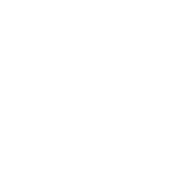

<p align="center">
  <picture>
    <source media="(prefers-color-scheme: dark)" srcset="./src/assets/white_knight_icon.png">
    <source media="(prefers-color-scheme: light)" srcset="./src/assets/black_knight_icon.png">
    
  </picture>
</p>

<h1 align="center">MCP Defender</h1>
<h2 align="center">Automatically protects MCP traffic in AI apps</h2>

<p align="center">
  <a href="https://github.com/MCP-Defender/MCP-Defender"></a>
  <a href="LICENSE"></a>
</p>

<h1 align="center"><a href="https://www.docker.com/blog/docker-acquires-mcp-defender-ai-agent-security/">MCP Defender has been acquired by Docker Inc.</a></h1>

🛡️  MCP Defender is a desktop app that protects AI apps like Cursor from a variety of attacks.

🚦 All MCP tool call requests and responses from AI apps are automatically proxied through MCP Defender.

🔎  The intercepted data is then checked against a set of signatures.

🔐  If anything harmful is detected, MCP Defender alerts you and asks if you want to allow or block the tool call.

# Demos
https://github.com/user-attachments/assets/363ae2b1-e395-4cdc-b5ca-e9862baf89c3


# Quick Start

[Download MCP Defender for Mac](https://github.com/MCP-Defender/MCP-Defender/releases/latest)

Alternatively you can clone the git repo, and run it as follows:

```bash
# Install dependencies
npm install

# Start app
npm start
```

## Which apps are automatically protected?

MCP Defender protects Cursor, Claude, Visual Studio Code and Windsurf.

## License

MCP Defender is licensed under the AGPL-3.0 license. For more details, see the [LICENSE](LICENSE).
